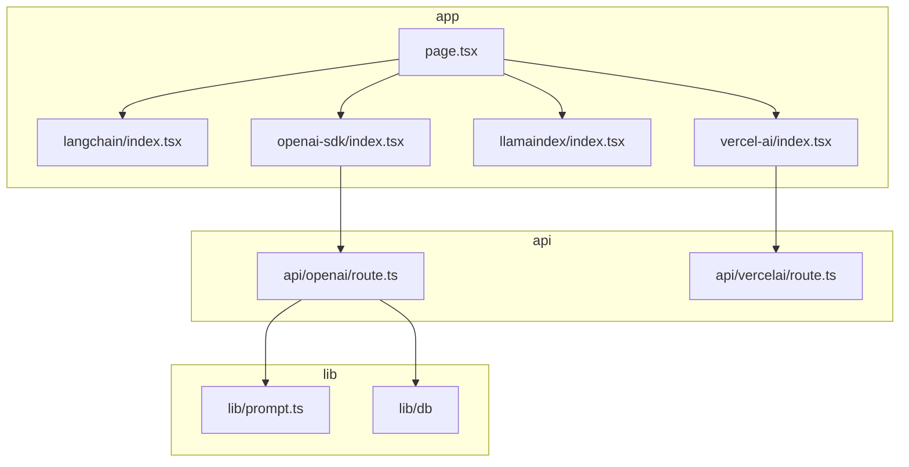
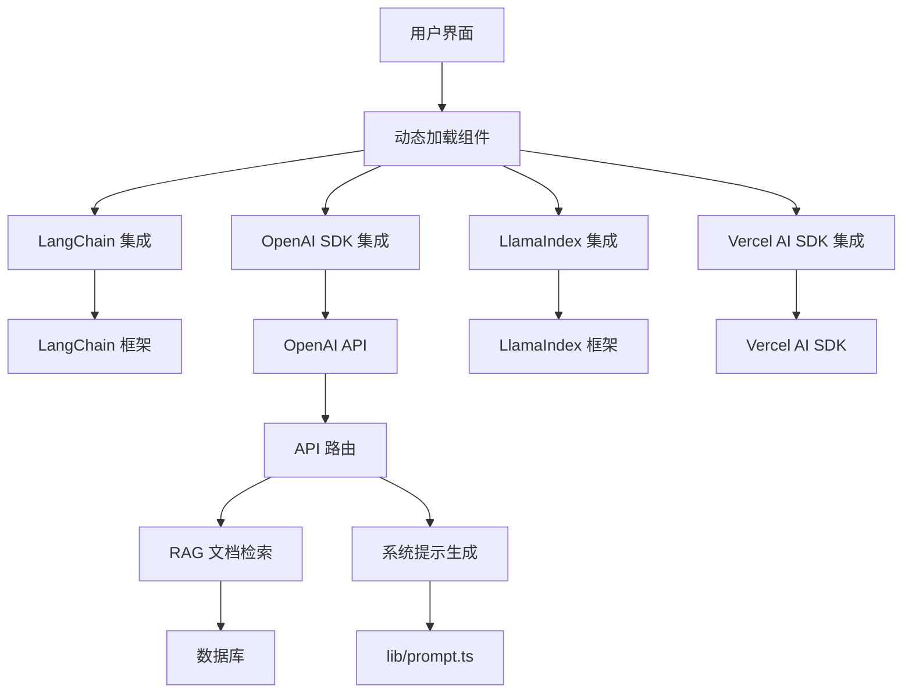
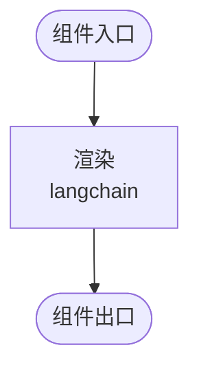
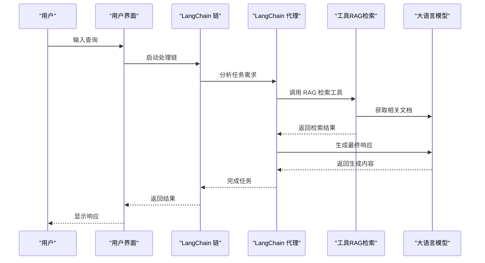
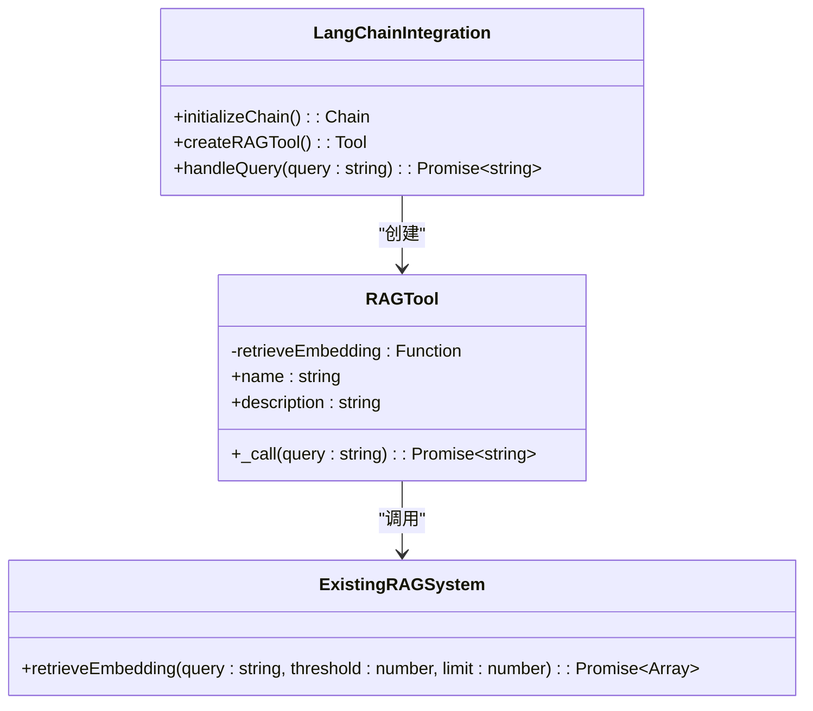
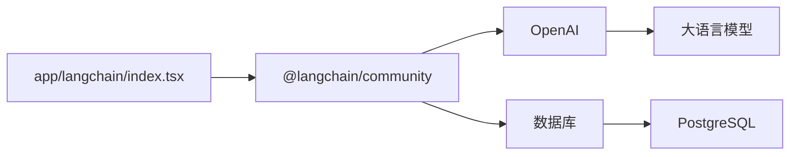

# LangChain 集成

<cite>
**本文档引用的文件**  
- [app/langchain/index.tsx](file://app/langchain/index.tsx)
- [app/page.tsx](file://app/page.tsx)
- [INTEGRATION_SUMMARY.md](file://INTEGRATION_SUMMARY.md)
- [README.md](file://README.md)
- [pnpm-lock.yaml](file://pnpm-lock.yaml)
- [lib/prompt.ts](file://lib/prompt.ts)
- [app/api/openai/route.ts](file://app/api/openai/route.ts)
- [app/components/RAGDocsShow/RAGDocsShow.tsx](file://app/components/RAGDocsShow/RAGDocsShow.tsx)
</cite>

## 目录
1. [简介](#简介)
2. [项目结构](#项目结构)
3. [核心组件](#核心组件)
4. [架构概述](#架构概述)
5. [详细组件分析](#详细组件分析)
6. [依赖分析](#依赖分析)
7. [性能考虑](#性能考虑)
8. [故障排除指南](#故障排除指南)
9. [结论](#结论)

## 简介
本文档旨在说明 `app/langchain/index.tsx` 文件中 LangChain 集成的当前实现状态。目前该页面仅包含一个简单的占位符组件，尚未实现完整的 LangChain 功能。文档将阐述预期的集成路径，包括如何利用 LangChain 的高级功能（如链式调用、代理、工具集成）来增强代码生成能力，并讨论未来开发计划，如与现有 RAG 系统的对接、支持复杂查询分解和多步骤推理。

## 项目结构
项目采用模块化结构，将不同 AI SDK 的集成分别放置在独立的目录中。LangChain 集成位于 `app/langchain` 目录下，与 OpenAI、LlamaIndex 和 Vercel AI SDK 并列。这种结构便于维护和扩展不同 AI 框架的集成。

**Diagram sources**
- [app/page.tsx](file://app/page.tsx#L26-L29)
- [app/langchain/index.tsx](file://app/langchain/index.tsx#L1-L7)

**Section sources**
- [app/langchain/index.tsx](file://app/langchain/index.tsx#L1-L7)
- [app/page.tsx](file://app/page.tsx#L1-L76)

## 核心组件
`app/langchain/index.tsx` 当前仅导出一个简单的函数式组件，其返回值为一个包含文本 "langchain" 的 div 元素。该组件尚未集成任何 LangChain 功能，仅作为未来功能开发的占位符。

**Section sources**
- [app/langchain/index.tsx](file://app/langchain/index.tsx#L1-L7)

## 架构概述
项目整体架构基于 Next.js，利用其 App Router 和 Server Components 特性。前端通过动态导入（`next/dynamic`）按需加载不同 SDK 的页面组件，以优化初始加载性能。后端 API 路由处理与 AI 模型的通信，并集成 RAG 功能。

**Diagram sources**
- [app/page.tsx](file://app/page.tsx#L1-L76)
- [app/api/openai/route.ts](file://app/api/openai/route.ts#L1-L94)
- [lib/prompt.ts](file://lib/prompt.ts#L1-L67)

## 详细组件分析

### LangChain 组件分析
当前 `app/langchain/index.tsx` 组件极其简单，仅用于占位。它没有导入任何 LangChain 库，也没有实现任何与 AI 交互的逻辑。

**Diagram sources**
- [app/langchain/index.tsx](file://app/langchain/index.tsx#L1-L7)

**Section sources**
- [app/langchain/index.tsx](file://app/langchain/index.tsx#L1-L7)

### 预期集成路径
未来 LangChain 集成应借鉴已实现的 OpenAI SDK 集成模式，但利用 LangChain 提供的高级抽象。

#### 链式调用与代理
LangChain 的核心优势在于其链（Chains）和代理（Agents）功能。可以构建如下链式结构：

**Diagram sources**
- [app/langchain/index.tsx](file://app/langchain/index.tsx)
- [app/api/openai/route.ts](file://app/api/openai/route.ts)
- [lib/prompt.ts](file://lib/prompt.ts)

#### 与现有 RAG 系统对接
LangChain 可以无缝集成现有的 RAG 系统。通过创建自定义工具（Tool），可以复用 `retrieveEmbedding` 函数和数据库模式。

**Diagram sources**
- [app/langchain/index.tsx](file://app/langchain/index.tsx)
- [app/api/openai/route.ts](file://app/api/openai/route.ts#L40-L67)
- [lib/db/openai/actions.ts](file://lib/db/openai/actions.ts)
- [lib/db/openai/schema.ts](file://lib/db/openai/schema.ts)

## 依赖分析
项目已通过 `pnpm-lock.yaml` 声明了对 `@langchain/community` 的依赖，版本为 `0.3.16`，表明 LangChain 集成在技术上是可行的。

**Diagram sources**
- [pnpm-lock.yaml](file://pnpm-lock.yaml#L1881-L1914)
- [app/langchain/index.tsx](file://app/langchain/index.tsx)

**Section sources**
- [pnpm-lock.yaml](file://pnpm-lock.yaml#L1881-L1914)

## 性能考虑
由于 LangChain 组件当前为空，性能影响可忽略。未来集成时需注意：
- 代理和链式调用可能增加延迟
- 多次 LLM 调用会增加成本
- 工具调用的异步性需要妥善管理

## 故障排除指南
目前 `app/langchain/index.tsx` 无复杂逻辑，常见问题可能包括：
- 动态导入失败：检查路径是否正确
- 组件未显示：检查 `page.tsx` 中的路由配置
- 未来集成时，应参考 `INTEGRATION_SUMMARY.md` 中的错误处理模式

**Section sources**
- [app/page.tsx](file://app/page.tsx#L26-L29)
- [INTEGRATION_SUMMARY.md](file://INTEGRATION_SUMMARY.md#L0-L75)

## 结论
`app/langchain/index.tsx` 当前仅作为占位符存在，尚未实现任何 LangChain 功能。项目已具备集成 LangChain 的基础（依赖库、RAG 系统）。未来开发应聚焦于利用 LangChain 的链、代理和工具集成能力，实现复杂的多步骤推理和查询分解，从而超越当前简单的 API 调用模式，提供更智能的代码生成服务。