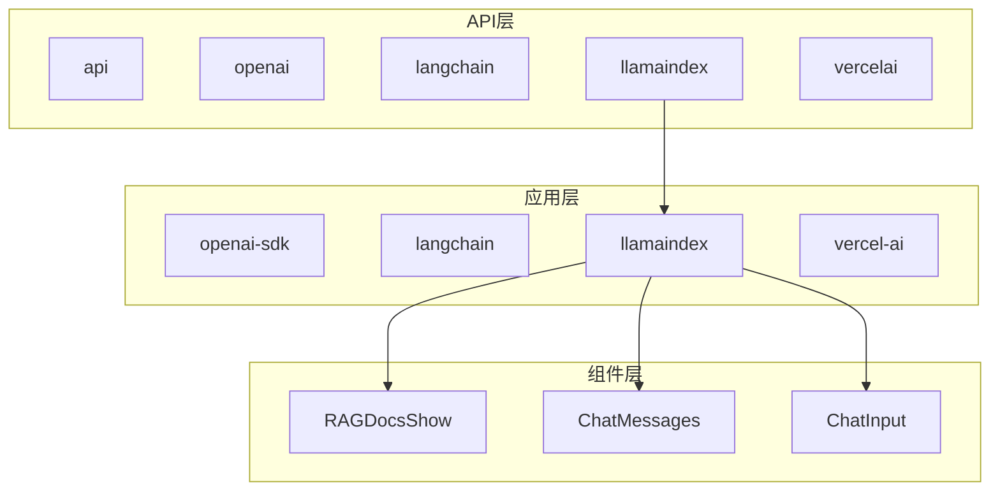
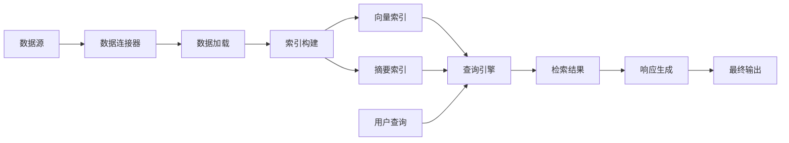
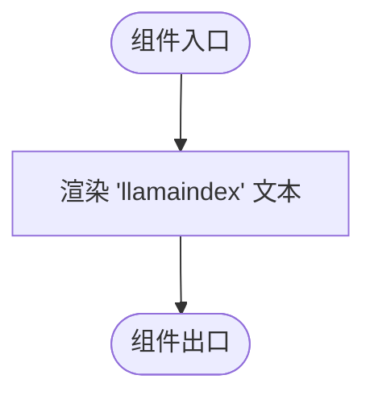
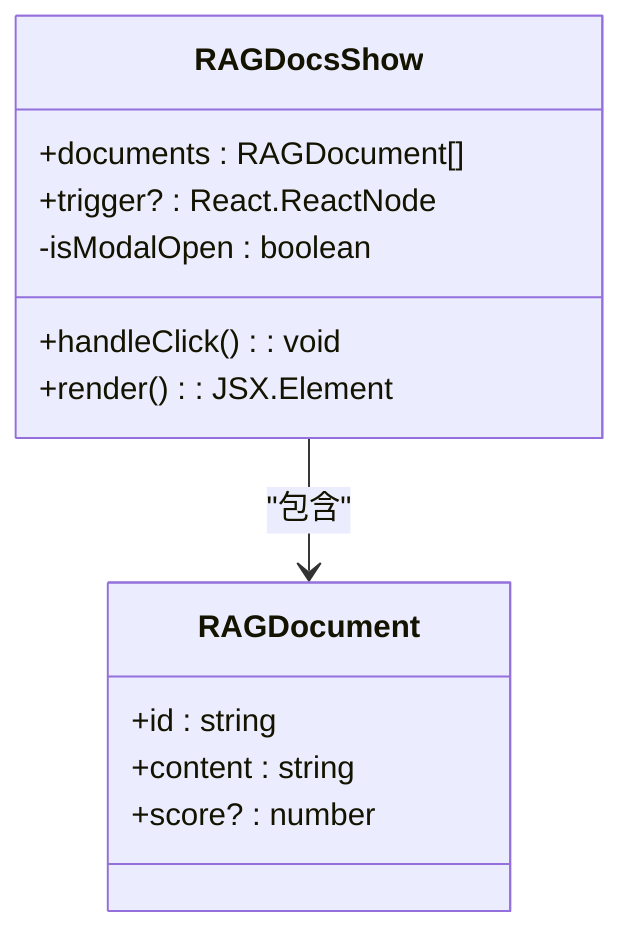
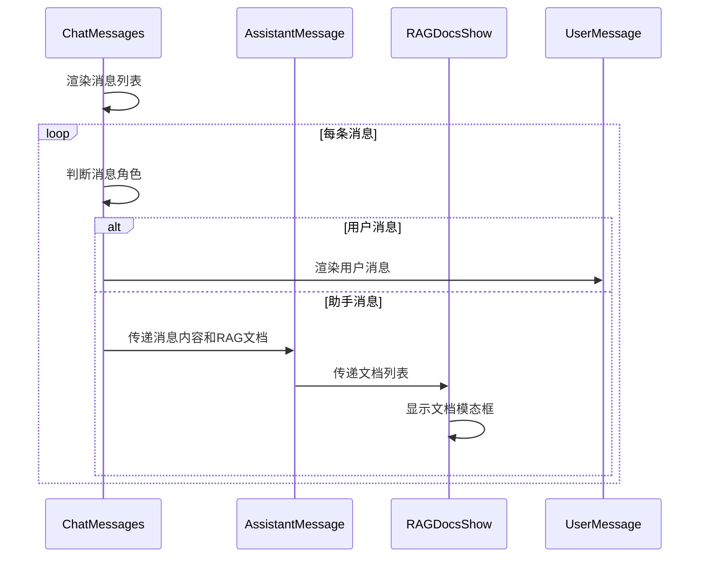
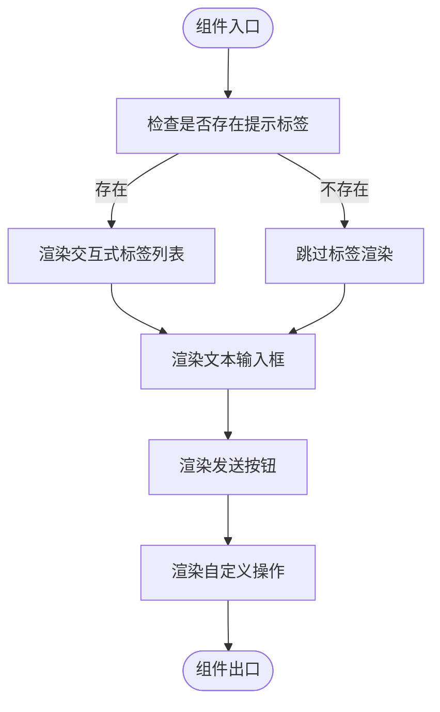

# LlamaIndex 集成

<cite>
**Referenced Files in This Document**   
- [app/llamaindex/index.tsx](file://app/llamaindex/index.tsx)
- [app/components/RAGDocsShow/RAGDocsShow.tsx](file://app/components/RAGDocsShow/RAGDocsShow.tsx)
- [app/components/ChatMessages/ChatMessages.tsx](file://app/components/ChatMessages/ChatMessages.tsx)
- [app/components/ChatInput/ChatInput.tsx](file://app/components/ChatInput/ChatInput.tsx)
- [README.md](file://README.md)
</cite>

## 目录
1. [简介](#简介)
2. [项目结构](#项目结构)
3. [核心组件](#核心组件)
4. [架构概述](#架构概述)
5. [详细组件分析](#详细组件分析)
6. [依赖分析](#依赖分析)
7. [性能考虑](#性能考虑)
8. [故障排除指南](#故障排除指南)
9. [结论](#结论)

## 简介
LlamaIndex 是一个强大的检索增强生成（RAG）框架，旨在提升大型语言模型在特定领域知识问答中的表现。本项目旨在集成 LlamaIndex 以增强现有文档检索功能。目前，LlamaIndex 集成尚处于初始阶段，`app/llamaindex/index.tsx` 页面仅包含一个占位符组件，尚未实现实际功能。本文档将阐述当前实现状态、LlamaIndex 的优势以及未来的集成计划。

## 项目结构
项目结构清晰地划分了不同技术栈的实现路径，包括 OpenAI SDK、LangChain、LlamaIndex 和 Vercel AI SDK。这种模块化设计使得不同 RAG 框架的实现可以独立开发和测试。



**Diagram sources**
- [app/llamaindex/index.tsx](file://app/llamaindex/index.tsx)
- [app/components/RAGDocsShow/RAGDocsShow.tsx](file://app/components/RAGDocsShow/RAGDocsShow.tsx)
- [app/components/ChatMessages/ChatMessages.tsx](file://app/components/ChatMessages/ChatMessages.tsx)
- [app/components/ChatInput/ChatInput.tsx](file://app/components/ChatInput/ChatInput.tsx)

**Section sources**
- [app/llamaindex/index.tsx](file://app/llamaindex/index.tsx)
- [README.md](file://README.md)

## 核心组件
当前 LlamaIndex 集成的核心组件主要包括占位符页面和可复用的 UI 组件。`app/llamaindex/index.tsx` 是 LlamaIndex 功能的入口点，目前仅渲染一个简单的文本。其他核心组件如 `RAGDocsShow`、`ChatMessages` 和 `ChatInput` 已在其他 RAG 实现中使用，未来将被 LlamaIndex 集成复用。

**Section sources**
- [app/llamaindex/index.tsx](file://app/llamaindex/index.tsx)
- [app/components/RAGDocsShow/RAGDocsShow.tsx](file://app/components/RAGDocsShow/RAGDocsShow.tsx)
- [app/components/ChatMessages/ChatMessages.tsx](file://app/components/ChatMessages/ChatMessages.tsx)
- [app/components/ChatInput/ChatInput.tsx](file://app/components/ChatInput/ChatInput.tsx)

## 架构概述
LlamaIndex 的架构设计旨在提供一个灵活且高效的 RAG 解决方案。它通过数据连接器从各种数据源获取数据，利用先进的索引结构（如向量索引、摘要索引等）对数据进行组织，并通过查询引擎将用户查询与索引数据进行匹配，最终生成上下文感知的响应。



**Diagram sources**
- [README.md](file://README.md)

## 详细组件分析

### LlamaIndex 页面分析
`app/llamaindex/index.tsx` 组件目前是一个简单的客户端组件，仅返回一个包含 "llamaindex" 文本的 div 元素。这表明 LlamaIndex 的实际功能尚未实现，该页面仅作为未来功能的占位符。



**Diagram sources**
- [app/llamaindex/index.tsx](file://app/llamaindex/index.tsx#L0-L6)

**Section sources**
- [app/llamaindex/index.tsx](file://app/llamaindex/index.tsx#L0-L6)

### RAG 文档展示组件分析
`RAGDocsShow` 组件是一个可复用的 UI 组件，用于展示检索到的相关文档。它接收文档列表和触发元素作为 props，当用户点击触发元素时，会弹出一个模态框显示所有相关文档及其相关性分数。



**Diagram sources**
- [app/components/RAGDocsShow/RAGDocsShow.tsx](file://app/components/RAGDocsShow/RAGDocsShow.tsx#L6-L50)
- [app/components/RAGDocsShow/interface.ts](file://app/components/RAGDocsShow/interface.ts#L0-L11)

**Section sources**
- [app/components/RAGDocsShow/RAGDocsShow.tsx](file://app/components/RAGDocsShow/RAGDocsShow.tsx#L0-L53)

### 聊天消息组件分析
`ChatMessages` 组件负责渲染聊天界面，包括用户消息和助手消息。它集成了 `RAGDocsShow` 组件，以便在助手消息中展示相关的检索文档。



**Diagram sources**
- [app/components/ChatMessages/ChatMessages.tsx](file://app/components/ChatMessages/ChatMessages.tsx#L11-L95)
- [app/components/ChatMessages/ChatMessages.stories.tsx](file://app/components/ChatMessages/ChatMessages.stories.tsx#L123-L149)

**Section sources**
- [app/components/ChatMessages/ChatMessages.tsx](file://app/components/ChatMessages/ChatMessages.tsx#L0-L100)

### 聊天输入组件分析
`ChatInput` 组件提供用户输入界面，包括文本输入框、发送按钮和交互式标签列表。它支持流式响应和自定义操作。



**Diagram sources**
- [app/components/ChatInput/ChatInput.tsx](file://app/components/ChatInput/ChatInput.tsx#L10-L74)

**Section sources**
- [app/components/ChatInput/ChatInput.tsx](file://app/components/ChatInput/ChatInput.tsx#L0-L79)

## 依赖分析
LlamaIndex 的依赖关系主要体现在 Next.js 配置文件中，`next.config.mjs` 将 `llamaindex` 列为服务端组件的外部包，确保其在服务端正确加载。

```mermaid
graph LR
A[app/llamaindex/index.tsx] --> B[next.config.mjs]
B --> C[llamaindex@0.8.22]
C --> D[pg]
C --> E[pgvector]
```

**Diagram sources**
- [next.config.mjs](file://next.config.mjs#L0-L10)
- [pnpm-lock.yaml](file://pnpm-lock.yaml#L6632-L6664)

**Section sources**
- [next.config.mjs](file://next.config.mjs#L0-L10)
- [pnpm-lock.yaml](file://pnpm-lock.yaml#L6632-L6664)

## 性能考虑
LlamaIndex 通过其先进的索引结构和查询优化能力，能够显著提升 RAG 系统的性能。向量索引允许快速的相似性搜索，而摘要索引则可以减少查询时需要处理的数据量。此外，LlamaIndex 支持多种优化策略，如查询重写和混合检索，以进一步提高检索效率和准确性。

## 故障排除指南
在集成 LlamaIndex 时，可能会遇到以下常见问题：
- **依赖冲突**：确保 `llamaindex` 及其对等依赖（如 `pg` 和 `pgvector`）的版本兼容。
- **配置错误**：检查 `next.config.mjs` 中的 `serverComponentsExternalPackages` 配置是否正确。
- **数据连接问题**：验证数据连接器是否能正确访问数据源。

**Section sources**
- [next.config.mjs](file://next.config.mjs#L0-L10)
- [pnpm-lock.yaml](file://pnpm-lock.yaml#L6632-L6664)

## 结论
当前 LlamaIndex 集成尚处于初始阶段，`app/llamaindex/index.tsx` 页面仅包含一个占位符组件。然而，项目已经具备了集成 LlamaIndex 所需的基础架构和 UI 组件。未来，可以通过利用 LlamaIndex 的数据连接器、索引和查询引擎来替代或增强现有的文档嵌入检索功能，从而提升 RAG 系统的性能和准确性。