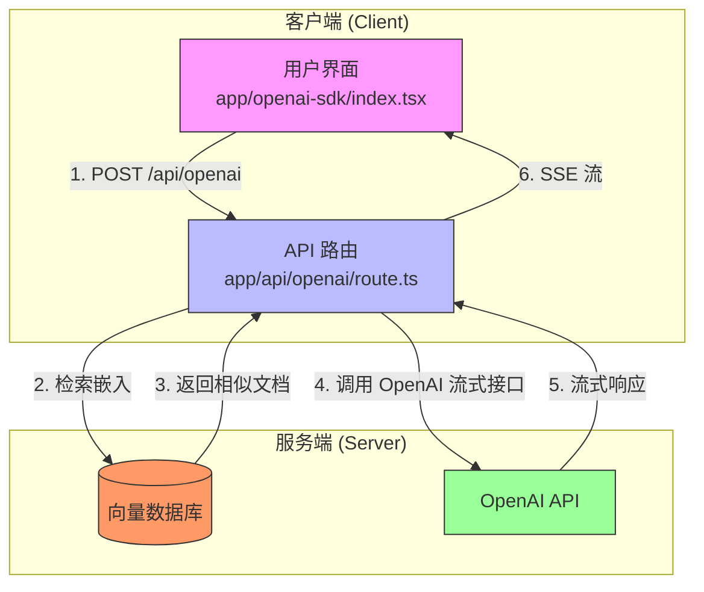
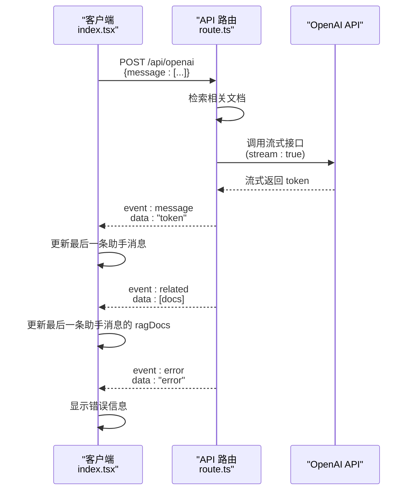
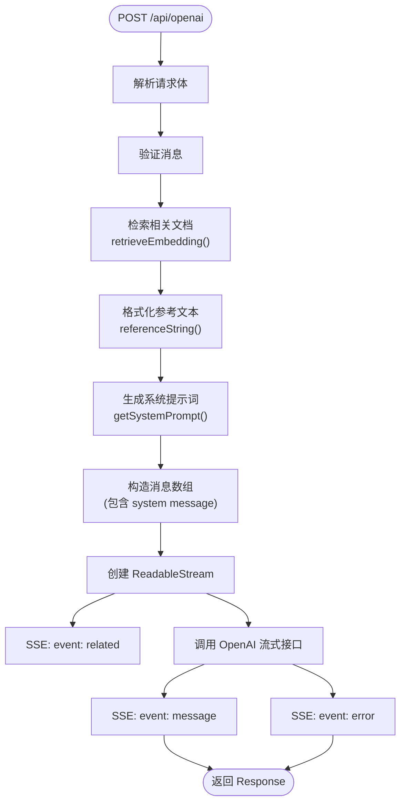
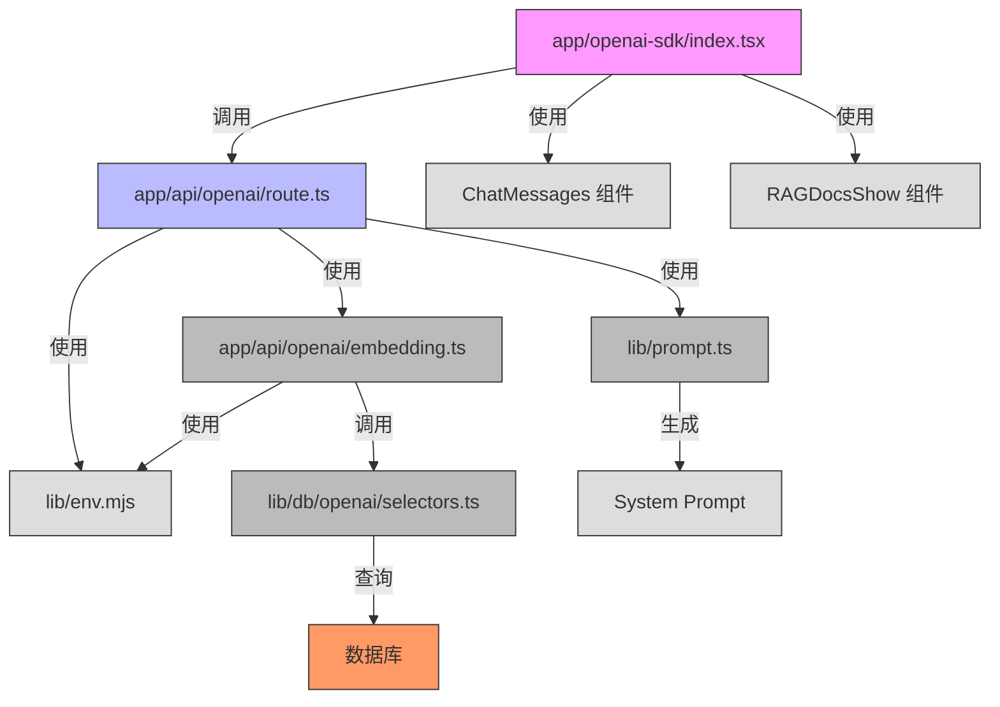

# OpenAI SDK 集成

<cite>
**Referenced Files in This Document**   
- [app/openai-sdk/index.tsx](file://app/openai-sdk/index.tsx)
- [app/api/openai/route.ts](file://app/api/openai/route.ts)
- [app/api/openai/types.ts](file://app/api/openai/types.ts)
- [app/api/openai/embedding.ts](file://app/api/openai/embedding.ts)
- [lib/prompt.ts](file://lib/prompt.ts)
- [lib/db/openai/selectors.ts](file://lib/db/openai/selectors.ts)
</cite>

## 目录
1. [简介](#简介)
2. [核心组件](#核心组件)
3. [架构概览](#架构概览)
4. [详细组件分析](#详细组件分析)
5. [依赖分析](#依赖分析)
6. [性能考虑](#性能考虑)
7. [故障排除指南](#故障排除指南)
8. [结论](#结论)

## 简介
本文档详细阐述了在 Next.js 应用中集成 OpenAI SDK 的实现方案，核心逻辑位于 `app/openai-sdk/index.tsx`。该集成方案通过客户端的 `fetch` API 调用后端 `/api/openai` 接口，利用 Server-Sent Events (SSE) 实现流式响应，为用户提供实时、流畅的对话体验。文档将深入解析消息状态管理、输入处理、请求中止（AbortController）和错误恢复等关键机制，并说明其与 RAG（检索增强生成）系统的结合方式，最后对比其他 AI 集成方案，突出其优势与复杂性。

## 核心组件

该集成方案的核心是 `app/openai-sdk/index.tsx` 文件中的 `Home` 组件，它是一个 React 客户端组件，负责管理用户界面、用户交互和与后端 API 的通信。其主要职责包括：
- **状态管理**：使用 `useState` 和 `useRef` 管理对话消息、输入框内容、加载状态、错误信息和连接状态。
- **事件处理**：通过 `useCallback` 优化处理用户输入、表单提交和消息重试的回调函数。
- **SSE 流处理**：实现了一个完整的 SSE 客户端，用于解析和处理来自服务器的流式数据。
- **RAG 集成**：接收并显示由后端检索出的相关上下文文档。

**Section sources**
- [app/openai-sdk/index.tsx](file://app/openai-sdk/index.tsx#L0-L267)

## 架构概览

该集成方案采用前后端分离的架构，客户端负责 UI 交互，后端 API 路由负责与 OpenAI 服务通信并注入上下文。

**Diagram sources**
- [app/openai-sdk/index.tsx](file://app/openai-sdk/index.tsx#L0-L267)
- [app/api/openai/route.ts](file://app/api/openai/route.ts#L0-L94)

## 详细组件分析

### 客户端逻辑分析

`app/openai-sdk/index.tsx` 实现了完整的客户端流式对话逻辑。

#### 消息状态与输入处理
组件使用 `messages` 状态存储整个对话历史，每条消息包含 `id`, `role` (user/assistant), `content` 和可选的 `ragDocs`。`input` 状态绑定到输入框，`handleInputChange` 回调函数在用户输入时更新该状态并清除之前的错误。当用户提交消息时，`onSubmit` 回调会将用户消息和一个空的助手消息添加到 `messages` 中，为流式响应做准备。

**Section sources**
- [app/openai-sdk/index.tsx](file://app/openai-sdk/index.tsx#L35-L47)
- [app/openai-sdk/index.tsx](file://app/openai-sdk/index.tsx#L105-L129)

#### SSE 流式响应处理
这是集成的核心。`onSubmit` 函数使用 `fetch` API 发起 POST 请求到 `/api/openai`，并设置 `signal` 为 `AbortController` 的 `abortControllerRef.current.signal`，以支持请求中止。

**Diagram sources**
- [app/openai-sdk/index.tsx](file://app/openai-sdk/index.tsx#L132-L205)
- [app/api/openai/route.ts](file://app/api/openai/route.ts#L55-L93)

`fetch` 响应的 `body` 是一个 `ReadableStream`。客户端通过 `getReader()` 获取 `reader`，然后在一个 `while` 循环中持续读取数据块（`value`）。`TextDecoder` 用于将二进制数据解码为 UTF-8 字符串。解码后的数据被拼接成 `buffer`，然后按行（`\n`）分割。代码通过 `pendingEventType` 变量来处理 `event:` 和 `data:` 可能跨数据块的情况，确保正确配对。

#### 事件处理与错误恢复
`handleSSEEvent` 函数负责处理三种事件：
- **`related` 事件**：当接收到相关文档时，更新最后一条助手消息的 `ragDocs` 属性。
- **`message` 事件**：将接收到的文本内容追加到最后一条助手消息的 `content` 上。通过 `lastChunkRef` 引用防止完全相同的分片被重复追加。
- **`error` 事件**：抛出错误，触发 `onSubmit` 中的 `catch` 块。

在 `onSubmit` 的 `catch` 块中，实现了错误恢复机制：
- 如果是 `AbortError`，说明用户主动中止了请求，此时会删除之前创建的空助手消息。
- 对于其他错误，会设置 `error` 状态以在 UI 上显示错误信息，并将最后一条助手消息的内容更新为“抱歉，发生了错误，请重试。”。

**Section sources**
- [app/openai-sdk/index.tsx](file://app/openai-sdk/index.tsx#L50-L86)
- [app/openai-sdk/index.tsx](file://app/openai-sdk/index.tsx#L167-L205)

### 服务端逻辑分析

`app/api/openai/route.ts` 是一个 Next.js API 路由，负责处理客户端的请求。

#### RAG 上下文注入
路由首先解析请求体，获取用户消息。然后调用 `retrieveEmbedding` 函数，该函数使用 `getEmbedding` 为用户输入生成向量嵌入，并查询向量数据库（`searchSimilarEmbeddings`）以找到最相似的文档片段。这些片段被格式化为字符串 `reference`，并作为 `system` 消息的一部分，通过 `getSystemPrompt(reference)` 生成的系统提示词插入到发送给 OpenAI 的消息数组的最前面。这使得大模型在生成回复时能够参考这些上下文信息。

**Diagram sources**
- [app/api/openai/route.ts](file://app/api/openai/route.ts#L20-L94)
- [app/api/openai/embedding.ts](file://app/api/openai/embedding.ts#L0-L67)
- [lib/prompt.ts](file://lib/prompt.ts#L0-L66)

#### SSE 响应流创建
路由返回一个 `Response` 对象，其 `body` 是一个 `ReadableStream`。在 `start` 方法中，首先通过 `controller.enqueue` 推送 `related` 事件，将检索到的文档发送给客户端。然后，调用 OpenAI 的流式聊天接口（`stream: true`），并遍历返回的 `chunk`，将每个 `content` 通过 `message` 事件推送给客户端。如果发生错误，则通过 `error` 事件推送错误信息。

**Section sources**
- [app/api/openai/route.ts](file://app/api/openai/route.ts#L55-L93)

## 依赖分析

该集成方案涉及多个文件和模块的协同工作。

**Diagram sources**
- [app/openai-sdk/index.tsx](file://app/openai-sdk/index.tsx#L0-L267)
- [app/api/openai/route.ts](file://app/api/openai/route.ts#L0-L94)
- [app/api/openai/embedding.ts](file://app/api/openai/embedding.ts#L0-L67)
- [lib/prompt.ts](file://lib/prompt.ts#L0-L66)
- [lib/db/openai/selectors.ts](file://lib/db/openai/selectors.ts#L0-L32)

## 性能考虑

- **流式传输**：使用 SSE 实现流式响应，用户无需等待整个回复生成完毕即可看到内容，显著提升了用户体验。
- **向量检索**：`retrieveEmbedding` 函数利用向量数据库的余弦相似度搜索，能够高效地从大量文档中检索出与用户查询最相关的信息。
- **客户端状态管理**：通过 `useCallback` 和 `useRef` 优化了回调函数和引用，避免了不必要的组件重新渲染和状态丢失。

## 故障排除指南

- **连接错误**：检查 `lib/env.mjs` 中的 `AI_KEY` 和 `AI_BASE_URL` 环境变量是否正确配置。
- **无相关文档返回**：检查 `app/api/openai/embedding.ts` 中的 `threshold` 阈值是否设置得过高，或者向量数据库中是否已正确存储了文档的嵌入向量。
- **SSE 解析失败**：确保客户端和服务器端的 `event` 和 `data` 格式严格匹配，特别是换行符 `\n` 的使用。
- **消息重复**：`lastChunkRef` 机制旨在防止完全相同的分片重复，但如果服务器发送了内容不同但非常相似的分片，仍可能出现视觉上的重复。这通常由模型生成逻辑决定。

**Section sources**
- [app/openai-sdk/index.tsx](file://app/openai-sdk/index.tsx#L50-L86)
- [app/api/openai/route.ts](file://app/api/openai/route.ts#L55-L93)
- [lib/env.mjs](file://lib/env.mjs)

## 结论

本文档详细分析了 `app/openai-sdk/index.tsx` 中实现的 OpenAI SDK 集成方案。该方案通过直接使用 `fetch` API 和 `ReadableStream` 处理 SSE，提供了对流式对话过程的**直接控制**，允许实现精细的 UI 更新和错误处理逻辑。其与 RAG 系统的深度集成，通过在系统提示词中注入检索到的上下文，显著增强了大模型的回复准确性和信息量。然而，这种直接控制也带来了**较高的复杂性**，开发者需要手动处理流的解析、事件分发、状态同步和错误恢复等底层细节。相比之下，使用 Vercel AI SDK 等高级库可以极大地简化这些流程，但可能会牺牲一定的灵活性。此实现方案适用于需要高度定制化对话体验和复杂状态管理的场景。