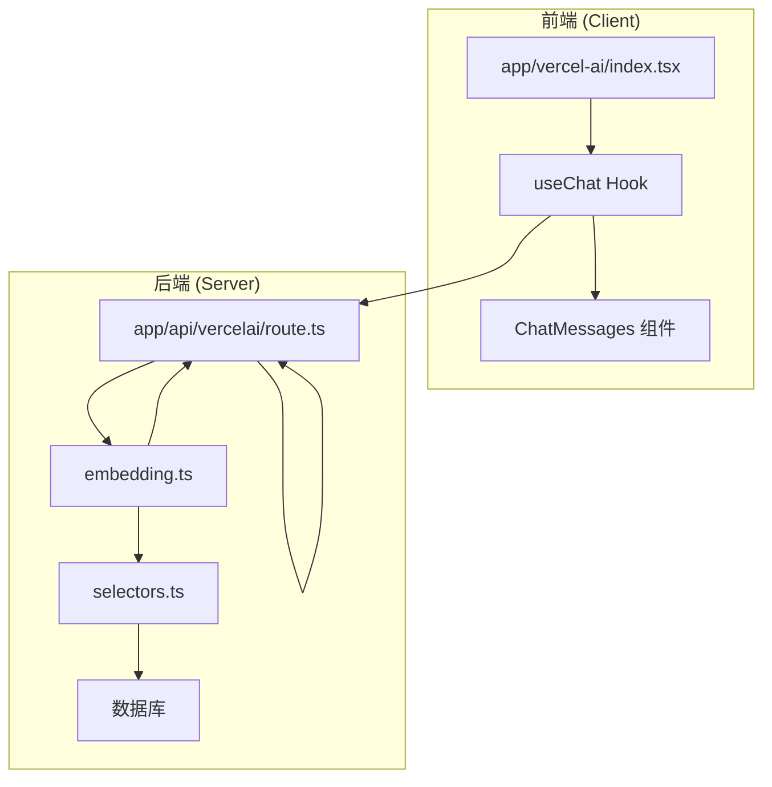
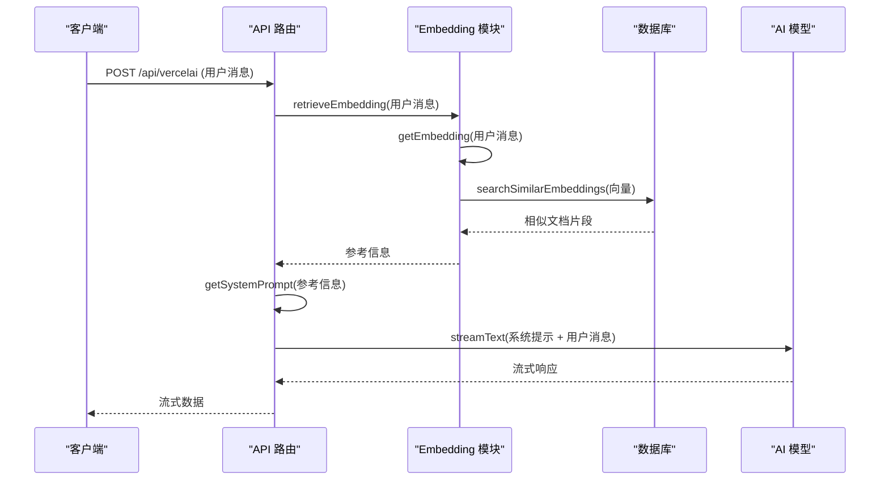

<cite>
**本文档中引用的文件**
- [index.tsx](file://app/vercel-ai/index.tsx)
- [route.ts](file://app/api/vercelai/route.ts)
- [prompt.ts](file://lib/prompt.ts)
- [embedding.ts](file://app/api/vercelai/embedding.ts)
- [selectors.ts](file://lib/db/vercelai/selectors.ts)
- [ChatMessages.tsx](file://app/components/ChatMessages/ChatMessages.tsx)
- [AssistantMessage.tsx](file://app/components/ChatMessages/AssistantMessage.tsx)
- [RAGDocsShow.tsx](file://app/components/RAGDocsShow/RAGDocsShow.tsx)
</cite>

## 目录
1. [简介](#简介)
2. [项目结构](#项目结构)
3. [核心组件](#核心组件)
4. [架构概述](#架构概述)
5. [详细组件分析](#详细组件分析)
6. [依赖分析](#依赖分析)
7. [性能考虑](#性能考虑)
8. [故障排除指南](#故障排除指南)
9. [结论](#结论)

## 简介
本文档详细分析了在 `app/vercel-ai/index.tsx` 中集成 Vercel AI SDK 的实现方式，重点探讨了 `useChat` Hook 的使用。文档解释了 Vercel AI SDK 如何简化流式响应处理、自动管理消息状态和 API 调用。内容涵盖 `useChat` 的配置、表单提交处理、重试逻辑（reload）以及 RAG 文档的处理方式。当前 RAG 文档通过系统消息注入，因此在 UI 上暂时不显示独立的 RAG 文档列表。文档还将对比 OpenAI SDK 集成，突出 Vercel AI SDK 在开发效率和简化底层控制方面的优势。

## 项目结构
项目结构清晰地分离了前端组件、API 路由和共享库。`app/vercel-ai/index.tsx` 作为 Vercel AI 集成的入口点，调用位于 `app/api/vercelai/route.ts` 的 API 路由。RAG 相关功能（如嵌入生成和检索）在 `app/api/vercelai/embedding.ts` 中实现，并与数据库交互通过 `lib/db/vercelai/selectors.ts`。前端 UI 组件（如 `ChatMessages` 和 `AssistantMessage`）位于 `app/components` 目录下。

**Section sources**
- [index.tsx](file://app/vercel-ai/index.tsx)
- [route.ts](file://app/api/vercelai/route.ts)

## 核心组件
核心组件包括 `useChat` Hook，它在 `app/vercel-ai/index.tsx` 中被调用，用于管理聊天状态和与后端 API 的通信。`ChatMessages` 组件负责渲染消息列表和输入框，而 `AssistantMessage` 组件则专门处理助手消息的显示，包括 RAG 文档的展示。

**Section sources**
- [index.tsx](file://app/vercel-ai/index.tsx#L10-L63)
- [ChatMessages.tsx](file://app/components/ChatMessages/ChatMessages.tsx#L1-L100)
- [AssistantMessage.tsx](file://app/components/ChatMessages/AssistantMessage.tsx#L1-L74)

## 架构概述
系统架构采用客户端-服务器模式。客户端使用 Vercel AI SDK 的 `useChat` Hook 简化与后端 API 的交互。后端 API (`app/api/vercelai/route.ts`) 接收用户消息，利用 `embedding.ts` 中的函数进行 RAG 检索，将检索到的参考信息注入系统提示词，并通过 `streamText` 发起流式 AI 调用。



**Diagram sources**
- [index.tsx](file://app/vercel-ai/index.tsx#L10-L63)
- [route.ts](file://app/api/vercelai/route.ts#L1-L68)
- [embedding.ts](file://app/api/vercelai/embedding.ts#L1-L60)
- [selectors.ts](file://lib/db/vercelai/selectors.ts#L1-L32)

## 详细组件分析

### useChat Hook 配置与状态管理
`useChat` Hook 在 `app/vercel-ai/index.tsx` 中被配置，通过 `api: '/api/vercelai'` 指定后端 API 路由。它自动管理 `messages`、`input`、`isLoading` 等状态，极大地简化了开发者的工作。开发者无需手动处理 `fetch` 请求、状态更新和错误处理。

**Section sources**
- [index.tsx](file://app/vercel-ai/index.tsx#L10-L20)

### 表单提交与重试逻辑
表单提交逻辑通过 `handleSubmit` 回调处理。在 `onSubmit` 函数中，调用 `handleSubmit(e)` 触发消息发送，并在发送后清除图片 URL。重试逻辑通过 `reload` 函数实现，允许用户重新发送最后一条消息，这在 AI 响应出错或不完整时非常有用。

**Section sources**
- [index.tsx](file://app/vercel-ai/index.tsx#L22-L34)

### RAG 文档处理流程
RAG 文档的处理流程始于用户发送消息。后端 API (`route.ts`) 调用 `retrieveEmbedding` 函数，该函数使用 `getEmbedding` 生成查询向量，并通过 `searchSimilarEmbeddings` 在数据库中查找相似的文档片段。检索到的参考信息被格式化为字符串，并通过 `getSystemPrompt` 函数注入到系统提示词中。最终，包含参考信息的提示词与用户消息一起被发送给 AI 模型。



**Diagram sources**
- [route.ts](file://app/api/vercelai/route.ts#L1-L68)
- [embedding.ts](file://app/api/vercelai/embedding.ts#L1-L60)
- [selectors.ts](file://lib/db/vercelai/selectors.ts#L1-L32)
- [prompt.ts](file://lib/prompt.ts#L1-L67)

#### RAG 文档在 UI 上的处理
尽管 RAG 文档已成功注入系统提示，但当前 UI 实现中，`AssistantMessage` 组件接收到的 `ragDocs` 属性为空数组。这是因为在 `index.tsx` 中，`processedMessages` 映射函数将所有助手消息的 `ragDocs` 显式设置为空。因此，`RAGDocsShow` 组件虽然存在，但由于没有数据传递，无法在 UI 上显示实际的 RAG 文档列表。

```mermaid
flowchart TD
A[useChat 返回 messages] --> B{角色是助手?}
B --> |是| C[设置 ragDocs = []]
B --> |否| D[保持原样]
C --> E[传递给 ChatMessages]
D --> E
E --> F[AssistantMessage 渲染]
F --> G[RAGDocsShow 无数据]
```

**Diagram sources**
- [index.tsx](file://app/vercel-ai/index.tsx#L36-L50)
- [AssistantMessage.tsx](file://app/components/ChatMessages/AssistantMessage.tsx#L1-L74)
- [RAGDocsShow.tsx](file://app/components/RAGDocsShow/RAGDocsShow.tsx#L1-L53)

## 依赖分析
`useChat` Hook 依赖于后端 API 路由 `/api/vercelai`。该路由依赖于 Vercel AI SDK 的 `streamText` 函数、OpenAI 客户端以及本地的 `embedding` 和 `prompt` 模块。`embedding` 模块又依赖于数据库查询函数 `searchSimilarEmbeddings`。

```mermaid
graph TD
A[useChat] --> B[/api/vercelai]
B --> C[streamText]
B --> D[createOpenAI]
B --> E[getSystemPrompt]
B --> F[retrieveEmbedding]
F --> G[getEmbedding]
F --> H[searchSimilarEmbeddings]
H --> I[数据库]
```

**Diagram sources**
- [index.tsx](file://app/vercel-ai/index.tsx#L10-L20)
- [route.ts](file://app/api/vercelai/route.ts#L1-L68)
- [embedding.ts](file://app/api/vercelai/embedding.ts#L1-L60)
- [selectors.ts](file://lib/db/vercelai/selectors.ts#L1-L32)

## 性能考虑
流式响应 (`streamText`) 提供了更好的用户体验，因为它允许用户在 AI 生成内容时立即看到结果，而不是等待整个响应完成。RAG 检索的性能取决于向量数据库的规模和查询效率。`cosineDistance` 函数用于计算向量相似度，其性能在大规模数据集上可能成为瓶颈。

## 故障排除指南
如果 RAG 文档未按预期工作，请检查：
1.  数据库中是否已正确插入了文档及其嵌入向量。
2.  `retrieveEmbedding` 函数中的相似度阈值 (`threshold`) 是否设置得过高，导致没有匹配结果。
3.  `getSystemPrompt` 函数是否正确地将参考信息注入到提示词中。

**Section sources**
- [embedding.ts](file://app/api/vercelai/embedding.ts#L45-L60)
- [selectors.ts](file://lib/db/vercelai/selectors.ts#L1-L32)
- [prompt.ts](file://lib/prompt.ts#L1-L67)

## 结论
Vercel AI SDK 通过 `useChat` Hook 极大地简化了与 AI 模型的集成，自动处理了状态管理和流式通信的复杂性。RAG 功能的实现展示了如何将外部知识库无缝集成到 AI 对话中。虽然当前 UI 未显示 RAG 文档，但其处理流程已建立，为未来增强提供了基础。与直接使用 OpenAI SDK 相比，Vercel AI SDK 显著提高了开发效率，让开发者能够更专注于业务逻辑而非底层通信细节。