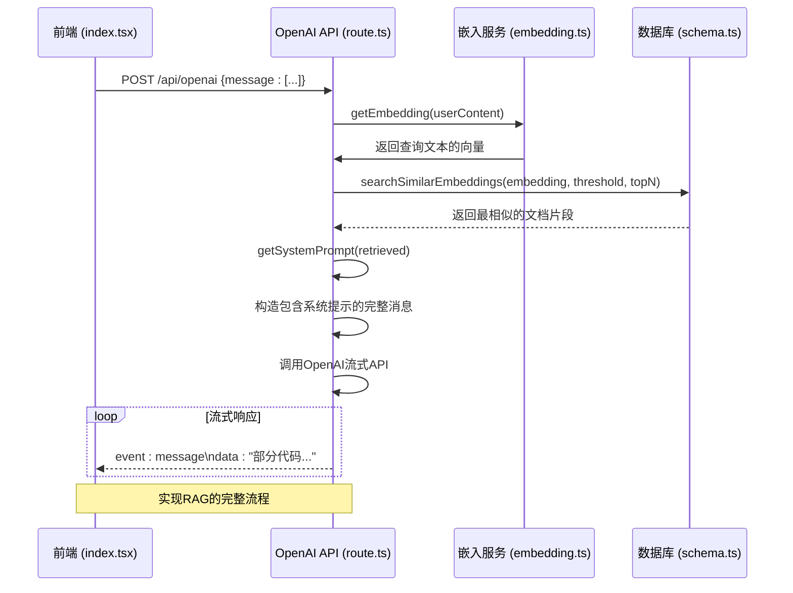
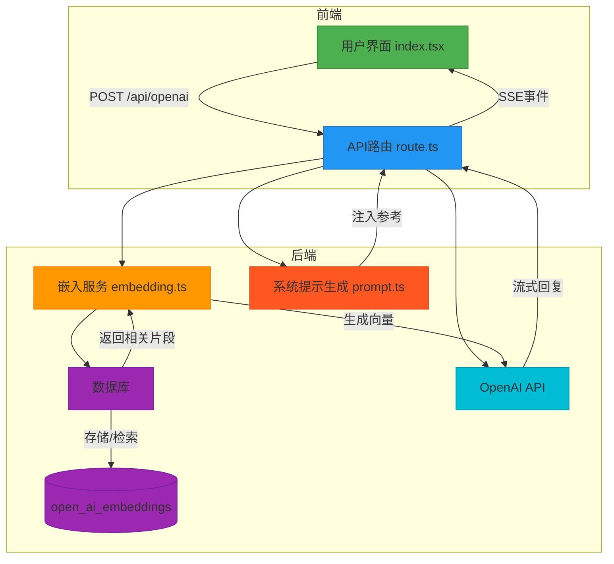

# OpenAI API

<cite>
**Referenced Files in This Document**   
- [route.ts](file://app/api/openai/route.ts)
- [types.ts](file://app/api/openai/types.ts)
- [prompt.ts](file://lib/prompt.ts)
- [embedding.ts](file://app/api/openai/embedding.ts)
- [selectors.ts](file://lib/db/openai/selectors.ts)
- [schema.ts](file://lib/db/openai/schema.ts)
- [index.tsx](file://app/openai-sdk/index.tsx)
</cite>

## 目录
1. [简介](#简介)
2. [API端点与请求结构](#api端点与请求结构)
3. [核心数据结构](#核心数据结构)
4. [响应机制与SSE流式输出](#响应机制与sse流式输出)
5. [RAG功能实现](#rag功能实现)
6. [错误处理](#错误处理)
7. [客户端集成](#客户端集成)
8. [架构概览](#架构概览)

## 简介

本文档详细介绍了位于`/app/api/openai/route.ts`的OpenAI API接口。该接口是一个基于Next.js的服务器端路由，旨在为前端应用提供一个强大的代码生成服务。它利用OpenAI的大型语言模型（LLM），结合检索增强生成（RAG）技术，能够根据用户输入的自然语言需求，生成高质量、符合规范的前端业务组件代码。API通过流式响应（SSE）实时返回结果，为用户提供类似聊天机器人的交互体验。

## API端点与请求结构

该API提供一个单一的POST端点，用于接收客户端的代码生成请求。

### 端点URL
```
POST /api/openai
```

### 请求头
必须包含以下请求头：
- `Content-Type: application/json`

### 请求体
请求体必须是一个JSON对象，其结构由`types.ts`文件中的`OpenAIRequest`类型定义。

**Section sources**
- [types.ts](file://app/api/openai/types.ts#L1-L6)
- [route.ts](file://app/api/openai/route.ts#L20-L22)

## 核心数据结构

### OpenAIRequest 类型
`OpenAIRequest`是API请求体的类型定义，其核心是一个名为`message`的字段。

- **`message`**: 类型为 `ChatCompletionMessageParam[]`，表示一个消息数组。该数组遵循OpenAI聊天补全API的格式，包含对话的历史记录，其中每条消息都有`role`（角色，如"user"或"assistant"）和`content`（内容）属性。API会使用此数组作为与AI模型对话的上下文。

**Section sources**
- [types.ts](file://app/api/openai/types.ts#L1-L6)

## 响应机制与SSE流式输出

该API不返回传统的JSON响应，而是通过`text/event-stream`格式进行流式传输，实现低延迟的实时响应。

### 响应头
API响应包含以下关键头信息：
- `Content-Type: text/event-stream; charset=utf-8`
- `Cache-Control: no-cache, no-transform`
- `Connection: keep-alive`

### Server-Sent Events (SSE) 机制
API使用SSE协议，通过一个可读流（`ReadableStream`）向客户端推送三种类型的事件：

1.  **`related` 事件**: 在AI生成回复之前，首先推送与用户查询相关的知识库片段。数据部分是一个包含检索到的文档内容和相似度分数的JSON数组。
2.  **`message` 事件**: AI模型生成的回复内容被分割成小块，通过此事件逐个推送。数据部分是当前文本块的JSON字符串。
3.  **`error` 事件**: 如果在处理过程中发生任何错误（如AI调用失败），会通过此事件推送错误信息。

这种流式输出方式允许前端在AI“思考”和“书写”的同时，就逐步显示生成的代码，极大地提升了用户体验。

**Section sources**
- [route.ts](file://app/api/openai/route.ts#L67-L94)

## RAG功能实现

该API的核心优势在于其RAG（Retrieval-Augmented Generation）功能，它通过结合外部知识库来增强AI的生成能力，确保生成的代码符合项目特定的规范和约束。

### 工作流程
1.  **文本嵌入 (Embedding)**: 当用户发送查询时，API首先调用`embedding.ts`中的`getEmbedding`函数。该函数使用OpenAI的嵌入模型（如`text-embedding-ada-002`）将用户查询的文本转换为一个高维向量（embedding）。
2.  **向量检索 (Retrieval)**: 利用生成的向量，API调用`retrieveEmbedding`函数。该函数会查询数据库中存储的、预先生成的文档嵌入向量。
3.  **相似度匹配**: 数据库查询使用余弦相似度来计算用户查询向量与数据库中所有向量的相似度，并返回最相似的前N个结果。
4.  **动态提示工程 (Dynamic Prompting)**: 检索到的相关文档内容会被传递给`lib/prompt.ts`中的`getSystemPrompt`函数。该函数会将这些内容动态地注入到发送给AI模型的系统提示（System Prompt）中，作为上下文参考。

### 数据库交互
- **数据表**: 相关的知识库文档存储在名为`open_ai_embeddings`的数据库表中。
- **表结构**: 该表包含`id`、`content`（原始文本）和`embedding`（向量数据）三个字段。
- **索引**: 为了实现高效的向量搜索，`embedding`字段上建立了一个使用HNSW算法的向量索引，支持快速的余弦相似度计算。

通过这一系列步骤，API能够确保AI在生成代码时，充分参考了项目内部的组件库文档和编码规范，从而生成更准确、更符合要求的代码。



**Diagram sources**
- [route.ts](file://app/api/openai/route.ts#L1-L94)
- [embedding.ts](file://app/api/openai/embedding.ts#L1-L67)
- [selectors.ts](file://lib/db/openai/selectors.ts#L11-L31)
- [schema.ts](file://lib/db/openai/schema.ts#L1-L20)

**Section sources**
- [route.ts](file://app/api/openai/route.ts#L30-L50)
- [embedding.ts](file://app/api/openai/embedding.ts#L58-L66)
- [prompt.ts](file://lib/prompt.ts#L1-L66)
- [selectors.ts](file://lib/db/openai/selectors.ts#L11-L31)
- [schema.ts](file://lib/db/openai/schema.ts#L1-L20)

## 错误处理

API实现了全面的错误处理机制，以确保服务的健壮性。

- **400 Bad Request**: 当请求方法不是POST，或请求体格式不正确（如`message`字段缺失、非数组或为空）时返回。例如，缺少用户消息内容也会触发此错误。
- **405 Method Not Allowed**: 当使用非POST方法（如GET）访问该端点时返回。
- **500 Internal Server Error**: 在流式响应过程中，如果调用OpenAI API失败（例如网络问题、API密钥无效或模型错误），API会在SSE流中发送一个`error`事件，将错误信息传递给客户端，而不是直接中断连接。

**Section sources**
- [route.ts](file://app/api/openai/route.ts#L13-L15)
- [route.ts](file://app/api/openai/route.ts#L22-L27)
- [route.ts](file://app/api/openai/route.ts#L84-L90)

## 客户端集成

该API与位于`/app/openai-sdk/index.tsx`的前端页面紧密集成。

### 集成方式
前端页面使用`fetch` API向`/api/openai`端点发起POST请求。它负责：
1.  **构造请求**: 将用户的输入和对话历史整理成符合`OpenAIRequest`格式的JSON。
2.  **处理SSE流**: 通过`response.body.getReader()`读取流式数据，并逐行解析SSE事件（`event:` 和 `data:`）。
3.  **状态更新**: 根据接收到的不同事件类型，更新React组件的状态。例如，`related`事件用于显示引用的文档，`message`事件用于逐步更新AI的回复内容，`error`事件用于显示错误提示。

### 调用示例

#### 使用 curl
```bash
curl -X POST http://localhost:3000/api/openai \
  -H "Content-Type: application/json" \
  -d '{
    "message": [
      {
        "role": "user",
        "content": "请帮我创建一个带有提交按钮的登录表单组件。"
      }
    ]
  }'
```

#### 使用 JavaScript fetch
```javascript
const response = await fetch('/api/openai', {
  method: 'POST',
  headers: { 'Content-Type': 'application/json' },
  body: JSON.stringify({
    message: [{ role: 'user', content: '你的问题...' }]
  })
});

const reader = response.body.getReader();
const decoder = new TextDecoder();
let buffer = '';

while (true) {
  const { done, value } = await reader.read();
  if (done) break;
  buffer += decoder.decode(value, { stream: true });
  // 解析buffer中的SSE事件...
}
```

**Section sources**
- [index.tsx](file://app/openai-sdk/index.tsx#L1-L267)

## 架构概览



**Diagram sources**
- [route.ts](file://app/api/openai/route.ts)
- [embedding.ts](file://app/api/openai/embedding.ts)
- [prompt.ts](file://lib/prompt.ts)
- [index.tsx](file://app/openai-sdk/index.tsx)