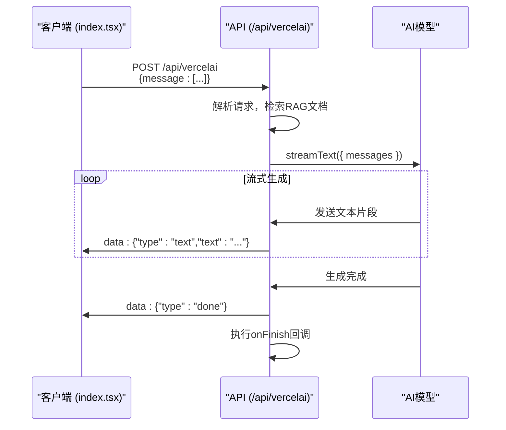
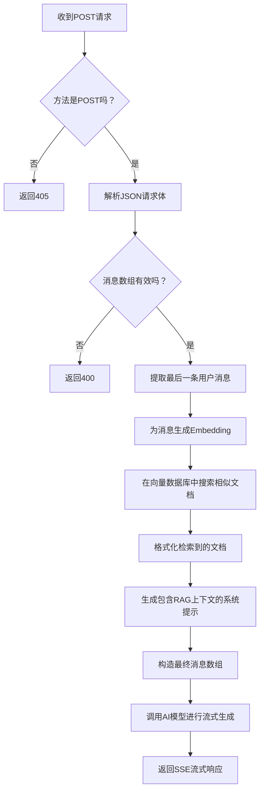

# Vercel AI SDK API

<cite>
**本文档引用的文件**
- [route.ts](file://app/api/vercelai/route.ts)
- [types.ts](file://app/api/vercelai/types.ts)
- [embedding.ts](file://app/api/vercelai/embedding.ts)
- [prompt.ts](file://lib/prompt.ts)
- [selectors.ts](file://lib/db/vercelai/selectors.ts)
- [actions.ts](file://lib/db/vercelai/actions.ts)
- [index.tsx](file://app/vercel-ai/index.tsx)
</cite>

## 目录
1. [简介](#简介)
2. [API端点与请求结构](#api端点与请求结构)
3. [响应格式与SSE流式传输](#响应格式与sse流式传输)
4. [核心处理流程](#核心处理流程)
5. [错误处理策略](#错误处理策略)
6. [客户端调用示例](#客户端调用示例)
7. [与OpenAI原生API的对比](#与openai原生api的对比)
8. [结论](#结论)

## 简介

本文档详细介绍了位于`/api/vercelai/route.ts`的API端点，该端点是基于Vercel AI SDK构建的代码生成服务的核心。该API接收前端请求，利用向量数据库进行相关文档检索（RAG），并结合检索到的上下文信息，通过AI模型生成高质量的前端业务组件代码。API的设计旨在为`app/vercel-ai/index.tsx`页面提供后端支持，实现一个智能的、上下文感知的代码生成工作流。

**Section sources**
- [route.ts](file://app/api/vercelai/route.ts#L1-L68)
- [index.tsx](file://app/vercel-ai/index.tsx#L1-L63)

## API端点与请求结构

### 端点URL
`POST /api/vercelai`

### 请求头
- `Content-Type: application/json`：必须设置，以确保请求体被正确解析。

### 请求体结构
请求体的结构由`app/api/vercelai/types.ts`文件中的`OpenAIRequest`类型定义。
- **根属性**：`message`，其类型为`CoreMessage[]`。
- **`CoreMessage`结构**：这是一个由Vercel AI SDK定义的接口，通常包含`role`（角色，如"user"或"assistant"）和`content`（内容，字符串）两个字段。
- **实际兼容性**：API在实现中表现出一定的灵活性，它同时支持`message`和`messages`作为消息数组的根属性名，以兼容不同的客户端调用方式。

**Section sources**
- [types.ts](file://app/api/vercelai/types.ts#L1-L6)
- [route.ts](file://app/api/vercelai/route.ts#L25-L30)

## 响应格式与SSE流式传输

### 响应类型
该API返回一个`text/event-stream`类型的流式响应。这意味着AI生成的文本会以数据帧（data frame）的形式分块、实时地发送给客户端，而不是等待整个响应生成完毕后一次性返回。这极大地提升了用户体验，用户可以立即看到AI生成的内容。

### SSE协议实现
API通过Vercel AI SDK的`streamText`函数实现SSE（Server-Sent Events）协议。
- **数据帧格式**：每个数据帧以`data: `开头，后跟一个JSON对象。该对象包含`type`字段（如"text"、"done"）和`text`字段（当前生成的文本片段）。
- **客户端解析**：客户端（如浏览器）会持续监听此流，每当收到一个数据帧，就将其解析并追加到聊天界面中。`useChat`钩子（来自`ai/react`）在`app/vercel-ai/index.tsx`中封装了这一复杂的解析逻辑，使前端开发者可以轻松处理流式响应。



**Diagram sources**
- [route.ts](file://app/api/vercelai/route.ts#L50-L65)
- [index.tsx](file://app/vercel-ai/index.tsx#L7-L10)

**Section sources**
- [route.ts](file://app/api/vercelai/route.ts#L50-L65)

## 核心处理流程

API的处理流程是一个精心设计的多步骤过程，将检索增强生成（RAG）技术与AI模型调用紧密结合。

### 1. 请求验证与解析
API首先验证HTTP方法为`POST`，然后解析请求体，提取出消息数组。

### 2. RAG文档检索
- **提取查询**：从消息数组中提取最后一条用户消息的内容作为查询文本。
- **生成Embedding**：调用`getEmbedding`函数，使用配置的AI模型（如`text-embedding-3-small`）为查询文本生成向量嵌入。
- **语义搜索**：调用`searchSimilarEmbeddings`函数，在`vercelAiEmbeddings`数据库表中执行基于余弦相似度的向量搜索，找出最相关的文档片段。

### 3. 构造系统提示（System Prompt）
- **生成上下文**：将检索到的文档片段格式化为带有编号的引用字符串。
- **注入上下文**：调用`getSystemPrompt`函数，将引用字符串作为`reference`参数传入。该函数返回一个预定义的系统提示，其中包含了角色设定、编码规范和工作流程，并将`reference`部分动态地插入到提示的末尾。

### 4. AI流式响应生成
- **构造最终消息**：将注入了RAG上下文的系统消息（system message）插入到原始消息数组的最前面。
- **发起流式调用**：使用`streamText`函数，将最终的消息数组发送给AI模型（如`gpt-4o-mini`），并开始流式接收响应。
- **后处理**：在流完成时，通过`onFinish`回调记录日志。



**Diagram sources**
- [route.ts](file://app/api/vercelai/route.ts#L1-L68)
- [embedding.ts](file://app/api/vercelai/embedding.ts#L51-L59)
- [selectors.ts](file://lib/db/vercelai/selectors.ts#L11-L31)
- [prompt.ts](file://lib/prompt.ts#L1-L67)

**Section sources**
- [route.ts](file://app/api/vercelai/route.ts#L1-L68)
- [embedding.ts](file://app/api/vercelai/embedding.ts#L51-L59)
- [selectors.ts](file://lib/db/vercelai/selectors.ts#L11-L31)
- [prompt.ts](file://lib/prompt.ts#L1-L67)

## 错误处理策略

API实现了分层的错误处理机制，以确保服务的健壮性。

### 400 Bad Request
- **触发条件**：当请求方法不是`POST`，或请求体中的消息数组不存在、为空、或格式不正确时触发。
- **诊断方法**：检查客户端发送的HTTP方法和请求体JSON结构。确保`message`或`messages`字段存在且为非空数组。

### 500 Internal Server Error
- **触发条件**：此错误通常由未捕获的异常引起，例如：
    - AI服务调用失败（网络问题、API密钥无效、模型不可用）。
    - 数据库查询错误（数据库连接失败、`searchSimilarEmbeddings`函数内部错误）。
    - 环境变量缺失（如`AI_KEY`、`AI_BASE_URL`未正确配置）。
- **诊断方法**：检查服务器日志。`onFinish`回调中的`console.log`可以帮助确认RAG检索是否成功执行。此外，应检查`lib/env.mjs`中的环境变量配置是否正确。

**Section sources**
- [route.ts](file://app/api/vercelai/route.ts#L20-L23)
- [route.ts](file://app/api/vercelai/route.ts#L30-L34)
- [route.ts](file://app/api/vercelai/route.ts#L60-L63)

## 客户端调用示例

### 使用curl命令
```bash
curl -X POST http://localhost:3000/api/vercelai \
  -H "Content-Type: application/json" \
  -d '{
    "message": [
      {
        "role": "user",
        "content": "请帮我创建一个按钮组件，要求有主要和次要两种样式。"
      }
    ]
  }'
```

### 使用JavaScript fetch
```javascript
const response = await fetch('/api/vercelai', {
  method: 'POST',
  headers: {
    'Content-Type': 'application/json',
  },
  body: JSON.stringify({
    message: [
      { role: 'user', content: '请帮我创建一个按钮组件，要求有主要和次要两种样式。' }
    ]
  }),
});

// 处理流式响应
const reader = response.body.getReader();
const decoder = new TextDecoder();
let result = '';

while(true) {
  const { done, value } = await reader.read();
  if (done) break;
  const chunk = decoder.decode(value);
  // 解析SSE数据帧，提取text字段
  const lines = chunk.split('\n');
  for (const line of lines) {
    if (line.startsWith('data: ')) {
      const data = JSON.parse(line.slice(6));
      if (data.type === 'text') {
        result += data.text;
        // 更新UI，例如：document.getElementById('output').innerText = result;
      }
    }
  }
}
```

**Section sources**
- [route.ts](file://app/api/vercelai/route.ts#L1-L68)

## 与OpenAI原生API的对比

| 特性 | 本Vercel AI SDK API | OpenAI原生API (如`/v1/chat/completions`) |
| :--- | :--- | :--- |
| **协议** | `text/event-stream` (SSE) | 支持`text/event-stream`和完整JSON响应 |
| **SDK依赖** | Vercel AI SDK (`ai`包) | OpenAI官方SDK或直接HTTP调用 |
| **流式处理** | 由`streamText`等函数抽象，简化了流的创建和管理 | 需要手动处理`/v1/chat/completions`的`stream=true`参数和SSE解析 |
| **RAG集成** | 深度集成。在调用AI前，自动检索数据库并注入系统提示。 | 无内置支持。RAG逻辑需在调用API前由开发者自行实现。 |
| **前端集成** | 提供`ai/react`库的`useChat`钩子，极大简化了React应用中的流式交互。 | 无官方前端钩子。开发者需自行实现状态管理和流解析。 |
| **系统提示** | 动态生成，可轻松注入检索到的上下文。 | 需在请求体中静态定义或由应用逻辑动态拼接。 |

**Section sources**
- [route.ts](file://app/api/vercelai/route.ts#L1-L68)
- [index.tsx](file://app/vercel-ai/index.tsx#L7-L10)

## 结论

`/api/vercelai/route.ts` API是一个功能完备的、基于RAG的智能代码生成服务端点。它通过Vercel AI SDK简化了流式AI交互的复杂性，并通过与`lib/db`模块的深度集成，实现了上下文感知的代码生成。该API的设计模式，特别是其将RAG检索无缝融入AI提示的流程，为构建智能开发辅助工具提供了一个优秀的范例。前端通过`useChat`钩子可以非常便捷地与之交互，共同构成了一个高效、流畅的开发者体验。