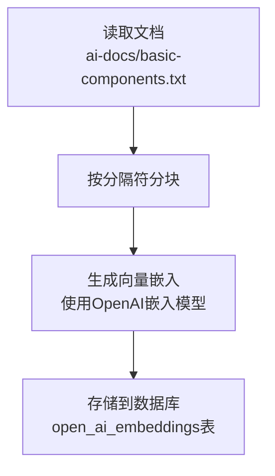

# RAG系统设计

<cite>
**本文档引用的文件**  
- [basic-components.txt](file://ai-docs/basic-components.txt)
- [embedDocs.ts](file://app/api/openai/embedDocs.ts)
- [embedding.ts](file://app/api/openai/embedding.ts)
- [prompt.ts](file://lib/prompt.ts)
- [route.ts](file://app/api/openai/route.ts)
- [actions.ts](file://lib/db/openai/actions.ts)
- [selectors.ts](file://lib/db/openai/selectors.ts)
- [schema.ts](file://lib/db/openai/schema.ts)
- [env.mjs](file://lib/env.mjs)
</cite>

## 目录
1. [简介](#简介)
2. [RAG系统工作原理](#rag系统工作原理)
3. [文档分块与向量嵌入](#文档分块与向量嵌入)
4. [知识库初始化流程](#知识库初始化流程)
5. [相似度检索与上下文注入](#相似度检索与上下文注入)
6. [数据流图](#数据流图)
7. [性能优化策略](#性能优化策略)
8. [故障排除](#故障排除)

## 简介
检索增强生成（Retrieval-Augmented Generation, RAG）系统是一种结合了信息检索和语言生成的混合架构。该系统通过将私有文档知识库与大型语言模型相结合，实现了基于特定领域知识的智能问答功能。本系统的核心目标是解决通用语言模型在特定领域知识上的局限性，通过从预处理的知识库中检索相关信息并注入到提示词中，使模型能够生成更准确、更专业的回答。

**本文档引用的文件**  
- [basic-components.txt](file://ai-docs/basic-components.txt)
- [test-rag-functionality.md](file://test-rag-functionality.md)

## RAG系统工作原理
RAG系统的工作流程分为两个主要阶段：离线知识库构建阶段和在线查询响应阶段。在离线阶段，系统将私有文档`ai-docs/basic-components.txt`进行分块处理，为每个文本块生成向量嵌入，并将这些嵌入与原始文本内容一起存储到数据库中。在在线阶段，当用户提出问题时，系统首先将用户查询转换为向量嵌入，然后在数据库中进行相似度搜索，找出与查询最相关的文档片段。这些相关片段作为上下文被注入到发送给AI模型的提示词中，从而引导模型生成基于特定知识的回答。

该系统通过这种方式实现了知识的动态更新和扩展，无需重新训练语言模型即可更新知识库内容。同时，由于检索过程是基于语义相似度而非关键词匹配，系统能够理解用户查询的深层含义，提供更精准的检索结果。

**本文档引用的文件**  
- [test-rag-functionality.md](file://test-rag-functionality.md#L0-L78)
- [route.ts](file://app/api/openai/route.ts#L1-L95)

## 文档分块与向量嵌入
文档分块是RAG系统预处理阶段的关键步骤，其目的是将大型文档分割成适合处理的较小片段。在本系统中，`ai-docs/basic-components.txt`文件中的文档通过特定的分隔符`-------split line-------`进行分割，每个UI组件的文档成为一个独立的文本块。这种分块策略确保了每个文本块都包含完整的组件信息，包括使用场景、API说明等，有利于后续的语义理解。

向量嵌入是将文本转换为数值向量的过程，这些向量能够在多维空间中表示文本的语义信息。系统使用OpenAI的嵌入模型（由环境变量`EMBEDDING`指定，默认为`text-embedding-ada-002`）为每个文本块生成1536维的向量嵌入。这些嵌入向量被存储在PostgreSQL数据库的`open_ai_embeddings`表中，利用向量索引（hnsw）实现高效的相似度搜索。



**图表来源**  
- [embedDocs.ts](file://app/api/openai/embedDocs.ts#L4-L14)
- [embedding.ts](file://app/api/openai/embedding.ts#L14-L45)
- [schema.ts](file://lib/db/openai/schema.ts#L9-L19)
- [actions.ts](file://lib/db/openai/actions.ts#L9-L20)

**本文档引用的文件**  
- [embedding.ts](file://app/api/openai/embedding.ts#L14-L45)
- [schema.ts](file://lib/db/openai/schema.ts#L9-L19)

## 知识库初始化流程
知识库的初始化由`embedDocs.ts`脚本负责执行，该脚本定义了`embedDocs`函数作为主要的初始化入口。执行流程如下：首先，脚本使用Node.js的`fs`模块同步读取`ai-docs/basic-components.txt`文件内容；然后，调用`getEmbeddingsByChunks`函数对文档进行分块并生成向量嵌入；最后，将生成的嵌入数据通过`insertOpenAiEmbeddings`函数批量插入到数据库中。

该流程通过`embedDocs()`函数的直接调用来触发，确保了知识库的初始化可以在应用启动时或需要更新知识时自动执行。整个过程是幂等的，重复执行不会导致数据重复，因为每次执行都会重新生成并插入所有文档的嵌入。

```mermaid
sequenceDiagram
    participant Script as embedDocs.ts
    participant Embedding as embedding.ts
    participant DB as 数据库
    participant OpenAI as OpenAI API
    
    Script->>Script: 读取basic-components.txt
    Script->>Embedding: 调用getEmbeddingsByChunks()
    Embedding->>OpenAI: 批量创建嵌入
    OpenAI-->>Embedding: 返回嵌