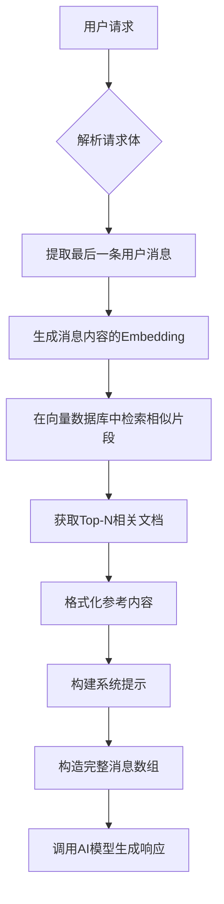
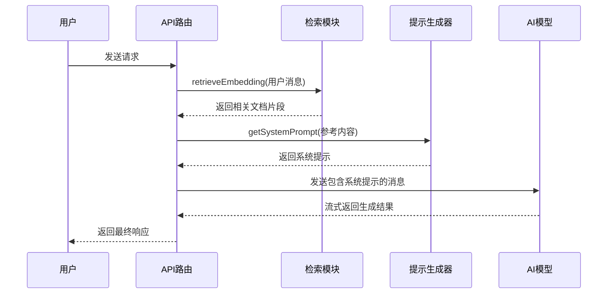
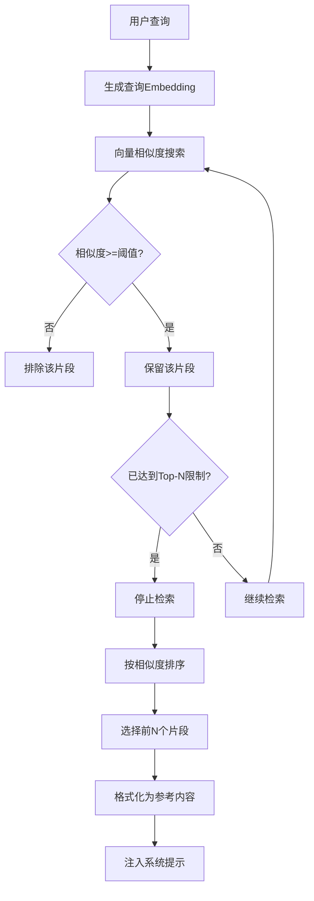
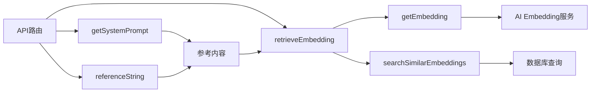

# 上下文注入

<cite>
**本文档中引用的文件**  
- [prompt.ts](file://lib/prompt.ts)
- [route.ts](file://app/api/openai/route.ts)
- [route.ts](file://app/api/vercelai/route.ts)
- [embedding.ts](file://app/api/openai/embedding.ts)
- [embedding.ts](file://app/api/vercelai/embedding.ts)
- [basic-components.txt](file://ai-docs/basic-components.txt)
</cite>

## 目录
1. [简介](#简介)
2. [上下文注入机制](#上下文注入机制)
3. [系统提示构建流程](#系统提示构建流程)
4. [参考文档格式化策略](#参考文档格式化策略)
5. [实际提示词模板示例](#实际提示词模板示例)
6. [上下文长度限制处理](#上下文长度限制处理)
7. [依赖分析](#依赖分析)

## 简介
本文档详细说明了系统如何将相似度检索返回的相关文档片段（reference）注入到发送给AI模型的提示词（prompt）中。重点分析`getSystemPrompt`函数如何根据可选的`reference`参数动态构建包含私有组件API知识的系统提示，从而指导AI模型生成符合规范的代码。

## 上下文注入机制

系统通过检索增强生成（RAG）机制实现上下文注入。当用户提交请求时，系统首先提取最后一条用户消息内容，然后调用`retrieveEmbedding`函数进行语义检索，获取与用户需求最相关的文档片段。

在OpenAI和Vercel AI两个API路由中，均实现了相同的上下文注入逻辑。该机制的核心步骤包括：
1. 解析用户请求并提取最后一条消息内容
2. 调用`retrieveEmbedding`函数进行向量相似度检索
3. 将检索结果转换为格式化的参考字符串
4. 使用`getSystemPrompt`函数生成包含参考内容的系统提示
5. 将系统提示作为system message插入到消息数组的最前面



**Diagram sources**
- [route.ts](file://app/api/openai/route.ts#L2-L53)
- [route.ts](file://app/api/vercelai/route.ts#L2-L67)

**Section sources**
- [route.ts](file://app/api/openai/route.ts#L1-L95)
- [route.ts](file://app/api/vercelai/route.ts#L1-L68)

## 系统提示构建流程

`getSystemPrompt`函数是上下文注入的核心，它根据可选的`reference`参数动态构建系统提示。该函数定义在`lib/prompt.ts`文件中，其主要职责是创建一个结构化的系统角色提示，用于指导AI模型的行为。

当`reference`参数存在时，函数会在基础提示后添加参考内容部分，使用`<Reference>`标签包裹检索到的文档片段。这种设计确保了AI模型能够访问最新的私有组件API知识，同时保持了提示结构的清晰性和一致性。



**Diagram sources**
- [prompt.ts](file://lib/prompt.ts#L1-L67)
- [route.ts](file://app/api/openai/route.ts#L3-L53)

**Section sources**
- [prompt.ts](file://lib/prompt.ts#L1-L67)

## 参考文档格式化策略

系统使用`referenceString`辅助函数将检索到的多个文档片段格式化为统一的字符串格式。该函数在OpenAI和Vercel AI两个API路由中均有定义，实现逻辑完全相同。

格式化策略采用编号标记的方式，每个检索到的文档片段都被赋予一个唯一的编号（如【片段1】、【片段2】等），并按顺序连接成一个连续的字符串。这种设计既保证了多个参考文档的清晰区分，又维持了文本的连贯性，便于AI模型理解和利用。

```mermaid
flowchart TB
A[检索结果数组] --> B{数组为空?}
B --> |是| C[返回空字符串]
B --> |否| D[遍历数组]
D --> E[为每个片段添加编号]
E --> F[格式化为"【片段N】内容"]
F --> G[用换行符连接所有片段]
G --> H[返回最终字符串]
```

**Diagram sources**
- [route.ts](file://app/api/openai/route.ts#L18-L21)
- [route.ts](file://app/api/vercelai/route.ts#L15-L18)

**Section sources**
- [route.ts](file://app/api/openai/route.ts#L18-L21)
- [route.ts](file://app/api/vercelai/route.ts#L15-L18)

## 实际提示词模板示例

系统提示模板包含固定的角色定义和可变的参考内容两部分。以下是实际的提示词结构示例：

```
# Role: 前端业务组件开发专家

## Profile
- author: lv
- version: 0.1
- language: 中文
- description: 你作为一名资深的前端开发工程师...

## Goals
- 能够清楚地理解用户提出的业务组件需求
- 根据用户的描述生成完整的符合代码规范的业务组件代码

## Constraints
- 业务组件中用到的所有组件都来源于 `import { } from "@private-basic-components"` 组件库
- 必须遵循知识库<API> </API>中组件的 props 来实现业务组件

## Workflows
第一步：结合用户需求理解我提供给你的`@private-basic-components`组件知识库数据
...

------
使用 <Reference></Reference> 标记中的内容作为本次对话的参考:

<Reference>
【片段1】The documentation for the Affix basic UI components
<when-to-use>
On longer web pages, it's helpful to stick component into the viewport...
<API>
| Property | Description | Type | Default |
| offsetBottom | Offset from the bottom of the viewport (in pixels) | number | - |
| offsetTop | Offset from the top of the viewport (in pixels) | number | 0 |

【片段2】The documentation for the Alert basic UI components
<when-to-use>
- When you need to show alert messages to users
- When you need a persistent static container which is closable by user actions
<API>
| Property | Description | Type | Default |
| action | The action of Alert | ReactNode | - |
| banner | Whether to show as banner | boolean | false |
</Reference>
```

**Section sources**
- [prompt.ts](file://lib/prompt.ts#L1-L67)
- [basic-components.txt](file://ai-docs/basic-components.txt#L1-L799)

## 上下文长度限制处理

系统通过多层策略来处理上下文长度限制问题：

1. **检索结果数量限制**：`retrieveEmbedding`函数的`topN`参数默认设置为3或5，限制返回的最相关文档片段数量，避免过多内容占用上下文空间。

2. **相似度阈值过滤**：通过`threshold`参数（默认0.5或0.7）过滤低相关性的检索结果，确保只有高质量的参考内容被注入。

3. **分块存储策略**：在生成embedding时，原始文档使用"-------split line-------"作为分隔符进行分块处理，每个组件的文档独立成块，便于精确检索和控制内容粒度。

4. **动态内容注入**：只有在存在相关检索结果时才注入参考内容，避免在不需要时增加不必要的上下文负担。



**Diagram sources**
- [embedding.ts](file://app/api/openai/embedding.ts#L58-L66)
- [embedding.ts](file://app/api/vercelai/embedding.ts#L51-L59)

**Section sources**
- [embedding.ts](file://app/api/openai/embedding.ts#L58-L66)
- [embedding.ts](file://app/api/vercelai/embedding.ts#L51-L59)

## 依赖分析

上下文注入功能涉及多个模块的协同工作，形成了清晰的依赖关系链：



系统通过这种模块化设计实现了高内聚低耦合的架构，各个组件职责明确，便于维护和扩展。API路由层负责协调整个流程，检索模块负责语义搜索，提示生成器负责构建AI交互上下文，形成了完整的上下文注入闭环。

**Diagram sources**
- [route.ts](file://app/api/openai/route.ts#L1-L95)
- [embedding.ts](file://app/api/openai/embedding.ts#L1-L67)
- [prompt.ts](file://lib/prompt.ts#L1-L67)

**Section sources**
- [route.ts](file://app/api/openai/route.ts#L1-L95)
- [embedding.ts](file://app/api/openai/embedding.ts#L1-L67)
- [prompt.ts](file://lib/prompt.ts#L1-L67)