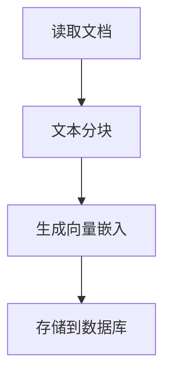
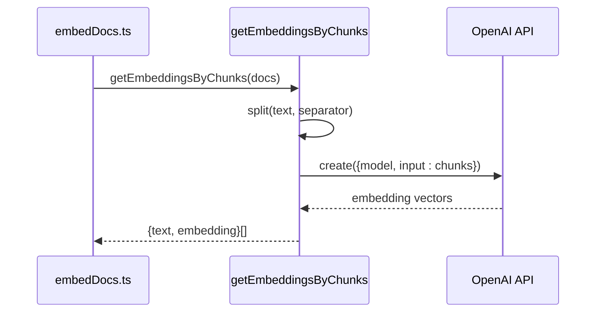
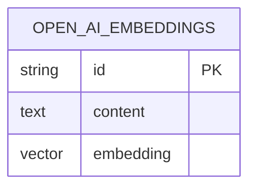

<cite>
**本文档中引用的文件**  
- [embedDocs.ts](file://app/api/openai/embedDocs.ts)
- [embedding.ts](file://app/api/openai/embedding.ts)
- [basic-components.txt](file://ai-docs/basic-components.txt)
- [actions.ts](file://lib/db/openai/actions.ts)
- [schema.ts](file://lib/db/openai/schema.ts)
</cite>

## 目录
1. [文档嵌入生成](#文档嵌入生成)
2. [核心流程分析](#核心流程分析)
3. [分块策略与嵌入生成](#分块策略与嵌入生成)
4. [向量存储机制](#向量存储机制)
5. [数据库表结构](#数据库表结构)
6. [完整流程示意图](#完整流程示意图)
7. [RAG知识库初始化作用](#rag知识库初始化作用)
8. [分块策略对检索效果的影响](#分块策略对检索效果的影响)
9. [嵌入质量优化建议](#嵌入质量优化建议)

## 文档嵌入生成

本文档详细阐述了`embedDocs.ts`脚本如何实现文档嵌入生成的完整流程。该流程是构建RAG（检索增强生成）知识库的核心环节，通过将私有组件文档转换为向量嵌入，为后续的语义检索提供基础数据支持。

## 核心流程分析

文档嵌入生成的核心流程由`embedDocs.ts`脚本驱动，涉及文档读取、文本分块、向量生成和数据库存储四个关键步骤。该流程实现了从原始文本到结构化向量数据的转换。

**Diagram sources**
- [embedDocs.ts](file://app/api/openai/embedDocs.ts#L1-L17)

**Section sources**
- [embedDocs.ts](file://app/api/openai/embedDocs.ts#L1-L17)

## 分块策略与嵌入生成

文本分块是嵌入生成的关键预处理步骤，由`embedding.ts`中的`getEmbeddingsByChunks`函数实现。该函数负责将长文本分割为语义完整的片段，并调用OpenAI API为每个片段生成向量表示。

### 分块处理逻辑

`getEmbeddingsByChunks`函数接收原始文本和配置选项，使用指定的分隔符（默认为`-------split line-------`）将文本分割成多个块。分隔符的选择至关重要，它决定了每个文本块的语义边界。在本项目中，分隔符被精心设计为每种UI组件文档的分界线，确保每个文本块对应一个完整的组件文档。

### 嵌入生成过程

分块完成后，函数将所有文本块批量发送到OpenAI的嵌入模型（默认为`text-embedding-ada-002`）。批量处理不仅提高了效率，还降低了API调用成本。API返回的浮点数向量数组即为文本的高维语义表示。

**Diagram sources**
- [embedding.ts](file://app/api/openai/embedding.ts#L14-L45)

**Section sources**
- [embedding.ts](file://app/api/openai/embedding.ts#L14-L45)

## 向量存储机制

生成的向量嵌入需要持久化存储以便后续检索，这一任务由`insertOpenAiEmbeddings`函数完成。该函数实现了将向量数据批量插入数据库的逻辑。

### 存储流程

`insertOpenAiEmbeddings`函数接收一个包含文本内容和对应向量的数组。首先进行输入验证，确保数据格式正确。然后构造符合数据库表结构的插入数据行，最后通过Drizzle ORM执行批量插入操作。批量插入显著提升了数据写入效率，避免了逐条插入的性能瓶颈。

**Section sources**
- [actions.ts](file://lib/db/openai/actions.ts#L9-L20)

## 数据库表结构

向量数据存储在名为`open_ai_embeddings`的数据库表中，其结构由`schema.ts`文件定义。该表设计充分考虑了向量检索的特殊需求。

### 表结构定义

| 字段 | 类型 | 约束 | 说明 |
|------|------|------|------|
| id | varchar(191) | 主键, 自动生成 | 唯一标识符 |
| content | text | 非空 | 原始文本内容 |
| embedding | vector(1536) | 非空 | OpenAI生成的1536维向量 |

### 索引设计

表中创建了名为`openai_embedding_index`的HNSW（Hierarchical Navigable Small World）索引，专门用于加速向量相似度搜索。该索引使用`vector_cosine_ops`操作符，支持高效的余弦相似度计算，是实现快速语义检索的基础。

**Diagram sources**
- [schema.ts](file://lib/db/openai/schema.ts#L3-L18)

**Section sources**
- [schema.ts](file://lib/db/openai/schema.ts#L3-L18)

## 完整流程示意图

以下流程图展示了从文档读取到向量存储的完整端到端流程。

**Diagram sources**
- [embedDocs.ts](file://app/api/openai/embedDocs.ts#L1-L17)
- [embedding.ts](file://app/api/openai/embedding.ts#L14-L45)
- [actions.ts](file://lib/db/openai/actions.ts#L9-L20)

## RAG知识库初始化作用

该文档嵌入生成流程在RAG系统中扮演着知识库初始化的关键角色。通过将`basic-components.txt`中的私有组件文档转换为向量嵌入，系统构建了一个可被语义检索的知识库。当用户提出关于组件使用的问题时，系统可以快速检索出最相关的文档片段，为大模型生成准确回答提供上下文支持。这种机制有效解决了大模型知识更新滞后和缺乏私有领域知识的问题。

## 分块策略对检索效果的影响

分块策略是影响检索效果的核心因素。本项目采用的`-------split line-------`分隔符确保了每个文本块都是一个完整的组件文档，这种基于语义边界的分块方式具有显著优势：

- **高召回率**：查询与组件相关的任何信息时，整个组件文档作为一个单元被检索，避免了信息碎片化。
- **上下文完整性**：返回的检索结果包含完整的API文档和使用示例，无需拼接多个片段。
- **减少噪声**：避免了跨组件的语义混淆，确保检索结果的相关性。

然而，过大的文本块也可能导致检索精度下降，因为模型可能只关注文本中的局部信息。未来可探索更精细的分块策略，如按API属性或使用示例进一步细分。

## 嵌入质量优化建议

为持续优化嵌入质量，建议从以下几个方面进行调整：

1. **模型升级**：考虑将嵌入模型从`text-embedding-ada-002`升级到`text-embedding-3-small`或`text-embedding-3-large`，新模型在语义表示能力和维度效率上均有显著提升。
2. **参数调优**：实验不同的`encoding_format`（如`base64`）对存储和检索性能的影响。
3. **预处理增强**：在分块后增加文本清洗步骤，移除无关的格式字符，保留核心语义信息。
4. **质量评估**：建立嵌入质量评估机制，通过计算检索结果的相关性分数来量化不同配置下的性能差异。