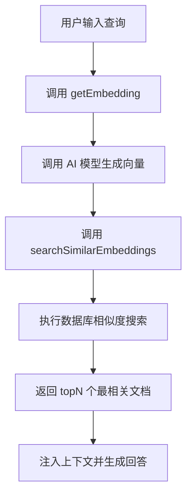
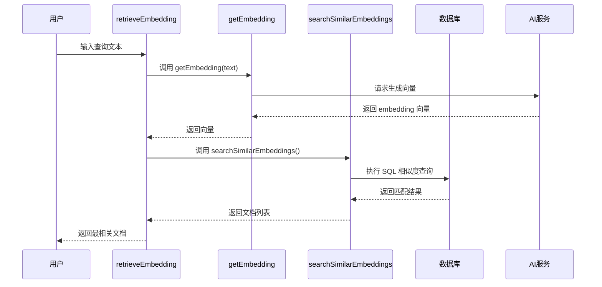
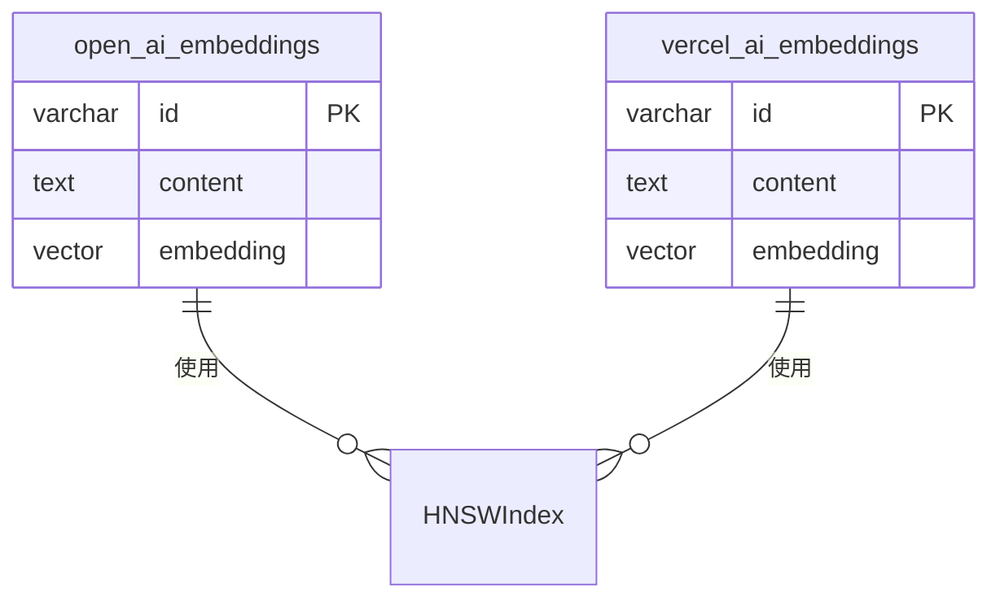

# 相似度检索

<cite>
**本文档中引用的文件**  
- [app/api/openai/embedding.ts](file://app/api/openai/embedding.ts)
- [app/api/vercelai/embedding.ts](file://app/api/vercelai/embedding.ts)
- [lib/db/openai/selectors.ts](file://lib/db/openai/selectors.ts)
- [lib/db/vercelai/selectors.ts](file://lib/db/vercelai/selectors.ts)
- [lib/db/openai/schema.ts](file://lib/db/openai/schema.ts)
- [lib/db/vercelai/schema.ts](file://lib/db/vercelai/schema.ts)
- [app/api/vercelai/embedDocs.ts](file://app/api/vercelai/embedDocs.ts)
- [test-rag-functionality.md](file://test-rag-functionality.md)
- [INTEGRATION_SUMMARY.md](file://INTEGRATION_SUMMARY.md)
</cite>

## 目录
1. [简介](#简介)
2. [核心检索流程](#核心检索流程)
3. [retrieveEmbedding 函数分析](#retrieveembedding-函数分析)
4. [searchSimilarEmbeddings 向量搜索机制](#searchsimilarembeddings-向量搜索机制)
5. [相似度参数详解](#相似度参数详解)
6. [完整调用链示例](#完整调用链示例)
7. [索引优化与性能提升](#索引优化与性能提升)
8. [常见问题与调试](#常见问题与调试)
9. [结论](#结论)

## 简介
本项目实现了基于向量嵌入的语义相似度检索机制，支持通过 OpenAI 和 Vercel AI 两种嵌入模型进行文档检索。系统将文档内容转换为高维向量并存储在 PostgreSQL 数据库中，利用余弦相似度算法实现高效的语义搜索。该机制是 RAG（检索增强生成）系统的核心组件，用于在用户提问时召回最相关的知识片段。

## 核心检索流程

**图示来源**  
- [app/api/openai/embedding.ts](file://app/api/openai/embedding.ts#L58-L66)
- [lib/db/openai/selectors.ts](file://lib/db/openai/selectors.ts#L11-L31)

## retrieveEmbedding 函数分析
`retrieveEmbedding` 函数是相似度检索的入口点，负责将用户查询文本转换为向量并触发后续搜索。该函数存在于两个实现中，分别对应 OpenAI 和 Vercel AI 两种嵌入服务。

**核心功能**：
- 接收用户查询文本
- 调用对应 AI 服务生成文本嵌入向量
- 调用底层数据库搜索函数执行相似度匹配
- 返回符合条件的最相关文档列表

**Section sources**
- [app/api/openai/embedding.ts](file://app/api/openai/embedding.ts#L58-L66)
- [app/api/vercelai/embedding.ts](file://app/api/vercelai/embedding.ts#L51-L59)

## searchSimilarEmbeddings 向量搜索机制

**图示来源**  
- [lib/db/openai/selectors.ts](file://lib/db/openai/selectors.ts#L11-L31)
- [lib/db/vercelai/selectors.ts](file://lib/db/vercelai/selectors.ts#L11-L31)

## 相似度参数详解
| 参数 | 类型 | 默认值 | 作用说明 |
|------|------|--------|----------|
| threshold | number | 0.7 (retrieve) / 0.75 (search) | 相似度阈值，范围 0-1，值越大要求越相似 |
| topN | number | 5 | 返回结果的最大数量，控制召回文档数量 |

**参数行为说明**：
- **threshold**：设置结果的最低相似度门槛，低于此值的文档不会被返回
- **topN**：限制返回结果数量，避免返回过多无关内容影响性能

**Section sources**
- [app/api/openai/embedding.ts](file://app/api/openai/embedding.ts#L58-L66)
- [lib/db/openai/selectors.ts](file://lib/db/openai/selectors.ts#L11-L31)

## 完整调用链示例

**实际调用示例**：
1. 用户输入："什么是 Button 组件？"
2. 系统调用 `retrieveEmbedding("什么是 Button 组件？", 0.7, 5)`
3. 调用 `getEmbedding` 获取该文本的向量表示
4. 调用 `searchSimilarEmbeddings` 在数据库中搜索相似向量
5. 返回相似度大于 0.7 的前 5 个最相关文档片段

**Section sources**
- [test-rag-functionality.md](file://test-rag-functionality.md#L45-L55)
- [app/api/vercelai/embedDocs.ts](file://app/api/vercelai/embedDocs.ts#L0-L16)

## 索引优化与性能提升
系统通过 HNSW（Hierarchical Navigable Small World）索引显著提升大规模数据集的检索性能。数据库表 `open_ai_embeddings` 和 `vercel_ai_embeddings` 均在 `embedding` 字段上创建了 HNSW 索引，使用 `vector_cosine_ops` 操作符类支持高效的余弦相似度计算。

**索引配置**：
- 索引类型：HNSW
- 操作符：vector_cosine_ops
- 向量维度：1536（对应 text-embedding-ada-002 模型）

此优化使得即使在百万级向量数据集中也能实现毫秒级响应，相比全表扫描有数量级的性能提升。

**图示来源**  
- [lib/db/openai/schema.ts](file://lib/db/openai/schema.ts#L0-L18)
- [lib/db/vercelai/schema.ts](file://lib/db/vercelai/schema.ts#L0-L18)

## 常见问题与调试
### 低相关性结果问题
**可能原因**：
1. 相似度阈值设置过高或过低
2. 嵌入模型与文档类型不匹配
3. 文档分块策略不合理
4. 训练数据不足

**调试方法**：
- 临时降低 `threshold` 值观察返回结果
- 检查嵌入向量的生成是否正常
- 验证数据库中是否已正确存储文档嵌入
- 使用 `embedDocs` 脚本重新生成文档嵌入

### 性能问题
**优化建议**：
- 确保 HNSW 索引已正确创建
- 监控数据库查询性能
- 适当调整 `topN` 值避免返回过多结果
- 考虑使用专用向量数据库（如 Weaviate）处理超大规模数据

**Section sources**
- [test-rag-functionality.md](file://test-rag-functionality.md#L75-L86)
- [INTEGRATION_SUMMARY.md](file://INTEGRATION_SUMMARY.md#L0-L125)

## 结论
本系统的相似度检索机制通过 `retrieveEmbedding` 和 `searchSimilarEmbeddings` 函数的协同工作，实现了高效的语义搜索功能。系统支持灵活的阈值和数量控制参数，结合 HNSW 索引优化，能够在大规模数据集中快速定位最相关的信息。该机制为 RAG 系统提供了可靠的知识检索能力，是实现智能问答的核心基础。