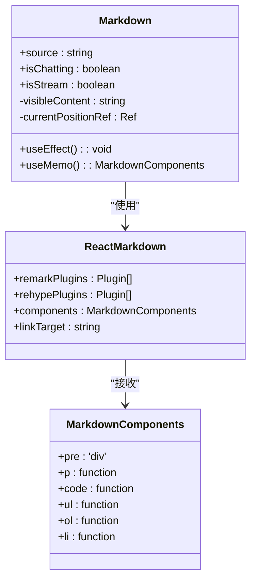
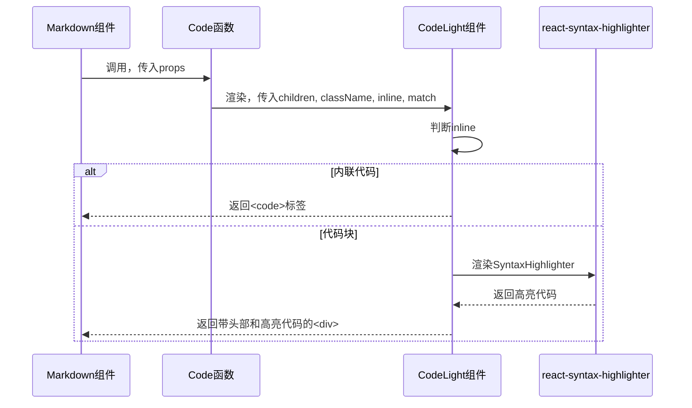

# Markdown渲染组件 (Markdown)

<cite>
**本文档中引用的文件**  
- [Markdown.tsx](file://app/components/Markdown/Markdown.tsx)
- [CodeLight.tsx](file://app/components/Markdown/CodeLight.tsx)
- [interface.ts](file://app/components/Markdown/interface.ts)
- [styles.ts](file://app/components/Markdown/styles.ts)
- [AssistantMessage.tsx](file://app/components/ChatMessages/AssistantMessage.tsx)
- [UserMessage.tsx](file://app/components/ChatMessages/UserMessage.tsx)
</cite>

## 目录
1. [简介](#简介)
2. [核心功能与设计](#核心功能与设计)
3. [流式渲染机制](#流式渲染机制)
4. [渲染行为控制参数](#渲染行为控制参数)
5. [Markdown解析与自定义渲染](#markdown解析与自定义渲染)
6. [代码高亮集成方案](#代码高亮集成方案)
7. [性能优化策略](#性能优化策略)
8. [使用示例](#使用示例)
9. [结论](#结论)

## 简介
`Markdown` 组件是AI应用中用于渲染响应内容的核心UI组件。它不仅能够解析标准的Markdown语法，还特别针对聊天场景优化，支持流式渲染（streaming），模拟打字机效果，提升用户体验。该组件通过集成 `react-markdown` 库和自定义的 `CodeLight` 组件，实现了对文本、代码块、列表等元素的精确控制和高亮显示。

**Section sources**
- [Markdown.tsx](file://app/components/Markdown/Markdown.tsx#L1-L110)

## 核心功能与设计
该组件的主要职责是将传入的Markdown格式字符串安全、高效地渲染为富文本内容。其设计围绕着可配置性、性能和用户体验展开，支持静态渲染和动态流式渲染两种模式。组件通过 `useMemo` 缓存渲染配置，并通过 `useEffect` 管理流式渲染的生命周期。

**Section sources**
- [Markdown.tsx](file://app/components/Markdown/Markdown.tsx#L16-L89)

## 流式渲染机制
流式渲染是该组件的核心特性，用于在AI聊天场景中逐步显示长文本回复。

### 核心实现
流式渲染由 `useEffect` 钩子驱动，结合 `setTimeout` 实现。当 `isStream` 为 `true` 时，组件会启动一个递归的定时器，将 `source` 字符串按固定大小的块（`CHUNK_SIZE`）逐步显示。

### 分块与定时
- **分块大小 (CHUNK_SIZE)**: 定义为 `2`，即每次渲染2个字符。
- **渲染间隔 (RENDER_INTERVAL)**: 定义为 `0.5` 毫秒，控制字符出现的速度。
- **状态管理**: 使用 `useState` 管理 `visibleContent`，并使用 `useRef` 保存当前渲染的字符位置（`currentPositionRef`）。

### 渲染流程
1.  检查 `isStream` 和 `isChatting` 参数。
2.  如果 `isChatting` 为 `false`，则立即显示全部内容。
3.  否则，定义 `renderNextChunk` 函数，该函数：
    -   将 `source` 从开始到 `currentPositionRef.current + CHUNK_SIZE` 的部分切片。
    -   更新 `visibleContent` 状态。
    -   将 `currentPositionRef.current` 增加 `CHUNK_SIZE`。
    -   使用 `setTimeout` 调用自身，实现循环。
4.  执行 `renderNextChunk` 启动渲染。
5.  在 `useEffect` 的清理函数中，使用 `clearTimeout` 清理定时器，防止内存泄漏。

```mermaid
flowchart TD
A[开始] --> B{isStream?}
B --> |否| C[直接渲染全部内容]
B --> |是| D{isChatting?}
D --> |否| C
D --> |是| E[初始化定时器]
E --> F[切片并更新visibleContent]
F --> G[更新当前位置]
G --> H[setTimeout(renderNextChunk)]
H --> I{位置 < 总长度?}
I --> |是| F
I --> |否| J[结束]
```

**Diagram sources**
- [Markdown.tsx](file://app/components/Markdown/Markdown.tsx#L41-L95)

**Section sources**
- [Markdown.tsx](file://app/components/Markdown/Markdown.tsx#L41-L95)

## 渲染行为控制参数
组件通过两个布尔型参数精确控制其渲染行为。

### isStream 参数
- **作用**: 启用或禁用流式渲染模式。
- **行为**: 当为 `true` 时，组件使用 `visibleContent` 状态进行分块渲染；当为 `false` 时，直接渲染完整的 `source` 字符串。

### isChatting 参数
- **作用**: 标识当前是否处于聊天交互状态。
- **行为**: 与 `isStream` 结合使用。当 `isStream` 为 `true` 但 `isChatting` 为 `false` 时，组件会一次性显示全部内容，这可能用于预览或非交互式场景。

**Section sources**
- [interface.ts](file://app/components/Markdown/interface.ts#L11-L15)
- [Markdown.tsx](file://app/components/Markdown/Markdown.tsx#L16-L89)

## Markdown解析与自定义渲染
组件利用 `react-markdown` 库进行Markdown解析，并通过 `components` 属性深度自定义HTML标签的渲染方式。

### 解析插件
- **remarkPlugins**: 使用 `RemarkMath` (数学公式)、`RemarkGfm` (GitHub Flavored Markdown) 和 `RemarkBreaks` (换行符处理)。
- **rehypePlugins**: 使用 `RehypeKatex` 来渲染数学公式。

### 自定义组件映射
`components` 对象通过 `useMemo` 缓存，避免不必要的重新计算。它定义了以下关键映射：
- **`pre`**: 将 `<pre>` 标签替换为 `<div>`，以更好地控制样式。
- **`p`**: 为所有段落添加 `dir="auto"` 属性，支持自动文本方向。
- **`code`**: 映射到内部的 `Code` 组件，用于处理代码块和内联代码。
- **`ul`, `ol`, `li`**: 为无序列表、有序列表和列表项统一设置文本颜色为 `rgba(255, 255, 255, 0.8)`，确保视觉一致性。



**Diagram sources**
- [Markdown.tsx](file://app/components/Markdown/Markdown.tsx#L70-L89)
- [interface.ts](file://app/components/Markdown/interface.ts#L28-L32)

**Section sources**
- [Markdown.tsx](file://app/components/Markdown/Markdown.tsx#L70-L89)

## 代码高亮集成方案
组件通过集成 `CodeLight` 组件来实现代码高亮和复制功能。

### CodeLight 组件
`CodeLight` 是一个动态导入的组件，用于处理代码块的渲染。
- **逻辑判断**: 根据 `inline` 参数区分内联代码和代码块。
- **语言识别**: 通过正则表达式 `/language-(\w+)/` 从 `className` 中提取编程语言类型（如 `javascript`）。
- **高亮渲染**: 对于代码块（`inline=false`），使用 `react-syntax-highlighter` 库和 `Prism` 样式进行高亮，并传入 `codeLight` 样式对象。
- **复制功能**: 在代码块上方渲染一个包含语言标签和“复制”按钮的头部，点击按钮可调用 `useCopyData` 钩子复制代码。

### 样式集成
`CodeLight` 组件使用 `useCodeLightClassName` 钩子生成其容器的CSS类名，该类名定义了头部和复制按钮的样式。



**Diagram sources**
- [Markdown.tsx](file://app/components/Markdown/Markdown.tsx#L11-L11)
- [CodeLight.tsx](file://app/components/Markdown/CodeLight.tsx#L286-L322)
- [styles.ts](file://app/components/Markdown/styles.ts#L417-L435)

**Section sources**
- [CodeLight.tsx](file://app/components/Markdown/CodeLight.tsx#L286-L322)
- [Markdown.tsx](file://app/components/Markdown/Markdown.tsx#L11-L11)

## 性能优化策略
该组件在设计上充分考虑了性能。

### useMemo 缓存
`components` 对象使用 `useMemo` 进行缓存，其依赖项为空数组 `[]`，这意味着该对象在组件的整个生命周期内只创建一次，避免了每次渲染时都重新创建函数和对象，从而减少了不必要的重渲染。

### 及时清理定时器
在 `useEffect` 的清理函数中，明确检查并调用 `clearTimeout(timerId)`，确保当组件卸载或依赖项变化时，正在运行的定时器会被清除，防止内存泄漏和在已卸载的组件上设置状态。

### memo 包装
主 `Markdown` 组件和内部的 `Code` 函数组件都使用了 `React.memo` 进行包装，实现了浅比较的props优化，避免在props未变化时进行不必要的重渲染。

**Section sources**
- [Markdown.tsx](file://app/components/Markdown/Markdown.tsx#L70-L89)
- [Markdown.tsx](file://app/components/Markdown/Markdown.tsx#L97-L109)

## 使用示例

### 在聊天消息中的使用
在 `AssistantMessage` 组件中，`Markdown` 组件被配置为流式渲染模式，以匹配AI回复的生成过程。
```tsx
<Markdown 
  source={message} 
  isChatting={isLoading} 
  isStream 
/>
```
- **isChatting**: 绑定到 `isLoading` 状态，当AI正在思考时为 `true`。
- **isStream**: 设置为 `true`，启用打字机效果。

**Section sources**
- [AssistantMessage.tsx](file://app/components/ChatMessages/AssistantMessage.tsx#L25-L73)

### 在静态内容中的使用
在 `UserMessage` 组件中，`Markdown` 组件用于渲染用户的输入，通常为静态内容。
```tsx
<Markdown source={message} />
```
- **isStream**: 未提供，默认为 `false`。
- **isChatting**: 未提供，默认为 `false`。
此配置会立即渲染全部Markdown内容。

**Section sources**
- [UserMessage.tsx](file://app/components/ChatMessages/UserMessage.tsx#L25-L59)

## 结论
`Markdown` 组件是一个功能强大且高度优化的渲染引擎，专为AI驱动的应用而设计。它通过 `useEffect` 和 `setTimeout` 实现了流畅的流式渲染，通过 `isStream` 和 `isChatting` 参数灵活控制渲染行为。组件利用 `react-markdown` 的扩展能力，通过 `components` 属性实现了对列表、段落等元素的样式定制，并通过集成 `CodeLight` 组件提供了专业的代码高亮和复制功能。最后，通过 `useMemo`、`useEffect` 清理和 `React.memo` 等技术，确保了组件在各种场景下的高性能和稳定性。