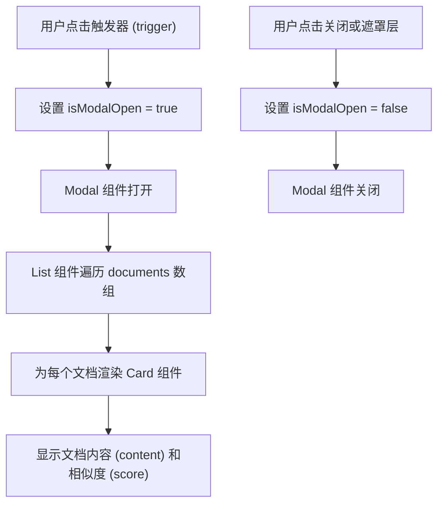
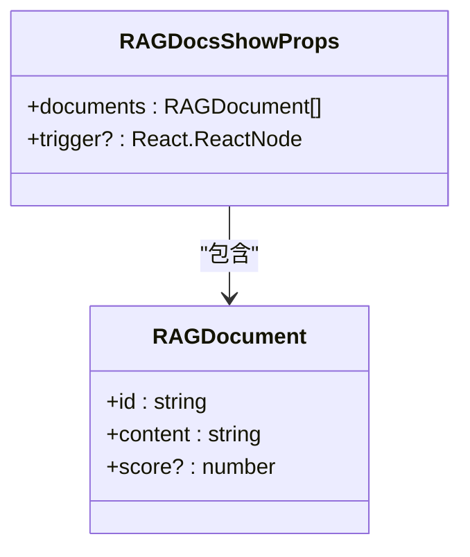
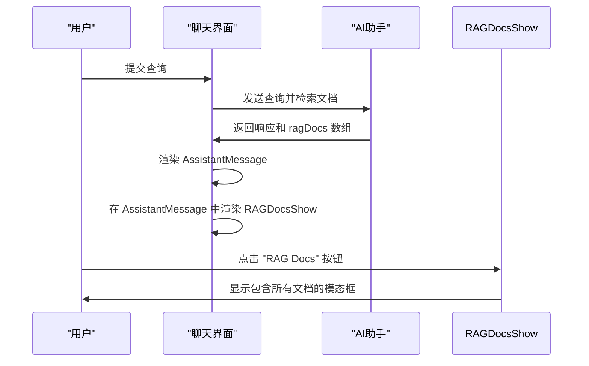

# RAG文档展示组件 (RAGDocsShow)

<cite>
**本文档引用文件**  
- [RAGDocsShow.tsx](file://app/components/RAGDocsShow/RAGDocsShow.tsx)
- [interface.ts](file://app/components/RAGDocsShow/interface.ts)
- [RAGDocsShow.stories.tsx](file://app/components/RAGDocsShow/RAGDocsShow.stories.tsx)
- [AssistantMessage.tsx](file://app/components/ChatMessages/AssistantMessage.tsx)
- [ChatMessages.tsx](file://app/components/ChatMessages/ChatMessages.tsx)
- [interface.ts](file://app/components/ChatMessages/interface.ts)
</cite>

## 目录
1. [简介](#简介)
2. [核心功能与工作流程](#核心功能与工作流程)
3. [属性（Props）结构详解](#属性props结构详解)
4. [UI设计与交互细节](#ui设计与交互细节)
5. [使用示例与集成场景](#使用示例与集成场景)
6. [在RAG系统中的价值](#在rag系统中的价值)

## 简介
RAGDocsShow 是一个专为检索增强生成（RAG）系统设计的可视化组件，用于展示AI模型在生成响应时所依据的检索文档。该组件通过一个可交互的触发器（trigger）激活模态框，在模态框中以列表形式清晰地呈现检索到的文档内容及其相关性评分，从而增强系统的透明度和用户信任。

**Section sources**
- [RAGDocsShow.tsx](file://app/components/RAGDocsShow/RAGDocsShow.tsx#L1-L52)
- [RAGDocsShow.stories.tsx](file://app/components/RAGDocsShow/RAGDocsShow.stories.tsx#L1-L34)

## 核心功能与工作流程
RAGDocsShow 组件的核心工作流程如下：
1. **触发机制**：组件接收一个 `trigger` 作为子元素（如按钮），当用户点击该触发器时，会激活模态框的显示。
2. **状态管理**：内部使用 `useState` 管理模态框的打开/关闭状态（`isModalOpen`）。
3. **模态框展示**：点击触发器后，`isModalOpen` 状态被设为 `true`，Ant Design 的 `Modal` 组件随之打开。
4. **文档渲染**：在模态框内，使用 `List` 组件遍历传入的 `documents` 数组，每个文档项通过 `Card` 组件进行渲染，确保布局整洁且具有良好的视觉层次。
5. **交互关闭**：用户可以通过点击模态框右上角的关闭按钮或点击遮罩层来关闭模态框，此时 `onCancel` 回调会将 `isModalOpen` 设为 `false`。



**Diagram sources**
- [RAGDocsShow.tsx](file://app/components/RAGDocsShow/RAGDocsShow.tsx#L6-L50)

**Section sources**
- [RAGDocsShow.tsx](file://app/components/RAGDocsShow/RAGDocsShow.tsx#L6-L50)

## 属性（Props）结构详解
RAGDocsShow 组件接受两个主要属性，定义在 `interface.ts` 文件中。

### RAGDocsShowProps 接口
```typescript
interface RAGDocsShowProps {
  documents: RAGDocument[];
  trigger?: React.ReactNode;
}
```

- **documents**: 一个 `RAGDocument` 对象数组，是组件的核心数据源。
  - **id**: 字符串类型，文档的唯一标识符。
  - **content**: 字符串类型，包含检索到的文档原始内容，将在 `Paragraph` 组件中展示。
  - **score**: 可选的数字类型，表示文档与用户查询的相似度或相关性分数（通常在0到1之间）。

- **trigger**: 可选的 `React.ReactNode` 类型，用于定义激活模态框的UI元素。如果未提供，组件将不会有任何可见的触发方式。

### 数据展示逻辑
- **content 展示**：每个文档的 `content` 字段通过 Ant Design 的 `Paragraph` 组件展示，并配置了省略号（ellipsis）功能，当文本超过3行时自动折叠，并提供“more”链接供用户展开查看完整内容。
- **score 展示**：如果文档包含 `score` 字段，组件会使用 `Tag` 组件将其渲染为一个蓝色标签。`score` 值会乘以100并保留两位小数，以百分比形式显示（例如，0.89 显示为 "89.00%"）。



**Diagram sources**
- [interface.ts](file://app/components/RAGDocsShow/interface.ts#L0-L11)

**Section sources**
- [interface.ts](file://app/components/RAGDocsShow/interface.ts#L0-L11)

## UI设计与交互细节
RAGDocsShow 组件的UI设计注重用户体验和信息的清晰传达。

- **模态框尺寸**：`Modal` 组件的 `width` 被固定为800像素，确保在大多数屏幕上都能提供足够的空间来展示文档内容，同时避免过大而影响用户体验。
- **无页脚设计**：`footer={null}` 移除了模态框默认的确认和取消按钮，因为该组件仅用于信息展示，无需用户进行确认操作。
- **卡片悬停效果**：每个文档的 `Card` 组件都应用了 `hover:shadow-md` 和 `transition-shadow` 的Tailwind CSS类，当用户将鼠标悬停在卡片上时，会显示轻微的阴影，提供视觉反馈。
- **长文本处理**：`Paragraph` 组件的 `ellipsis` 配置实现了对长文本的优雅处理。`expandable: true` 允许用户通过点击“more”链接来展开和收起全文，这对于展示可能很长的检索结果至关重要。
- **标签样式**：`Tag` 组件通过自定义CSS类（`!h-[24px] !leading-[22px] flex items-center`）确保了高度和行高的精确控制，并使用 `flex items-center` 保证文本垂直居中。

**Section sources**
- [RAGDocsShow.tsx](file://app/components/RAGDocsShow/RAGDocsShow.tsx#L20-L48)

## 使用示例与集成场景
RAGDocsShow 组件最典型的集成场景是在聊天界面中，作为AI助手消息的一部分。

### 示例：在聊天消息中集成
在 `AssistantMessage.tsx` 组件中，`RAGDocsShow` 被直接用于展示与AI响应关联的检索文档。

```tsx
{ragDocs && (
  <RAGDocsShow
    documents={ragDocs}
    trigger={
      <Badge dot color="green">
        <Button size="small" type="default" icon={<FileOutlined />}>
          RAG Docs
        </Button>
      </Badge>
    }
  />
)}
```

- **数据来源**：`ragDocs` 作为 `AssistantMessage` 组件的prop传入，它直接来自AI响应的元数据。
- **触发器设计**：触发器是一个带有绿色圆点徽章（`Badge dot`）的小型按钮，图标为文件（`FileOutlined`），文字为“RAG Docs”。绿色圆点直观地提示用户有相关文档可供查看。
- **消息结构**：在 `ChatMessages.tsx` 中，每条消息对象（`Message`）可以包含一个可选的 `ragDocs` 字段，其类型正是从 `RAGDocsShow` 组件导入的 `RAGDocument`。

此集成方式确保了用户在查看AI回答的同时，可以一键查看支撑该回答的原始信息来源。



**Diagram sources**
- [AssistantMessage.tsx](file://app/components/ChatMessages/AssistantMessage.tsx#L16-L69)
- [ChatMessages.tsx](file://app/components/ChatMessages/ChatMessages.tsx#L11-L95)
- [interface.ts](file://app/components/ChatMessages/interface.ts#L17-L26)

**Section sources**
- [AssistantMessage.tsx](file://app/components/ChatMessages/AssistantMessage.tsx#L16-L69)
- [ChatMessages.tsx](file://app/components/ChatMessages/ChatMessages.tsx#L11-L95)

## 在RAG系统中的价值
RAGDocsShow 组件在RAG系统中扮演着至关重要的角色，其价值主要体现在以下几个方面：

1. **增强透明度**：它向用户明确展示了AI回答的“思考过程”和信息来源，打破了“黑箱”模型的神秘感，让用户知道答案是基于哪些具体文档生成的。
2. **建立用户信任**：通过提供可验证的证据，用户可以自行评估检索到的文档是否相关和可靠，从而对AI的回答建立更强的信任。
3. **支持信息溯源**：用户可以直接阅读原始文档片段，这对于需要严谨信息来源的场景（如研究、决策支持）尤为重要。
4. **提升用户体验**：简洁、直观的UI设计和流畅的交互（如一键展开/收起）使得查阅检索结果变得轻松便捷，不会打断用户的对话流程。

综上所述，RAGDocsShow 不仅仅是一个UI组件，更是连接AI智能与用户理解的桥梁，是构建负责任、可信赖的AI应用的关键一环。

**Section sources**
- [RAGDocsShow.tsx](file://app/components/RAGDocsShow/RAGDocsShow.tsx#L1-L52)
- [AssistantMessage.tsx](file://app/components/ChatMessages/AssistantMessage.tsx#L16-L69)