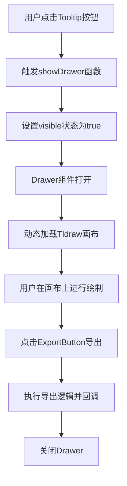
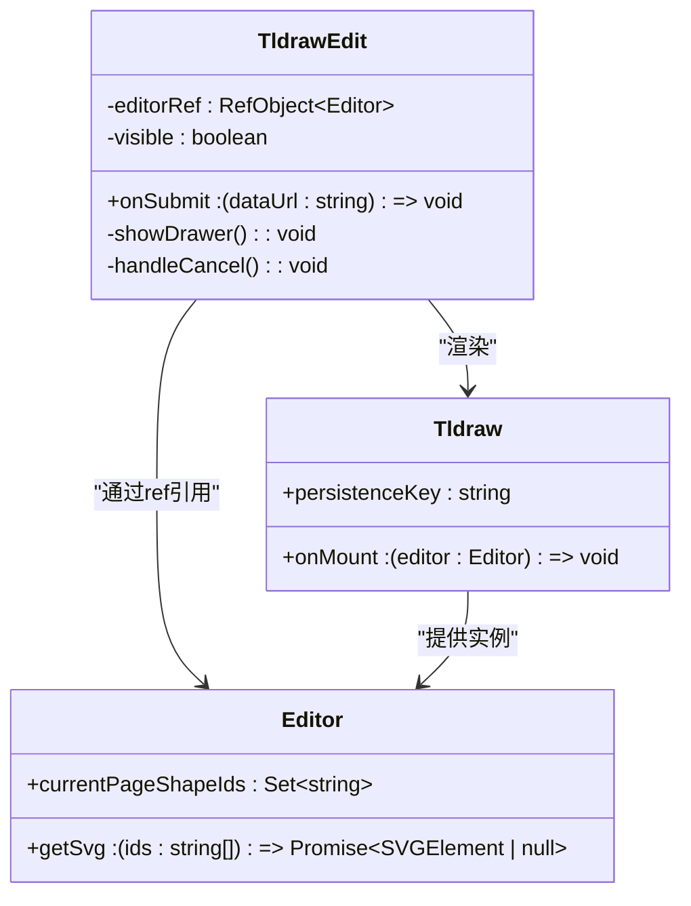
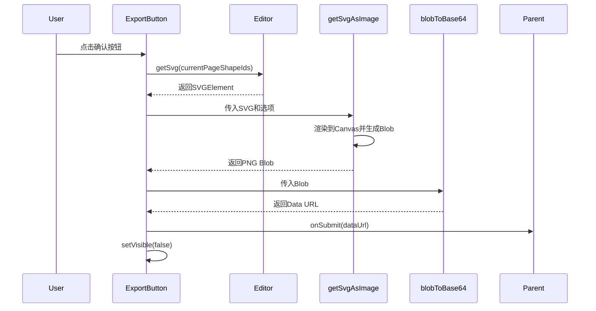

# Tldraw可视化编辑组件 (TldrawEdit)

<cite>
**Referenced Files in This Document**   
- [TldrawEdit.tsx](file://app/components/TldrawEdit/TldrawEdit.tsx)
- [interface.ts](file://app/components/TldrawEdit/interface.ts)
- [getSvgAsImage.ts](file://app/components/TldrawEdit/lib/getSvgAsImage.ts)
- [png.ts](file://app/components/TldrawEdit/lib/png.ts)
- [blobToBase64.ts](file://app/components/TldrawEdit/lib/blobToBase64.ts)
- [styles.ts](file://app/components/TldrawEdit/styles.ts)
</cite>

## 目录
1. [简介](#简介)
2. [核心功能与交互设计](#核心功能与交互设计)
3. [组件结构与实现](#组件结构与实现)
4. [状态管理与引用](#状态管理与引用)
5. [导出功能实现](#导出功能实现)
6. [持久化与外部集成](#持久化与外部集成)
7. [样式与UI定制](#样式与ui定制)
8. [集成示例](#集成示例)

## 简介

TldrawEdit组件是一个基于Tldraw库的可视化UI绘制工具，旨在为用户提供一个直观的图形绘制界面。该组件通过一个简洁的Tooltip按钮触发一个全屏Drawer，内部嵌入了功能完整的Tldraw画布，允许用户进行自由绘图。绘制完成后，用户可以通过自定义的ExportButton将画布内容导出为图像数据，并通过回调函数传递给父组件，实现与外部系统的无缝集成。该组件特别适用于需要用户生成图像输入的场景，如聊天应用中的UI草图分享。

## 核心功能与交互设计

TldrawEdit组件的核心交互设计围绕“触发-绘制-导出”这一流程展开。用户界面中一个带有“Draw UI”提示的Tooltip按钮是整个功能的入口。当用户点击此按钮时，会触发一个从右侧滑出的全屏Drawer。



**Diagram sources**
- [TldrawEdit.tsx](file://app/components/TldrawEdit/TldrawEdit.tsx#L30-L34)

**Section sources**
- [TldrawEdit.tsx](file://app/components/TldrawEdit/TldrawEdit.tsx#L18-L80)

## 组件结构与实现

TldrawEdit组件采用函数式组件（FC）实现，其结构清晰地分为UI触发部分和绘制容器部分。

### UI触发部分
UI触发部分由一个Ant Design的`Tooltip`包裹一个`Button`构成。该按钮使用`PictureOutlined`图标，并通过自定义CSS类设置了半透明的白色背景，以融入整体设计风格。按钮的`onClick`事件绑定了`showDrawer`函数，负责控制Drawer的显隐。

### 绘制容器部分
绘制容器部分由Ant Design的`Drawer`组件实现。该Drawer具有以下特点：
- **标题栏**：包含“Draw UI”文本和一个自定义的`ExportButton`。
- **位置与尺寸**：位于页面右侧，宽度为100%，实现全屏覆盖。
- **内容区域**：填充整个视口高度，无内边距，确保Tldraw画布能充分利用空间。

在Drawer内部，通过Next.js的`dynamic`函数动态导入了`@tldraw/tldraw`库的`Tldraw`组件，以避免服务端渲染（SSR）错误。`Tldraw`组件通过`onMount`生命周期钩子获取到`Editor`实例的引用。



**Diagram sources**
- [TldrawEdit.tsx](file://app/components/TldrawEdit/TldrawEdit.tsx#L18-L80)
- [TldrawEdit.tsx](file://app/components/TldrawEdit/TldrawEdit.tsx#L14-L16)

**Section sources**
- [TldrawEdit.tsx](file://app/components/TldrawEdit/TldrawEdit.tsx#L18-L80)

## 状态管理与引用

TldrawEdit组件使用React的`useState`和`useRef`钩子进行内部状态管理。

### 状态管理
组件维护了两个核心状态：
1.  **`visible`**：一个布尔值状态，用于控制Drawer的打开和关闭。初始值为`false`。`showDrawer`函数将其设置为`true`以打开Drawer，而`handleCancel`函数则将其设置回`false`以关闭Drawer。
2.  **`refresh`**：一个用于强制组件重新渲染的状态（通过`useState({})`创建，其值未被使用）。它在`Tldraw`组件挂载时被调用，可能用于在编辑器初始化后触发一次UI更新。

### 引用管理
组件使用`useRef`创建了一个名为`editorRef`的引用，其类型为`Editor`。这个引用在`Tldraw`组件的`onMount`回调中被赋值，从而让TldrawEdit组件能够访问到Tldraw编辑器的底层API，这对于后续的导出功能至关重要。

```mermaid
flowchart LR
A[onMount] --> |提供editor实例| B(Tldraw组件)
B --> |赋值给| C[editorRef.current]
C --> D[ExportButton]
D --> |调用| E[editor.getSvg()]
```

**Section sources**
- [TldrawEdit.tsx](file://app/components/TldrawEdit/TldrawEdit.tsx#L20-L20)
- [TldrawEdit.tsx](file://app/components/TldrawEdit/TldrawEdit.tsx#L25-L27)

## 导出功能实现

导出功能是通过一个名为`ExportButton`的内部函数组件实现的，它被放置在Drawer的标题栏中。

### 工作流程
1.  **用户点击**：当用户点击“Confirm”按钮时，会触发一个异步的`onClick`事件处理器。
2.  **获取SVG**：处理器首先调用`editor.getSvg()`方法，传入当前页面所有形状的ID，以获取一个包含所有绘制内容的`SVGElement`。
3.  **转换为PNG**：获取到的SVG元素会被传递给`getSvgAsImage`工具函数，该函数负责将SVG渲染到一个`<canvas>`上，并最终生成一个`Blob`格式的PNG图像。
4.  **转换为Data URL**：生成的`Blob`图像通过`blobToBase64`工具函数被转换为一个Base64编码的Data URL字符串。
5.  **回调与关闭**：最终的Data URL通过`onSubmit`回调函数传递给父组件，同时`setVisible(false)`被调用以关闭Drawer。

### 工具函数
-   **`getSvgAsImage`**：这是一个复杂的工具函数，它处理了SVG到图像的转换过程，包括处理跨域图片、计算缩放比例以适应浏览器Canvas的最大尺寸限制，并利用`png.ts`中的`PngHelpers`来设置PNG的物理像素密度（pHYs）块。
-   **`blobToBase64`**：一个简单的Promise包装器，使用`FileReader` API将`Blob`对象读取为Base64 Data URL。



**Diagram sources**
- [TldrawEdit.tsx](file://app/components/TldrawEdit/TldrawEdit.tsx#L82-L119)
- [getSvgAsImage.ts](file://app/components/TldrawEdit/lib/getSvgAsImage.ts#L1-L132)
- [blobToBase64.ts](file://app/components/TldrawEdit/lib/blobToBase64.ts#L1-L8)

**Section sources**
- [TldrawEdit.tsx](file://app/components/TldrawEdit/TldrawEdit.tsx#L82-L119)
- [getSvgAsImage.ts](file://app/components/TldrawEdit/lib/getSvgAsImage.ts#L1-L132)
- [blobToBase64.ts](file://app/components/TldrawEdit/lib/blobToBase64.ts#L1-L8)

## 持久化与外部集成

### 持久化 (persistenceKey)
Tldraw库原生支持状态持久化。在TldrawEdit组件中，通过在`<Tldraw>`组件上设置`persistenceKey="tldraw"`属性，实现了绘制状态的自动保存。这意味着用户在画布上绘制的内容会被序列化并存储在浏览器的`localStorage`中，键名为`tldraw`。当用户下次打开该组件时，Tldraw库会自动从`localStorage`中读取之前的状态并恢复画布，极大地提升了用户体验。

### 外部集成 (onSubmit)
组件通过`onSubmit`回调函数与外部系统集成。父组件在使用TldrawEdit时，需要提供一个`onSubmit`函数作为prop。当用户完成绘制并点击导出按钮后，生成的图像Data URL会作为参数传递给这个函数。这使得父组件可以自由地处理这张图像，例如将其作为消息内容发送到聊天服务器。

**Section sources**
- [TldrawEdit.tsx](file://app/components/TldrawEdit/TldrawEdit.tsx#L75-L77)
- [interface.ts](file://app/components/TldrawEdit/interface.ts#L1-L3)

## 样式与UI定制

组件使用`@ant-design/use-emotion-css`库来创建动态样式。`useClassName`钩子函数返回一个Emotion CSS类名，该类名被应用于Tldraw画布的外层`div`。当前的样式规则是隐藏Tldraw自带的调试面板（`.tlui-debug-panel { display: none }`），以保持界面的简洁。

**Section sources**
- [styles.ts](file://app/components/TldrawEdit/styles.ts#L1-L12)

## 集成示例

以下是一个在聊天输入区集成TldrawEdit组件的示例：

```tsx
// 假设在ChatInput组件中
const ChatInput = () => {
  const handleImageSubmit = (dataUrl: string) => {
    // 将图像Data URL作为消息内容发送
    sendMessage({ type: 'image', content: dataUrl });
  };

  return (
    <div>
      {/* 其他输入元素 */}
      <TldrawEdit onSubmit={handleImageSubmit} />
    </div>
  );
};
```

在此示例中，`handleImageSubmit`函数接收从TldrawEdit导出的图像Data URL，并将其作为一条类型为'image'的消息发送出去。