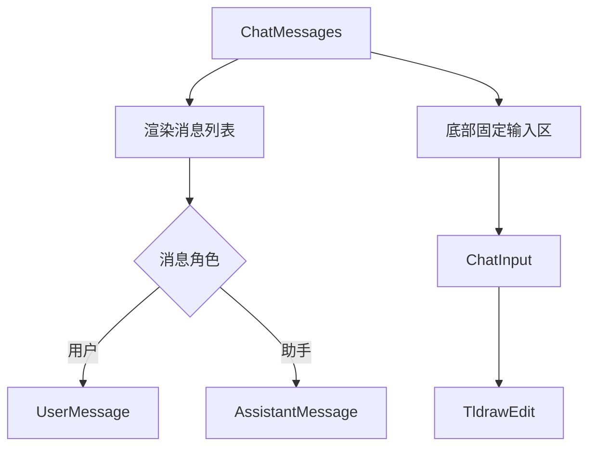
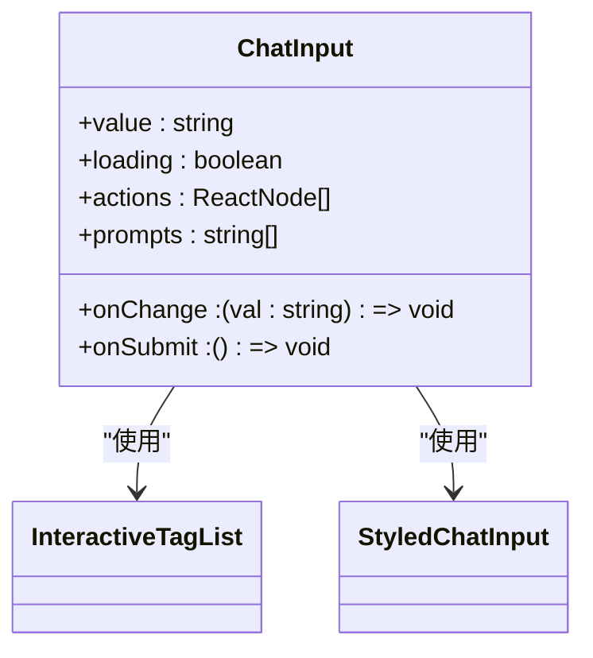
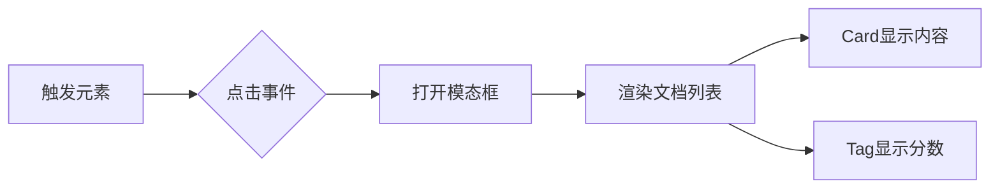
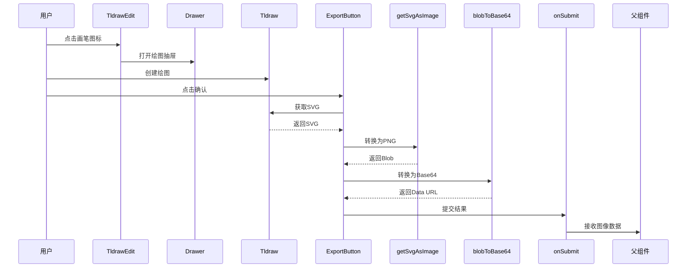
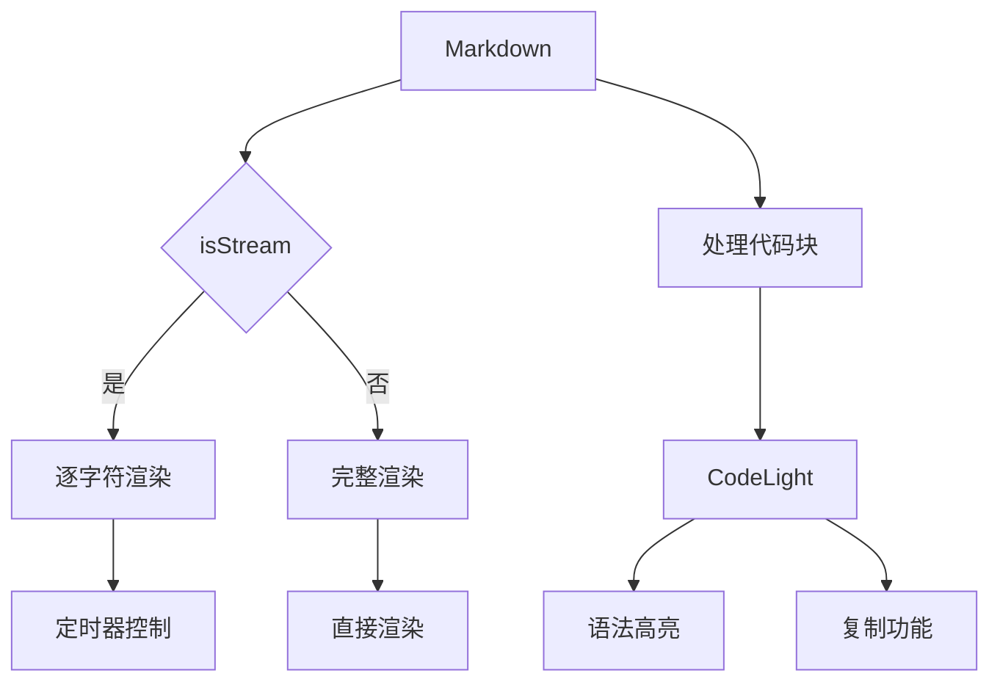
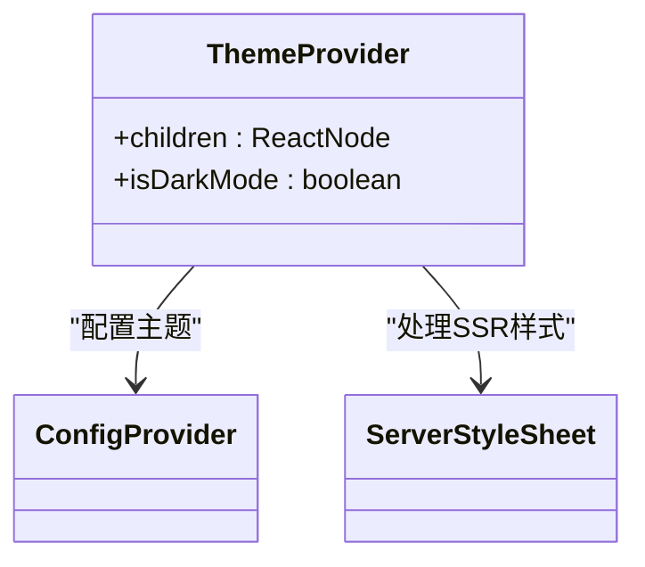

# UI组件库

<cite>
**本文档引用的文件**
- [ChatMessages.tsx](file://app/components/ChatMessages/ChatMessages.tsx)
- [ChatInput.tsx](file://app/components/ChatInput/ChatInput.tsx)
- [RAGDocsShow.tsx](file://app/components/RAGDocsShow/RAGDocsShow.tsx)
- [TldrawEdit.tsx](file://app/components/TldrawEdit/TldrawEdit.tsx)
- [Markdown.tsx](file://app/components/Markdown/Markdown.tsx)
- [ThemeProvider.tsx](file://app/components/ThemeProvider/ThemeProvider.tsx)
- [interface.ts](file://app/components/ChatMessages/interface.ts)
- [ChatInput/interface.ts](file://app/components/ChatInput/interface.ts)
- [RAGDocsShow/interface.ts](file://app/components/RAGDocsShow/interface.ts)
- [TldrawEdit/interface.ts](file://app/components/TldrawEdit/interface.ts)
- [Markdown/interface.ts](file://app/components/Markdown/interface.ts)
- [AssistantMessage.tsx](file://app/components/ChatMessages/AssistantMessage.tsx)
- [UserMessage.tsx](file://app/components/ChatMessages/UserMessage.tsx)
- [CodeLight.tsx](file://app/components/Markdown/CodeLight.tsx)
- [styles.ts](file://app/components/ChatInput/styles.ts)
- [TldrawEdit/styles.ts](file://app/components/TldrawEdit/styles.ts)
</cite>

## 目录
1. [简介](#简介)
2. [核心组件概览](#核心组件概览)
3. [ChatMessages 组件](#chatmessages-组件)
4. [ChatInput 组件](#chatinput-组件)
5. [RAGDocsShow 组件](#ragdocsshow-组件)
6. [TldrawEdit 组件](#tldrawedit-组件)
7. [Markdown 组件](#markdown-组件)
8. [主题支持 (ThemeProvider)](#主题支持-theme-provider)
9. [可访问性与响应式设计](#可访问性与响应式设计)

## 简介
本文档详细介绍了UI组件库中的核心可复用组件，重点阐述了`ChatMessages`、`ChatInput`、`RAGDocsShow`、`TldrawEdit`和`Markdown`等关键组件的设计与实现。文档涵盖了每个组件的props接口、内部状态管理、视觉表现、使用示例以及相关技术集成细节。

## 核心组件概览
UI组件库提供了一系列专为AI对话场景设计的可复用组件，支持消息渲染、用户输入、文档展示、可视化绘图和富文本渲染等核心功能。所有组件均遵循一致的设计语言，并支持暗色主题和响应式布局。

## ChatMessages 组件

`ChatMessages`组件负责渲染完整的聊天界面，包括用户和AI的消息历史记录以及底部的输入区域。该组件通过`messages`属性接收消息数组，并根据消息角色（user或assistant）分别渲染`UserMessage`和`AssistantMessage`子组件。

当AI正在生成响应时，`isLoading`属性控制加载状态的显示。组件集成了`ChatInput`用于用户输入，并通过`TldrawEdit`提供绘图功能，允许用户上传手绘UI草图作为输入的一部分。

**图示来源**
- [ChatMessages.tsx](file://app/components/ChatMessages/ChatMessages.tsx#L1-L100)
- [AssistantMessage.tsx](file://app/components/ChatMessages/AssistantMessage.tsx#L1-L74)
- [UserMessage.tsx](file://app/components/ChatMessages/UserMessage.tsx#L1-L59)

**本节来源**
- [ChatMessages.tsx](file://app/components/ChatMessages/ChatMessages.tsx#L1-L100)
- [interface.ts](file://app/components/ChatMessages/interface.ts#L1-L29)

## ChatInput 组件

`ChatInput`组件提供了一个功能丰富的文本输入框，支持多行输入、提示标签（prompts）和自定义操作按钮。组件通过`actions`属性接收操作按钮数组，如`TldrawEdit`绘图按钮。

输入框具有防抖优化，通过`React.memo`进行性能优化，仅在相关属性变化时重新渲染。组件内置了空值校验，当用户尝试提交空消息时会显示警告提示。

**图示来源**
- [ChatInput.tsx](file://app/components/ChatInput/ChatInput.tsx#L1-L79)
- [interface.ts](file://app/components/ChatInput/interface.ts#L1-L14)
- [styles.ts](file://app/components/ChatInput/styles.ts#L1-L84)

**本节来源**
- [ChatInput.tsx](file://app/components/ChatInput/ChatInput.tsx#L1-L79)
- [interface.ts](file://app/components/ChatInput/interface.ts#L1-L14)

## RAGDocsShow 组件

`RAGDocsShow`组件用于展示检索增强生成（RAG）相关的文档片段。当用户点击"RAG Docs"按钮时，会弹出一个模态框，显示所有相关文档及其匹配分数。

文档以卡片列表形式呈现，支持内容截断和展开功能。匹配分数以百分比形式显示在蓝色标签中，帮助用户评估文档的相关性。

**图示来源**
- [RAGDocsShow.tsx](file://app/components/RAGDocsShow/RAGDocsShow.tsx#L1-L53)
- [interface.ts](file://app/components/RAGDocsShow/interface.ts#L1-L12)

**本节来源**
- [RAGDocsShow.tsx](file://app/components/RAGDocsShow/RAGDocsShow.tsx#L1-L53)
- [interface.ts](file://app/components/RAGDocsShow/interface.ts#L1-L12)

## TldrawEdit 组件

`TldrawEdit`组件集成了`tldraw`库，提供了一个完整的可视化绘图功能。用户可以通过点击画笔图标打开绘图抽屉，在其中创建UI草图。

组件使用`next/dynamic`进行动态导入，避免服务端渲染问题。绘图完成后，用户可以点击"Confirm"按钮，组件会将SVG转换为PNG图像并以Base64数据URL形式返回给父组件。

**图示来源**
- [TldrawEdit.tsx](file://app/components/TldrawEdit/TldrawEdit.tsx#L1-L123)
- [interface.ts](file://app/components/TldrawEdit/interface.ts#L1-L5)
- [lib/getSvgAsImage.ts](file://app/components/TldrawEdit/lib/getSvgAsImage.ts)
- [lib/blobToBase64.ts](file://app/components/TldrawEdit/lib/blobToBase64.ts)

**本节来源**
- [TldrawEdit.tsx](file://app/components/TldrawEdit/TldrawEdit.tsx#L1-L123)
- [interface.ts](file://app/components/TldrawEdit/interface.ts#L1-L5)

## Markdown 组件

`Markdown`组件用于渲染富文本内容，支持数学公式、GitHub风格的Markdown和Katex渲染。组件具有流式渲染功能，当`isStream`为true时，会逐字符显示内容，模拟AI生成文本的打字效果。

代码块通过`CodeLight`组件高亮显示，支持语法高亮和复制功能。组件使用`react-markdown`和`remark`插件处理Markdown解析。

**图示来源**
- [Markdown.tsx](file://app/components/Markdown/Markdown.tsx#L1-L109)
- [CodeLight.tsx](file://app/components/Markdown/CodeLight.tsx#L1-L325)
- [interface.ts](file://app/components/Markdown/interface.ts#L1-L33)

**本节来源**
- [Markdown.tsx](file://app/components/Markdown/Markdown.tsx#L1-L109)
- [interface.ts](file://app/components/Markdown/interface.ts#L1-L33)

## 主题支持 (ThemeProvider)

`ThemeProvider`组件基于Ant Design和styled-components提供主题管理功能。组件默认启用暗色主题，通过`ConfigProvider`配置Ant Design的主题算法。

对于styled-components，组件使用`ServerStyleSheet`处理服务端渲染样式注入，确保在Next.js环境中正确渲染样式。

**图示来源**
- [ThemeProvider.tsx](file://app/components/ThemeProvider/ThemeProvider.tsx#L1-L36)
- [interface.ts](file://app/components/ThemeProvider/interface.ts#L1-L4)

**本节来源**
- [ThemeProvider.tsx](file://app/components/ThemeProvider/ThemeProvider.tsx#L1-L36)
- [interface.ts](file://app/components/ThemeProvider/interface.ts#L1-L4)

## 可访问性与响应式设计
所有组件均考虑了可访问性（a11y）需求，使用语义化HTML标签和ARIA属性。文本内容支持自动换行和溢出处理，确保在不同屏幕尺寸下都能正常显示。

组件使用Tailwind CSS进行响应式布局，通过`max-w`、`flex`和`overflow-auto`等实用类实现自适应设计。关键交互元素都具有适当的焦点样式和悬停效果，提升用户体验。