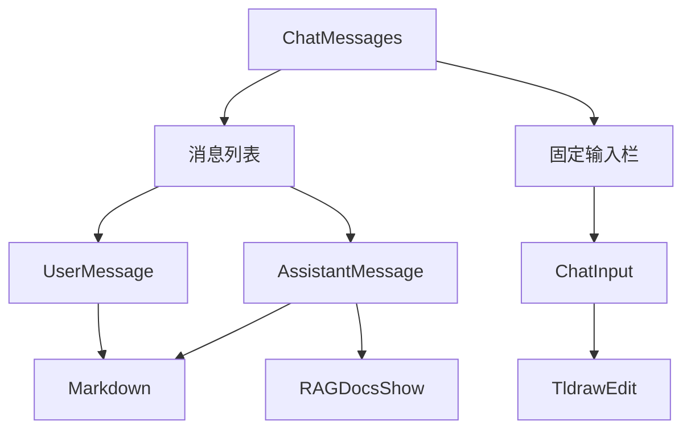
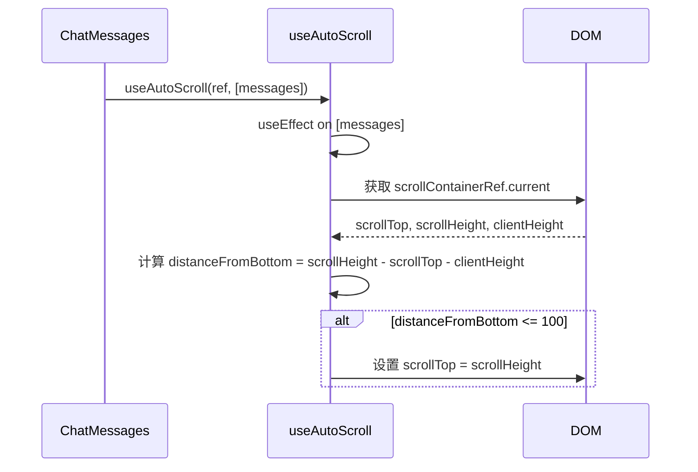
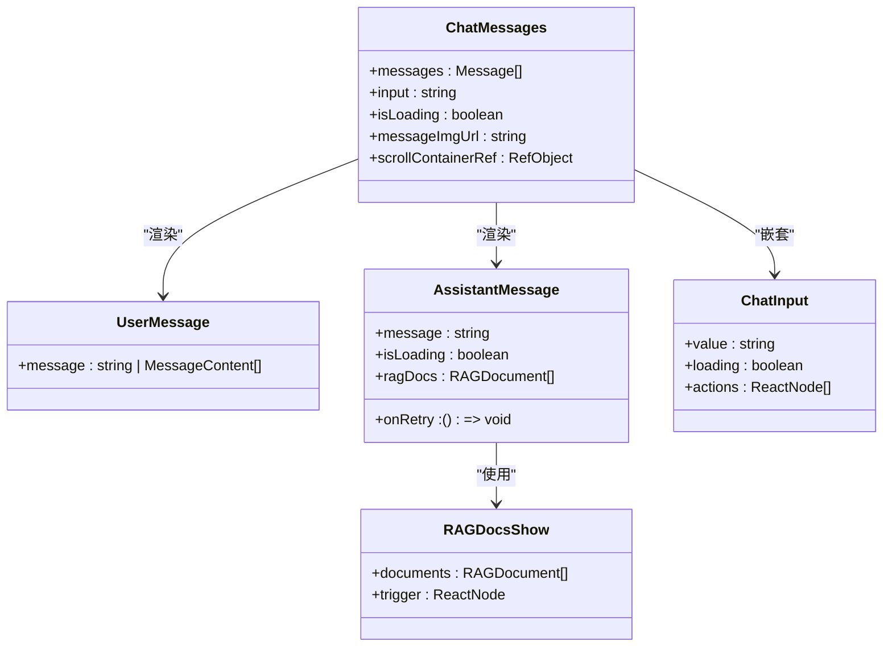

# 聊天消息组件 (ChatMessages)

<cite>
**本文档中引用的文件**   
- [ChatMessages.tsx](file://app/components/ChatMessages/ChatMessages.tsx)
- [interface.ts](file://app/components/ChatMessages/interface.ts)
- [UserMessage.tsx](file://app/components/ChatMessages/UserMessage.tsx)
- [AssistantMessage.tsx](file://app/components/ChatMessages/AssistantMessage.tsx)
- [useAutoScroll.ts](file://app/hooks/useAutoScroll.ts)
- [ChatInput.tsx](file://app/components/ChatInput/ChatInput.tsx)
- [Markdown.tsx](file://app/components/Markdown/Markdown.tsx)
- [RAGDocsShow.tsx](file://app/components/RAGDocsShow/RAGDocsShow.tsx)
- [ChatMessages.stories.tsx](file://app/components/ChatMessages/ChatMessages.stories.tsx)
</cite>

## 目录
1. [简介](#简介)
2. [核心功能与架构](#核心功能与架构)
3. [Props 接口详解](#props-接口详解)
4. [自动滚动机制](#自动滚动机制)
5. [子组件协作机制](#子组件协作机制)
6. [布局与响应式设计](#布局与响应式设计)
7. [性能优化策略](#性能优化策略)
8. [使用示例](#使用示例)
9. [可访问性设计](#可访问性设计)
10. [总结](#总结)

## 简介

`ChatMessages` 组件是聊天界面的核心容器，负责管理整个消息流的展示、布局和交互。该组件不仅渲染用户和助手的消息列表，还集成了消息输入框、自动滚动、重试机制和文档引用（RAG）等功能，为构建完整的对话式AI应用提供了坚实的基础。

**Section sources**
- [ChatMessages.tsx](file://app/components/ChatMessages/ChatMessages.tsx#L1-L100)

## 核心功能与架构

`ChatMessages` 组件采用复合模式，将消息列表、输入区域和交互逻辑整合在一个统一的界面中。其核心功能包括：

- **消息列表渲染**：根据 `messages` 数组中的角色（`user` 或 `assistant`）动态渲染 `UserMessage` 或 `AssistantMessage` 组件。
- **固定输入栏**：通过 `position: fixed` 将 `ChatInput` 组件固定在视口底部，确保在任何滚动状态下都可访问。
- **渐变遮罩**：在消息列表底部应用从透明到继承背景色的渐变，实现平滑的视觉过渡。
- **嵌套集成**：直接在组件内部嵌套 `ChatInput`，形成一个自包含的聊天单元。

该组件的架构设计体现了高内聚、低耦合的原则，将所有与聊天消息相关的UI和逻辑集中管理。



**Diagram sources**
- [ChatMessages.tsx](file://app/components/ChatMessages/ChatMessages.tsx#L11-L95)
- [UserMessage.tsx](file://app/components/ChatMessages/UserMessage.tsx#L17-L54)
- [AssistantMessage.tsx](file://app/components/ChatMessages/AssistantMessage.tsx#L16-L69)
- [ChatInput.tsx](file://app/components/ChatInput/ChatInput.tsx#L10-L74)

**Section sources**
- [ChatMessages.tsx](file://app/components/ChatMessages/ChatMessages.tsx#L1-L100)
- [ChatInput.tsx](file://app/components/ChatInput/ChatInput.tsx#L1-L80)

## Props 接口详解

`ChatMessages` 组件通过 `ChatMessagesProps` 接口定义了其对外暴露的属性，这些属性构成了父组件与该组件通信的主要方式。

| 属性名 | 类型 | 必需 | 描述 |
| :--- | :--- | :--- | :--- |
| `messages` | `Array<Message>` | 是 | 消息对象数组，包含每条消息的ID、角色、内容和可选的RAG文档引用。 |
| `input` | `string` | 是 | 当前输入框的文本值，用于受控组件模式。 |
| `handleInputChange` | `(e: ChangeEvent<HTMLInputElement>) => void` | 是 | 输入框内容变化时的回调函数。 |
| `onSubmit` | `(e: FormEvent<HTMLFormElement>) => void` | 是 | 提交表单时的回调函数，通常用于发送新消息。 |
| `isLoading` | `boolean` | 是 | 指示助手是否正在生成回复，影响最后一条助手消息的加载状态。 |
| `messageImgUrl` | `string` | 是 | 通过Tldraw编辑器生成的图片URL，用于在输入框中预览。 |
| `setMessagesImgUrl` | `(url: string) => void` | 是 | 用于更新或清除 `messageImgUrl` 的回调函数。 |
| `onRetry` | `(id: string) => void` | 是 | 当用户点击“重试”按钮时触发的回调，参数为消息ID。 |

**Section sources**
- [interface.ts](file://app/components/ChatMessages/interface.ts#L1-L30)
- [ChatMessages.tsx](file://app/components/ChatMessages/ChatMessages.tsx#L11-L95)

## 自动滚动机制

`ChatMessages` 组件通过 `useAutoScroll` Hook 实现了智能的自动滚动到底部功能。该机制的工作原理如下：

1. **引用获取**：组件使用 `useRef` 创建一个对消息容器 `div` 的引用 `scrollContainerRef`。
2. **Hook 调用**：在组件内部调用 `useAutoScroll(scrollContainerRef, [messages])`，将容器引用和 `messages` 数组作为依赖项传入。
3. **条件判断**：`useAutoScroll` Hook 在 `messages` 数组变化时执行。它会检查用户当前是否接近容器底部（距离底部小于100像素）。
4. **执行滚动**：如果用户在底部附近，则自动将滚动条位置设置为容器的总高度，从而滚动到底部。

这种设计确保了当新消息（尤其是助手的流式响应）被添加时，视图会自动跟随，同时尊重用户的主动滚动行为。如果用户向上滚动查看历史消息，新消息的到达不会强制将其拉回底部。



**Diagram sources**
- [useAutoScroll.ts](file://app/hooks/useAutoScroll.ts#L2-L16)
- [ChatMessages.tsx](file://app/components/ChatMessages/ChatMessages.tsx#L11-L95)

**Section sources**
- [useAutoScroll.ts](file://app/hooks/useAutoScroll.ts#L1-L18)
- [ChatMessages.tsx](file://app/components/ChatMessages/ChatMessages.tsx#L11-L95)

## 子组件协作机制

`ChatMessages` 组件通过组合模式与多个子组件协同工作，共同构建完整的聊天体验。

### 与 UserMessage 和 AssistantMessage 的协作

`ChatMessages` 负责根据 `messages` 数组中的 `role` 字段，决定渲染 `UserMessage` 还是 `AssistantMessage`。

- **UserMessage**：当 `message.role === 'user'` 时渲染。它接收 `message.content` 作为 `message` 属性，并使用 `Markdown` 组件渲染文本内容。对于包含图片的消息，它会遍历 `content` 数组并分别渲染图片和文本。
- **AssistantMessage**：当 `message.role === 'assistant'` 时渲染。它接收 `message.content`、`isLoading` 状态和 `onRetry` 回调。它还集成了 `RAGDocsShow` 组件，用于展示与回复相关的文档引用。

### 与 ChatInput 的集成

`ChatMessages` 将 `ChatInput` 组件嵌套在自身的布局结构中，位于消息列表的下方。`ChatInput` 通过 `actions` 属性接收一个包含 `TldrawEdit` 组件的数组，实现了“绘制UI”功能。当 `TldrawEdit` 生成图片后，`messageImgUrl` 会被更新，`ChatInput` 会显示一个可关闭的图片预览。

这种嵌套设计使得 `ChatMessages` 成为一个功能完整的、自包含的聊天单元，简化了父组件的集成复杂度。



**Diagram sources**
- [ChatMessages.tsx](file://app/components/ChatMessages/ChatMessages.tsx#L11-L95)
- [UserMessage.tsx](file://app/components/ChatMessages/UserMessage.tsx#L17-L54)
- [AssistantMessage.tsx](file://app/components/ChatMessages/AssistantMessage.tsx#L16-L69)
- [ChatInput.tsx](file://app/components/ChatInput/ChatInput.tsx#L10-L74)
- [RAGDocsShow.tsx](file://app/components/RAGDocsShow/RAGDocsShow.tsx#L6-L50)

**Section sources**
- [ChatMessages.tsx](file://app/components/ChatMessages/ChatMessages.tsx#L1-L100)
- [UserMessage.tsx](file://app/components/ChatMessages/UserMessage.tsx#L1-L60)
- [AssistantMessage.tsx](file://app/components/ChatMessages/AssistantMessage.tsx#L1-L75)
- [ChatInput.tsx](file://app/components/ChatInput/ChatInput.tsx#L1-L80)
- [RAGDocsShow.tsx](file://app/components/RAGDocsShow/RAGDocsShow.tsx#L1-L54)

## 布局与响应式设计

`ChatMessages` 组件采用了现代的响应式布局策略，确保在不同设备上都能提供良好的用户体验。

- **容器结构**：主容器使用 `flex flex-col` 布局，占据整个视口高度 (`h-full`)，并启用垂直滚动 (`overflow-auto`)。
- **内容宽度**：内部内容区域设置了最大宽度 `max-w-[1058px]`，以保证在大屏幕上内容不会过宽，提升可读性。
- **固定输入栏**：`ChatInput` 所在的 `div` 使用 `position: fixed` 固定在视口底部，并通过 `left-0` 和 `w-full` 确保其宽度与视口一致。
- **视觉遮罩**：在固定输入栏上方，消息列表区域使用 `pb-44` 添加了足够的内边距，防止内容被输入栏遮挡。同时，一个带有渐变背景 (`bg-gradient-to-b`) 和模糊效果 (`backdrop-blur-sm`) 的遮罩层，实现了从内容到输入栏的平滑视觉过渡。

这种布局设计既保证了功能的完整性，又兼顾了视觉的美观性。

**Section sources**
- [ChatMessages.tsx](file://app/components/ChatMessages/ChatMessages.tsx#L11-L95)

## 性能优化策略

`ChatMessages` 及其子组件采用了多种性能优化技术，以确保流畅的用户体验。

- **React.memo**：`UserMessage`、`AssistantMessage` 和 `ChatInput` 组件都使用了 `React.memo` 进行包裹。这可以防止在父组件重新渲染时，子组件进行不必要的重渲染。例如，`AssistantMessage` 的 `memo` 比较函数会检查 `isLoading` 状态和 `message` 内容是否发生变化。
- **useMemo**：在 `ChatMessages` 中，传递给 `ChatInput` 的 `actions` 数组使用 `useMemo` 进行缓存，避免在每次渲染时都重新创建新的数组和组件实例。
- **流式渲染**：`Markdown` 组件支持流式渲染 (`isStream`)。当 `isChatting` 为 `true` 时，它会分块 (`CHUNK_SIZE`) 渐进式地渲染助手的回复，模拟打字机效果，提升响应感。

这些优化措施共同作用，有效减少了不必要的计算和DOM操作，提升了应用的整体性能。

**Section sources**
- [UserMessage.tsx](file://app/components/ChatMessages/UserMessage.tsx#L17-L54)
- [AssistantMessage.tsx](file://app/components/ChatMessages/AssistantMessage.tsx#L16-L69)
- [ChatInput.tsx](file://app/components/ChatInput/ChatInput.tsx#L10-L74)
- [Markdown.tsx](file://app/components/Markdown/Markdown.tsx#L16-L89)

## 使用示例

以下是一个在父组件中使用 `ChatMessages` 的典型示例：

```tsx
import { ChatMessages } from '@/components/ChatMessages';
import { useState } from 'react';

const ChatPage = () => {
  const [messages, setMessages] = useState([
    { id: '1', role: 'user', content: 'Hello' },
    { id: '2', role: 'assistant', content: 'Hi there!' }
  ]);
  const [input, setInput] = useState('');
  const [isLoading, setIsLoading] = useState(false);
  const [messageImgUrl, setMessageImgUrl] = useState('');

  const handleInputChange = (e) => setInput(e.target.value);
  const onSubmit = async (e) => {
    e.preventDefault();
    if (!input.trim()) return;
    
    // 添加用户消息
    const newUserMessage = { id: Date.now().toString(), role: 'user', content: input };
    setMessages(prev => [...prev, newUserMessage]);
    setInput('');
    setIsLoading(true);

    // 模拟API调用
    setTimeout(() => {
      const newAssistantMessage = { 
        id: (Date.now() + 1).toString(), 
        role: 'assistant', 
        content: 'This is a simulated response.' 
      };
      setMessages(prev => [...prev, newAssistantMessage]);
      setIsLoading(false);
    }, 1000);
  };

  const onRetry = (id) => {
    // 重新发送指定ID的消息
    console.log('Retrying message:', id);
  };

  return (
    <div className="h-screen">
      <ChatMessages
        messages={messages}
        input={input}
        handleInputChange={handleInputChange}
        onSubmit={onSubmit}
        isLoading={isLoading}
        messageImgUrl={messageImgUrl}
        setMessagesImgUrl={setMessageImgUrl}
        onRetry={onRetry}
      />
    </div>
  );
};

export default ChatPage;
```

**Section sources**
- [ChatMessages.stories.tsx](file://app/components/ChatMessages/ChatMessages.stories.tsx#L1-L150)

## 可访问性设计

`ChatMessages` 组件在设计时考虑了基本的可访问性：

- **语义化标签**：使用 `div` 和 `p` 等语义化标签构建内容结构。
- **键盘导航**：`ChatInput` 中的 `TextArea` 和 `Button` 组件天然支持键盘操作。
- **ARIA 属性**：`Image` 组件使用了 `alt` 属性（如 `alt="user-image"`），为屏幕阅读器提供描述。
- **焦点管理**：虽然组件本身没有显式管理焦点，但其使用的Ant Design组件遵循了良好的可访问性实践。

为了进一步提升可访问性，可以考虑为消息列表添加 `aria-live` 区域，以便在新消息到达时通知屏幕阅读器用户。

**Section sources**
- [ChatMessages.tsx](file://app/components/ChatMessages/ChatMessages.tsx#L11-L95)
- [UserMessage.tsx](file://app/components/ChatMessages/UserMessage.tsx#L17-L54)
- [AssistantMessage.tsx](file://app/components/ChatMessages/AssistantMessage.tsx#L16-L69)

## 总结

`ChatMessages` 组件是一个功能丰富、设计精良的聊天界面核心容器。它通过清晰的Props接口、智能的自动滚动、高效的性能优化和模块化的子组件协作，为构建高质量的对话式AI应用提供了强大的支持。其响应式布局和可访问性设计也体现了对用户体验的全面考量。开发者可以轻松地将此组件集成到自己的应用中，并通过传递不同的消息数据流来驱动其行为。