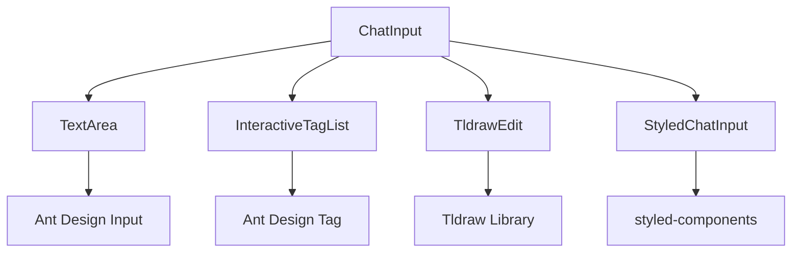
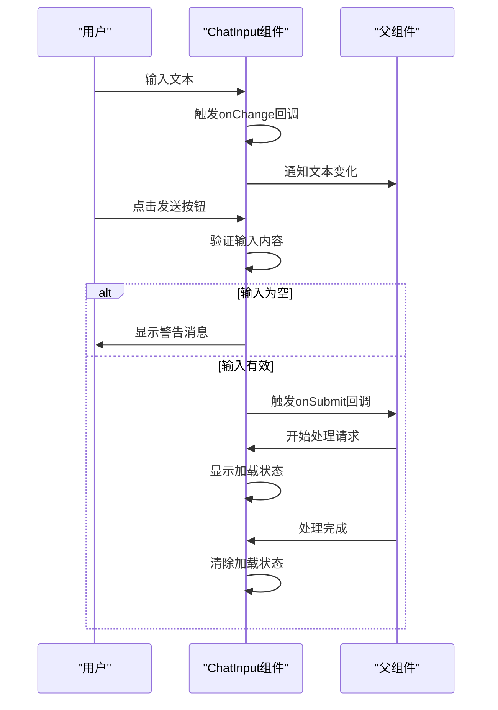
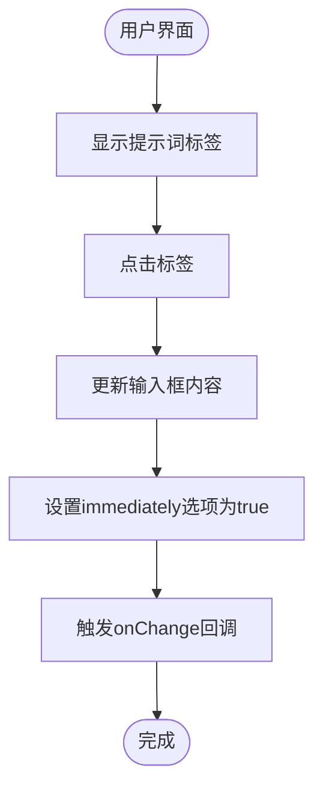
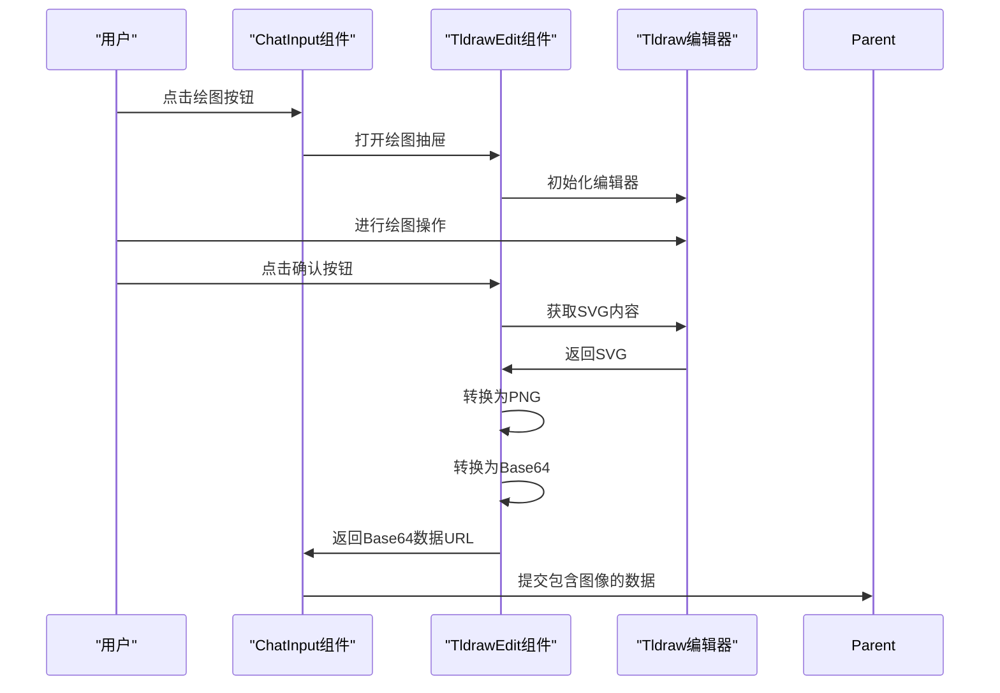
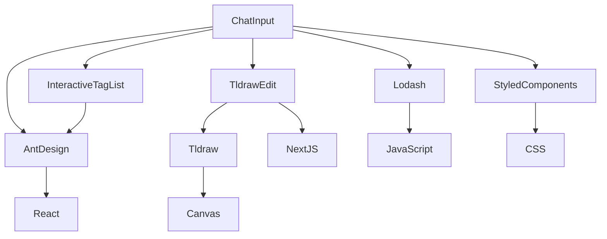

# 聊天输入组件 (ChatInput)

<cite>
**Referenced Files in This Document**   
- [ChatInput.tsx](file://app/components/ChatInput/ChatInput.tsx)
- [interface.ts](file://app/components/ChatInput/interface.ts)
- [styles.ts](file://app/components/ChatInput/styles.ts)
- [InteractiveTagList.tsx](file://app/components/InteractiveTagList/InteractiveTagList.tsx)
- [InteractiveTagList.interface.ts](file://app/components/InteractiveTagList/interface.ts)
- [TldrawEdit.tsx](file://app/components/TldrawEdit/TldrawEdit.tsx)
- [TldrawEdit.interface.ts](file://app/components/TldrawEdit/interface.ts)
- [ChatInput.stories.tsx](file://app/components/ChatInput/ChatInput.stories.tsx)
</cite>

## 目录
1. [简介](#简介)
2. [核心组件](#核心组件)
3. [架构概述](#架构概述)
4. [详细组件分析](#详细组件分析)
5. [依赖分析](#依赖分析)
6. [性能考虑](#性能考虑)
7. [故障排除指南](#故障排除指南)
8. [结论](#结论)

## 简介
聊天输入组件（ChatInput）是用户与系统进行交互的核心入口，提供了一个功能丰富且高度可定制的输入界面。该组件支持多种交互模式，包括文本输入、快捷指令标签和可视化绘图集成。通过精心设计的props接口，开发者可以轻松地将该组件集成到各种应用场景中，并根据需要进行个性化定制。本文档将深入分析该组件的设计与实现，重点关注其交互模式、可定制化特性、性能优化策略以及与父组件的数据绑定机制。

## 核心组件

聊天输入组件（ChatInput）作为用户输入的主要界面，实现了文本输入、快捷指令和可视化绘图三种交互模式的无缝集成。组件通过`value`、`actions`、`loading`等props实现了高度的可定制化，允许开发者根据具体需求配置不同的功能和外观。内部使用`React.memo`进行性能优化，通过条件渲染逻辑避免不必要的重渲染。组件还实现了完整的表单提交处理、空值校验和加载状态的UI反馈，确保了良好的用户体验。

**Section sources**
- [ChatInput.tsx](file://app/components/ChatInput/ChatInput.tsx#L1-L80)
- [interface.ts](file://app/components/ChatInput/interface.ts#L1-L15)

## 架构概述

聊天输入组件采用模块化设计，由多个独立但相互协作的子组件构成。主组件负责整体布局和状态管理，而具体的交互功能则由专门的子组件实现。这种设计模式提高了代码的可维护性和可扩展性，使得每个功能模块都可以独立开发和测试。



**Diagram sources **
- [ChatInput.tsx](file://app/components/ChatInput/ChatInput.tsx#L1-L80)
- [InteractiveTagList.tsx](file://app/components/InteractiveTagList/InteractiveTagList.tsx#L1-L24)
- [TldrawEdit.tsx](file://app/components/TldrawEdit/TldrawEdit.tsx#L1-L124)

## 详细组件分析

### 聊天输入组件分析

聊天输入组件是整个交互系统的核心，负责协调各个子组件的工作并提供统一的API接口。组件通过props接收外部状态，并通过回调函数与父组件进行双向数据绑定。

#### 组件接口定义
```mermaid
classDiagram
class ChatInputProps {
+value : string
+loading? : boolean
+actions : Array<ReactNode>
+onChange? : (val : string, options? : { immediately? : boolean }) => void
+onSubmit : () => void
+handleInputChange? : (event : React.ChangeEvent<HTMLTextAreaElement>) => void
+minRows? : number
+prompts? : Array<string>
}
```

**Diagram sources **
- [interface.ts](file://app/components/ChatInput/interface.ts#L2-L11)

#### 交互流程


**Diagram sources **
- [ChatInput.tsx](file://app/components/ChatInput/ChatInput.tsx#L10-L74)

#### 快捷指令标签交互


**Diagram sources **
- [ChatInput.tsx](file://app/components/ChatInput/ChatInput.tsx#L15-L22)
- [InteractiveTagList.tsx](file://app/components/InteractiveTagList/InteractiveTagList.tsx#L5-L20)

#### 可视化绘图集成


**Diagram sources **
- [ChatInput.tsx](file://app/components/ChatInput/ChatInput.tsx#L35-L40)
- [TldrawEdit.tsx](file://app/components/TldrawEdit/TldrawEdit.tsx#L18-L80)

### 性能优化分析

聊天输入组件通过`React.memo`实现了高效的性能优化，仅在必要时重新渲染组件。

```mermaid
flowchart TD
A[组件更新] --> B{比较props}
B --> C[prevProps.value === nextProps.value]
B --> D[prevProps.loading === nextProps.loading]
B --> E[isEqual(prevProps.actions, nextProps.actions)]
B --> F[isEqual(prevProps.prompts, nextProps.prompts)]
C --> G{所有条件都满足?}
D --> G
E --> G
F --> G
G --> |是| H[跳过重新渲染]
G --> |否| I[执行重新渲染]
```

**Diagram sources **
- [ChatInput.tsx](file://app/components/ChatInput/ChatInput.tsx#L65-L74)

## 依赖分析

聊天输入组件依赖于多个第三方库和内部组件，形成了一个复杂的依赖网络。这些依赖关系确保了组件功能的完整性和用户体验的流畅性。



**Diagram sources **
- [ChatInput.tsx](file://app/components/ChatInput/ChatInput.tsx#L1-L10)
- [package.json](file://package.json#L1-L100)

## 性能考虑

聊天输入组件在设计时充分考虑了性能因素，通过多种策略确保了在各种使用场景下的流畅体验。

1. **条件渲染优化**：通过`React.memo`包装组件，实现了基于props变化的智能重渲染，避免了不必要的性能开销。
2. **懒加载策略**：对于Tldraw编辑器这样的重型组件，采用了`next/dynamic`进行动态导入，确保只有在用户需要时才加载相关资源。
3. **事件处理优化**：文本输入事件的处理经过精心设计，避免了频繁的状态更新对性能的影响。
4. **样式性能**：使用`styled-components`进行样式管理，确保了样式的高效应用和复用。

**Section sources**
- [ChatInput.tsx](file://app/components/ChatInput/ChatInput.tsx#L65-L74)
- [TldrawEdit.tsx](file://app/components/TldrawEdit/TldrawEdit.tsx#L10-L15)

## 故障排除指南

在使用聊天输入组件时，可能会遇到一些常见问题。以下是一些典型的故障排除建议：

1. **输入框无法输入**：检查`value`和`onChange`props是否正确配置，确保实现了双向数据绑定。
2. **发送按钮无响应**：验证`onSubmit`回调函数是否已正确定义，并检查输入内容是否为空。
3. **快捷指令标签不显示**：确认`prompts`数组是否包含有效数据，并检查组件是否正确渲染。
4. **绘图功能无法使用**：确保Tldraw相关依赖已正确安装，并检查网络连接是否正常。

**Section sources**
- [ChatInput.tsx](file://app/components/ChatInput/ChatInput.tsx#L45-L55)
- [TldrawEdit.tsx](file://app/components/TldrawEdit/TldrawEdit.tsx#L60-L80)

## 结论

聊天输入组件是一个功能强大且设计精良的用户交互入口，通过模块化设计和精心的性能优化，为用户提供了流畅的输入体验。组件支持多种交互模式，包括文本输入、快捷指令和可视化绘图，满足了多样化的使用需求。通过清晰的props接口和回调机制，组件实现了高度的可定制化和灵活的双向数据绑定。未来可以考虑进一步优化加载状态的反馈机制，并增加更多的交互模式以提升用户体验。