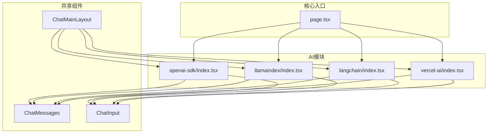
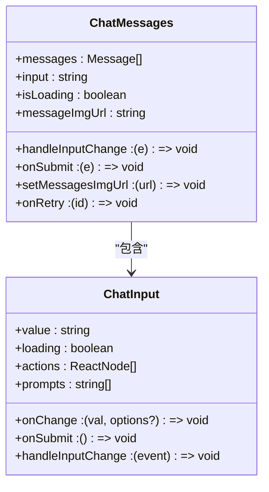
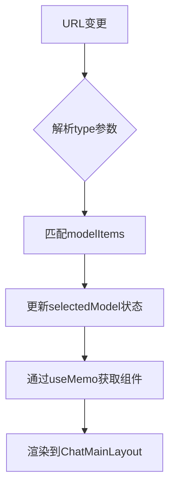
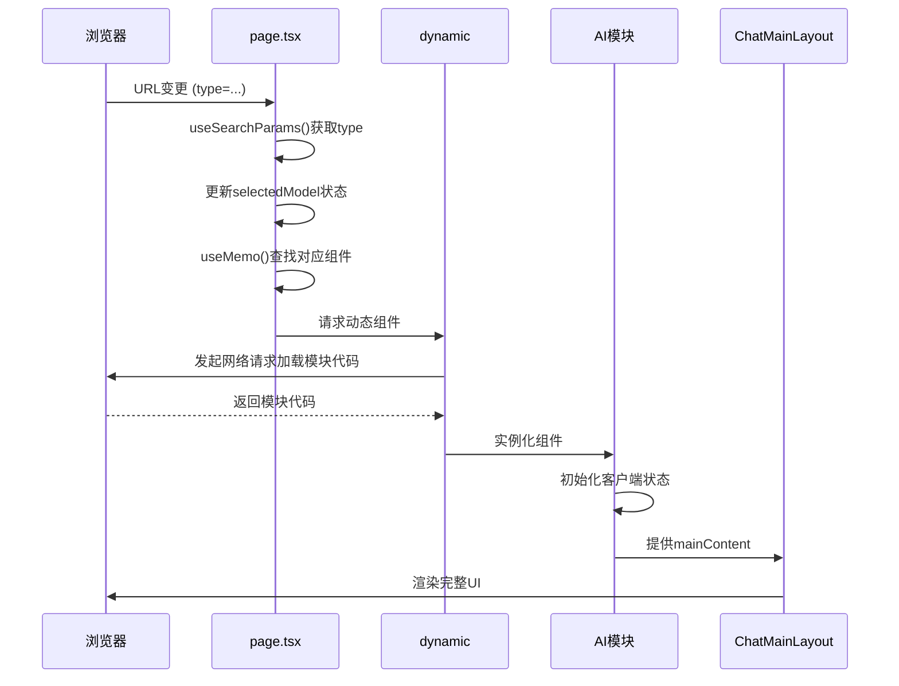

# API客户端集成

<cite>
**Referenced Files in This Document**   
- [app/page.tsx](file://app/page.tsx)
- [app/openai-sdk/index.tsx](file://app/openai-sdk/index.tsx)
- [app/llamaindex/index.tsx](file://app/llamaindex/index.tsx)
- [app/langchain/index.tsx](file://app/langchain/index.tsx)
- [app/vercel-ai/index.tsx](file://app/vercel-ai/index.tsx)
- [app/components/ChatMainLayout/ChatMainLayout.tsx](file://app/components/ChatMainLayout/ChatMainLayout.tsx)
- [app/components/ChatMessages/ChatMessages.tsx](file://app/components/ChatMessages/ChatMessages.tsx)
- [app/components/ChatInput/ChatInput.tsx](file://app/components/ChatInput/ChatInput.tsx)
- [app/components/ChatMessages/interface.ts](file://app/components/ChatMessages/interface.ts)
- [app/components/ChatInput/interface.ts](file://app/components/ChatInput/interface.ts)
</cite>

## 目录
1. [项目结构](#项目结构)
2. [核心组件](#核心组件)
3. [动态导入与懒加载机制](#动态导入与懒加载机制)
4. [AI SDK模块集成](#ai-sdk模块集成)
5. [统一接口设计](#统一接口设计)
6. [路由驱动的模块选择](#路由驱动的模块选择)
7. [SSR禁用与客户端状态](#ssr禁用与客户端状态)
8. [模块加载流程](#模块加载流程)

## 项目结构

项目采用Next.js App Router架构，核心AI功能模块以独立页面组件形式组织。`app/`目录下包含多个AI框架的集成入口，如`openai-sdk/`、`llamaindex/`、`langchain/`和`vercel-ai/`。核心UI组件（如`ChatMessages`、`ChatInput`）位于`components/`目录，通过统一接口为各AI模块提供一致的交互体验。



**Diagram sources**
- [app/page.tsx](file://app/page.tsx#L1-L76)
- [app/components/ChatMainLayout/ChatMainLayout.tsx](file://app/components/ChatMainLayout/ChatMainLayout.tsx#L1-L52)

**Section sources**
- [app/page.tsx](file://app/page.tsx#L1-L76)
- [app/components/ChatMainLayout/ChatMainLayout.tsx](file://app/components/ChatMainLayout/ChatMainLayout.tsx#L1-L52)

## 核心组件

系统由`page.tsx`作为主入口，通过`ChatMainLayout`提供统一的布局框架。`ChatMessages`和`ChatInput`是核心交互组件，分别负责消息渲染与用户输入。各AI SDK模块（如`OpenaiSdk`）作为独立的动态组件，通过`mainContent`注入到主布局中。

**Section sources**
- [app/page.tsx](file://app/page.tsx#L1-L76)
- [app/components/ChatMainLayout/ChatMainLayout.tsx](file://app/components/ChatMainLayout/ChatMainLayout.tsx#L1-L52)
- [app/components/ChatMessages/ChatMessages.tsx](file://app/components/ChatMessages/ChatMessages.tsx#L1-L101)
- [app/components/ChatInput/ChatInput.tsx](file://app/components/ChatInput/ChatInput.tsx#L1-L79)

## 动态导入与懒加载机制

`page.tsx`利用Next.js的`next/dynamic`实现AI模块的动态导入和懒加载。通过`dynamic(() => import('./module-path'))`语法，模块代码仅在需要时从服务器按需加载，有效减少初始包体积。

```typescript
const OpenaiSdk = dynamic(() => import('./openai-sdk'), {
  ssr: false,
  loading: () => <Loading />
});
```

此配置包含两个关键选项：`ssr: false`确保组件仅在客户端渲染，`loading`属性指定加载期间显示的占位组件（`<Loading />`），显著提升用户体验。

**Section sources**
- [app/page.tsx](file://app/page.tsx#L16-L24)

## AI SDK模块集成

项目支持`OpenaiSdk`、`LlamaindexSdk`、`LangchainSdk`和`VercelAi`等多个AI框架。每个模块（如`openai-sdk/index.tsx`）都是一个独立的客户端组件，封装了特定AI服务的API调用逻辑（如SSE流处理、错误处理）。尽管实现细节各异，但所有模块最终都通过`ChatMessages`和`ChatInput`组件与用户交互，实现了功能与UI的解耦。

**Section sources**
- [app/page.tsx](file://app/page.tsx#L16-L34)
- [app/openai-sdk/index.tsx](file://app/openai-sdk/index.tsx#L1-L267)
- [app/llamaindex/index.tsx](file://app/llamaindex/index.tsx#L1-L8)
- [app/langchain/index.tsx](file://app/langchain/index.tsx#L1-L8)
- [app/vercel-ai/index.tsx](file://app/vercel-ai/index.tsx#L1-L63)

## 统一接口设计

`ChatMessages`和`ChatInput`组件定义了标准化的接口，确保所有AI模块能无缝集成。`ChatMessages`通过`messages`、`input`、`onSubmit`等props接收状态和回调，内部统一渲染消息列表和输入框。`ChatInput`则通过`value`、`onChange`、`onSubmit`等props与父组件通信，保证了输入逻辑的一致性。



**Diagram sources**
- [app/components/ChatMessages/ChatMessages.tsx](file://app/components/ChatMessages/ChatMessages.tsx#L11-L95)
- [app/components/ChatInput/ChatInput.tsx](file://app/components/ChatInput/ChatInput.tsx#L10-L74)
- [app/components/ChatMessages/interface.ts](file://app/components/ChatMessages/interface.ts#L1-L30)
- [app/components/ChatInput/interface.ts](file://app/components/ChatInput/interface.ts#L1-L15)

**Section sources**
- [app/components/ChatMessages/ChatMessages.tsx](file://app/components/ChatMessages/ChatMessages.tsx#L1-L101)
- [app/components/ChatInput/ChatInput.tsx](file://app/components/ChatInput/ChatInput.tsx#L1-L79)

## 路由驱动的模块选择

模块选择由URL查询参数`type`驱动。`page.tsx`通过`useSearchParams()`获取`type`值，并使用`modelItems`数组映射到对应的动态组件。当用户通过下拉菜单切换模型时，`handleModelChange`函数会更新URL参数，触发页面状态更新，从而渲染新的AI模块。



**Diagram sources**
- [app/page.tsx](file://app/page.tsx#L36-L76)

**Section sources**
- [app/page.tsx](file://app/page.tsx#L36-L76)

## SSR禁用与客户端状态

所有动态导入的AI模块均配置`ssr: false`。这是因为AI交互严重依赖客户端状态（如`useState`管理的`messages`、`input`）和浏览器API（如`fetch`、`AbortController`）。在服务端渲染时，这些状态和API不可用或行为不一致，会导致水合（hydration）错误。禁用SSR确保了组件始终在客户端执行，保证了状态管理和API调用的可靠性。

**Section sources**
- [app/page.tsx](file://app/page.tsx#L16-L34)

## 模块加载流程

从URL变更到最终渲染，模块加载流程如下图所示。该流程清晰地展示了动态导入、状态更新和组件渲染的完整生命周期。



**Diagram sources**
- [app/page.tsx](file://app/page.tsx#L1-L76)
- [app/components/ChatMainLayout/ChatMainLayout.tsx](file://app/components/ChatMainLayout/ChatMainLayout.tsx#L1-L52)