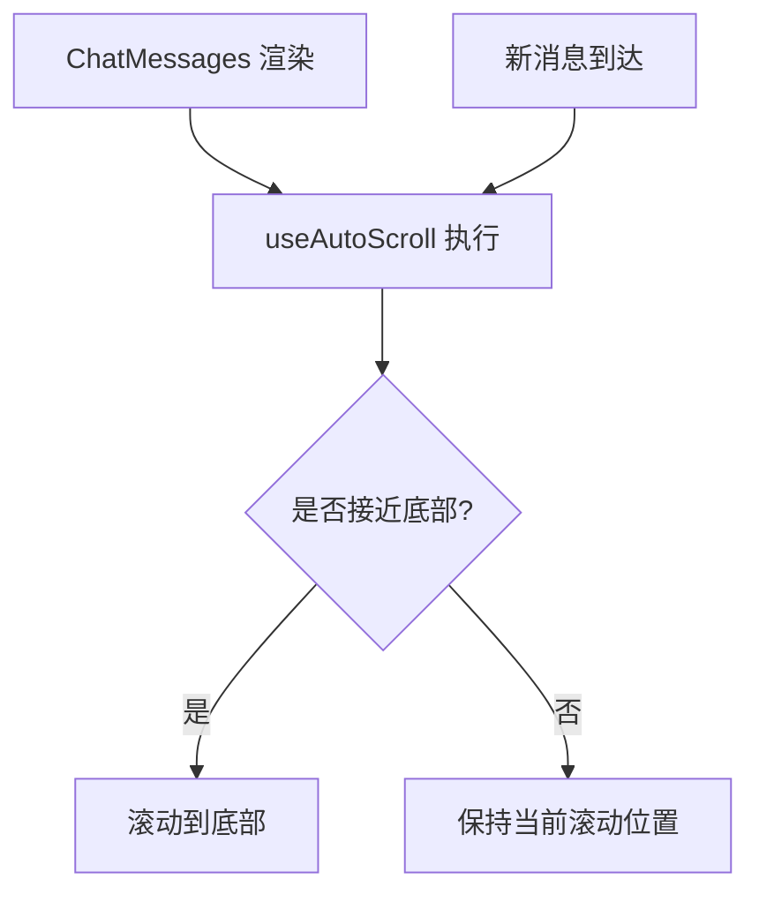
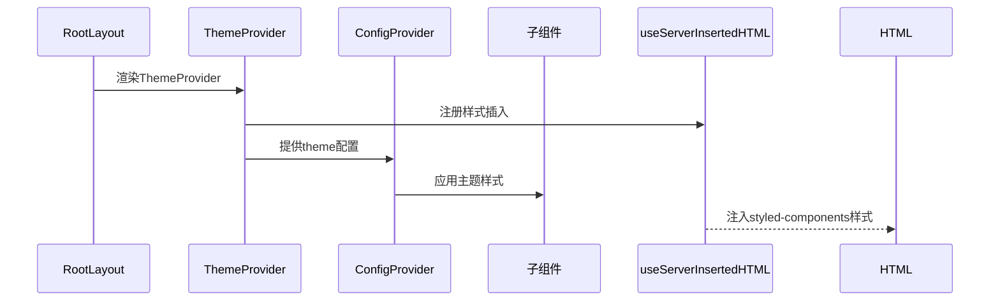
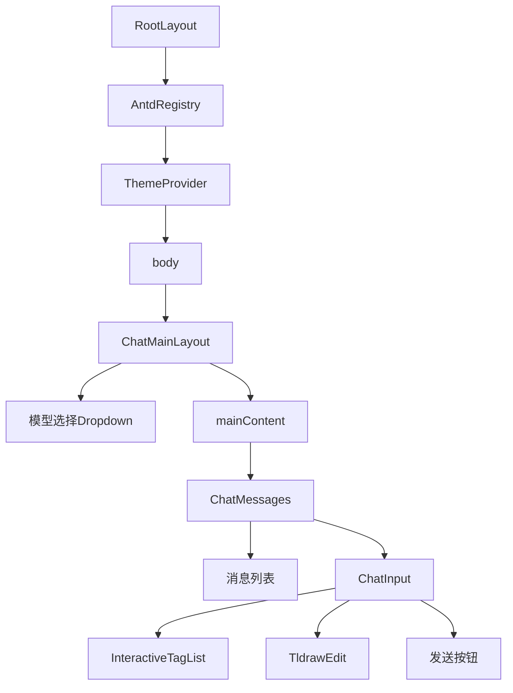

# UI组件架构

<cite>
**本文档中引用的文件**  
- [layout.tsx](file://app/layout.tsx)
- [ChatMainLayout.tsx](file://app/components/ChatMainLayout/ChatMainLayout.tsx)
- [ChatMainLayout/interface.ts](file://app/components/ChatMainLayout/interface.ts)
- [ChatMessages.tsx](file://app/components/ChatMessages/ChatMessages.tsx)
- [ChatMessages/interface.ts](file://app/components/ChatMessages/interface.ts)
- [ChatInput.tsx](file://app/components/ChatInput/ChatInput.tsx)
- [ChatInput/interface.ts](file://app/components/ChatInput/interface.ts)
- [useAutoScroll.ts](file://app/hooks/useAutoScroll.ts)
- [ThemeProvider.tsx](file://app/components/ThemeProvider/ThemeProvider.tsx)
- [ThemeProvider/interface.ts](file://app/components/ThemeProvider/interface.ts)
</cite>

## 目录
1. [项目结构](#项目结构)
2. [核心组件分析](#核心组件分析)
3. [组件树结构](#组件树结构)
4. [样式协同机制](#样式协同机制)
5. [结论](#结论)

## 项目结构

项目采用基于React的组件化架构，前端UI结构主要位于`app/components`目录下。核心UI组件包括`ChatMainLayout`、`ChatMessages`、`ChatInput`、`ThemeProvider`等，分别负责布局管理、消息展示、输入控制和主题注入。`layout.tsx`作为根布局文件，全局注入`ThemeProvider`以实现主题控制。Tailwind CSS与Ant Design结合使用，通过`globals.css`和组件内联样式实现视觉统一。

**组件来源**
- [layout.tsx](file://app/layout.tsx#L1-L40)
- [ChatMainLayout.tsx](file://app/components/ChatMainLayout/ChatMainLayout.tsx#L1-L51)

## 核心组件分析

### ChatMainLayout：顶层布局容器

`ChatMainLayout`作为顶层布局组件，接收`mainContent`、`selectedModel`、`onModelChange`和`modelItems`作为属性。其内部集成Ant Design的`Dropdown`和`Button`组件，实现模型切换功能。通过`Dropdown`的`menu.onClick`事件监听用户选择，并调用`onModelChange`回调更新模型状态。下拉菜单通过`dropdownRender`自定义渲染，应用深色背景和透明度样式，确保视觉一致性。布局顶部包含品牌标识和模型选择器，内容区域高度通过CSS计算动态调整，适配不同屏幕尺寸。

**组件来源**
- [ChatMainLayout.tsx](file://app/components/ChatMainLayout/ChatMainLayout.tsx#L6-L46)
- [interface.ts](file://app/components/ChatMainLayout/interface.ts#L1-L11)

### ChatMessages：消息区域与自动滚动

`ChatMessages`组件通过`forwardRef`暴露`scrollToBottom`方法，允许父组件控制滚动行为。其内部使用`useRef`创建对滚动容器的引用，并将该引用传递给`useAutoScroll`自定义Hook。`useAutoScroll`监听`messages`数组的变化，当新消息到达时，自动判断是否接近底部（距离小于100px），并触发滚动到底部操作。该组件还嵌套`ChatInput`，实现输入框固定于底部的布局效果，并通过`TldrawEdit`集成绘图功能，支持用户上传手绘UI草图。

**图示来源**
- [ChatMessages.tsx](file://app/components/ChatMessages/ChatMessages.tsx#L11-L95)
- [useAutoScroll.ts](file://app/hooks/useAutoScroll.ts#L2-L16)

### ChatInput：富输入功能实现

`ChatInput`组件基于Ant Design的`TextArea`构建，支持多行自适应输入。其核心特性包括：
- **提示标签交互**：通过`InteractiveTagList`展示预设提示词，点击标签可快速填充输入框。
- **自定义动作插槽**：通过`actions`插槽接收外部组件，如`TldrawEdit`绘图工具。
- **提交控制**：发送按钮集成防抖和空值校验，避免无效请求。
- **性能优化**：使用`React.memo`进行浅比较，避免不必要的重渲染。

输入区域与动作按钮通过`StyledChatInput`进行样式封装，确保视觉一致性。`TldrawEdit`通过`Drawer`弹出层实现，用户绘制完成后可导出为PNG图像并嵌入消息流。

**组件来源**
- [ChatInput.tsx](file://app/components/ChatInput/ChatInput.tsx#L10-L74)
- [interface.ts](file://app/components/ChatInput/interface.ts#L1-L14)

### ThemeProvider：全局主题注入

`ThemeProvider`在`layout.tsx`中作为根级组件注入，通过Ant Design的`ConfigProvider`实现主题控制。其接收`isDarkMode`布尔值，动态选择`theme.darkAlgorithm`或`theme.defaultAlgorithm`应用于整个应用。为支持服务端渲染（SSR），使用`styled-components`的`ServerStyleSheet`和Next.js的`useServerInsertedHTML`确保样式正确注入HTML。该机制确保主题样式在首屏渲染时即生效，避免闪烁问题。

**图示来源**
- [ThemeProvider.tsx](file://app/components/ThemeProvider/ThemeProvider.tsx#L8-L33)
- [layout.tsx](file://app/layout.tsx#L1-L40)

## 组件树结构

从`RootLayout`到具体功能组件的嵌套关系如下：

**图示来源**
- [layout.tsx](file://app/layout.tsx#L1-L40)
- [ChatMainLayout.tsx](file://app/components/ChatMainLayout/ChatMainLayout.tsx#L6-L46)
- [ChatMessages.tsx](file://app/components/ChatMessages/ChatMessages.tsx#L11-L95)

## 样式协同机制

项目采用Tailwind CSS与Ant Design协同的样式策略：
- **Tailwind CSS**：负责基础布局（flex、grid、spacing）、颜色透明度（bg-black/90）和滚动条样式（scrollbar-thin）。
- **Ant Design**：提供组件默认样式（Button、Dropdown、Divider），并通过`className`覆盖机制进行定制（如`!bg-black/80`）。
- **CSS-in-JS**：`styled-components`用于动态样式（如`StyledChatInput`），支持基于props的条件渲染。
- **全局样式**：`globals.css`重置默认样式并定义字体变量，确保跨浏览器一致性。

这种分层样式架构既保留了Ant Design的组件完整性，又通过Tailwind实现灵活布局，同时利用CSS-in-JS处理复杂交互样式。

**组件来源**
- [globals.css](file://app/globals.css)
- [styles.ts](file://app/components/ChatInput/styles.ts)
- [ChatMainLayout.tsx](file://app/components/ChatMainLayout/ChatMainLayout.tsx#L6-L46)

## 结论

本项目构建了一个高度模块化的React前端架构，`ChatMainLayout`作为顶层容器协调模型切换与内容展示，`ChatMessages`通过`forwardRef`和`useAutoScroll`实现智能滚动，`ChatInput`支持富输入与插件扩展，`ThemeProvider`确保主题一致性。组件间通过清晰的props接口通信，结合Tailwind与Ant Design的样式体系，实现了高效、可维护的UI开发模式。