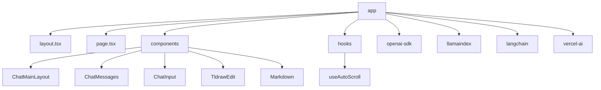
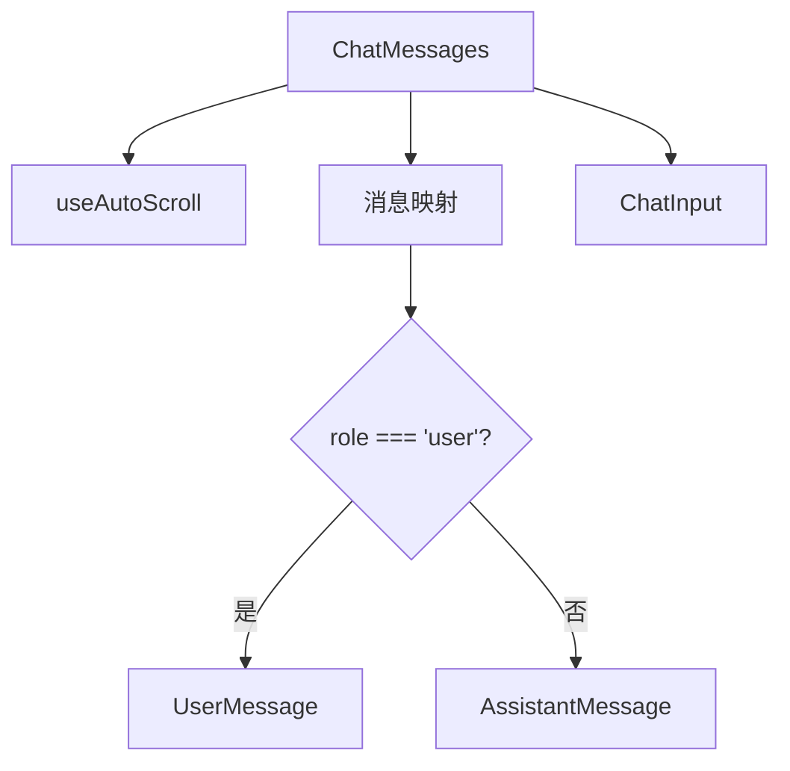
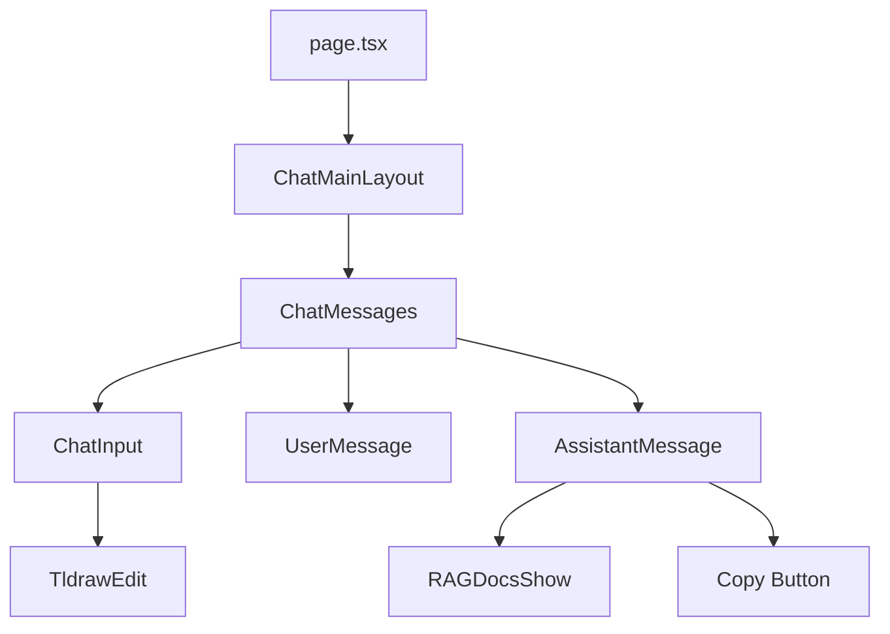
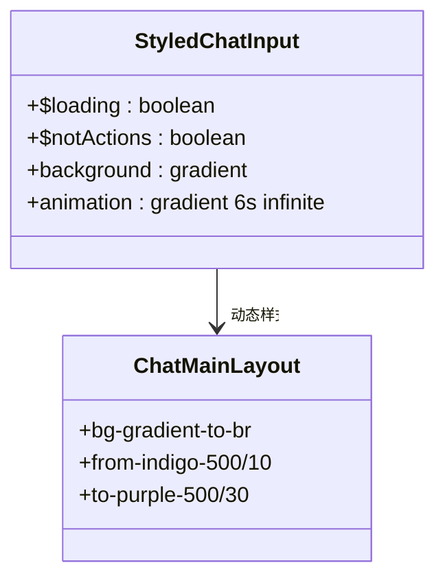
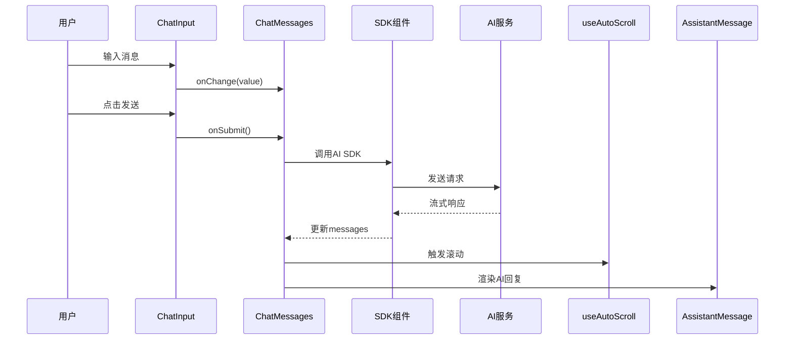

# 前端架构

<cite>
**本文档中引用的文件**  
- [layout.tsx](file://app/layout.tsx)
- [page.tsx](file://app/page.tsx)
- [ChatMainLayout.tsx](file://app/components/ChatMainLayout/ChatMainLayout.tsx)
- [ChatMessages.tsx](file://app/components/ChatMessages/ChatMessages.tsx)
- [ChatInput.tsx](file://app/components/ChatInput/ChatInput.tsx)
- [AssistantMessage.tsx](file://app/components/ChatMessages/AssistantMessage.tsx)
- [UserMessage.tsx](file://app/components/ChatMessages/UserMessage.tsx)
- [interface.ts](file://app/components/ChatMainLayout/interface.ts)
- [interface.ts](file://app/components/ChatMessages/interface.ts)
- [interface.ts](file://app/components/ChatInput/interface.ts)
- [styles.ts](file://app/components/ChatMainLayout/styles.ts)
- [styles.ts](file://app/components/ChatInput/styles.ts)
- [useAutoScroll.ts](file://app/hooks/useAutoScroll.ts)
- [utils.ts](file://lib/utils.ts)
</cite>

## 目录
1. [项目结构](#项目结构)  
2. [核心组件分析](#核心组件分析)  
3. [组件树与数据流](#组件树与数据流)  
4. [状态管理与Props传递](#状态管理与props传递)  
5. [UI组件库设计原则](#ui组件库设计原则)  
6. [样式实现机制](#样式实现机制)  
7. [生命周期与交互流程](#生命周期与交互流程)

## 项目结构

本项目基于Next.js App Router和React Server Components构建，采用分层设计模式。根目录`app/`包含路由入口`layout.tsx`和`page.tsx`，以及核心UI组件目录`components/`。组件按功能模块化组织，每个子组件包含独立的`interface.ts`（类型定义）、`styles.ts`（样式）和`.stories.tsx`（Storybook测试）。

**图示来源**  
- [layout.tsx](file://app/layout.tsx#L1-L40)
- [page.tsx](file://app/page.tsx#L1-L76)

## 核心组件分析

### ChatMainLayout 容器组件

`ChatMainLayout`作为核心布局容器，接收`mainContent`作为子内容，并通过`modelItems`和`onModelChange`实现AI模型切换功能。顶部导航栏包含应用标题和下拉菜单，用于切换不同AI SDK（OpenAI、LLamaIndex等）。

**组件来源**  
- [ChatMainLayout.tsx](file://app/components/ChatMainLayout/ChatMainLayout.tsx#L6-L46)
- [interface.ts](file://app/components/ChatMainLayout/interface.ts#L5-L10)

### ChatMessages 消息容器

`ChatMessages`组件负责渲染消息流，并集成`ChatInput`输入框。通过`useAutoScroll`钩子实现消息滚动同步。消息列表根据`role`区分用户与AI消息，分别渲染`UserMessage`和`AssistantMessage`。

**图示来源**  
- [ChatMessages.tsx](file://app/components/ChatMessages/ChatMessages.tsx#L11-L95)
- [interface.ts](file://app/components/ChatMessages/interface.ts#L17-L26)

### ChatInput 输入组件

`ChatInput`为受控组件，通过`value`和`onChange`管理输入状态。支持动态`actions`插槽（如Tldraw绘图工具），并集成防抖提交逻辑。使用`styled-components`实现动态样式（如加载动画）。

**组件来源**  
- [ChatInput.tsx](file://app/components/ChatInput/ChatInput.tsx#L10-L74)
- [interface.ts](file://app/components/ChatInput/interface.ts#L2-L11)

## 组件树与数据流

**图示来源**  
- [page.tsx](file://app/page.tsx#L45-L76)
- [ChatMainLayout.tsx](file://app/components/ChatMainLayout/ChatMainLayout.tsx#L6-L46)
- [ChatMessages.tsx](file://app/components/ChatMessages/ChatMessages.tsx#L11-L95)

## 状态管理与Props传递

### 状态层级
1. **顶层状态**：`page.tsx`通过`useState`管理`selectedModel`
2. **中间层**：`ChatMainLayout`接收`selectedModel`并传递`mainContent`
3. **底层组件**：`ChatMessages`通过回调函数与父级通信

### 关键Props传递
| 组件 | 传递的Props | 来源 |
|------|------------|------|
| ChatMainLayout | mainContent, selectedModel, onModelChange, modelItems | page.tsx |
| ChatMessages | messages, input, onSubmit, isLoading | SDK组件 |
| ChatInput | value, onChange, onSubmit, actions | ChatMessages |

**组件来源**  
- [page.tsx](file://app/page.tsx#L58-L76)
- [ChatMainLayout.tsx](file://app/components/ChatMainLayout/ChatMainLayout.tsx#L6-L46)
- [ChatMessages.tsx](file://app/components/ChatMessages/ChatMessages.tsx#L11-L95)

## UI组件库设计原则

### 高内聚与可复用性
- **单一职责**：每个组件仅处理特定UI功能（如`UserMessage`专用于用户消息渲染）
- **可组合性**：通过`actions`插槽实现功能扩展（如Tldraw集成）
- **类型安全**：所有组件通过`interface.ts`定义严格类型契约

### 性能优化
- 使用`React.memo`对`ChatInput`、`AssistantMessage`等组件进行记忆化
- `useAutoScroll`依赖`messages`数组变化触发滚动
- 动态导入（`next/dynamic`）避免SSR问题

**组件来源**  
- [ChatInput.tsx](file://app/components/ChatInput/ChatInput.tsx#L10-L74)
- [AssistantMessage.tsx](file://app/components/ChatMessages/AssistantMessage.tsx#L45-L74)
- [useAutoScroll.ts](file://app/hooks/useAutoScroll.ts#L2-L16)

## 样式实现机制

### 技术栈
- **Tailwind CSS**：基础布局与响应式设计
- **styled-components**：动态样式与主题支持
- **Ant Design**：UI组件库集成

### 关键样式实现
- `StyledChatInput`使用CSS动画实现加载状态渐变背景
- `useStyles`通过`createUseStyles`生成BEM风格类名
- 全局样式通过`globals.css`注入

**图示来源**  
- [styles.ts](file://app/components/ChatInput/styles.ts#L28-L83)
- [styles.ts](file://app/components/ChatMainLayout/styles.ts#L2-L18)
- [globals.css](file://app/globals.css#L1-L10)

## 生命周期与交互流程

**图示来源**  
- [ChatInput.tsx](file://app/components/ChatInput/ChatInput.tsx#L50-L70)
- [ChatMessages.tsx](file://app/components/ChatMessages/ChatMessages.tsx#L11-L95)
- [useAutoScroll.ts](file://app/hooks/useAutoScroll.ts#L2-L16)