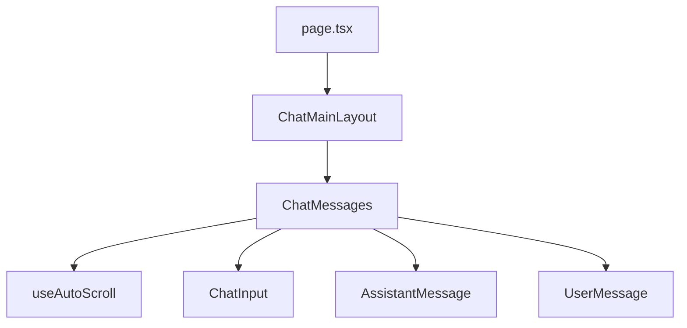
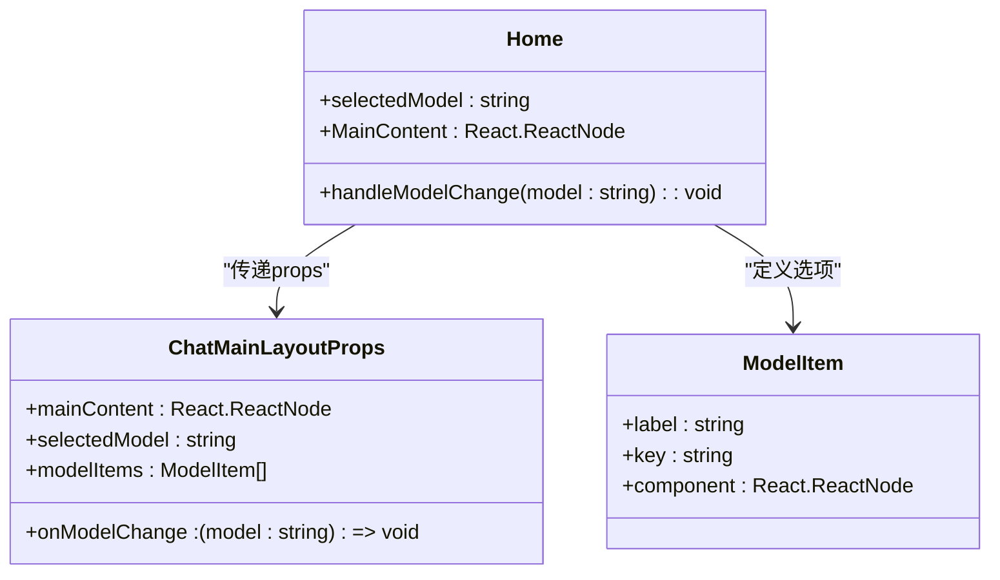
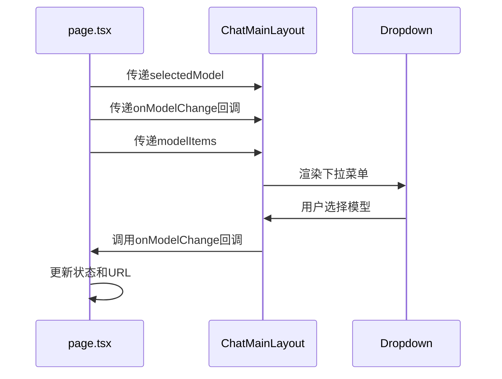
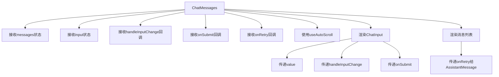
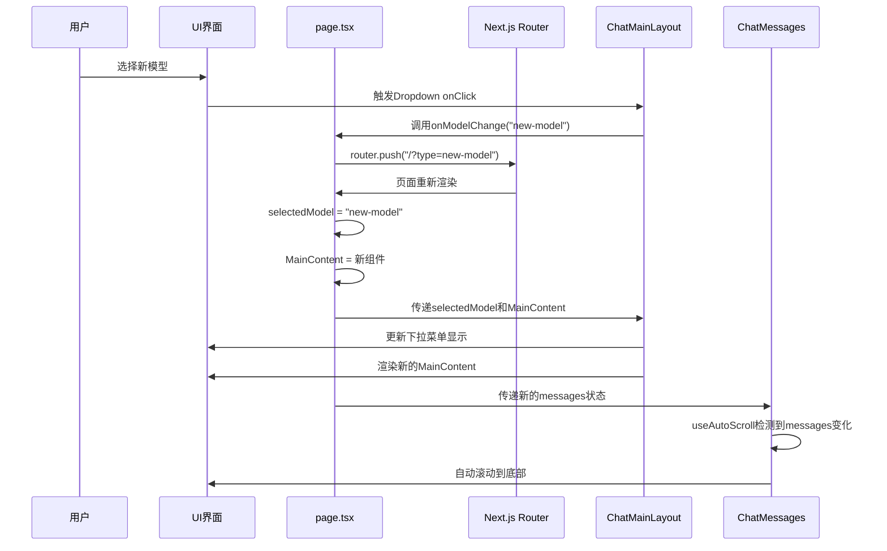

# 状态与数据流管理

<cite>
**本文档引用文件**  
- [page.tsx](file://app/page.tsx)
- [ChatMainLayout.tsx](file://app/components/ChatMainLayout/ChatMainLayout.tsx)
- [ChatMainLayout/interface.ts](file://app/components/ChatMainLayout/interface.ts)
- [ChatMessages.tsx](file://app/components/ChatMessages/ChatMessages.tsx)
- [ChatMessages/interface.ts](file://app/components/ChatMessages/interface.ts)
- [useAutoScroll.ts](file://app/hooks/useAutoScroll.ts)
</cite>

## 目录
1. [项目结构](#项目结构)
2. [核心状态管理机制](#核心状态管理机制)
3. [组件间通信契约](#组件间通信契约)
4. [数据流时序分析](#数据流时序分析)
5. [自动滚动实现原理](#自动滚动实现原理)

## 项目结构

本项目采用Next.js App Router架构，核心状态管理与数据流组件位于`app`目录下。主要组件包括：
- `page.tsx`: 页面入口，负责顶层状态管理
- `components/ChatMainLayout`: 主布局容器
- `components/ChatMessages`: 消息展示组件
- `hooks/useAutoScroll`: 自定义滚动Hook



**Diagram sources**
- [page.tsx](file://app/page.tsx)
- [ChatMainLayout.tsx](file://app/components/ChatMainLayout/ChatMainLayout.tsx)
- [ChatMessages.tsx](file://app/components/ChatMessages/ChatMessages.tsx)
- [useAutoScroll.ts](file://app/hooks/useAutoScroll.ts)

**Section sources**
- [page.tsx](file://app/page.tsx)
- [app/components](file://app/components)

## 核心状态管理机制

`page.tsx`作为应用的根组件，通过React Hooks实现核心状态管理。该组件使用`useState`和`useMemo`来管理模型选择状态，并通过URL参数进行状态同步。



**Diagram sources**
- [page.tsx](file://app/page.tsx#L1-L76)
- [ChatMainLayout/interface.ts](file://app/components/ChatMainLayout/interface.ts#L5-L10)

**Section sources**
- [page.tsx](file://app/page.tsx#L1-L76)

### 状态初始化与URL同步

在`page.tsx`中，`selectedModel`状态的初始化考虑了URL参数：
1. 通过`useSearchParams`获取URL中的`type`参数
2. 如果URL参数有效，则使用该值作为初始状态
3. 否则使用默认模型（`openai-sdk`）

当用户选择新模型时，`handleModelChange`回调会：
1. 更新URL参数
2. 调用`router.push`进行页面导航
3. 更新本地状态`selectedModel`

这种设计实现了状态的持久化和可分享性，用户可以通过分享带有特定参数的URL来传递模型选择。

### useMemo优化渲染

`MainContent`变量使用`useMemo`进行性能优化：
- 仅当`selectedModel`变化时重新计算
- 避免不必要的组件重新渲染
- 提高应用性能

## 组件间通信契约

本系统采用自上而下的单向数据流模式，通过props传递实现组件间通信。

### ChatMainLayout通信契约

`ChatMainLayout`组件定义了清晰的props契约，接收来自父组件的状态和回调：

```typescript
interface ChatMainLayoutProps {
  mainContent: React.ReactNode;
  selectedModel: string;
  onModelChange: (model: string) => void;
  modelItems: ModelItem[];
}
```



**Diagram sources**
- [ChatMainLayout.tsx](file://app/components/ChatMainLayout/ChatMainLayout.tsx#L6-L46)
- [ChatMainLayout/interface.ts](file://app/components/ChatMainLayout/interface.ts#L5-L10)

**Section sources**
- [ChatMainLayout.tsx](file://app/components/ChatMainLayout/ChatMainLayout.tsx#L6-L46)

#### 模型选择事件传递

当用户在下拉菜单中选择模型时，事件传递流程如下：
1. `Dropdown`组件触发`onClick`事件
2. 获取选中项的`key`值
3. 调用`onModelChange`回调函数
4. 回调函数在`page.tsx`中处理，更新状态和URL

这种设计遵循了"状态提升"原则，将状态管理集中在父组件中，子组件只负责UI展示和事件触发。

### ChatMessages通信契约

`ChatMessages`组件接收多个外部状态和回调，形成复杂的通信契约：

```typescript
interface ChatMessagesProps {
  messages: Array<Message>;
  input: string;
  handleInputChange: (e: React.ChangeEvent<HTMLInputElement>) => void;
  onSubmit: (e: React.FormEvent<HTMLFormElement>) => void;
  isLoading: boolean;
  messageImgUrl: string;
  setMessagesImgUrl: (url: string) => void;
  onRetry: (id: string) => void;
}
```



**Diagram sources**
- [ChatMessages.tsx](file://app/components/ChatMessages/ChatMessages.tsx#L11-L95)
- [ChatMessages/interface.ts](file://app/components/ChatMessages/interface.ts#L17-L26)

**Section sources**
- [ChatMessages.tsx](file://app/components/ChatMessages/ChatMessages.tsx#L11-L95)

#### 重试逻辑处理

`onRetry`回调的传递展示了深层组件通信：
1. `page.tsx`定义`onRetry`处理函数
2. 通过props传递给`ChatMessages`
3. 在消息映射中传递给`AssistantMessage`
4. 当用户点击重试按钮时，触发回调
5. 回调逐层向上传递到`page.tsx`进行处理

这种模式避免了在深层嵌套组件中直接访问顶层状态，保持了组件的解耦。

## 数据流时序分析

从用户操作到状态更新再到UI渲染的完整数据流闭环如下：



**Diagram sources**
- [page.tsx](file://app/page.tsx#L1-L76)
- [ChatMainLayout.tsx](file://app/components/ChatMainLayout/ChatMainLayout.tsx#L6-L46)
- [ChatMessages.tsx](file://app/components/ChatMessages/ChatMessages.tsx#L11-L95)

**Section sources**
- [page.tsx](file://app/page.tsx#L1-L76)
- [ChatMainLayout.tsx](file://app/components/ChatMainLayout/ChatMainLayout.tsx#L6-L46)
- [ChatMessages.tsx](file://app/components/ChatMessages/ChatMessages.tsx#L11-L95)

### 状态更新生命周期

1. **用户交互**: 用户在UI上进行操作（如选择模型）
2. **事件触发**: 组件触发相应的事件处理函数
3. **状态更新**: 父组件更新状态（`useState`）
4. **副作用执行**: `useEffect`等Hook响应状态变化
5. **重新渲染**: React重新渲染受影响的组件
6. **UI更新**: 浏览器更新DOM，用户看到变化

## 自动滚动实现原理

`useAutoScroll`自定义Hook实现了消息列表的自动滚动功能，确保新消息出现时视图自动滚动到底部。

```mermaid
flowchart TD
A[useAutoScroll调用] --> B[传入scrollContainerRef]
A --> C[传入依赖数组[messages]]
B --> D[useEffect监听依赖]
C --> D
D --> E{messages变化?}
E --> |是| F[获取滚动容器]
F --> G[计算滚动位置]
G --> H{距离底部≤100px?}
H --> |是| I[滚动到底部]
H --> |否| J[保持当前位置]
```

**Diagram sources**
- [useAutoScroll.ts](file://app/hooks/useAutoScroll.ts#L2-L16)
- [ChatMessages.tsx](file://app/components/ChatMessages/ChatMessages.tsx#L11-L95)

**Section sources**
- [useAutoScroll.ts](file://app/hooks/useAutoScroll.ts#L2-L16)

### 实现细节

`useAutoScroll`Hook的核心逻辑：
1. 接收滚动容器的引用和依赖数组
2. 使用`useEffect`监听依赖变化
3. 获取容器的滚动属性：
   - `scrollTop`: 当前滚动位置
   - `scrollHeight`: 内容总高度
   - `clientHeight`: 可见区域高度
4. 计算距离底部的距离
5. 如果距离小于100px，则滚动到底部

这种设计确保了只有在用户接近底部时才自动滚动，避免了在用户浏览历史消息时强制滚动的干扰体验。