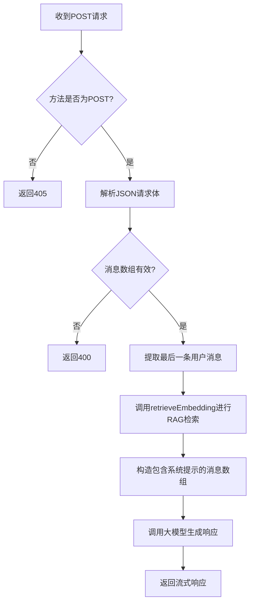
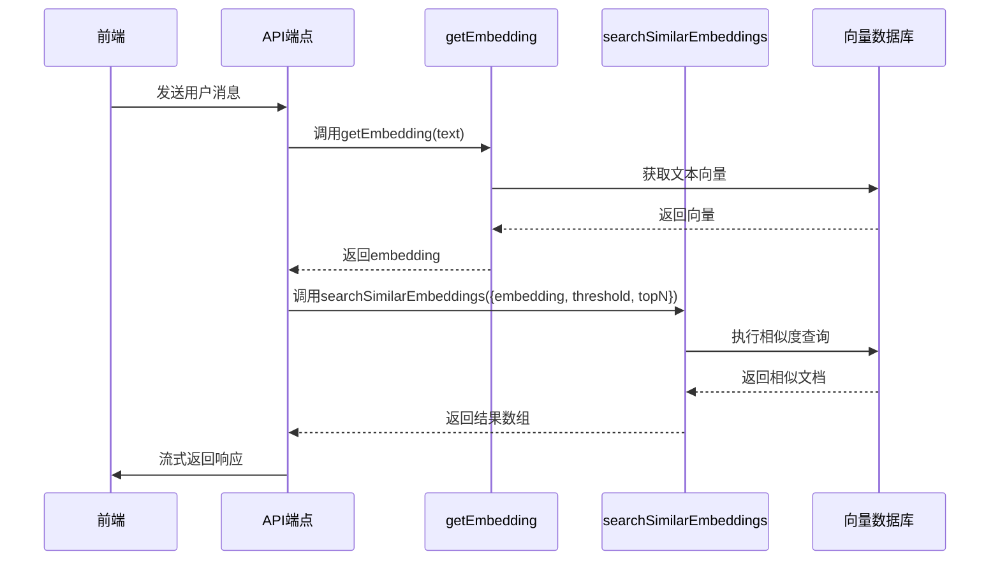
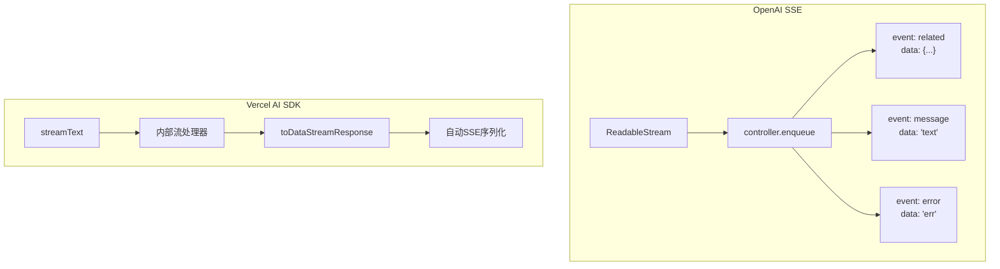

<cite>
**本文档中引用的文件**  
- [route.ts](file://app/api/openai/route.ts)
- [route.ts](file://app/api/vercelai/route.ts)
- [types.ts](file://app/api/openai/types.ts)
- [types.ts](file://app/api/vercelai/types.ts)
- [embedding.ts](file://app/api/openai/embedding.ts)
- [embedding.ts](file://app/api/vercelai/embedding.ts)
- [prompt.ts](file://lib/prompt.ts)
- [selectors.ts](file://lib/db/openai/selectors.ts)
- [selectors.ts](file://lib/db/vercelai/selectors.ts)
</cite>

## 目录
1. [API端点](#api端点)
2. [核心功能概述](#核心功能概述)
3. [请求处理流程](#请求处理流程)
4. [RAG检索机制](#rag检索机制)
5. [流式响应实现](#流式响应实现)
6. [技术选型对比](#技术选型对比)
7. [数据结构定义](#数据结构定义)
8. [错误处理与安全性](#错误处理与安全性)
9. [扩展新API端点](#扩展新api端点)

## API端点

本节详细说明 `/api/openai/route.ts` 和 `/api/vercelai/route.ts` 两个核心API端点的实现机制，涵盖其HTTP方法、请求/响应格式、事件类型及流式处理方式。

**Section sources**
- [route.ts](file://app/api/openai/route.ts)
- [route.ts](file://app/api/vercelai/route.ts)

## 核心功能概述

两个API端点均用于处理前端发起的聊天请求，支持RAG（检索增强生成）功能。它们接收用户消息，通过向量数据库检索相关文档片段，并将这些信息作为上下文注入系统提示词中，最终调用大模型生成响应。两者的主要区别在于底层SDK的集成方式：`/api/openai` 使用原生 OpenAI SDK，而 `/api/vercelai` 使用 Vercel AI SDK（@ai-sdk/openai）。

**Section sources**
- [route.ts](file://app/api/openai/route.ts)
- [route.ts](file://app/api/vercelai/route.ts)

## 请求处理流程

两个端点的请求处理流程高度相似，均遵循以下五个步骤：

1. **方法验证**：检查HTTP方法是否为POST。
2. **请求体解析**：解析JSON请求体。
3. **用户消息提取**：获取消息数组中的最后一条用户消息内容。
4. **RAG检索触发**：使用用户消息内容进行向量检索。
5. **消息构造与模型调用**：将检索到的参考内容作为系统消息插入消息数组，并调用大模型。

尽管流程一致，但在请求体结构上存在差异：`/api/openai` 预期请求体包含 `message` 字段，而 `/api/vercelai` 兼容 `messages` 或 `message` 字段，以适配 Vercel 的 `useChat` 钩子。

**Diagram sources**
- [route.ts](file://app/api/openai/route.ts#L15-L45)
- [route.ts](file://app/api/vercelai/route.ts#L15-L45)

**Section sources**
- [route.ts](file://app/api/openai/route.ts#L15-L45)
- [route.ts](file://app/api/vercelai/route.ts#L15-L45)

## RAG检索机制

RAG检索是两个端点的核心功能，其实现分为三个层次：

1. **文本向量化**：调用 `getEmbedding` 函数，使用配置的嵌入模型（如 `text-embedding-ada-002`）将用户输入的文本转换为向量。
2. **语义搜索**：在 `searchSimilarEmbeddings` 函数中，使用Drizzle ORM执行数据库查询，通过余弦距离计算向量相似度，并筛选出高于阈值的结果。
3. **结果整合**：`retrieveEmbedding` 函数协调上述步骤，返回包含内容和相似度分数的文档片段数组。

两个端点分别使用独立的数据库表（`openAiEmbeddings` 和 `vercelAiEmbeddings`）和查询逻辑，确保数据隔离。

**Diagram sources**
- [embedding.ts](file://app/api/openai/embedding.ts#L58-L66)
- [selectors.ts](file://lib/db/openai/selectors.ts#L11-L31)

**Section sources**
- [embedding.ts](file://app/api/openai/embedding.ts#L58-L66)
- [embedding.ts](file://app/api/vercelai/embedding.ts#L51-L59)
- [selectors.ts](file://lib/db/openai/selectors.ts#L11-L31)
- [selectors.ts](file://lib/db/vercelai/selectors.ts#L11-L31)

## 流式响应实现

### OpenAI端点：原生SSE实现

`/api/openai/route.ts` 使用原生的 `ReadableStream` 和 Server-Sent Events (SSE) 协议实现流式响应。其核心是手动构造一个 `ReadableStream`，在 `start` 方法中：

- 首先推送 `event: related` 事件，将检索到的文档片段发送给前端。
- 然后监听来自 OpenAI 流式API的 `chunk`，将每个文本片段封装为 `event: message` 事件推送。
- 发生错误时，推送 `event: error` 事件。

响应头明确设置为 `text/event-stream`，确保浏览器正确处理SSE。

### Vercel AI端点：Vercel AI SDK集成

`/api/vercelai/route.ts` 利用 `@ai-sdk/openai` 提供的 `streamText` 函数简化流式处理。`streamText` 是一个高级抽象，它内部处理了流的创建和管理。开发者只需传入模型、消息和可选的回调（如 `onFinish`），然后调用 `result.toDataStreamResponse()` 即可将结果转换为符合Next.js要求的 `Response` 对象。该方法自动处理SSE事件的序列化。

**Diagram sources**
- [route.ts](file://app/api/openai/route.ts#L50-L85)
- [route.ts](file://app/api/vercelai/route.ts#L55-L65)

**Section sources**
- [route.ts](file://app/api/openai/route.ts#L50-L85)
- [route.ts](file://app/api/vercelai/route.ts#L55-L65)

## 技术选型对比

| 特性 | `/api/openai` (原生OpenAI SDK) | `/api/vercelai` (Vercel AI SDK) |
| :--- | :--- | :--- |
| **SDK** | `openai` | `@ai-sdk/openai` |
| **流式实现** | 手动 `ReadableStream` + SSE | `streamText` + `toDataStreamResponse` |
| **代码复杂度** | 较高，需手动管理流和事件 | 较低，高级API抽象 |
| **灵活性** | 高，完全控制流的每个细节 | 中，依赖SDK的实现 |
| **集成性** | 通用，适用于任何环境 | 与Vercel生态深度集成 |
| **错误处理** | 手动try-catch并推送error事件 | SDK可能提供更结构化的错误 |

**Section sources**
- [route.ts](file://app/api/openai/route.ts)
- [route.ts](file://app/api/vercelai/route.ts)

## 数据结构定义

### 请求体

- **`/api/openai`**: `{ "message": ChatCompletionMessageParam[] }`
- **`/api/vercelai`**: `{ "messages": CoreMessage[] }` 或 `{ "message": CoreMessage[] }`

### 响应事件

| 事件类型 | 数据结构 | 触发条件 |
| :--- | :--- | :--- |
| `related` | `Array<{ content: string; similarity: number }>` | RAG检索完成后立即推送 |
| `message` | `string` | 模型生成的文本片段 |
| `error` | `string` | 模型调用或处理过程中发生错误 |

**Section sources**
- [types.ts](file://app/api/openai/types.ts)
- [types.ts](file://app/api/vercelai/types.ts)
- [route.ts](file://app/api/openai/route.ts#L70-L80)
- [route.ts](file://app/api/vercelai/route.ts#L60)

## 错误处理与安全性

### 错误处理

两个端点都实现了基本的错误处理：
- **请求验证**：对HTTP方法、JSON解析、消息数组有效性进行检查，返回400或405状态码。
- **运行时错误**：在流式响应的 `try-catch` 块中捕获异常，并通过 `event: error` 将错误信息推送给前端。

### 安全性配置

- **CORS**：两个端点都在响应头中设置 `'Access-Control-Allow-Origin': '*'`，允许任意源访问。在生产环境中，建议将其限制为具体的前端域名。
- **环境变量**：API密钥（`AI_KEY`）、基础URL（`AI_BASE_URL`）和模型名称（`MODEL`）均通过 `env` 从环境变量中获取，避免硬编码。

**Section sources**
- [route.ts](file://app/api/openai/route.ts#L15-L25)
- [route.ts](file://app/api/vercelai/route.ts#L15-L25)
- [route.ts](file://app/api/openai/route.ts#L75-L85)
- [route.ts](file://app/api/vercelai/route.ts#L65)

## 扩展新API端点

要扩展新的API端点，可以遵循以下模式：

1. **创建新目录**：在 `app/api/` 下创建新目录（如 `myai`）。
2. **实现核心逻辑**：创建 `route.ts` 文件，复制现有端点的结构。
3. **选择SDK**：根据需求选择使用原生OpenAI SDK或Vercel AI SDK。
4. **定制化**：修改 `getSystemPrompt` 的调用参数或实现新的提示词逻辑。
5. **数据库集成**：如有需要，创建独立的数据库表和查询逻辑，或复用现有RAG功能。

关键是要保持请求处理流程的一致性，并确保流式响应的正确实现。

**Section sources**
- [route.ts](file://app/api/openai/route.ts)
- [route.ts](file://app/api/vercelai/route.ts)