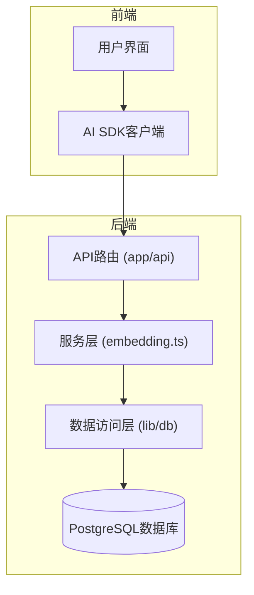
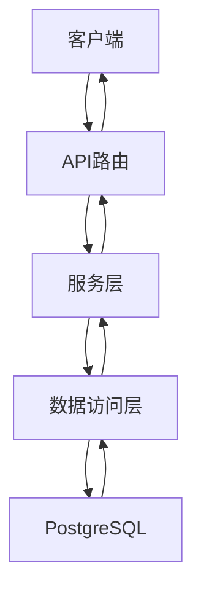
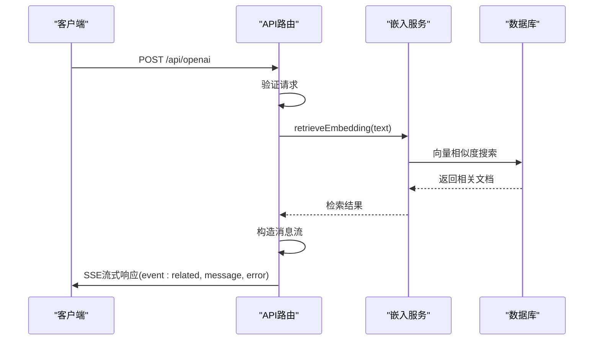
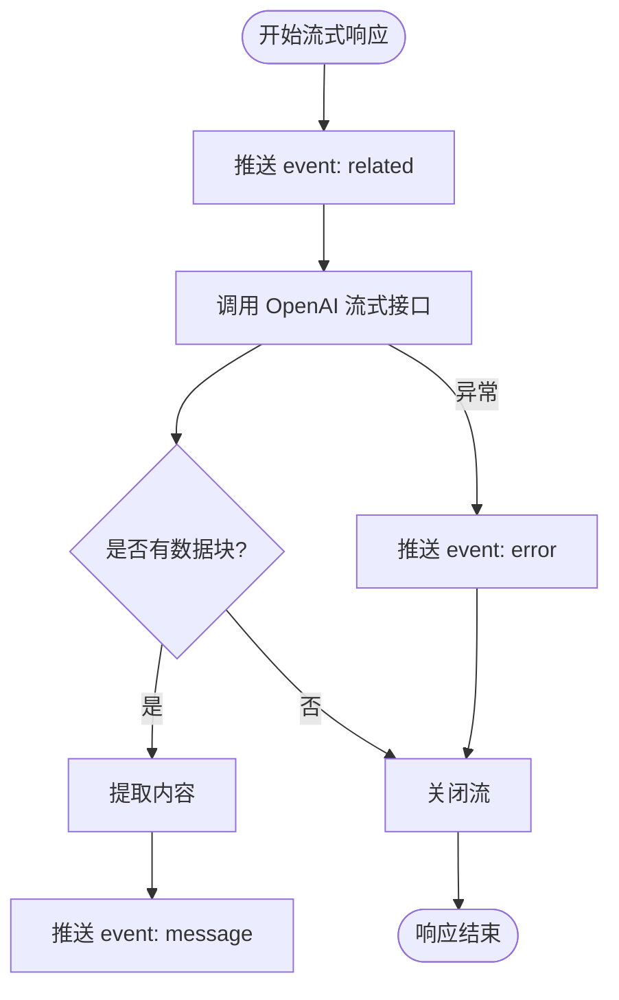
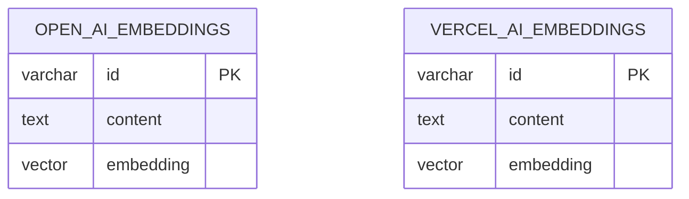
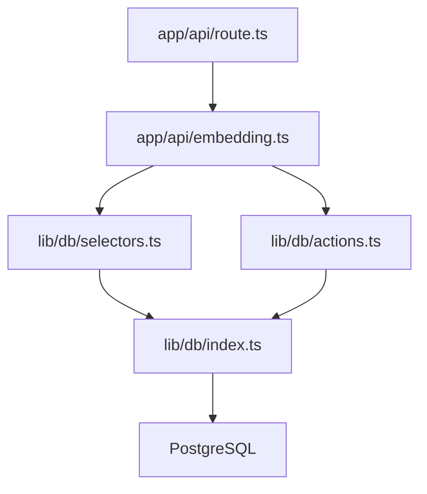

# 后端架构

<cite>
**本文档中引用的文件**  
- [app/api/openai/route.ts](file://app/api/openai/route.ts)
- [app/api/vercelai/route.ts](file://app/api/vercelai/route.ts)
- [app/api/openai/embedding.ts](file://app/api/openai/embedding.ts)
- [app/api/vercelai/embedding.ts](file://app/api/vercelai/embedding.ts)
- [lib/db/index.ts](file://lib/db/index.ts)
- [lib/db/migrate.ts](file://lib/db/migrate.ts)
- [lib/db/openai/schema.ts](file://lib/db/openai/schema.ts)
- [lib/db/vercelai/schema.ts](file://lib/db/vercelai/schema.ts)
- [lib/db/openai/actions.ts](file://lib/db/openai/actions.ts)
- [lib/db/vercelai/actions.ts](file://lib/db/vercelai/actions.ts)
- [lib/db/openai/selectors.ts](file://lib/db/openai/selectors.ts)
- [lib/db/vercelai/selectors.ts](file://lib/db/vercelai/selectors.ts)
- [app/openai-sdk/index.tsx](file://app/openai-sdk/index.tsx)
</cite>

## 目录
1. [简介](#简介)
2. [项目结构](#项目结构)
3. [核心组件](#核心组件)
4. [架构概览](#架构概览)
5. [详细组件分析](#详细组件分析)
6. [依赖分析](#依赖分析)
7. [性能考虑](#性能考虑)
8. [故障排除指南](#故障排除指南)
9. [结论](#结论)

## 简介
本项目是一个基于私有组件的AI RAG（检索增强生成）应用，支持通过多种AI SDK（包括OpenAI、LangChain、LlamaIndex、Vercel AI）实现智能问答与代码生成。后端架构采用分层设计，结合Next.js API路由与Drizzle ORM进行数据库集成，实现高效的数据检索与持久化。API通过流式响应（SSE）向客户端实时推送内容，提升用户体验。系统使用PostgreSQL作为向量数据库存储嵌入向量，并通过语义相似度搜索实现RAG功能。

## 项目结构
项目采用模块化结构，主要分为前端组件、API路由和数据库操作三大部分。API路由位于`app/api`目录下，按不同AI SDK划分命名空间。数据库操作封装在`lib/db`中，包含模式定义、数据访问层和迁移脚本。



**Diagram sources**  
- [app/api/openai/route.ts](file://app/api/openai/route.ts#L1-L94)
- [lib/db/index.ts](file://lib/db/index.ts#L1-L7)

**Section sources**  
- [app/api](file://app/api)
- [lib/db](file://lib/db)

## 核心组件
核心功能由API路由、嵌入检索服务和数据库操作层构成。`route.ts`文件处理HTTP请求并返回流式响应；`embedding.ts`负责调用AI模型生成嵌入并向量检索；`lib/db`中的模块使用Drizzle ORM操作数据库，实现数据持久化与查询。

**Section sources**  
- [app/api/openai/route.ts](file://app/api/openai/route.ts#L1-L94)
- [app/api/openai/embedding.ts](file://app/api/openai/embedding.ts#L1-L67)
- [lib/db/openai/actions.ts](file://lib/db/openai/actions.ts#L1-L21)
- [lib/db/openai/selectors.ts](file://lib/db/openai/selectors.ts#L1-L32)

## 架构概览
系统采用典型的三层架构：路由层接收请求，服务层处理业务逻辑，数据访问层与数据库交互。API通过SSE实现流式输出，提升响应实时性。数据库使用Drizzle ORM进行模式管理与查询优化。



**Diagram sources**  
- [app/api/openai/route.ts](file://app/api/openai/route.ts#L1-L94)
- [lib/db/index.ts](file://lib/db/index.ts#L1-L7)

## 详细组件分析

### API路由分析
API路由作为系统的入口，负责解析请求、调用服务层并返回响应。以`openai/route.ts`为例，其处理流程包括：验证请求方法、解析JSON体、提取用户消息、调用嵌入检索、构造系统提示，并通过`ReadableStream`实现SSE流式响应。



**Diagram sources**  
- [app/api/openai/route.ts](file://app/api/openai/route.ts#L1-L94)
- [app/api/openai/embedding.ts](file://app/api/openai/embedding.ts#L58-L66)

**Section sources**  
- [app/api/openai/route.ts](file://app/api/openai/route.ts#L1-L94)

### 流式响应机制
系统使用Server-Sent Events（SSE）实现流式响应。在`route.ts`中，通过创建`ReadableStream`并将OpenAI的流式响应逐段推送，实现内容的实时输出。同时支持多类型事件：`related`推送检索到的相关文档，`message`推送模型生成内容，`error`推送错误信息。



**Diagram sources**  
- [app/api/openai/route.ts](file://app/api/openai/route.ts#L55-L93)
- [app/openai-sdk/index.tsx](file://app/openai-sdk/index.tsx#L50-L86)

**Section sources**  
- [app/api/openai/route.ts](file://app/api/openai/route.ts#L55-L93)
- [app/openai-sdk/index.tsx](file://app/openai-sdk/index.tsx#L50-L86)

### 数据库集成与Drizzle ORM使用
数据库操作层位于`lib/db`目录，使用Drizzle ORM进行类型安全的数据库操作。每个AI SDK对应独立的数据表（如`open_ai_embeddings`、`vercel_ai_embeddings`），支持向量存储与相似度搜索。

#### 数据模式定义
使用`pgTable`定义表结构，包含ID、内容和1536维向量字段，并创建HNSW索引以加速向量搜索。



**Diagram sources**  
- [lib/db/openai/schema.ts](file://lib/db/openai/schema.ts#L1-L19)
- [lib/db/vercelai/schema.ts](file://lib/db/vercelai/schema.ts#L1-L19)

#### 数据访问层
提供`actions.ts`用于数据插入，`selectors.ts`用于语义搜索。`searchSimilarEmbeddings`函数使用余弦距离计算相似度，并通过SQL模板实现高效查询。

```mermaid
classDiagram
class searchSimilarEmbeddings {
+embedding : number[]
+threshold : number
+topN : number
+returns : Promise~{content, similarity}~[]
+sql : 1 - cosineDistance()
}
class insertOpenAiEmbeddings {
+embeddings : {embedding, content}[]
+returns : Promise~{}~[]
+db.insert().values().returning()
}
searchSimilarEmbeddings --> "uses" db : 查询
insertOpenAiEmbeddings --> "uses" db : 插入
```

**Diagram sources**  
- [lib/db/openai/selectors.ts](file://lib/db/openai/selectors.ts#L11-L31)
- [lib/db/openai/actions.ts](file://lib/db/openai/actions.ts#L1-L21)

**Section sources**  
- [lib/db/openai/selectors.ts](file://lib/db/openai/selectors.ts#L1-L32)
- [lib/db/openai/actions.ts](file://lib/db/openai/actions.ts#L1-L21)

### 数据库迁移管理
通过`migrate.ts`脚本执行数据库迁移，使用Drizzle ORM的迁移工具自动同步模式变更。迁移文件存储在`lib/db/migrations`目录中，确保数据库结构与代码定义一致。

```mermaid
flowchart LR
A[执行 pnpm db:migrate] --> B[runMigrate.ts]
B --> C[连接数据库]
C --> D[调用 migrate()]
D --> E[扫描 migrations 文件夹]
E --> F[应用未执行的迁移]
F --> G[更新 _journal.json]
G --> H[完成]
```

**Diagram sources**  
- [lib/db/migrate.ts](file://lib/db/migrate.ts#L1-L33)

**Section sources**  
- [lib/db/migrate.ts](file://lib/db/migrate.ts#L1-L33)

## 依赖分析
系统依赖关系清晰，各层之间低耦合。API路由依赖服务层，服务层依赖数据访问层，数据访问层通过Drizzle ORM连接数据库。



**Diagram sources**  
- [app/api/openai/route.ts](file://app/api/openai/route.ts#L1-L94)
- [lib/db/index.ts](file://lib/db/index.ts#L1-L7)

**Section sources**  
- [app/api/openai/route.ts](file://app/api/openai/route.ts#L1-L94)
- [lib/db/index.ts](file://lib/db/index.ts#L1-L7)

## 性能考虑
系统在多个层面进行了性能优化：
- 使用HNSW索引加速向量相似度搜索
- 批量插入嵌入数据以减少数据库往返
- 流式响应避免长时间等待
- 缓存机制（通过SSE事件分发）减少重复计算

## 故障排除指南
遇到问题时，请检查以下方面：

**Section sources**  
- [test-rag-functionality.md](file://test-rag-functionality.md#L80-L86)
- [OPENAI_SETUP.md](file://OPENAI_SETUP.md#L59-L64)

## 结论
本后端架构设计合理，采用分层结构实现关注点分离，通过SSE提升用户体验，利用Drizzle ORM确保数据库操作的安全性与效率。系统具备良好的可维护性与扩展性，适合RAG类AI应用的开发与部署。