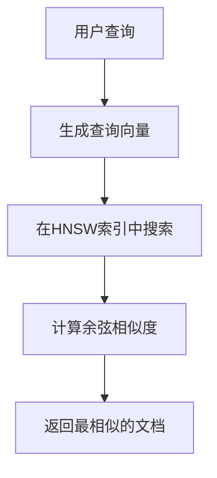

<cite>
**本文档中引用的文件**
- [lib/db/openai/schema.ts](file://lib/db/openai/schema.ts)
- [lib/db/vercelai/schema.ts](file://lib/db/vercelai/schema.ts)
- [lib/db/openai/selectors.ts](file://lib/db/openai/selectors.ts)
- [lib/db/vercelai/selectors.ts](file://lib/db/vercelai/selectors.ts)
</cite>

# 数据库模式设计

## 目录
1. [简介](#简介)
2. [核心表结构](#核心表结构)
3. [向量索引机制](#向量索引机制)
4. [数据隔离与查询性能](#数据隔离与查询性能)
5. [结论](#结论)

## 简介
本文档详细阐述了为支持不同AI框架而设计的数据库模式，重点分析了`openAiEmbeddings`和`vercelAiEmbeddings`两个核心表的结构与索引策略。该设计旨在为基于向量的语义搜索提供高效、可扩展的数据存储与检索能力。

## 核心表结构

系统为OpenAI和Vercel AI框架分别设计了独立的嵌入向量存储表，即`openAiEmbeddings`和`vercelAiEmbeddings`。这两个表具有完全相同的字段结构，体现了高内聚、低耦合的设计原则。

每个表包含三个核心字段：
- **`id`**: 作为主键，其数据类型为`varchar`，长度限制为191。该字段的默认值由`nanoid`函数生成，确保了全局唯一性和安全性。
- **`content`**: 用于存储原始文档或文本片段，数据类型为`text`，且为非空字段，保证了数据的完整性。
- **`embedding`**: 这是核心的向量字段，使用`vector`类型存储1536维的浮点数数组，同样为非空字段。该维度与OpenAI和Vercel AI的文本嵌入模型输出维度保持一致。

这种对称的表结构设计使得系统能够无缝地为两种AI服务提供数据支持，同时保持了代码和逻辑的复用性。

**Section sources**
- [lib/db/openai/schema.ts](file://lib/db/openai/schema.ts#L3-L18)
- [lib/db/vercelai/schema.ts](file://lib/db/vercelai/schema.ts#L3-L18)

## 向量索引机制

为了实现高效的向量相似度搜索，系统在`embedding`字段上创建了专门的HNSW（Hierarchical Navigable Small World）索引。

### HNSW索引
HNSW是一种先进的近似最近邻（ANN）搜索算法，特别适用于高维向量空间。它通过构建多层图结构来实现快速的邻近搜索，其查询时间复杂度远低于传统的线性扫描，尤其在处理大规模向量数据集时性能优势显著。

### 索引配置
- **索引名称**: 分别为`openAiEmbeddingIndex`和`vercelAiEmbeddingIndex`。
- **操作符类**: 使用`vector_cosine_ops`操作符。该操作符针对余弦相似度计算进行了优化，能够高效地计算两个向量之间的夹角余弦值，值越接近1表示向量越相似。
- **索引方法**: 采用`USING hnsw`语法，明确指定使用HNSW算法构建索引。

此索引配置使得系统能够快速执行“查找与给定向量最相似的K个向量”这类查询，是实现语义搜索功能的基石。



**Diagram sources**
- [lib/db/openai/schema.ts](file://lib/db/openai/schema.ts#L12-L18)
- [lib/db/vercelai/schema.ts](file://lib/db/vercelai/schema.ts#L12-L18)

**Section sources**
- [lib/db/openai/schema.ts](file://lib/db/openai/schema.ts#L12-L18)
- [lib/db/vercelai/schema.ts](file://lib/db/vercelai/schema.ts#L12-L18)

## 数据隔离与查询性能

### 数据隔离
将OpenAI和Vercel AI的嵌入数据存储在独立的表中，实现了严格的数据隔离。这种设计的主要优势包括：
1.  **避免数据混淆**: 确保不同AI框架生成的嵌入向量不会混合，保证了搜索结果的准确性和可预测性。
2.  **独立管理**: 可以为每个表独立执行数据维护、备份和清理操作，互不影响。
3.  **权限控制**: 未来可以为不同表设置不同的访问权限，增强数据安全性。

### 查询性能
独立的表结构结合专用的HNSW索引，共同保障了卓越的查询性能：
- **查询范围更小**: 搜索时只需在特定框架的表中进行，数据集规模更小，搜索速度更快。
- **索引效率更高**: 为每个表独立维护的索引更加紧凑，查询效率更高。
- **并行处理**: 系统可以并行处理来自不同AI框架的查询请求，提升整体吞吐量。

`selectors.ts`文件中的`searchSimilarEmbeddings`函数清晰地展示了查询逻辑，它利用Drizzle ORM构建SQL查询，通过`cosineDistance`函数计算距离，并利用`1 - distance`得到相似度，最终按相似度排序并返回结果。

```mermaid
classDiagram
class searchSimilarEmbeddings {
+embedding : number[]
+threshold : number
+topN : number
+return : Promise~{ content : string; similarity : number }[]
+sql similarity
}
```

**Diagram sources**
- [lib/db/openai/selectors.ts](file://lib/db/openai/selectors.ts#L10-L32)
- [lib/db/vercelai/selectors.ts](file://lib/db/vercelai/selectors.ts#L10-L32)

**Section sources**
- [lib/db/openai/selectors.ts](file://lib/db/openai/selectors.ts#L10-L32)
- [lib/db/vercelai/selectors.ts](file://lib/db/vercelai/selectors.ts#L10-L32)

## 结论
该数据库模式设计通过为不同AI框架建立独立的、结构对称的嵌入向量表，并辅以HNSW索引和`vector_cosine_ops`操作符，成功实现了高效、可扩展且安全的语义搜索功能。数据隔离确保了结果的准确性，而专用索引则保证了查询的高性能。这种设计模式为系统未来集成更多AI服务提供了良好的扩展基础。