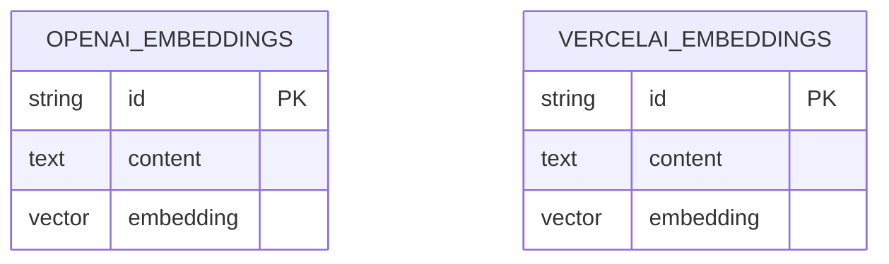
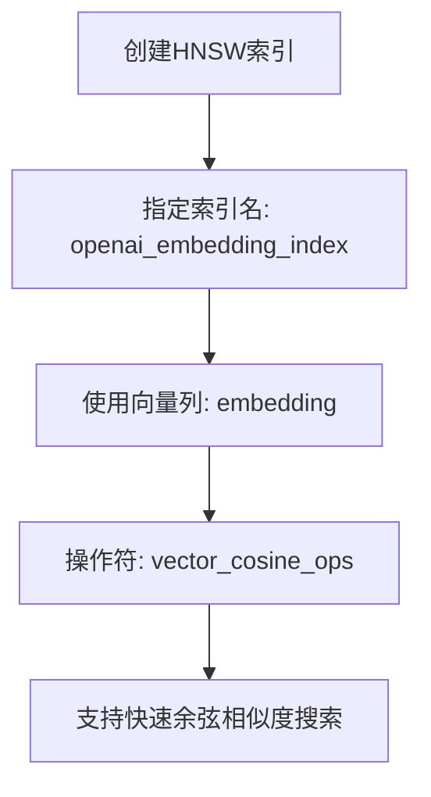

# 表结构设计

<cite>
**本文档引用的文件**  
- [lib/db/openai/schema.ts](file://lib/db/openai/schema.ts)
- [lib/db/vercelai/schema.ts](file://lib/db/vercelai/schema.ts)
- [lib/db/openai/selectors.ts](file://lib/db/openai/selectors.ts)
- [lib/db/vercelai/selectors.ts](file://lib/db/vercelai/selectors.ts)
</cite>

## 目录
1. [引言](#引言)
2. [核心表结构定义](#核心表结构定义)
3. [字段设计意图详解](#字段设计意图详解)
4. [数据隔离与架构设计](#数据隔离与架构设计)
5. [索引与查询优化](#索引与查询优化)
6. [类型安全与开发优势](#类型安全与开发优势)
7. [对称设计与模块化思想](#对称设计与模块化思想)
8. [结论](#结论)

## 引言

本文档详细阐述了项目中用于支持AI语义搜索功能的数据库表结构设计，聚焦于`lib/db/openai/schema.ts`和`lib/db/vercelai/schema.ts`两个核心文件中定义的`openAiEmbeddings`和`vercelAiEmbeddings`表。该设计旨在为基于向量嵌入（Embedding）的检索增强生成（RAG）系统提供高效、可靠的数据存储基础。通过分析其字段构成、索引策略和整体架构，本文揭示了其在数据隔离、性能优化和可维护性方面的设计考量。

**Section sources**
- [lib/db/openai/schema.ts](file://lib/db/openai/schema.ts#L1-L20)
- [lib/db/vercelai/schema.ts](file://lib/db/vercelai/schema.ts#L1-L20)

## 核心表结构定义

系统为两个不同的AI框架——OpenAI和Vercel AI——分别定义了独立的数据库表。这种设计并非冗余，而是出于对数据隔离和框架独立性的明确考量。

**Diagram sources**
- [lib/db/openai/schema.ts](file://lib/db/openai/schema.ts#L3-L18)
- [lib/db/vercelai/schema.ts](file://lib/db/vercelai/schema.ts#L3-L18)

**Section sources**
- [lib/db/openai/schema.ts](file://lib/db/openai/schema.ts#L3-L18)
- [lib/db/vercelai/schema.ts](file://lib/db/vercelai/schema.ts#L3-L18)

## 字段设计意图详解

### id 字段
`id`字段被设计为`varchar`类型，长度为191，作为主键。其值通过`nanoid()`函数生成。`nanoid`是一种现代的、URL安全的唯一标识符生成算法，相较于传统的UUID，它生成的ID更短、更具可读性，同时保持了极低的碰撞概率。更重要的是，`nanoid`是无状态的，非常适合在分布式系统中使用，无需中心化的ID生成服务，从而增强了系统的可扩展性和部署灵活性。

### content 字段
`content`字段为`text`类型，用于存储原始文档片段的文本内容。这是RAG流程中的关键部分。当AI模型生成响应时，系统会通过向量相似度搜索找到与用户查询最相关的`content`，并将这些内容作为上下文注入到提示词（Prompt）中，使模型能够基于这些具体信息生成更准确、更有依据的回答。

### embedding 字段
`embedding`字段是`vector`类型，维度固定为1536。这个维度是OpenAI的`text-embedding-ada-002`模型的输出特征长度。该字段存储了将`content`文本通过嵌入模型转换后的高维向量。向量数据库利用这些向量进行高效的相似度计算（如余弦相似度），以实现语义层面的搜索，而非简单的关键词匹配。

**Section sources**
- [lib/db/openai/schema.ts](file://lib/db/openai/schema.ts#L6-L10)
- [lib/db/vercelai/schema.ts](file://lib/db/vercelai/schema.ts#L6-L10)

## 数据隔离与架构设计

为OpenAI和Vercel AI创建独立的表结构是一项关键的架构决策，其背后有深刻的技术原因：

1.  **避免向量空间混淆**：尽管Vercel AI可能也使用与OpenAI兼容的嵌入模型，但不同框架或模型版本生成的向量可能存在于不同的向量空间中。将它们混合存储会导致相似度计算结果失真，因为比较不同空间的向量没有意义。独立的表确保了搜索查询只在语义一致的向量空间内进行。
2.  **支持独立的配置与更新**：两个AI框架可能有不同的嵌入模型配置、更新周期或性能要求。独立的表结构允许团队独立地为每个框架优化数据库模式、索引策略和数据处理流程，而不会相互影响。例如，可以为`openAiEmbeddings`表使用特定的HNSW索引参数，而为`vercelAiEmbeddings`表使用另一套参数。
3.  **清晰的职责分离**：这种设计遵循了关注点分离原则。`openai`目录下的所有文件（`schema.ts`, `actions.ts`, `selectors.ts`）共同构成了一个内聚的模块，专门处理与OpenAI相关的数据。`vercelai`目录同理。这极大地提高了代码的可维护性和可理解性。

**Section sources**
- [lib/db/openai/schema.ts](file://lib/db/openai/schema.ts#L3-L18)
- [lib/db/vercelai/schema.ts](file://lib/db/vercelai/schema.ts#L3-L18)

## 索引与查询优化

为了实现高效的向量相似度搜索，两个表都定义了专门的索引。

**Diagram sources**
- [lib/db/openai/schema.ts](file://lib/db/openai/schema.ts#L13-L17)
- [lib/db/vercelai/schema.ts](file://lib/db/vercelai/schema.ts#L13-L17)

在`schema.ts`文件中，通过`index()`函数创建了名为`openai_embedding_index`和`vercel_ai_embedding_index`的索引。该索引使用了`hnsw`（Hierarchical Navigable Small World）算法，这是一种高效的近似最近邻（ANN）搜索算法，特别适合高维向量。`t.embedding.op('vector_cosine_ops')`指定了使用余弦距离作为相似度度量标准，这与语义搜索的需求完美契合。

`selectors.ts`文件中的`searchSimilarEmbeddings`函数展示了如何利用这个索引：
1.  使用`cosineDistance`函数计算查询向量与数据库中所有向量的余弦距离。
2.  将距离转换为相似度（`1 - 距离`）。
3.  通过`WHERE`子句过滤出相似度高于阈值的结果。
4.  使用`ORDER BY`按相似度降序排列。
5.  使用`LIMIT`返回最相关的前N个结果。

**Section sources**
- [lib/db/openai/schema.ts](file://lib/db/openai/schema.ts#L13-L17)
- [lib/db/vercelai/schema.ts](file://lib/db/vercelai/schema.ts#L13-L17)
- [lib/db/openai/selectors.ts](file://lib/db/openai/selectors.ts#L1-L32)
- [lib/db/vercelai/selectors.ts](file://lib/db/vercelai/selectors.ts#L1-L32)

## 类型安全与开发优势

项目采用了Drizzle ORM，这为数据库操作带来了显著的类型安全优势。在`schema.ts`中定义的表结构会自动生成TypeScript类型。这意味着在`selectors.ts`等文件中编写数据库查询时，IDE能够提供精确的自动补全，并在编译时检查字段名、参数类型等是否正确。例如，`db.select({ content: openAiEmbeddings.content, similarity })`这行代码，其返回结果的类型会被自动推断为`Array<{ content: string; similarity: number }>`，极大地减少了因拼写错误或类型不匹配导致的运行时错误，提升了开发效率和代码质量。

**Section sources**
- [lib/db/openai/schema.ts](file://lib/db/openai/schema.ts#L3-L18)
- [lib/db/openai/selectors.ts](file://lib/db/openai/selectors.ts#L1-L32)

## 对称设计与模块化思想

`openAiEmbeddings`和`vercelAiEmbeddings`两个表的结构高度对称，这并非巧合，而是体现了清晰的模块化架构思想。`openai`和`vercelai`两个目录是完全对等的模块。每个模块都包含自己的`schema.ts`（定义数据结构）、`actions.ts`（定义数据操作）和`selectors.ts`（定义数据查询）。这种“模块即功能域”的设计使得系统具有极强的可扩展性。如果未来需要集成第三个AI框架（如Anthropic AI），只需在`lib/db/`下创建一个新的`anthropicai`目录，并复制相同的文件结构和模式，即可快速完成集成，而无需修改现有代码，充分体现了高内聚、低耦合的设计原则。

**Section sources**
- [lib/db/openai/schema.ts](file://lib/db/openai/schema.ts#L3-L18)
- [lib/db/vercelai/schema.ts](file://lib/db/vercelai/schema.ts#L3-L18)
- [lib/db/openai/selectors.ts](file://lib/db/openai/selectors.ts#L1-L32)
- [lib/db/vercelai/selectors.ts](file://lib/db/vercelai/selectors.ts#L1-L32)

## 结论

综上所述，该项目的数据库表结构设计是深思熟虑的结果。通过为不同AI框架创建独立的、结构对称的表，系统实现了数据隔离、避免了向量空间混淆，并支持独立的配置管理。`nanoid`、`text`和`1536维vector`的字段设计精准地满足了RAG系统的需求。结合HNSW索引和Drizzle ORM的类型安全特性，该设计不仅保证了语义搜索的高性能，也极大地提升了代码的可维护性和开发体验。这种模块化、可扩展的架构为未来集成更多AI能力奠定了坚实的基础。