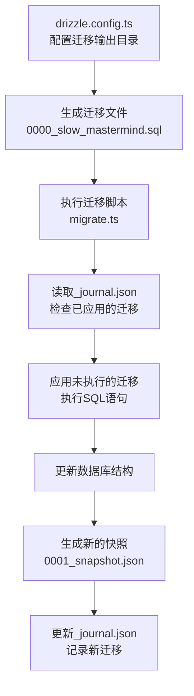

<cite>
**本文档中引用的文件**   
- [migrate.ts](file://lib/db/migrate.ts)
- [0000_slow_mastermind.sql](file://lib/db/migrations/0000_slow_mastermind.sql)
- [0001_cold_tyrannus.sql](file://lib/db/migrations/0001_cold_tyrannus.sql)
- [drizzle.config.ts](file://drizzle.config.ts)
- [0000_snapshot.json](file://lib/db/migrations/meta/0000_snapshot.json)
- [0001_snapshot.json](file://lib/db/migrations/meta/0001_snapshot.json)
- [_journal.json](file://lib/db/migrations/meta/_journal.json)
</cite>

## 目录
1. [引言](#引言)
2. [迁移脚本执行流程](#迁移脚本执行流程)
3. [迁移文件与版本控制](#迁移文件与版本控制)
4. [快照与元数据管理](#快照与元数据管理)
5. [错误处理与日志记录](#错误处理与日志记录)
6. [开发实践指南](#开发实践指南)
7. [结论](#结论)

## 引言
本文档深入分析项目中的数据库迁移机制，重点阐述`lib/db/migrate.ts`脚本的执行流程。数据库迁移是确保开发、测试和生产环境数据库结构一致性的关键过程。本系统采用Drizzle ORM进行迁移管理，通过版本化的SQL文件来追踪和应用数据库模式变更。文档将详细说明迁移的触发、执行、日志记录、错误处理以及与快照（snapshot）的关联，为开发者提供安全操作数据库结构的指导。

## 迁移脚本执行流程
`lib/db/migrate.ts`是数据库迁移的核心执行脚本。其流程始于读取`DATABASE_URL`环境变量以建立与PostgreSQL数据库的临时连接。该脚本使用`postgres`客户端库创建一个最大连接数为1的连接池，确保迁移过程的独占性。

一旦连接建立，脚本通过Drizzle ORM的`drizzle()`函数创建数据库实例。随后，脚本记录迁移开始时间，并调用`migrate()`函数，指定`lib/db/migrations`为迁移文件目录。`migrate()`函数会智能地读取`_journal.json`元数据文件，确定哪些迁移文件尚未应用，并按版本顺序执行它们。迁移完成后，脚本计算并输出总耗时，最后正常退出进程。

**Section sources**
- [migrate.ts](file://lib/db/migrate.ts#L6-L26)

## 迁移文件与版本控制
迁移文件是定义数据库模式变更的SQL脚本，位于`lib/db/migrations`目录下。每个文件以`<版本号>_<描述>.sql`的格式命名，例如`0000_slow_mastermind.sql`和`0001_cold_tyrannus.sql`。这种命名约定确保了迁移文件按字典序执行，从而维护了变更的顺序性。

每个迁移文件包含标准的SQL DDL（数据定义语言）语句。例如，`0000_slow_mastermind.sql`创建了`open_ai_embeddings`表及其向量索引，而`0001_cold_tyrannus.sql`则创建了`vercel_ai_embeddings`表。`--> statement-breakpoint`注释用于分隔不同的SQL语句，这是Drizzle ORM迁移工具的要求。

**Section sources**
- [0000_slow_mastermind.sql](file://lib/db/migrations/0000_slow_mastermind.sql)
- [0001_cold_tyrannus.sql](file://lib/db/migrations/0001_cold_tyrannus.sql)

## 快照与元数据管理
Drizzle ORM利用快照（snapshot）机制来管理数据库的预期状态。`lib/db/migrations/meta`目录下的`0000_snapshot.json`和`0001_snapshot.json`文件分别记录了在应用`0000`和`0001`迁移后的数据库完整结构。这些JSON文件包含了表、列、索引、主键等所有元数据。

`_journal.json`文件是迁移历史的记录。它按时间顺序列出了所有已应用的迁移，包括版本号、时间戳和标签（即文件名）。`migrate()`函数在执行前会读取此文件，以确定下一个需要应用的迁移，从而避免重复执行。

`drizzle.config.ts`配置文件定义了迁移的输出目录（`out`）和模式文件的来源（`schema`），是整个迁移系统的基础配置。

**Diagram sources**
- [drizzle.config.ts](file://drizzle.config.ts#L1-L13)
- [migrate.ts](file://lib/db/migrate.ts#L6-L26)
- [_journal.json](file://lib/db/migrations/meta/_journal.json)

**Section sources**
- [drizzle.config.ts](file://drizzle.config.ts#L1-L13)
- [0000_snapshot.json](file://lib/db/migrations/meta/0000_snapshot.json)
- [0001_snapshot.json](file://lib/db/migrations/meta/0001_snapshot.json)
- [_journal.json](file://lib/db/migrations/meta/_journal.json)

## 错误处理与日志记录
迁移脚本实现了健壮的错误处理机制。在执行开始时，脚本会检查`DATABASE_URL`环境变量是否存在，若缺失则立即抛出错误并终止。在`runMigrate`函数外层，使用`.catch()`捕获所有异步错误。一旦迁移过程中的任何步骤失败（如连接数据库失败、SQL语法错误等），脚本会输出`❌ Migration failed`的错误标志和具体的错误信息到控制台，并以退出码1终止进程，确保失败的迁移不会被忽略。

日志记录清晰地标识了迁移的各个阶段：使用`⏳ Running migrations...`表示开始，使用`✅ Migrations completed in X ms`表示成功完成，并附带执行耗时。这种设计便于开发者快速判断迁移状态。

**Section sources**
- [migrate.ts](file://lib/db/migrate.ts#L6-L33)

## 开发实践指南
开发者在添加新迁移时，应使用Drizzle CLI生成新的迁移文件，该文件会自动以递增的版本号命名。在编写SQL时，应确保语句的幂等性（如使用`IF NOT EXISTS`），以防止重复执行时出错。

若需回滚问题迁移，由于Drizzle ORM的`migrate()`函数不支持自动回滚，开发者必须手动编写一个反向的迁移文件（例如，`0002_rollback_cold_tyrannus.sql`），其中包含`DROP TABLE`等撤销操作的SQL语句，并将其提交到版本控制系统。在生产环境中应用迁移前，务必在预发布环境中进行充分测试，并备份数据库。

## 结论
本项目通过`lib/db/migrate.ts`脚本和Drizzle ORM提供了一套可靠、可追溯的数据库迁移机制。通过环境变量管理连接、版本化SQL文件控制变更、JSON快照和日志文件记录状态，系统确保了数据库结构变更的安全性和一致性。开发者应遵循最佳实践，谨慎管理迁移，以维护数据的完整性和应用的稳定性。