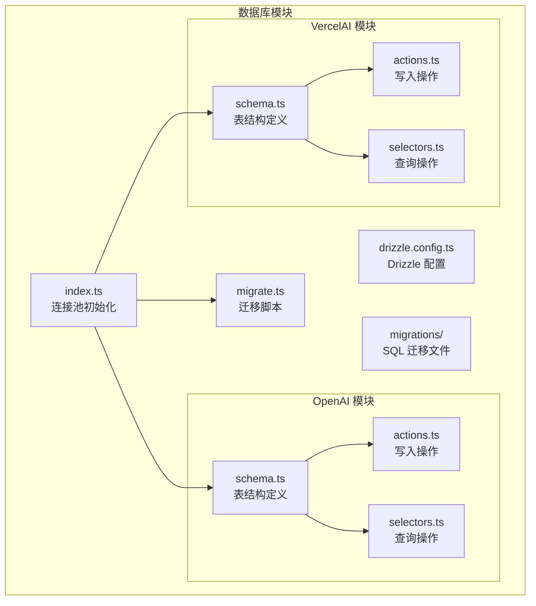
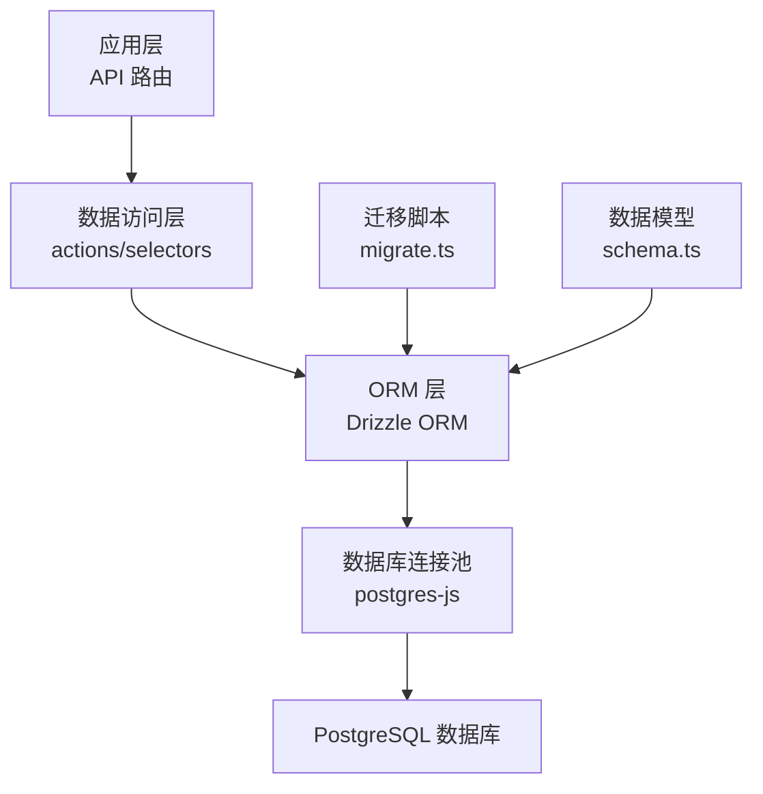
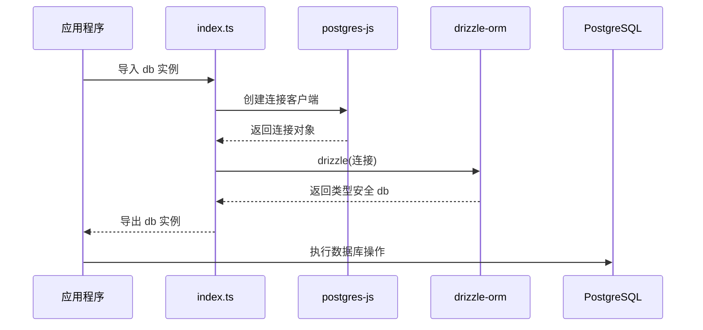
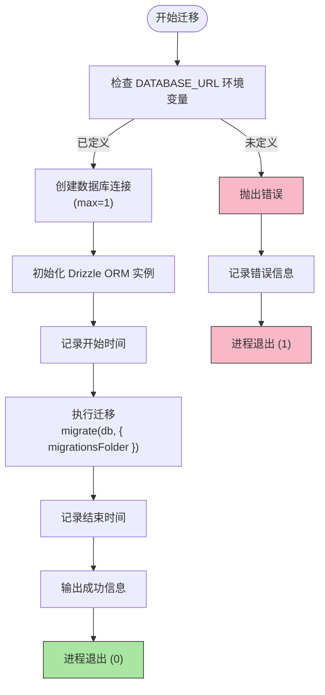
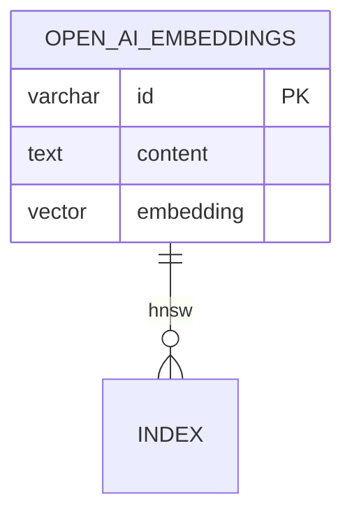
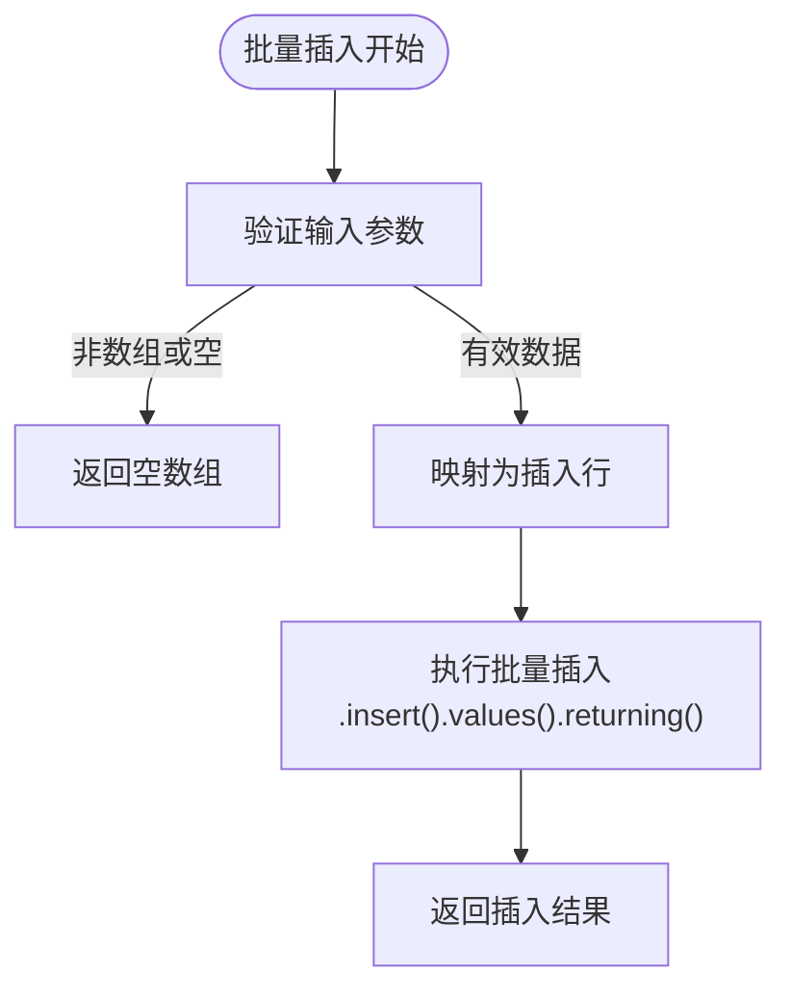
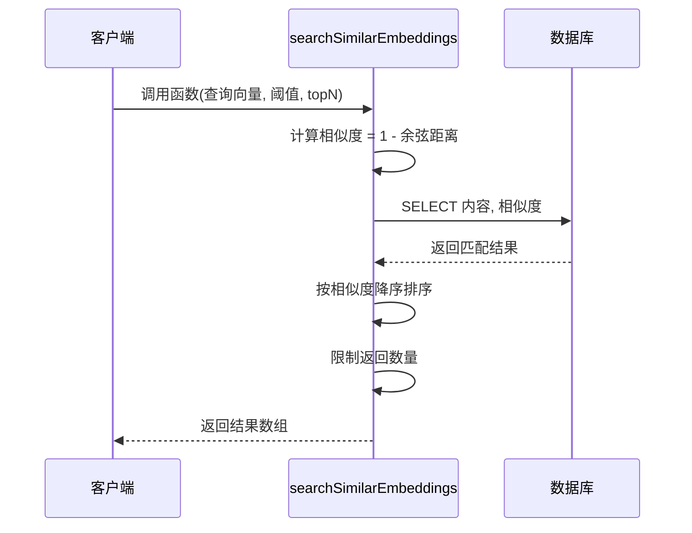
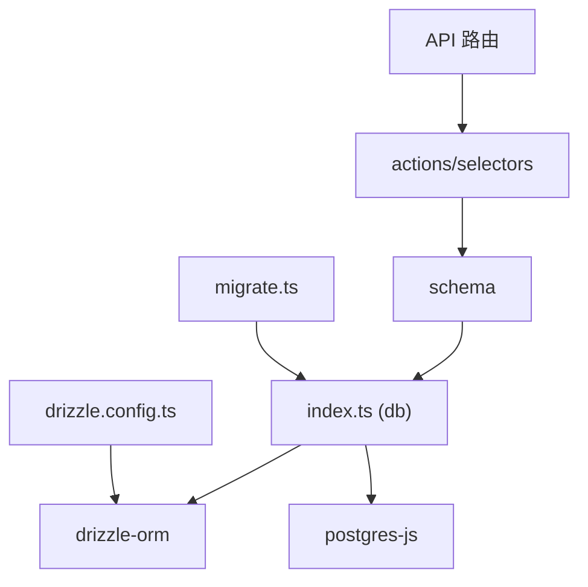

# 数据库集成

<cite>
**本文档引用的文件**  
- [lib/db/index.ts](file://lib/db/index.ts)
- [lib/db/migrate.ts](file://lib/db/migrate.ts)
- [lib/db/openai/schema.ts](file://lib/db/openai/schema.ts)
- [lib/db/openai/actions.ts](file://lib/db/openai/actions.ts)
- [lib/db/openai/selectors.ts](file://lib/db/openai/selectors.ts)
- [lib/db/vercelai/schema.ts](file://lib/db/vercelai/schema.ts)
- [lib/db/vercelai/actions.ts](file://lib/db/vercelai/actions.ts)
- [lib/db/vercelai/selectors.ts](file://lib/db/vercelai/selectors.ts)
- [drizzle.config.ts](file://drizzle.config.ts)
</cite>

## 目录
1. [简介](#简介)
2. [项目结构](#项目结构)
3. [核心组件](#核心组件)
4. [架构概览](#架构概览)
5. [详细组件分析](#详细组件分析)
6. [依赖分析](#依赖分析)
7. [性能考虑](#性能考虑)
8. [故障排除指南](#故障排除指南)
9. [结论](#结论)

## 简介
本文档全面介绍项目中基于 Drizzle ORM 的数据库集成方案，重点阐述数据库连接池初始化、类型安全的数据访问、迁移管理、表结构设计以及数据读写操作的最佳实践。系统利用 PostgreSQL 作为底层数据库，并结合向量嵌入实现语义搜索功能，支持 OpenAI 和 Vercel AI 两种嵌入模型的数据存储与检索。

## 项目结构
项目数据库相关代码集中于 `lib/db` 目录下，采用模块化组织方式，按功能划分命名空间（如 `openai`、`vercelai`），确保逻辑隔离与可维护性。

**图示来源**  
- [lib/db/index.ts](file://lib/db/index.ts#L1-L7)
- [lib/db/migrate.ts](file://lib/db/migrate.ts#L1-L33)
- [lib/db/openai/schema.ts](file://lib/db/openai/schema.ts#L1-L19)
- [lib/db/vercelai/schema.ts](file://lib/db/vercelai/schema.ts#L1-L19)

**本节来源**  
- [lib/db/index.ts](file://lib/db/index.ts#L1-L7)
- [lib/db/migrate.ts](file://lib/db/migrate.ts#L1-L33)
- [drizzle.config.ts](file://drizzle.config.ts#L1-L20)

## 核心组件
系统通过 Drizzle ORM 实现类型安全的数据库交互，主要包含以下核心组件：
- **数据库连接管理**：在 `index.ts` 中初始化连接池
- **迁移系统**：通过 `migrate.ts` 执行数据库版本升级
- **数据模型定义**：在各模块 `schema.ts` 中声明表结构
- **数据访问层**：`actions.ts` 负责写入，`selectors.ts` 负责读取

**本节来源**  
- [lib/db/index.ts](file://lib/db/index.ts#L1-L7)
- [lib/db/migrate.ts](file://lib/db/migrate.ts#L1-L33)
- [lib/db/openai/schema.ts](file://lib/db/openai/schema.ts#L1-L19)

## 架构概览
系统采用分层架构设计，确保数据访问的安全性与可扩展性。

**图示来源**  
- [lib/db/index.ts](file://lib/db/index.ts#L1-L7)
- [lib/db/migrate.ts](file://lib/db/migrate.ts#L6-L26)
- [lib/db/openai/actions.ts](file://lib/db/openai/actions.ts#L9-L20)
- [lib/db/openai/selectors.ts](file://lib/db/openai/selectors.ts#L11-L31)

## 详细组件分析

### 数据库连接初始化分析
`lib/db/index.ts` 文件负责创建全局数据库实例，使用 `postgres-js` 作为底层驱动，通过 `drizzle()` 函数包装为类型安全的 ORM 实例。

**图示来源**  
- [lib/db/index.ts](file://lib/db/index.ts#L1-L7)

**本节来源**  
- [lib/db/index.ts](file://lib/db/index.ts#L1-L7)

### 迁移脚本工作流程分析
`migrate.ts` 脚本用于执行数据库迁移，确保模式变更的安全性和可追溯性。

**图示来源**  
- [lib/db/migrate.ts](file://lib/db/migrate.ts#L6-L26)

**本节来源**  
- [lib/db/migrate.ts](file://lib/db/migrate.ts#L1-L33)

### 表结构设计分析
以 `openai/schema.ts` 为例，系统定义了向量嵌入表，支持高效的语义搜索。

字段说明：
- **id**: 使用 `nanoid()` 生成唯一主键
- **content**: 存储原始文本内容，不可为空
- **embedding**: 向量类型，维度为 1536（对应 OpenAI 模型）
- **索引**: 在 `embedding` 字段上建立 HNSW 索引，使用 `vector_cosine_ops` 操作符优化余弦相似度计算

**图示来源**  
- [lib/db/openai/schema.ts](file://lib/db/openai/schema.ts#L5-L19)

**本节来源**  
- [lib/db/openai/schema.ts](file://lib/db/openai/schema.ts#L1-L19)
- [lib/db/vercelai/schema.ts](file://lib/db/vercelai/schema.ts#L1-L19)

### 数据访问层分析

#### 写入操作分析
`actions.ts` 中的 `insertOpenAiEmbeddings` 函数实现批量插入功能。

**图示来源**  
- [lib/db/openai/actions.ts](file://lib/db/openai/actions.ts#L9-L20)

**本节来源**  
- [lib/db/openai/actions.ts](file://lib/db/openai/actions.ts#L1-L21)
- [lib/db/vercelai/actions.ts](file://lib/db/vercelai/actions.ts#L1-L21)

#### 读取操作分析
`selectors.ts` 中的 `searchSimilarEmbeddings` 函数实现基于向量的语义搜索。

**图示来源**  
- [lib/db/openai/selectors.ts](file://lib/db/openai/selectors.ts#L11-L31)

**本节来源**  
- [lib/db/openai/selectors.ts](file://lib/db/openai/selectors.ts#L1-L32)
- [lib/db/vercelai/selectors.ts](file://lib/db/vercelai/selectors.ts#L1-L32)

## 依赖分析
系统依赖关系清晰，层次分明。

**图示来源**  
- [lib/db/index.ts](file://lib/db/index.ts#L1-L7)
- [lib/db/migrate.ts](file://lib/db/migrate.ts#L1-L33)
- [lib/db/openai/actions.ts](file://lib/db/openai/actions.ts#L9-L20)
- [lib/db/openai/selectors.ts](file://lib/db/openai/selectors.ts#L11-L31)

**本节来源**  
- [lib/db/index.ts](file://lib/db/index.ts#L1-L7)
- [lib/db/migrate.ts](file://lib/db/migrate.ts#L1-L33)
- [lib/db/openai/actions.ts](file://lib/db/openai/actions.ts#L1-L21)
- [lib/db/openai/selectors.ts](file://lib/db/openai/selectors.ts#L1-L32)

## 性能考虑
- **连接池管理**：生产环境中建议调整 `max` 连接数以适应负载
- **向量索引**：HNSW 索引显著提升高维向量的相似度搜索效率
- **批量操作**：写入采用批量插入减少网络往返开销
- **类型安全**：Drizzle ORM 编译时检查避免运行时 SQL 错误

## 故障排除指南
常见问题及解决方案：

| 问题现象 | 可能原因 | 解决方案 |
|--------|--------|--------|
| 迁移失败 | DATABASE_URL 未设置 | 检查环境变量配置 |
| 迁移超时 | 连接数限制过低 | 调整 `max` 参数或优化迁移脚本 |
| 搜索性能差 | 未正确建立向量索引 | 确认 HNSW 索引已创建 |
| 插入失败 | 向量维度不匹配 | 确保 embedding 数组长度为 1536 |

**本节来源**  
- [lib/db/migrate.ts](file://lib/db/migrate.ts#L1-L33)
- [lib/db/openai/schema.ts](file://lib/db/openai/schema.ts#L1-L19)
- [lib/db/openai/actions.ts](file://lib/db/openai/actions.ts#L1-L21)

## 结论
本项目通过 Drizzle ORM 实现了类型安全、可维护的数据库集成方案。系统具备以下优势：
- 基于连接池的高效数据库访问
- 自动化迁移管理确保模式一致性
- 向量索引支持高效的语义搜索
- 清晰的读写分离架构
- 完整的错误处理与日志记录

建议在生产环境中进一步优化连接池参数，并定期监控向量索引性能。