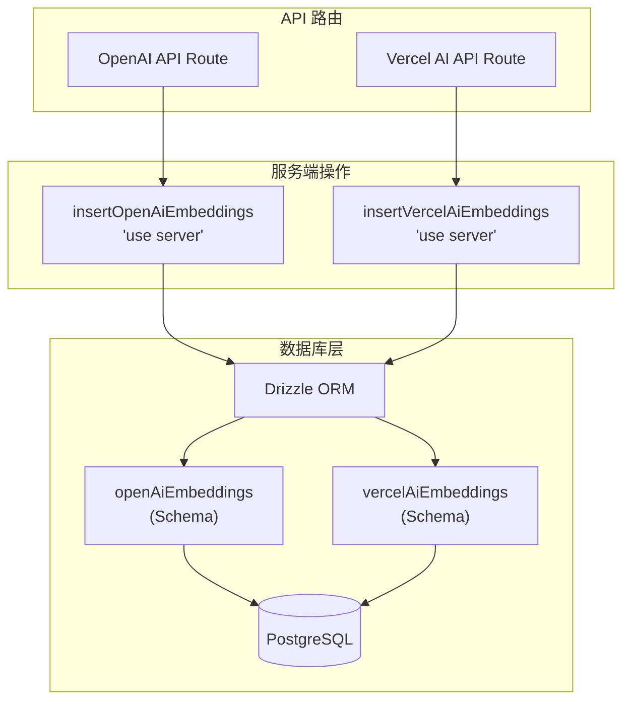
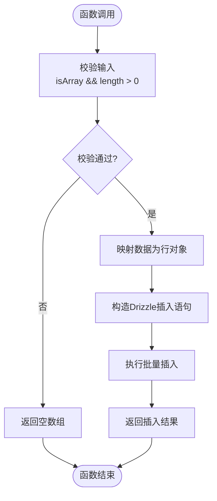
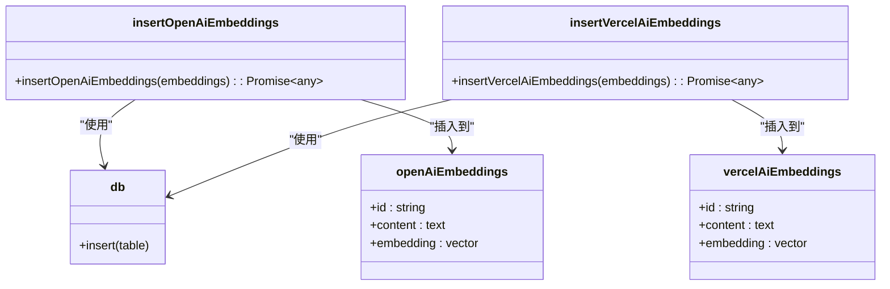

# 数据写入操作

<cite>
**Referenced Files in This Document**  
- [actions.ts](file://lib/db/openai/actions.ts)
- [actions.ts](file://lib/db/vercelai/actions.ts)
- [schema.ts](file://lib/db/openai/schema.ts)
- [schema.ts](file://lib/db/vercelai/schema.ts)
- [route.ts](file://app/api/openai/route.ts)
- [route.ts](file://app/api/vercelai/route.ts)
- [index.ts](file://lib/db/index.ts)
</cite>

## 目录
1. [简介](#简介)
2. [核心组件](#核心组件)
3. [架构概览](#架构概览)
4. [详细组件分析](#详细组件分析)
5. [依赖分析](#依赖分析)
6. [调用流程对比](#调用流程对比)
7. [结论](#结论)

## 简介
本文档详细说明了 `insertOpenAiEmbeddings` 和 `insertVercelAiEmbeddings` 两个服务端操作的实现机制。这两个函数是系统中负责将嵌入向量数据持久化到数据库的核心组件，采用统一的设计模式但服务于不同的AI平台数据源。文档将深入解析其安全执行机制、数据校验逻辑、批量插入实现，并通过实际调用示例展示其在API路由中的集成方式。

## 核心组件
`insertOpenAiEmbeddings` 和 `insertVercelAiEmbeddings` 是两个功能对称的服务端操作函数，分别位于 `lib/db/openai/actions.ts` 和 `lib/db/vercelai/actions.ts` 文件中。它们接收标准化的嵌入向量数组，执行基础校验后，利用Drizzle ORM进行批量数据库插入。两者共享相同的函数签名和处理逻辑，体现了代码的高复用性，同时通过隔离的数据库表实现了数据源的物理分离。

**Section sources**
- [actions.ts](file://lib/db/openai/actions.ts#L9-L20)
- [actions.ts](file://lib/db/vercelai/actions.ts#L9-L20)

## 架构概览


**Diagram sources**
- [actions.ts](file://lib/db/openai/actions.ts)
- [actions.ts](file://lib/db/vercelai/actions.ts)
- [schema.ts](file://lib/db/openai/schema.ts)
- [schema.ts](file://lib/db/vercelai/schema.ts)

## 详细组件分析

### Server Action 实现机制
`insertOpenAiEmbeddings` 和 `insertVercelAiEmbeddings` 函数均以 `'use server'` 指令开头，这是Next.js中定义Server Action的关键标识。此指令确保函数逻辑仅在服务端执行，即使它可能被客户端组件调用。这从根本上防止了客户端直接访问数据库或执行敏感操作，有效规避了安全风险。

函数接收一个泛型数组 `Array<{ embedding: number[]; content: string }>` 作为参数。在执行插入前，会进行空值和类型校验：检查传入参数是否为非空数组。若校验失败，则直接返回空数组，避免了无效的数据库操作。

**Section sources**
- [actions.ts](file://lib/db/openai/actions.ts#L9-L12)
- [actions.ts](file://lib/db/vercelai/actions.ts#L9-L12)

### Drizzle ORM 批量插入
通过Drizzle ORM构造批量插入语句是这两个函数的核心。函数将传入的嵌入向量数组映射为符合数据库表结构的行数据对象数组。随后，调用 `db.insert(table).values(rows).returning()` 链式方法。`db` 对象是全局的Drizzle数据库实例，`table` 分别指向 `openAiEmbeddings` 或 `vercelAiEmbeddings` 表。`values(rows)` 指定要插入的数据，`returning()` 则确保操作完成后返回插入的记录（如主键ID），便于后续处理。



**Diagram sources**
- [actions.ts](file://lib/db/openai/actions.ts#L13-L20)
- [actions.ts](file://lib/db/vercelai/actions.ts#L13-L20)
- [index.ts](file://lib/db/index.ts#L5)

### 实际调用示例
虽然提供的代码片段中未直接展示对这两个函数的调用，但从API路由的结构可以推断其使用场景。例如，在 `app/api/openai/route.ts` 中，`retrieveEmbedding` 函数很可能会在获取到文档内容后，调用 `insertOpenAiEmbeddings` 将新生成的嵌入向量存入数据库。典型的调用方式如下：
```typescript
// 伪代码示例
const embeddings = await generateEmbeddings(documents); // 生成嵌入向量
await insertOpenAiEmbeddings(embeddings); // 持久化存储
```
此过程确保了从AI服务获取的标准化 `embedding` (number数组) 和 `content` (字符串) 数据结构能够被安全、高效地写入数据库。

**Section sources**
- [route.ts](file://app/api/openai/route.ts)
- [route.ts](file://app/api/vercelai/route.ts)

## 依赖分析


**Diagram sources**
- [actions.ts](file://lib/db/openai/actions.ts)
- [actions.ts](file://lib/db/vercelai/actions.ts)
- [schema.ts](file://lib/db/openai/schema.ts)
- [schema.ts](file://lib/db/vercelai/schema.ts)
- [index.ts](file://lib/db/index.ts)

## 调用流程对比
`insertOpenAiEmbeddings` 和 `insertVercelAiEmbeddings` 在实现机制上几乎完全相同，都遵循“校验 -> 映射 -> 批量插入”的流程。它们的主要区别在于数据隔离：
- **数据表不同**：前者操作 `open_ai_embeddings` 表，后者操作 `vercel_ai_embeddings` 表。
- **Schema 不同**：分别由 `lib/db/openai/schema.ts` 和 `lib/db/vercelai/schema.ts` 定义，但表结构完全一致。
- **调用上下文不同**：预期在各自的API路由（`/api/openai` 和 `/api/vercelai`）中被调用，服务于不同的AI平台集成。

这种设计体现了高复用性与强隔离性的权衡。核心逻辑被完美复用，减少了代码冗余和维护成本；同时，通过完全独立的数据库表，确保了不同AI平台的数据互不干扰，便于独立管理、扩展和监控。

**Section sources**
- [actions.ts](file://lib/db/openai/actions.ts)
- [actions.ts](file://lib/db/vercelai/actions.ts)
- [schema.ts](file://lib/db/openai/schema.ts)
- [schema.ts](file://lib/db/vercelai/schema.ts)

## 结论
`insertOpenAiEmbeddings` 和 `insertVercelAiEmbeddings` 是设计精良的服务端操作，它们利用Next.js的Server Action特性保证了执行安全，通过简洁的校验逻辑和Drizzle ORM的批量操作实现了高效的数据持久化。其对称的设计模式展示了在多平台集成场景下，如何通过代码复用提升开发效率，同时通过数据表的物理隔离保障了系统的清晰边界和可维护性。