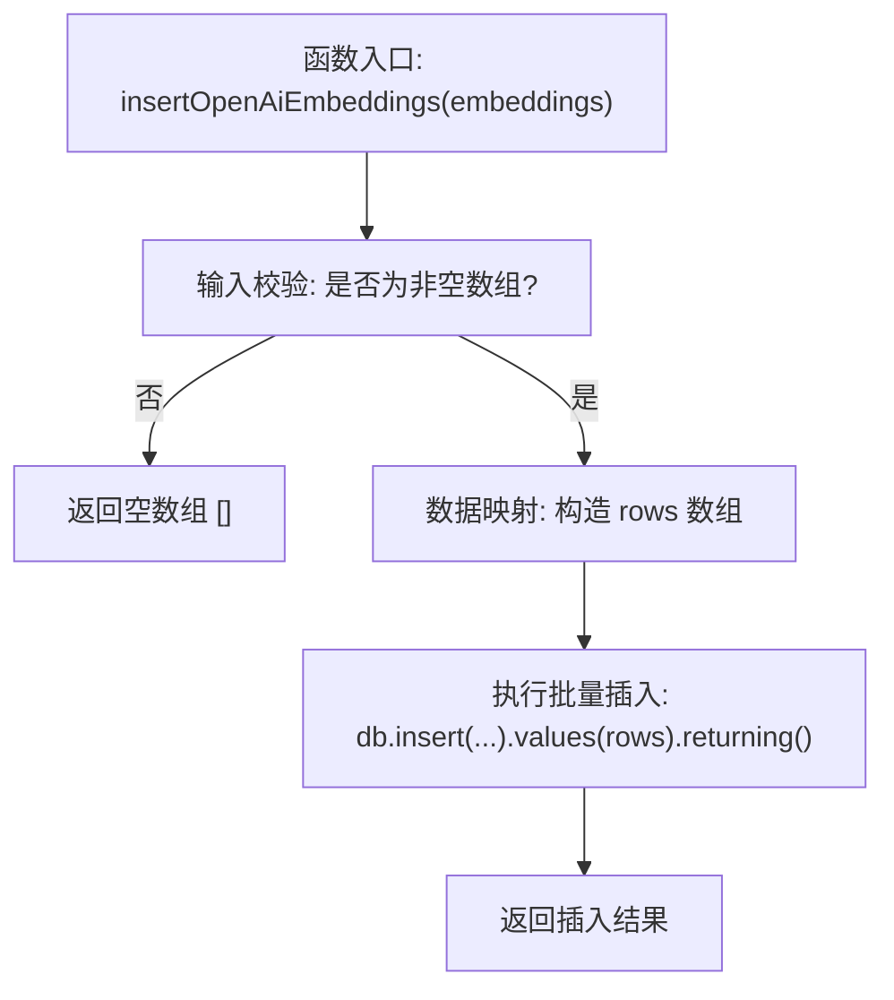
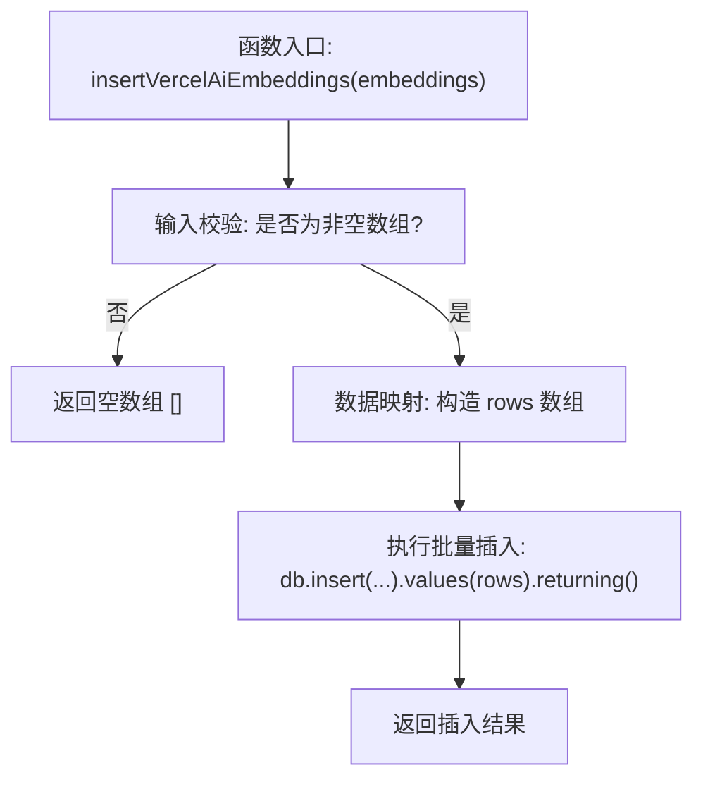
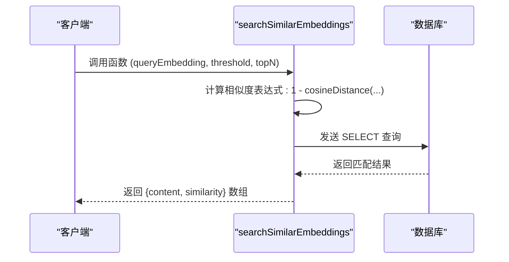
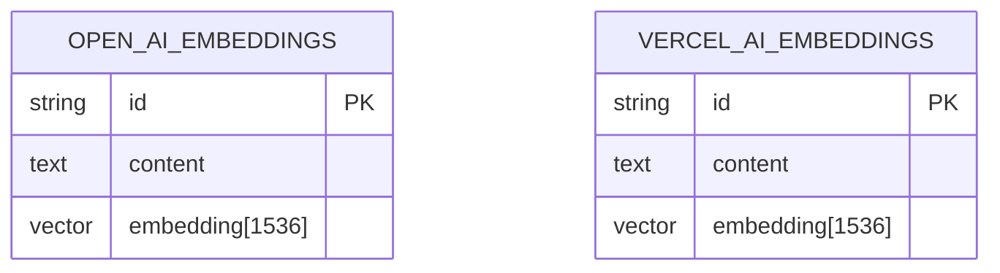
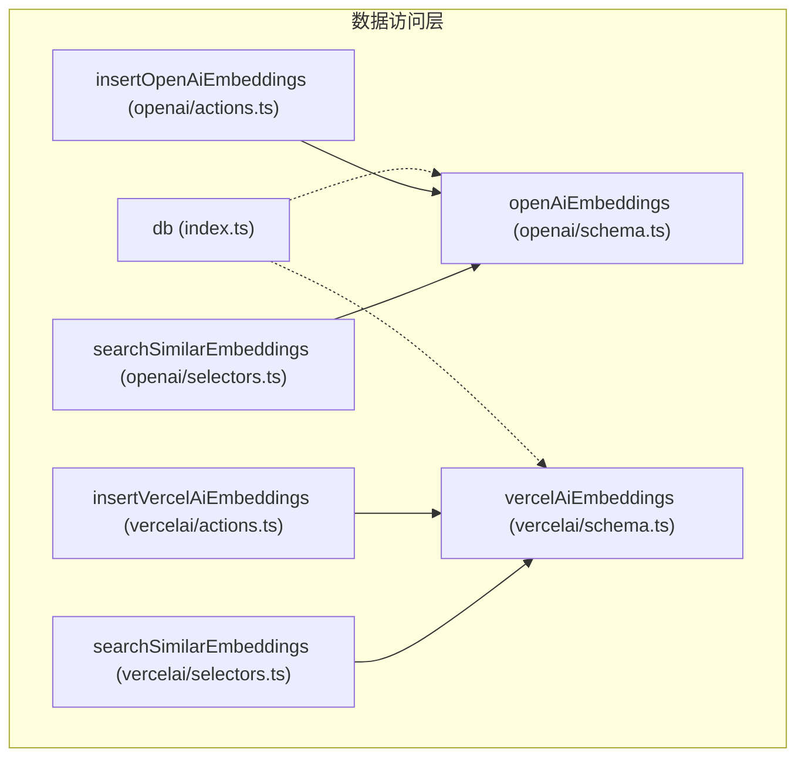

# 数据访问层

<cite>
**Referenced Files in This Document**  
- [actions.ts](file://lib/db/openai/actions.ts)
- [selectors.ts](file://lib/db/openai/selectors.ts)
- [actions.ts](file://lib/db/vercelai/actions.ts)
- [selectors.ts](file://lib/db/vercelai/selectors.ts)
- [schema.ts](file://lib/db/openai/schema.ts)
- [schema.ts](file://lib/db/vercelai/schema.ts)
- [index.ts](file://lib/db/index.ts)
</cite>

## 目录
1. [简介](#简介)
2. [核心功能概览](#核心功能概览)
3. [批量插入向量嵌入](#批量插入向量嵌入)
4. [语义相似度搜索](#语义相似度搜索)
5. [数据库架构与索引](#数据库架构与索引)
6. [数据访问层架构](#数据访问层架构)
7. [扩展与自定义查询](#扩展与自定义查询)
8. [结论](#结论)

## 简介
本文档详细阐述了项目中数据访问层的设计与实现，重点分析了 `actions.ts` 和 `selectors.ts` 文件中的核心功能。该层负责与数据库进行交互，支持基于向量嵌入的语义搜索功能，为上层应用提供高效、安全的数据操作接口。文档深入解析了批量插入和相似度搜索的实现逻辑，并强调了 Server Action 的安全性保障。

## 核心功能概览
数据访问层主要提供两大核心功能：一是批量插入由 OpenAI 或 Vercel AI 生成的向量嵌入数据；二是基于这些嵌入执行高效的语义相似度搜索。该层通过 Drizzle ORM 与 PostgreSQL 数据库交互，并利用其向量扩展能力实现复杂的向量运算。

**Section sources**
- [actions.ts](file://lib/db/openai/actions.ts#L1-L20)
- [selectors.ts](file://lib/db/openai/selectors.ts#L1-L30)

## 批量插入向量嵌入

### OpenAI 嵌入插入
`insertOpenAiEmbeddings` 函数实现了向 `open_ai_embeddings` 表批量插入数据的安全操作。该函数作为 Server Action 运行在服务端，确保了数据库凭证和操作逻辑不会暴露给客户端。

函数首先对输入参数进行校验，检查 `embeddings` 是否为非空数组。随后，它将输入的嵌入对象数组映射为符合数据库表结构的行数据（`rows`）。最后，利用 Drizzle ORM 的 `insert().values().returning()` 链式调用，一次性完成批量插入并返回插入结果。



**Diagram sources**
- [actions.ts](file://lib/db/openai/actions.ts#L9-L20)

**Section sources**
- [actions.ts](file://lib/db/openai/actions.ts#L9-L20)
- [schema.ts](file://lib/db/openai/schema.ts#L5-L19)

### Vercel AI 嵌入插入
`insertVercelAiEmbeddings` 函数的功能与 `insertOpenAiEmbeddings` 完全一致，唯一的区别是其操作的目标表为 `vercel_ai_embeddings`。这体现了代码的可复用性设计，针对不同 AI 服务提供商的嵌入数据，提供了结构相同的独立数据表和操作接口。



**Diagram sources**
- [actions.ts](file://lib/db/vercelai/actions.ts#L9-L20)

**Section sources**
- [actions.ts](file://lib/db/vercelai/actions.ts#L9-L20)
- [schema.ts](file://lib/db/vercelai/schema.ts#L5-L19)

## 语义相似度搜索

### 搜索逻辑解析
`searchSimilarEmbeddings` 函数是实现语义搜索的核心。它接收一个查询向量（`embedding`）、一个相似度阈值（`threshold`）和一个返回结果数量（`topN`），并返回最相似的文本内容及其相似度分数。

其核心逻辑是利用 Drizzle ORM 的 SQL 模板功能构建一个包含 `cosineDistance` 函数的复杂查询。余弦距离衡量两个向量的夹角，距离越小表示越相似。因此，函数通过 `1 - cosineDistance` 将距离转换为相似度（值越大越相似）。



**Diagram sources**
- [selectors.ts](file://lib/db/openai/selectors.ts#L11-L31)
- [selectors.ts](file://lib/db/vercelai/selectors.ts#L11-L31)

### 查询构建过程
该函数的查询构建过程如下：
1.  **定义相似度表达式**：使用 `sql<number>` 模板字面量创建一个计算相似度的表达式。
2.  **构建 SELECT 语句**：选择 `content` 字段和计算出的 `similarity` 字段。
3.  **设置 WHERE 条件**：使用 `sql` 模板字面量将相似度表达式作为条件，筛选出相似度大于阈值的结果。
4.  **排序与限制**：按相似度降序排列，并使用 `limit(topN)` 限制返回结果数量。

**Section sources**
- [selectors.ts](file://lib/db/openai/selectors.ts#L11-L31)
- [selectors.ts](file://lib/db/vercelai/selectors.ts#L11-L31)

## 数据库架构与索引

### 表结构定义
`openAiEmbeddings` 和 `vercelAiEmbeddings` 两个表的结构完全相同，均由 `schema.ts` 文件定义。每个表包含三个字段：
- `id`: 主键，使用 `nanoid` 自动生成。
- `content`: 存储原始文本内容。
- `embedding`: 向量类型字段，维度为 1536（与 OpenAI 和 Vercel AI 的嵌入模型输出一致）。



**Diagram sources**
- [schema.ts](file://lib/db/openai/schema.ts#L5-L19)
- [schema.ts](file://lib/db/vercelai/schema.ts#L5-L19)

### 高效查询索引
为了加速基于向量的相似度搜索，两个表都定义了一个 HNSW（Hierarchical Navigable Small World）索引。该索引专门用于高效处理近似最近邻（ANN）搜索。索引使用 `vector_cosine_ops` 操作符类，针对余弦距离计算进行了优化，极大地提升了 `cosineDistance` 函数的查询性能。

**Section sources**
- [schema.ts](file://lib/db/openai/schema.ts#L15-L19)
- [schema.ts](file://lib/db/vercelai/schema.ts#L15-L19)

## 数据访问层架构

### 整体架构
数据访问层采用分层架构，将数据库连接、表定义和数据操作逻辑清晰地分离。



**Diagram sources**
- [index.ts](file://lib/db/index.ts#L1-L7)
- [schema.ts](file://lib/db/openai/schema.ts#L5-L19)
- [schema.ts](file://lib/db/vercelai/schema.ts#L5-L19)
- [actions.ts](file://lib/db/openai/actions.ts#L9-L20)
- [selectors.ts](file://lib/db/openai/selectors.ts#L11-L31)

### 核心组件
- **`index.ts`**: 提供全局的 `db` 实例，封装了与 PostgreSQL 数据库的连接。
- **`schema.ts`**: 定义数据库表结构和索引。
- **`actions.ts`**: 包含写入操作（如插入），以 Server Action 形式暴露。
- **`selectors.ts`**: 包含读取操作（如搜索），封装复杂的查询逻辑。

**Section sources**
- [index.ts](file://lib/db/index.ts#L1-L7)
- [schema.ts](file://lib/db/openai/schema.ts#L1-L19)
- [actions.ts](file://lib/db/openai/actions.ts#L1-L20)
- [selectors.ts](file://lib/db/openai/selectors.ts#L1-L30)

## 扩展与自定义查询
本数据访问层的设计易于扩展。例如，可以轻松添加新的查询函数来支持不同的距离度量（如欧几里得距离）或更复杂的过滤条件。

**扩展示例**：添加一个按内容关键词过滤的搜索函数。
```typescript
// 可以在 selectors.ts 中新增此函数
export async function searchByKeywordAndSimilarity(
  keyword: string,
  queryEmbedding: number[],
  threshold = 0.75,
  topN = 5
) {
  const similarity = sql<number>`1 - (${cosineDistance(openAiEmbeddings.embedding, queryEmbedding)})`;
  
  return db
    .select({ content: openAiEmbeddings.content, similarity })
    .from(openAiEmbeddings)
    .where(
      sql`${openAiEmbeddings.content} LIKE ${`%${keyword}%`} AND ${similarity} > ${threshold}`
    )
    .orderBy(desc(similarity))
    .limit(topN);
}
```

## 结论
本文档全面解析了数据访问层的实现。通过利用 Next.js 的 Server Action（`'use server'`）和 Drizzle ORM 的强大功能，该层实现了安全、高效且可维护的向量数据管理。`insertOpenAiEmbeddings` 和 `insertVercelAiEmbeddings` 函数确保了数据写入的安全性与效率，而 `searchSimilarEmbeddings` 函数则通过精心构建的 SQL 查询和 HNSW 索引，实现了高性能的语义搜索。整体架构清晰，为未来的功能扩展奠定了坚实的基础。