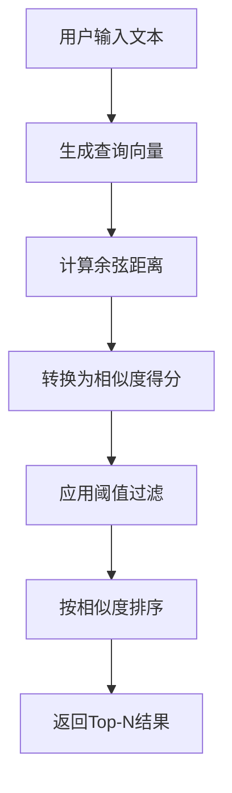
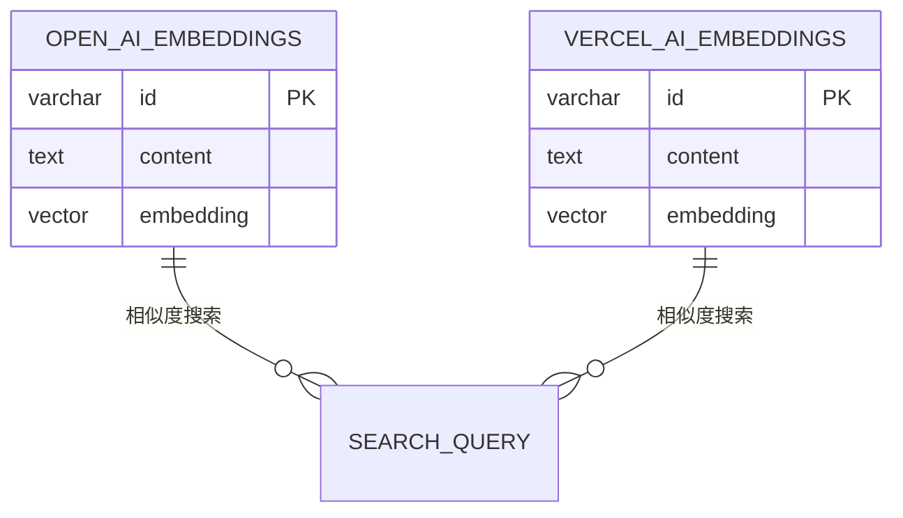
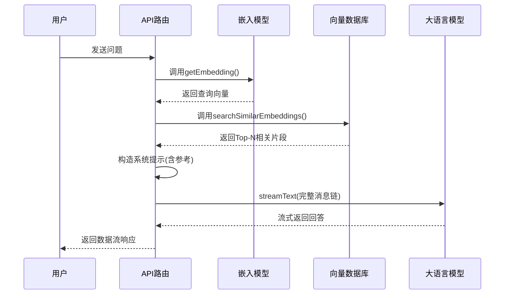

# 数据读取查询

<cite>
**本文档中引用的文件**  
- [selectors.ts](file://lib/db/openai/selectors.ts)
- [selectors.ts](file://lib/db/vercelai/selectors.ts)
- [schema.ts](file://lib/db/openai/schema.ts)
- [schema.ts](file://lib/db/vercelai/schema.ts)
- [embedding.ts](file://app/api/openai/embedding.ts)
- [embedding.ts](file://app/api/vercelai/embedding.ts)
- [route.ts](file://app/api/vercelai/route.ts)
- [prompt.ts](file://lib/prompt.ts)
</cite>

## 目录
1. [引言](#引言)
2. [核心功能解析](#核心功能解析)
3. [语义搜索实现原理](#语义搜索实现原理)
4. [Drizzle ORM 动态查询构建](#drizzle-orm-动态查询构建)
5. [相似度计算与过滤逻辑](#相似度计算与过滤逻辑)
6. [RAG 系统集成流程](#rag-系统集成流程)
7. [性能优化建议](#性能优化建议)
8. [错误处理最佳实践](#错误处理最佳实践)
9. [总结](#总结)

## 引言
本文深入解析 `searchSimilarEmbeddings` 函数在语义搜索中的实现机制，重点阐述其如何结合向量数据库与 AI 模型实现高效的相关性检索。该函数是检索增强生成（RAG）系统的核心组件，负责从嵌入向量数据库中查找与用户查询最相关的文本片段，并将其作为上下文注入到大模型推理过程中，从而提升回答的准确性与专业性。

## 核心功能解析

`searchSimilarEmbeddings` 是一个通用的语义搜索函数，在项目中为 OpenAI 和 Vercel AI 两套嵌入系统分别提供了实现。其主要功能是接收一个查询向量，通过余弦距离计算其与数据库中所有向量的相似度，返回高于阈值且最相关的前 N 个结果。

该函数封装了完整的向量检索逻辑，包括相似度表达式构建、条件过滤、排序和数量限制，对外提供简洁的 Promise 接口，返回包含原始内容和相似度得分的对象数组。

**Section sources**
- [selectors.ts](file://lib/db/openai/selectors.ts#L11-L31)
- [selectors.ts](file://lib/db/vercelai/selectors.ts#L11-L31)

## 语义搜索实现原理

语义搜索依赖于将文本转换为高维向量（embedding），这些向量在向量空间中保留了语义信息。两个向量之间的几何距离反映了它们语义上的相似程度。

本系统采用余弦距离作为衡量标准。余弦距离越小，表示两个向量方向越接近，语义越相似。函数内部将余弦距离转换为“相似度”得分，公式为：`相似度 = 1 - 余弦距离`。这样，相似度得分范围为 [0,1]，更符合直觉——得分越高，表示越相似。



**Diagram sources**
- [selectors.ts](file://lib/db/openai/selectors.ts#L15-L25)
- [embedding.ts](file://app/api/openai/embedding.ts#L50-L64)

## Drizzle ORM 动态查询构建

函数利用 Drizzle ORM 的 SQL 模板语法动态构建复杂的数据库查询，确保类型安全的同时保持灵活性。

通过 `sql<number>` 模板标签，可以内联编写原生 SQL 表达式，并将其作为字段参与查询。关键代码如下：
```ts
const similarity = sql<number>`1 - (${cosineDistance(openAiEmbeddings.embedding, embedding)})`;
```
此表达式创建了一个名为 `similarity` 的计算列，用于后续的过滤和排序。

整个查询链式调用如下：
- `.select()`：选择 `content` 字段和计算出的 `similarity` 得分
- `.from()`：指定数据源表（如 `openAiEmbeddings`）
- `.where()`：使用动态 SQL 模板应用相似度阈值过滤
- `.orderBy(desc(similarity))`：按相似度降序排列
- `.limit(topN)`：限制返回结果数量

这种构建方式既利用了 ORM 的安全性，又保留了原生 SQL 的强大表达能力。

**Section sources**
- [selectors.ts](file://lib/db/openai/selectors.ts#L15-L25)

## 相似度计算与过滤逻辑

### 相似度计算
如前所述，相似度得分由 `1 - cosineDistance` 计算得出。`cosineDistance` 是 Drizzle ORM 提供的向量操作函数，直接调用 PostgreSQL 的向量扩展功能进行高效计算。

### 过滤逻辑
查询中的 `.where(sql`${similarity} > ${threshold}`)` 确保只返回相似度超过指定阈值的结果。默认阈值为 `0.75`，意味着只有非常相关的文档才会被召回，避免噪声信息干扰 AI 模型。

### 排序策略
`.orderBy(desc(similarity))` 确保最相关的结果排在前面。这对于 RAG 系统至关重要，因为通常只会使用前几个最相关的片段作为上下文。

### 数量控制
`.limit(topN)` 限制返回结果数量，默认为 `5`。这防止一次性加载过多数据，平衡了召回率与性能。



**Diagram sources**
- [schema.ts](file://lib/db/openai/schema.ts#L5-L18)
- [schema.ts](file://lib/db/vercelai/schema.ts#L5-L18)

## RAG 系统集成流程

`searchSimilarEmbeddings` 函数是 RAG 工作流的关键环节，其调用链如下：

1. **用户提问**：前端发送用户消息至 API 路由。
2. **生成查询向量**：调用 `getEmbedding(text)` 使用 OpenAI 或 Vercel AI 模型将文本转为向量。
3. **执行语义搜索**：调用 `searchSimilarEmbeddings` 在数据库中检索最相关的文档片段。
4. **构造系统提示**：将检索到的片段格式化为 `<Reference>...</Reference>` 字符串，插入系统提示词。
5. **AI 流式响应**：将包含参考文档的完整消息链发送给大模型，生成基于知识的回答。



**Diagram sources**
- [embedding.ts](file://app/api/vercelai/embedding.ts#L50-L58)
- [route.ts](file://app/api/vercelai/route.ts#L40-L50)
- [prompt.ts](file://lib/prompt.ts#L60-L65)

**Section sources**
- [embedding.ts](file://app/api/vercelai/embedding.ts#L50-L60)
- [route.ts](file://app/api/vercelai/route.ts#L30-L60)

## 性能优化建议

### 索引创建策略
数据库表已使用 HNSW（Hierarchical Navigable Small World）索引优化向量搜索性能：
```ts
index('openai_embedding_index').using('hnsw', t.embedding.op('vector_cosine_ops'))
```
HNSW 是一种高效的近似最近邻搜索算法，显著加速高维向量的相似度查询。建议根据数据规模和查询负载调整 HNSW 参数（如 `m`, `ef_construction`）以获得最佳性能。

### 阈值调优方法
- **高阈值（>0.8）**：适用于需要高精度的场景，确保上下文高度相关，但可能漏检。
- **中等阈值（0.7-0.8）**：平衡召回率与精度的常用选择。
- **低阈值（<0.7）**：适用于需要广泛召回的场景，但可能引入噪声。

建议通过 A/B 测试或人工评估，根据实际问答质量调整阈值。

**Section sources**
- [schema.ts](file://lib/db/openai/schema.ts#L15-L18)
- [selectors.ts](file://lib/db/openai/selectors.ts#L11-L13)

## 错误处理最佳实践

虽然 `searchSimilarEmbeddings` 本身未显式处理错误，但其调用链中应包含完善的错误处理机制：

1. **参数验证**：确保 `embedding` 是有效数组，`threshold` 在 [0,1] 范围内。
2. **数据库连接异常**：捕获并重试或降级处理。
3. **空结果处理**：当 `retrieved.length === 0` 时，可选择不注入参考文档，让 AI 基于自身知识回答。
4. **日志记录**：在 `onFinish` 回调中记录检索到的文档数量，便于监控和调试。

示例：
```ts
const retrieved = await retrieveEmbedding(userContent, 0.5, 3);
console.log('RAG documents retrieved:', retrieved.length); // 监控日志
```

**Section sources**
- [route.ts](file://app/api/vercelai/route.ts#L40-L45)
- [prompt.ts](file://lib/prompt.ts#L60-L65)

## 总结
`searchSimilarEmbeddings` 函数通过 Drizzle ORM 精巧地构建了动态向量相似度查询，实现了高效的语义搜索。它作为 RAG 系统的“记忆检索”模块，成功地将外部知识库与大语言模型的能力相结合，显著提升了 AI 回答的专业性和准确性。配合 HNSW 索引和合理的阈值设置，该方案在性能与效果之间取得了良好平衡，是现代 AI 应用中知识增强的典范实现。