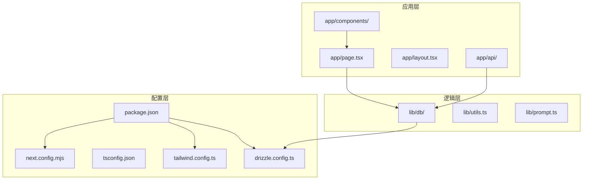
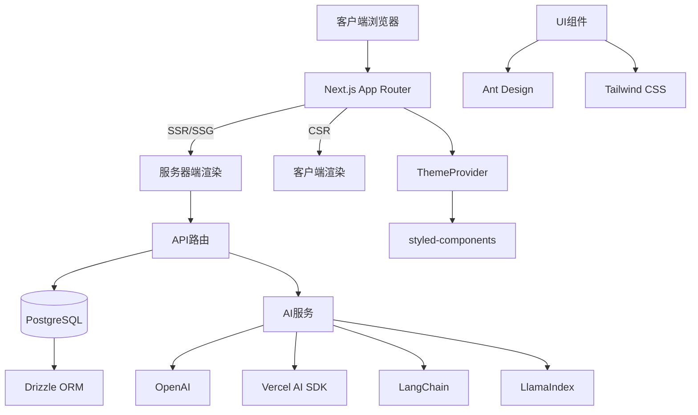
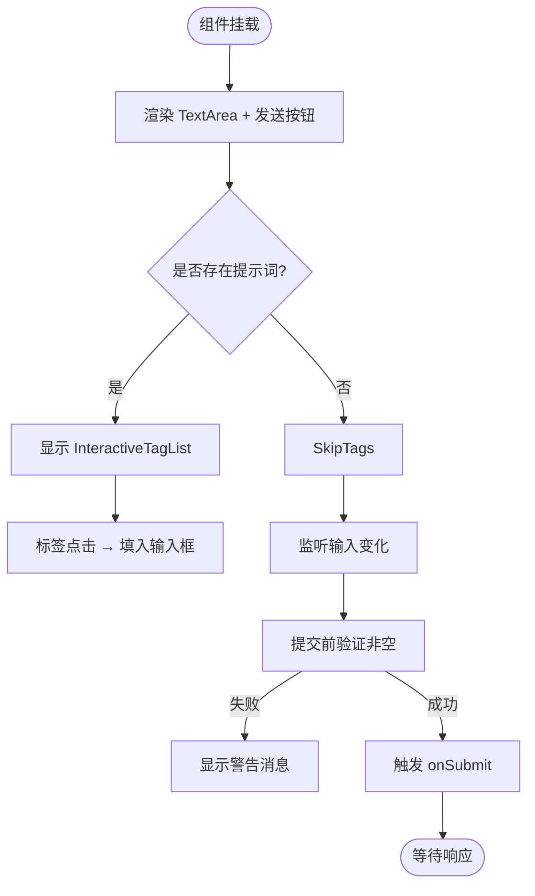
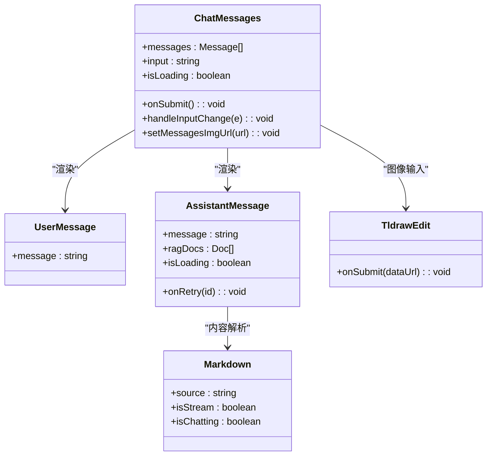
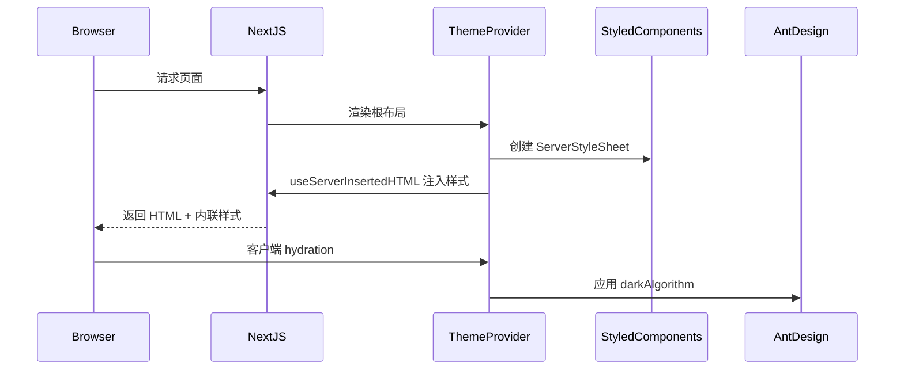
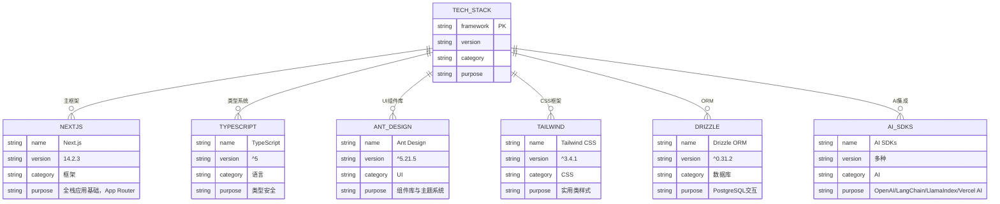

# 技术栈

<cite>
**本文档引用的文件**  
- [package.json](file://package.json)
- [next.config.mjs](file://next.config.mjs)
- [tailwind.config.ts](file://tailwind.config.ts)
- [tsconfig.json](file://tsconfig.json)
- [drizzle.config.ts](file://drizzle.config.ts)
- [app/page.tsx](file://app/page.tsx)
- [app/layout.tsx](file://app/layout.tsx)
- [app/components/ChatInput/ChatInput.tsx](file://app/components/ChatInput/ChatInput.tsx)
- [app/components/ChatMessages/ChatMessages.tsx](file://app/components/ChatMessages/ChatMessages.tsx)
- [app/components/Markdown/Markdown.tsx](file://app/components/Markdown/Markdown.tsx)
- [app/components/ThemeProvider/ThemeProvider.tsx](file://app/components/ThemeProvider/ThemeProvider.tsx)
- [app/components/TldrawEdit/TldrawEdit.tsx](file://app/components/TldrawEdit/TldrawEdit.tsx)
</cite>

## 目录
1. [简介](#简介)
2. [项目结构](#项目结构)
3. [核心组件](#核心组件)
4. [架构概览](#架构概览)
5. [详细组件分析](#详细组件分析)
6. [依赖分析](#依赖分析)
7. [性能考量](#性能考量)
8. [故障排除指南](#故障排除指南)
9. [结论](#结论)

## 简介
本项目是一个基于私有组件的AI RAG（检索增强生成）应用，旨在通过多种AI集成方案生成业务组件代码。项目采用现代化全栈技术栈，结合Next.js、TypeScript、Ant Design、Tailwind CSS等主流框架与工具，构建了一个高效、可扩展且用户友好的开发环境。技术选型注重类型安全、UI一致性、数据库交互效率以及AI能力集成，支持OpenAI SDK、LangChain、LlamaIndex和Vercel AI SDK四种AI方案，满足不同场景下的需求。

## 项目结构
项目采用功能模块化组织方式，主要分为以下几个核心目录：

- `app/`：Next.js App Router架构下的页面与组件入口，包含API路由、UI组件及AI集成模块。
- `lib/`：共享逻辑库，包括数据库操作（Drizzle ORM）、环境变量管理、提示词处理等。
- `ai-docs/`：AI文档资源存储目录。
- 根目录下配置文件涵盖构建、样式、类型检查及数据库迁移等关键设置。

该结构清晰分离关注点，便于维护与扩展。

**Diagram sources**
- [app/page.tsx](file://app/page.tsx#L1-L77)
- [lib/db/index.ts](file://lib/db/index.ts)
- [package.json](file://package.json#L1-L88)

**Section sources**
- [app/page.tsx](file://app/page.tsx#L1-L77)
- [package.json](file://package.json#L1-L88)

## 核心组件
项目核心由多个可复用UI组件构成，均位于`app/components/`目录下，如`ChatInput`、`ChatMessages`、`Markdown`渲染器、`TldrawEdit`绘图工具等。这些组件通过TypeScript定义接口，使用Ant Design与Tailwind CSS协同构建响应式界面，并通过`memo`优化渲染性能。AI相关功能通过动态导入实现按需加载，提升首屏性能。

**Section sources**
- [app/components/ChatInput/ChatInput.tsx](file://app/components/ChatInput/ChatInput.tsx#L1-L80)
- [app/components/ChatMessages/ChatMessages.tsx](file://app/components/ChatMessages/ChatMessages.tsx#L1-L101)
- [app/components/Markdown/Markdown.tsx](file://app/components/Markdown/Markdown.tsx#L1-L110)

## 架构概览
系统采用Next.js App Router作为全栈基础，支持服务器组件与客户端组件混合渲染。前端UI由Ant Design提供基础组件，结合Tailwind CSS进行细粒度样式定制。状态管理依赖React Hooks与Ant Design内置能力。后端通过API路由与Drizzle ORM操作PostgreSQL数据库，AI能力通过多个SDK集成，支持流式响应与RAG检索。

**Diagram sources**
- [app/layout.tsx](file://app/layout.tsx#L1-L41)
- [app/page.tsx](file://app/page.tsx#L1-L77)
- [lib/db/index.ts](file://lib/db/index.ts)

## 详细组件分析

### 聊天输入组件分析
`ChatInput`组件负责用户消息输入，集成`TextArea`、发送按钮及交互式标签列表。支持提示词快速插入、输入验证与加载状态反馈。通过`lodash`进行值比较优化重渲染，使用Ant Design的`Space`与`Divider`布局操作区。

**Diagram sources**
- [app/components/ChatInput/ChatInput.tsx](file://app/components/ChatInput/ChatInput.tsx#L1-L80)
- [app/components/InteractiveTagList/InteractiveTagList.tsx](file://app/components/InteractiveTagList/InteractiveTagList.tsx)

**Section sources**
- [app/components/ChatInput/ChatInput.tsx](file://app/components/ChatInput/ChatInput.tsx#L1-L80)

### 聊天消息组件分析
`ChatMessages`组件管理对话历史展示，支持用户与助手消息分类型渲染。集成`Markdown`组件实现富文本输出，支持KaTeX数学公式与代码高亮。通过`useAutoScroll`钩子实现自动滚动到底部，结合`TldrawEdit`实现UI草图绘制并插入图像。

**Diagram sources**
- [app/components/ChatMessages/ChatMessages.tsx](file://app/components/ChatMessages/ChatMessages.tsx#L1-L101)
- [app/components/Markdown/Markdown.tsx](file://app/components/Markdown/Markdown.tsx#L1-L110)
- [app/components/TldrawEdit/TldrawEdit.tsx](file://app/components/TldrawEdit/TldrawEdit.tsx#L1-L124)

**Section sources**
- [app/components/ChatMessages/ChatMessages.tsx](file://app/components/ChatMessages/ChatMessages.tsx#L1-L101)

### 主题与样式系统分析
`ThemeProvider`组件整合Ant Design主题与styled-components服务端渲染支持，实现暗色模式切换。通过`ConfigProvider`注入Ant Design主题算法，利用`ServerStyleSheet`解决styled-components在Next.js中的CSS注入问题。

**Diagram sources**
- [app/layout.tsx](file://app/layout.tsx#L1-L41)
- [app/components/ThemeProvider/ThemeProvider.tsx](file://app/components/ThemeProvider/ThemeProvider.tsx#L1-L37)

**Section sources**
- [app/components/ThemeProvider/ThemeProvider.tsx](file://app/components/ThemeProvider/ThemeProvider.tsx#L1-L37)

## 依赖分析
项目依赖清晰划分为运行时依赖与开发依赖，核心技术栈如下：

**Diagram sources**
- [package.json](file://package.json#L1-L88)
- [next.config.mjs](file://next.config.mjs#L1-L12)

**Section sources**
- [package.json](file://package.json#L1-L88)

## 性能考量
项目在性能方面采取多项优化措施：
- 使用`React.memo`避免不必要的组件重渲染。
- 动态导入AI模块实现代码分割，减少初始包体积。
- Markdown内容支持流式渲染动画，提升用户体验。
- 数据库查询通过Drizzle ORM优化，减少N+1问题。
- 图像处理在客户端完成，降低服务器负载。

## 故障排除指南
常见问题及解决方案：
- **AI模块加载失败**：检查环境变量是否配置正确，确保`DATABASE_URL`与API密钥有效。
- **样式未生效**：确认`AntdRegistry`与`ThemeProvider`正确包裹根组件。
- **Tldraw绘图不显示**：确保动态导入未被SSR干扰，检查浏览器兼容性。
- **流式响应中断**：检查API路由是否正确处理流式传输，避免中间件阻塞。

**Section sources**
- [app/page.tsx](file://app/page.tsx#L1-L77)
- [app/api/openai/route.ts](file://app/api/openai/route.ts)
- [app/api/vercelai/route.ts](file://app/api/vercelai/route.ts)

## 结论
本项目构建了一个现代化、模块化、AI驱动的前端代码生成系统。技术栈选型兼顾开发效率、类型安全与用户体验，Next.js App Router提供强大路由能力，Ant Design与Tailwind CSS协同构建高质量UI，Drizzle ORM简化数据库操作，四种AI方案提供灵活集成选项。整体架构清晰，易于维护与扩展，适合作为AI辅助开发工具的基础平台。