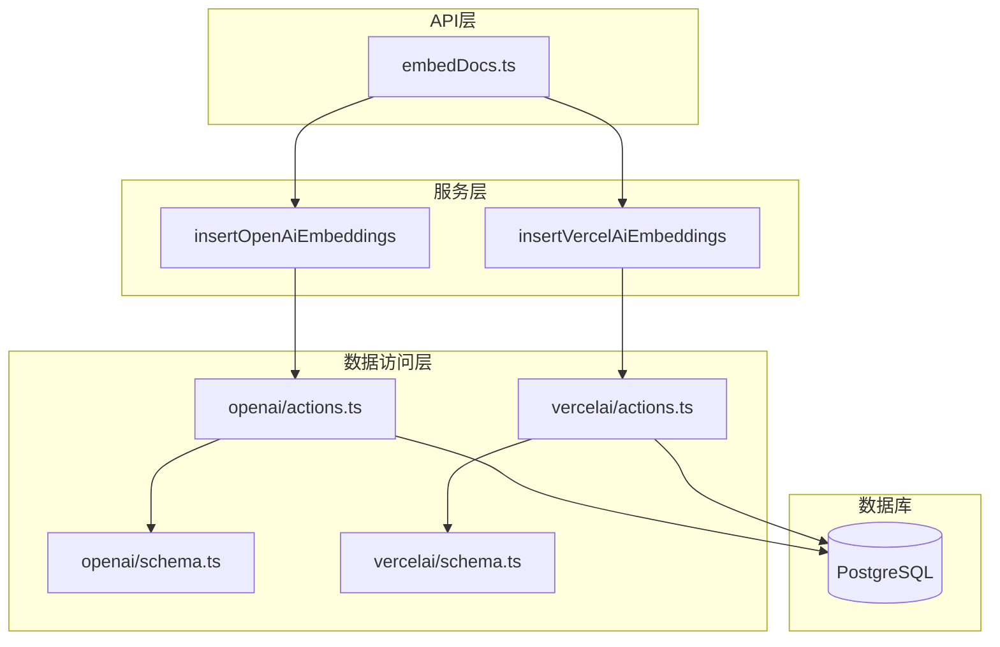
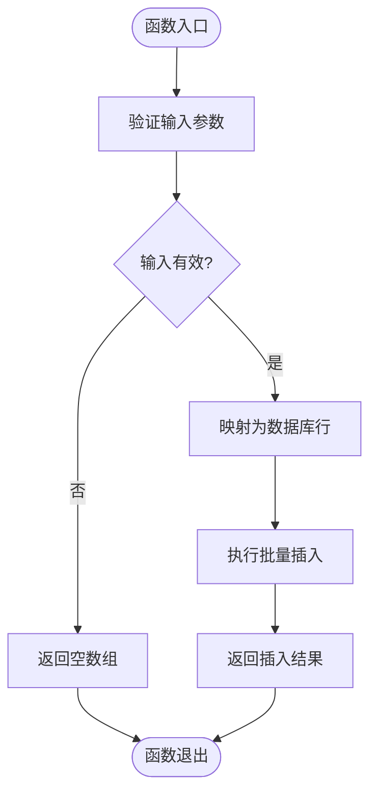
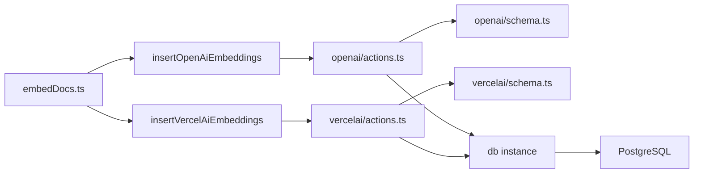

# 数据库操作封装

<cite>
**Referenced Files in This Document**   
- [actions.ts](file://lib/db/openai/actions.ts)
- [actions.ts](file://lib/db/vercelai/actions.ts)
- [schema.ts](file://lib/db/openai/schema.ts)
- [schema.ts](file://lib/db/vercelai/schema.ts)
- [embedDocs.ts](file://app/api/openai/embedDocs.ts)
- [embedDocs.ts](file://app/api/vercelai/embedDocs.ts)
- [index.ts](file://lib/db/index.ts)
</cite>

## 目录
1. [简介](#简介)
2. [核心功能分析](#核心功能分析)
3. [架构概览](#架构概览)
4. [详细组件分析](#详细组件分析)
5. [依赖关系分析](#依赖关系分析)
6. [性能考量](#性能考量)
7. [故障排除指南](#故障排除指南)
8. [结论](#结论)

## 简介

本文档详细分析了基于Drizzle ORM的数据库操作封装实现，重点聚焦于`actions.ts`文件中定义的批量插入功能。系统为OpenAI和Vercel AI分别提供了独立的数据存储路径，通过类型安全的模式定义和高效的数据操作接口，实现了文档嵌入向量的持久化存储。所有数据库操作均在服务端安全执行，确保了数据访问的安全性与一致性。

## 核心功能分析

本系统实现了两个核心服务端函数：`insertOpenAiEmbeddings` 和 `insertVercelAiEmbeddings`，用于处理来自不同AI平台的嵌入向量数据。这两个函数遵循相同的实现模式：接收包含嵌入向量和文本内容的对象数组，进行输入验证，映射为数据库兼容的行数据，并执行批量插入操作。通过使用 `'use server'` 指令，这些函数被明确限定在服务端执行，防止了客户端直接访问数据库的风险。函数设计包含早期返回机制，当输入为空数组或非数组类型时立即返回空结果，避免了不必要的数据库调用。

**Section sources**
- [actions.ts](file://lib/db/openai/actions.ts#L1-L21)
- [actions.ts](file://lib/db/vercelai/actions.ts#L1-L21)

## 架构概览

系统采用分层架构设计，将数据库操作逻辑与业务逻辑分离。顶层为API路由层，负责接收外部请求；中间为服务层，包含`embedDocs.ts`等文件，协调数据获取与存储；底层为数据访问层，由`actions.ts`和`schema.ts`构成，提供类型安全的数据库操作接口。Drizzle ORM作为数据访问抽象层，连接PostgreSQL数据库，确保类型安全和查询效率。

**Diagram sources**
- [actions.ts](file://lib/db/openai/actions.ts#L1-L21)
- [actions.ts](file://lib/db/vercelai/actions.ts#L1-L21)
- [schema.ts](file://lib/db/openai/schema.ts#L1-L20)
- [schema.ts](file://lib/db/vercelai/schema.ts#L1-L20)
- [embedDocs.ts](file://app/api/openai/embedDocs.ts#L1-L18)
- [embedDocs.ts](file://app/api/vercelai/embedDocs.ts#L1-L18)

## 详细组件分析

### 批量插入服务函数分析

`insertOpenAiEmbeddings` 和 `insertVercelAiEmbeddings` 函数实现了高度一致的逻辑流程。首先，函数对输入参数进行类型和空值校验，确保输入为非空数组。随后，使用`map`方法将输入的嵌入对象数组转换为符合数据库表结构的行数据数组。最后，通过Drizzle ORM的`insert().values().returning()`链式调用执行批量插入，并返回插入后的记录，便于后续处理。

#### 数据操作流程图

**Diagram sources**
- [actions.ts](file://lib/db/openai/actions.ts#L9-L20)
- [actions.ts](file://lib/db/vercelai/actions.ts#L9-L20)

### 数据模式定义分析

数据库表结构通过`schema.ts`文件定义，使用Drizzle ORM的`pgTable`函数创建。每个表包含三个字段：`id`（主键，使用nanoid生成）、`content`（非空文本）和`embedding`（维度为1536的向量）。为提高向量相似性搜索的效率，表上定义了使用HNSW算法的向量索引。这种设计优化了后续基于语义的检索性能。

**Section sources**
- [schema.ts](file://lib/db/openai/schema.ts#L1-L20)
- [schema.ts](file://lib/db/vercelai/schema.ts#L1-L20)

## 依赖关系分析

系统各组件间存在清晰的依赖关系。`embedDocs.ts`文件依赖于`actions.ts`中的插入函数，而`actions.ts`又依赖于`schema.ts`中定义的表结构。数据库连接通过`lib/db/index.ts`统一管理，`db`实例被所有数据访问层文件共享。这种依赖结构确保了代码的模块化和可维护性。

**Diagram sources**
- [embedDocs.ts](file://app/api/openai/embedDocs.ts#L1-L18)
- [embedDocs.ts](file://app/api/vercelai/embedDocs.ts#L1-L18)
- [actions.ts](file://lib/db/openai/actions.ts#L1-L21)
- [actions.ts](file://lib/db/vercelai/actions.ts#L1-L21)
- [index.ts](file://lib/db/index.ts#L1-L8)

**Section sources**
- [index.ts](file://lib/db/index.ts#L1-L8)

## 性能考量

批量插入操作显著提升了数据写入效率，相比逐条插入减少了数据库往返次数和事务开销。通过`returning()`方法，可以在一次查询中完成插入并获取结果，避免了额外的查询操作。向量索引的使用为后续的语义搜索提供了性能保障。此外，输入验证的早期返回机制减少了无效的数据库操作，进一步优化了整体性能。

## 故障排除指南

常见问题包括数据库连接失败、输入数据格式错误和向量维度不匹配。确保`DATABASE_URL`环境变量正确配置。输入数据必须为包含`embedding`（1536维数组）和`content`（字符串）属性的对象数组。若插入失败，检查数据库连接状态和表结构是否与模式定义一致。

**Section sources**
- [actions.ts](file://lib/db/openai/actions.ts#L9-L20)
- [actions.ts](file://lib/db/vercelai/actions.ts#L9-L20)
- [schema.ts](file://lib/db/openai/schema.ts#L1-L20)
- [schema.ts](file://lib/db/vercelai/schema.ts#L1-L20)

## 结论

本文档分析的数据库操作封装方案，通过清晰的分层架构和类型安全的接口设计，实现了高效、安全的嵌入向量存储。`'use server'`指令确保了操作的安全性，批量插入和向量索引优化了性能。该设计模式可扩展至其他数据存储需求，为构建可靠的AI应用提供了坚实的数据基础。