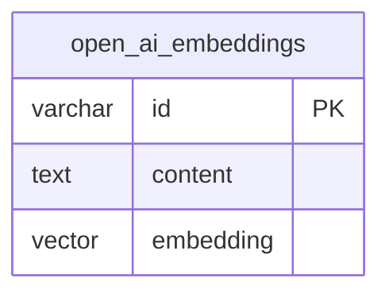
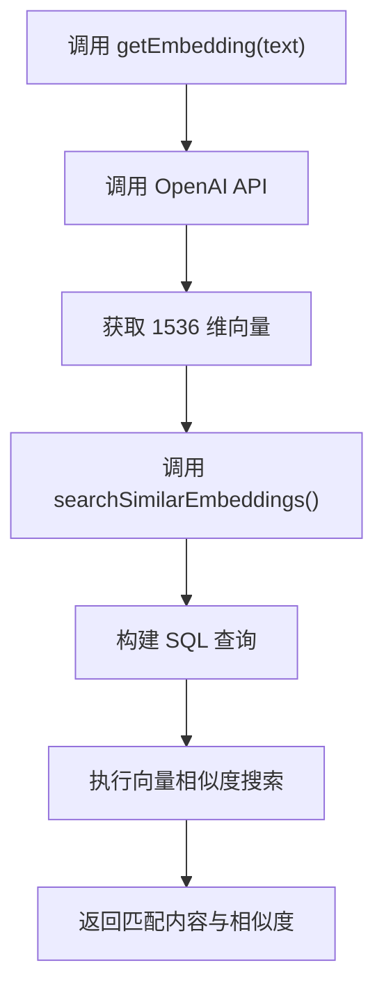

# OpenAI 数据库模式

<cite>
**本文档引用的文件**  
- [schema.ts](file://lib/db/openai/schema.ts)
- [selectors.ts](file://lib/db/openai/selectors.ts)
- [actions.ts](file://lib/db/openai/actions.ts)
- [0000_slow_mastermind.sql](file://lib/db/migrations/0000_slow_mastermind.sql)
- [embedding.ts](file://app/api/openai/embedding.ts)
- [embedDocs.ts](file://app/api/openai/embedDocs.ts)
- [OPENAI_SETUP.md](file://OPENAI_SETUP.md)
</cite>

## 目录
1. [简介](#简介)
2. [表结构定义](#表结构定义)
3. [字段详细说明](#字段详细说明)
4. [HNSW索引与向量搜索](#hnsw索引与向量搜索)
5. [Drizzle ORM集成实现](#drizzle-orm集成实现)
6. [RAG系统检索流程](#rag系统检索流程)
7. [实体关系图](#实体关系图)
8. [与OpenAI API的集成关联](#与openai-api的集成关联)
9. [总结](#总结)

## 简介
本文档详细说明了基于PostgreSQL的`openAiEmbeddings`表的设计与实现，该表用于存储由OpenAI生成的文本嵌入向量，支持高效语义检索。系统结合Drizzle ORM、pgvector扩展和HNSW索引，为RAG（检索增强生成）系统提供底层数据支持。

## 表结构定义
`openAiEmbeddings`表是RAG系统的核心数据存储组件，用于持久化文本内容及其对应的高维向量表示。该表通过Drizzle ORM定义，并由PostgreSQL数据库实际承载。



**图示来源**  
- [schema.ts](file://lib/db/openai/schema.ts#L3-L18)
- [0000_slow_mastermind.sql](file://lib/db/migrations/0000_slow_mastermind.sql#L1-L6)

**本节来源**  
- [schema.ts](file://lib/db/openai/schema.ts#L3-L18)

## 字段详细说明
`openAiEmbeddings`表包含三个核心字段，分别用于唯一标识、原始内容存储和向量表示。

### id 字段
- **类型**：`varchar(191)`
- **约束**：主键（PRIMARY KEY）
- **默认值**：通过`nanoid()`函数自动生成
- **用途**：确保每条记录具有全局唯一标识符，适用于分布式环境

### content 字段
- **类型**：`text`
- **约束**：非空（NOT NULL）
- **用途**：存储原始文档或文本片段内容，支持长文本存储

### embedding 字段
- **类型**：`vector(1536)`
- **约束**：非空（NOT NULL）
- **维度**：1536维
- **用途**：存储由OpenAI `text-embedding-ada-002`模型生成的嵌入向量

**本节来源**  
- [schema.ts](file://lib/db/openai/schema.ts#L3-L18)
- [OPENAI_SETUP.md](file://OPENAI_SETUP.md#L50-L55)

## HNSW索引与向量搜索
为优化高维向量的相似度搜索性能，系统在`embedding`字段上创建了HNSW（Hierarchical Navigable Small World）索引。

### 索引配置
- **索引名称**：`openAiEmbeddingIndex`
- **索引方法**：`hnsw`
- **操作符类**：`vector_cosine_ops`
- **排序依据**：余弦相似度

### 性能优势
HNSW索引通过构建多层图结构，显著加速最近邻搜索（ANN），在大规模向量数据集中实现亚线性时间复杂度查询，适用于实时语义检索场景。

```sql
CREATE INDEX IF NOT EXISTS "openai_embedding_index" ON "open_ai_embeddings" USING hnsw ("embedding" vector_cosine_ops);
```

**本节来源**  
- [schema.ts](file://lib/db/openai/schema.ts#L14-L18)
- [0000_slow_mastermind.sql](file://lib/db/migrations/0000_slow_mastermind.sql#L6)

## Drizzle ORM集成实现
Drizzle ORM作为TypeScript友好的数据库访问层，实现了类型安全的表定义与查询操作。

### 表定义
使用`pgTable`函数定义表结构，结合`vector`类型支持pgvector扩展，确保类型一致性。

### 插入操作
通过`insertOpenAiEmbeddings`函数实现批量插入，接收嵌入向量与内容数组，并持久化至数据库。

### 查询操作
利用`searchSimilarEmbeddings`函数执行语义搜索，基于余弦距离计算相似度，返回最相关的结果。



**本节来源**  
- [schema.ts](file://lib/db/openai/schema.ts#L3-L18)
- [actions.ts](file://lib/db/openai/actions.ts#L9-L20)
- [selectors.ts](file://lib/db/openai/selectors.ts#L11-L31)

## RAG系统检索流程
该表设计直接服务于RAG系统的高效检索需求，完整流程如下：

1. 用户输入查询文本
2. 系统调用OpenAI API生成查询向量
3. 在`openAiEmbeddings`表中执行向量相似度搜索
4. 返回最相关的文档片段作为上下文
5. 结合上下文生成最终回答

此流程通过预存储的嵌入向量避免了每次查询都调用嵌入模型，显著提升响应速度。

**本节来源**  
- [embedding.ts](file://app/api/openai/embedding.ts#L50-L66)
- [selectors.ts](file://lib/db/openai/selectors.ts#L11-L31)

## 实体关系图
以下是`openAiEmbeddings`表的实体关系图表示：


**图示来源**  
- [schema.ts](file://lib/db/openai/schema.ts#L3-L18)
- [0000_slow_mastermind.sql](file://lib/db/migrations/0000_slow_mastermind.sql#L1-L6)

## 与OpenAI API的集成关联
`openAiEmbeddings`表与OpenAI API紧密集成，形成完整的嵌入生命周期：

- **嵌入生成**：使用`text-embedding-ada-002`模型将文本转换为向量
- **数据存储**：通过`embedDocs.ts`脚本批量处理并存储文档嵌入
- **语义检索**：基于向量相似度召回相关内容，支持智能问答

该集成在`OPENAI_SETUP.md`中有明确配置说明，确保环境变量与API调用一致性。

**本节来源**  
- [embedding.ts](file://app/api/openai/embedding.ts#L1-L66)
- [embedDocs.ts](file://app/api/openai/embedDocs.ts#L1-L16)
- [OPENAI_SETUP.md](file://OPENAI_SETUP.md#L1-L64)

## 总结
`openAiEmbeddings`表通过合理的字段设计、高效的HNSW索引和Drizzle ORM的类型安全访问，为RAG系统提供了可靠的向量存储与检索能力。结合OpenAI API的嵌入服务，实现了从文本到向量再到语义检索的完整闭环，支持高性能的智能问答应用。