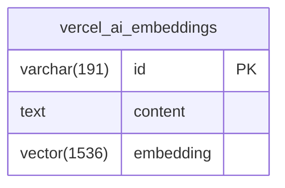

# Vercel AI 数据库模式

<cite>
**Referenced Files in This Document**   
- [schema.ts](file://lib/db/vercelai/schema.ts)
- [0000_slow_mastermind.sql](file://lib/db/migrations/0000_slow_mastermind.sql)
- [embedding.ts](file://app/api/vercelai/embedding.ts)
- [actions.ts](file://lib/db/vercelai/actions.ts)
</cite>

## 目录
1. [简介](#简介)
2. [核心表结构](#核心表结构)
3. [字段定义详解](#字段定义详解)
4. [向量索引机制](#向量索引机制)
5. [Drizzle ORM 与 pgvector 集成](#drizzle-orm-与-pgvector-集成)
6. [数据隔离与多框架支持](#数据隔离与多框架支持)
7. [实体关系图](#实体关系图)
8. [与 Vercel AI SDK 的集成](#与-vercel-ai-sdk-的集成)
9. [结论](#结论)

## 简介
本文档详细阐述了基于 Vercel AI SDK 构建的数据库模式设计，重点分析 `vercel_ai_embeddings` 表的实现机制。该表专用于存储由 Vercel AI 生成的文本嵌入向量，支持高效的语义搜索和检索增强生成（RAG）功能。文档将深入探讨其字段定义、索引优化策略、ORM 集成方式以及与 AI SDK 的协同工作流程。

## 核心表结构

`vercel_ai_embeddings` 表是 Vercel AI 数据处理的核心组件，其设计遵循了现代向量数据库的最佳实践。该表通过 Drizzle ORM 在 PostgreSQL 上定义，并利用 `pgvector` 扩展来支持向量数据类型和相似度搜索。



**Diagram sources**
- [schema.ts](file://lib/db/vercelai/schema.ts#L3-L18)

**Section sources**
- [schema.ts](file://lib/db/vercelai/schema.ts#L3-L18)

## 字段定义详解

`vercel_ai_embeddings` 表包含三个核心字段，每个字段都针对其特定用途进行了优化。

### id 字段
`id` 字段作为表的主键，采用 `varchar(191)` 类型并使用 `nanoid` 函数生成唯一标识符。这种设计确保了每个嵌入记录的全局唯一性，同时 `nanoid` 生成的短字符串在索引和查询性能上表现优异。

### content 字段
`content` 字段为 `text` 类型且不可为空（`notNull()`），用于存储原始文档或文本片段的内容。该字段保留了生成嵌入向量前的源文本，以便在检索后能够准确地呈现原始信息。

### embedding 字段
`embedding` 字段是 `vector(1536)` 类型，直接对应于 Vercel AI SDK 生成的 1536 维嵌入向量。该字段同样设置为非空，确保每条记录都包含有效的向量数据，为后续的向量搜索提供基础。

**Section sources**
- [schema.ts](file://lib/db/vercelai/schema.ts#L3-L18)

## 向量索引机制

为了优化基于余弦相似度的向量搜索性能，表定义中创建了名为 `vercelAiEmbeddingIndex` 的 HNSW（Hierarchical Navigable Small World）索引。

### HNSW 索引
HNSW 是一种高效的近似最近邻（ANN）搜索算法，特别适用于高维向量空间。通过在 `embedding` 字段上构建 HNSW 索引，系统能够在大规模数据集中快速找到与查询向量最相似的记录，显著降低了搜索的时间复杂度。

### vector_cosine_ops 操作符
该索引使用 `vector_cosine_ops` 操作符类，专门针对余弦相似度计算进行了优化。余弦相似度是衡量两个向量方向一致性的标准方法，在文本嵌入的语义搜索中被广泛采用。通过此操作符，数据库可以高效地执行 `ORDER BY embedding <-> query_embedding` 这类查询，返回按相似度排序的结果。

**Section sources**
- [schema.ts](file://lib/db/vercelai/schema.ts#L3-L18)
- [0000_slow_mastermind.sql](file://lib/db/migrations/0000_slow_mastermind.sql#L6)

## Drizzle ORM 与 pgvector 集成

该设计展示了 Drizzle ORM 如何与 `pgvector` 扩展无缝协同工作，简化了向量数据的管理。

### ORM 抽象层
Drizzle ORM 提供了对 `pgvector` 扩展的原生支持，通过 `vector()` 函数直接在模式定义中声明向量字段。这使得开发者可以在熟悉的 TypeScript 环境中操作向量数据，而无需编写复杂的原始 SQL。

### 迁移与同步
表结构通过 Drizzle 的迁移系统（如 `0000_slow_mastermind.sql`）进行版本控制和部署。这确保了模式变更能够安全、可重复地应用到生产环境，同时保持了代码与数据库结构的一致性。

**Section sources**
- [schema.ts](file://lib/db/vercelai/schema.ts#L3-L18)
- [0000_slow_mastermind.sql](file://lib/db/migrations/0000_slow_mastermind.sql#L1-L6)

## 数据隔离与多框架支持

该数据库设计支持多 AI 框架下的数据隔离与独立查询能力。

### 数据隔离
项目中存在 `open_ai_embeddings` 和 `vercel_ai_embeddings` 两个独立的表，分别用于存储来自 OpenAI 和 Vercel AI SDK 生成的嵌入向量。这种物理隔离的设计确保了不同来源的数据互不干扰，便于进行针对性的管理和优化。

### 独立查询
每个表都有其专用的查询函数（如 `searchSimilarEmbeddings`）和 API 路由（如 `app/api/vercelai/embedding.ts` 中的 `retrieveEmbedding`）。这允许应用程序根据使用的 AI 框架选择正确的数据源进行检索，实现了灵活的多框架支持。

**Section sources**
- [schema.ts](file://lib/db/vercelai/schema.ts#L3-L18)
- [embedding.ts](file://app/api/vercelai/embedding.ts#L45-L60)

## 实体关系图

以下是 `vercel_ai_embeddings` 表的实体关系图（ERD），清晰地展示了其字段和约束。

```mermaid
erDiagram
vercel_ai_embeddings {
varchar(191) id PK
text content NOT NULL
vector(1536) embedding NOT NULL
}
INDEX "vercel_ai_embedding_index" ON vercel_ai_embeddings(embedding) USING hnsw
```

**Diagram sources**
- [schema.ts](file://lib/db/vercelai/schema.ts#L3-L18)

## 与 Vercel AI SDK 的集成

`vercel_ai_embeddings` 表的设计与 Vercel AI SDK 紧密集成，形成了一个完整的数据处理闭环。

### 嵌入生成
`app/api/vercelai/embedding.ts` 文件中的 `getEmbedding` 和 `getEmbeddingsByChunks` 函数利用 Vercel AI SDK 的 `embed` 和 `embedMany` 方法，将文本转换为 1536 维的嵌入向量。这些向量随后被持久化到 `vercel_ai_embeddings` 表中。

### 检索流程
`retrieveEmbedding` 函数实现了检索增强生成（RAG）的核心逻辑：首先将查询文本转换为嵌入向量，然后利用数据库的 HNSW 索引在 `vercel_ai_embeddings` 表中查找最相似的记录，最终返回匹配的原始内容和相似度分数。

**Section sources**
- [embedding.ts](file://app/api/vercelai/embedding.ts#L1-L60)
- [actions.ts](file://lib/db/vercelai/actions.ts#L1-L21)

## 结论

`vercel_ai_embeddings` 表的实现是一个高效、可扩展的向量存储解决方案。通过结合 Drizzle ORM 的类型安全、`pgvector` 的强大功能和 HNSW 索引的高性能，该设计为基于 Vercel AI SDK 的应用提供了坚实的数据库基础。其清晰的数据隔离策略和与 SDK 的无缝集成，使得构建复杂的 RAG 应用变得简单而可靠。