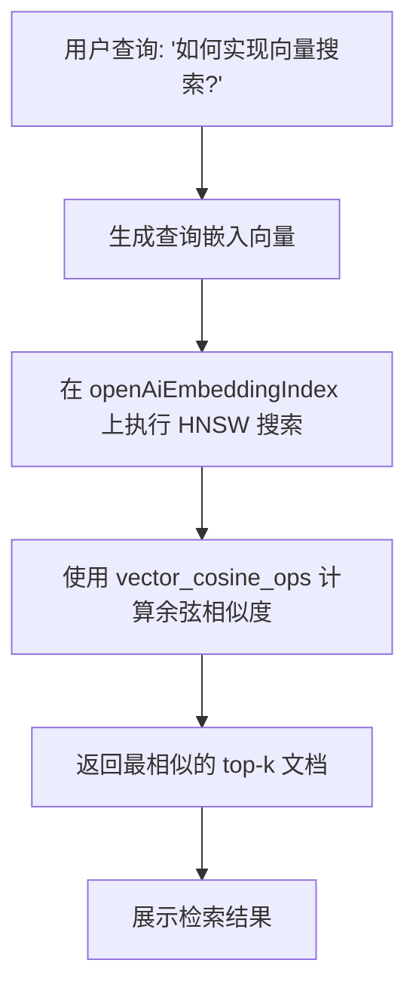
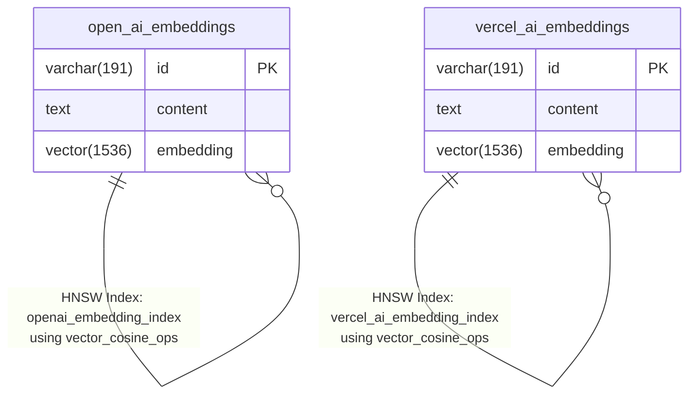

# 数据库模式设计

<cite>
**Referenced Files in This Document**   
- [schema.ts](file://lib/db/openai/schema.ts)
- [schema.ts](file://lib/db/vercelai/schema.ts)
- [drizzle.config.ts](file://drizzle.config.ts)
- [0000_slow_mastermind.sql](file://lib/db/migrations/0000_slow_mastermind.sql)
- [0001_cold_tyrannus.sql](file://lib/db/migrations/0001_cold_tyrannus.sql)
</cite>

## 目录
1. [简介](#简介)
2. [核心表结构](#核心表结构)
3. [数据隔离设计](#数据隔离设计)
4. [向量索引优化](#向量索引优化)
5. [实体关系图](#实体关系图)
6. [技术依赖与配置](#技术依赖与配置)
7. [结论](#结论)

## 简介
本文档详细阐述了基于Drizzle ORM的数据库模式设计，重点分析为不同AI服务（OpenAI与Vercel AI）构建的嵌入向量存储系统。该设计通过分离的表结构实现了服务间的数据隔离，并利用先进的向量索引技术优化了相似度搜索性能。系统采用PostgreSQL作为底层数据库，结合pgvector扩展支持高维向量操作，确保了在大规模文档检索场景下的高效性和可扩展性。

## 核心表结构

### OpenAI嵌入向量表 (openAiEmbeddings)
`openAiEmbeddings`表用于存储由OpenAI服务生成的文本嵌入向量。其核心字段定义如下：
- **id**: 主键字段，类型为`varchar(191)`，使用nanoid库生成唯一标识符。nanoid提供了一种安全、紧凑且URL友好的ID生成方案，避免了传统UUID的长度和可读性问题。
- **content**: 非空文本字段，用于存储原始文档或文本片段的内容。该字段保留了生成嵌入向量前的源数据，是后续检索和展示的基础。
- **embedding**: 非空向量字段，维度固定为1536，用于存储OpenAI模型生成的嵌入向量。此高维向量是文本语义信息的数学表示，是执行向量相似度搜索的关键。

### Vercel AI嵌入向量表 (vercelAiEmbeddings)
`vercelAiEmbeddings`表的结构与`openAiEmbeddings`表完全对称，专为Vercel AI服务设计。其字段定义与OpenAI表一致，确保了API接口的统一性和代码复用性。

**Section sources**
- [schema.ts](file://lib/db/openai/schema.ts#L1-L20)
- [schema.ts](file://lib/db/vercelai/schema.ts#L1-L20)

## 数据隔离设计

为`openAiEmbeddings`和`vercelAiEmbeddings`设计独立的表结构是本系统架构中的一个关键决策，其主要目的和优势如下：

1. **服务解耦与数据隔离**：将不同AI服务的嵌入数据物理分离，避免了数据混淆和潜在的命名冲突。这种隔离确保了每个服务的数据操作（如插入、更新、删除）互不影响，提高了系统的稳定性和可维护性。

2. **灵活的扩展与管理**：独立的表结构允许针对不同服务进行独立的性能调优、备份策略和访问控制。例如，可以为使用频率更高的服务分配更多的数据库资源，或为特定服务实施定制化的数据保留策略。

3. **简化多模型支持**：随着未来可能引入更多AI服务（如Anthropic、Google AI等），该模式可以轻松扩展，只需为新服务创建对应的表即可，无需修改现有数据结构或业务逻辑。

4. **清晰的语义边界**：从代码和架构层面明确了不同AI服务的职责边界，使开发者能够更清晰地理解数据流向和依赖关系，降低了系统复杂性。

**Section sources**
- [schema.ts](file://lib/db/openai/schema.ts#L1-L20)
- [schema.ts](file://lib/db/vercelai/schema.ts#L1-L20)

## 向量索引优化

为了高效执行基于语义的相似度搜索，系统在两个嵌入向量表上均创建了专门的HNSW（Hierarchical Navigable Small World）索引。

### 索引机制
- **HNSW索引**: HNSW是一种高效的近似最近邻（ANN）搜索算法，特别适用于高维向量空间。它通过构建多层图结构来加速搜索过程，在保证高召回率的同时，显著降低了搜索时间复杂度，从O(n)降低到接近O(log n)。
- **操作符类 (Operator Class)**: 索引使用`vector_cosine_ops`操作符类，该类针对余弦相似度计算进行了优化。余弦相似度是衡量两个向量方向一致性的标准方法，在文本嵌入场景中被广泛用于评估语义相似性。

### 性能优势
- **快速检索**: HNSW索引使得在包含数百万条记录的向量数据库中进行实时相似度搜索成为可能，响应时间可控制在毫秒级。
- **资源效率**: 相比于全表扫描，HNSW极大地减少了I/O操作和CPU计算量，有效降低了数据库负载。
- **可配置性**: HNSW算法的参数（如`ef_construction`和`M`）可以在创建索引时进行调整，以在索引构建时间、内存占用和查询速度之间取得最佳平衡。

**Diagram sources **
- [schema.ts](file://lib/db/openai/schema.ts#L10-L15)
- [schema.ts](file://lib/db/vercelai/schema.ts#L10-L15)

**Section sources**
- [schema.ts](file://lib/db/openai/schema.ts#L10-L15)
- [schema.ts](file://lib/db/vercelai/schema.ts#L10-L15)

## 实体关系图

**Diagram sources **
- [schema.ts](file://lib/db/openai/schema.ts#L1-L20)
- [schema.ts](file://lib/db/vercelai/schema.ts#L1-L20)
- [0000_slow_mastermind.sql](file://lib/db/migrations/0000_slow_mastermind.sql#L1-L7)
- [0001_cold_tyrannus.sql](file://lib/db/migrations/0001_cold_tyrannus.sql#L1-L7)

## 技术依赖与配置

### PostgreSQL与pgvector扩展
本数据库模式依赖于PostgreSQL数据库及其`pgvector`扩展。`pgvector`提供了对向量数据类型（`vector`）的原生支持，包括向量存储、距离计算（如余弦距离、欧几里得距离）和索引构建。Drizzle ORM通过`vector`函数将这一功能无缝集成到TypeScript类型系统中。

### Drizzle ORM配置
`drizzle.config.ts`文件中的配置指明了模式文件的扫描路径（`./lib/db/**/*/schema.ts`），这使得系统能够自动发现并处理位于`openai`和`vercelai`子目录下的所有模式定义。这种通配符配置简化了多模块数据库的管理。

### 迁移文件
SQL迁移文件（`0000_slow_mastermind.sql`和`0001_cold_tyrannus.sql`）是Drizzle ORM根据TypeScript模式自动生成的，它们精确地反映了`CREATE TABLE`和`CREATE INDEX`的SQL语句，确保了开发环境与生产环境数据库结构的一致性。

**Section sources**
- [drizzle.config.ts](file://drizzle.config.ts#L1-L13)
- [0000_slow_mastermind.sql](file://lib/db/migrations/0000_slow_mastermind.sql#L1-L7)
- [0001_cold_tyrannus.sql](file://lib/db/migrations/0001_cold_tyrannus.sql#L1-L7)

## 结论
该数据库模式设计通过为OpenAI和Vercel AI服务创建独立的嵌入向量表，实现了清晰的数据隔离和灵活的系统扩展。利用Drizzle ORM定义的`openAiEmbeddings`和`vercelAiEmbeddings`表结构，结合1536维向量字段和nanoid主键，构建了坚实的数据存储基础。更重要的是，通过在两个表上部署HNSW索引并使用`vector_cosine_ops`操作符，系统获得了卓越的向量相似度搜索性能。这一设计充分考虑了现代AI应用对高效、可扩展和可维护数据存储的需求，为构建强大的RAG（检索增强生成）系统提供了可靠的底层支持。