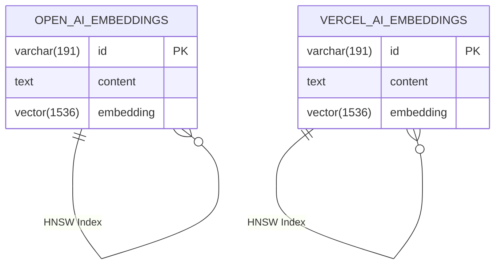

# 数据库设计

<cite>
**本文档引用的文件**
- [schema.ts](file://lib/db/openai/schema.ts)
- [schema.ts](file://lib/db/vercelai/schema.ts)
- [actions.ts](file://lib/db/openai/actions.ts)
- [actions.ts](file://lib/db/vercelai/actions.ts)
- [migrate.ts](file://lib/db/migrate.ts)
- [index.ts](file://lib/db/index.ts)
- [0000_slow_mastermind.sql](file://lib/db/migrations/0000_slow_mastermind.sql)
- [0001_cold_tyrannus.sql](file://lib/db/migrations/0001_cold_tyrannus.sql)
</cite>

## 目录
1. [简介](#简介)
2. [数据模型与表结构](#数据模型与表结构)
3. [多AI集成的独立模式设计](#多ai集成的独立模式设计)
4. [CRUD操作与数据访问层](#crud操作与数据访问层)
5. [数据库迁移与版本控制](#数据库迁移与版本控制)
6. [实体关系图（ERD）](#实体关系图erd)
7. [数据完整性与查询性能](#数据完整性与查询性能)
8. [向量嵌入存储最佳实践](#向量嵌入存储最佳实践)

## 简介
本文档详细阐述了基于Drizzle ORM的数据库设计，重点分析了为支持不同AI服务提供商而构建的独立数据库模式。系统通过为OpenAI和Vercel AI分别设计独立的表结构和数据访问层，实现了服务间的隔离与灵活性。文档深入解析了`schema.ts`中定义的数据模型、`actions.ts`中的CRUD操作封装、以及`migrations`目录下的版本控制机制，旨在为开发者提供清晰的数据库架构视图和最佳实践指导。

## 数据模型与表结构

系统定义了两个核心数据表：`open_ai_embeddings` 和 `vercel_ai_embeddings`，分别用于存储来自不同AI服务的向量嵌入数据。两个表具有完全相同的结构设计，体现了代码复用和一致性原则。

### 字段定义
每个表包含以下三个核心字段：
- **id**: `varchar(191)` 类型的主键，使用 `nanoid()` 函数生成唯一标识符，确保分布式环境下的ID唯一性。
- **content**: `text` 类型的非空字段，用于存储原始文本内容，支持长文本存储。
- **embedding**: `vector(1536)` 类型的非空字段，专门用于存储由AI模型生成的1536维向量嵌入。

### 主外键关系
两个表均采用单一主键设计，`id` 字段作为主键，没有定义外键关系。这种设计简化了数据模型，适用于以文档为中心的RAG（检索增强生成）场景，其中每个嵌入向量直接关联其原始内容，无需复杂的关联表。

### 索引策略
为优化向量相似性搜索的性能，两个表均在 `embedding` 字段上创建了专门的HNSW（Hierarchical Navigable Small World）索引。该索引使用 `vector_cosine_ops` 操作符，针对余弦相似度计算进行了优化，是实现高效向量检索的关键。

**Section sources**
- [schema.ts](file://lib/db/openai/schema.ts#L3-L18)
- [schema.ts](file://lib/db/vercelai/schema.ts#L3-L18)

## 多AI集成的独立模式设计

系统为OpenAI和Vercel AI设计了独立的数据库模式，这一架构决策基于以下几个关键考量：

### 服务隔离与解耦
将不同AI提供商的数据存储在独立的表中，实现了服务间的完全隔离。这允许系统独立地对任一AI服务进行维护、扩展或替换，而不会影响到另一个服务的数据和操作。例如，可以为OpenAI的嵌入表单独进行性能调优或数据迁移，而无需考虑Vercel AI的表。

### 灵活性与可扩展性
此设计提供了极高的灵活性。如果未来需要集成新的AI服务（如Anthropic或Google AI），只需在 `lib/db` 目录下创建一个新的子目录（如 `anthropic`），并复制 `schema.ts` 和 `actions.ts` 的模式，即可快速完成集成。这种模块化结构极大地降低了新服务接入的复杂度。

### 环境与配置管理
独立的模式使得可以为不同的AI服务配置不同的数据库连接或参数（尽管当前实现中共享同一连接），为未来的精细化资源管理提供了可能性。例如，可以将高频率访问的AI服务数据存储在更高性能的数据库实例上。

**Section sources**
- [schema.ts](file://lib/db/openai/schema.ts#L3-L18)
- [schema.ts](file://lib/db/vercelai/schema.ts#L3-L18)

## CRUD操作与数据访问层

`actions.ts` 文件封装了对数据库的CRUD操作，为上层应用提供了简洁、安全的API。

### 操作封装
`insertOpenAiEmbeddings` 和 `insertVercelAiEmbeddings` 函数是典型的批量插入操作。它们接收一个包含 `embedding`（数字数组）和 `content`（字符串）的对象数组，将其转换为符合Drizzle ORM要求的行数据格式，并执行批量插入。

### 错误处理与健壮性
函数在执行前进行了输入验证，检查 `embeddings` 参数是否为非空数组。如果验证失败，函数将返回一个空数组，避免了向数据库发送无效或空的插入请求，增强了系统的健壮性。

### 与ORM的集成
这些函数直接使用从 `db` 模块导入的数据库实例，通过Drizzle ORM的 `insert().values().returning()` 链式调用执行操作。`returning()` 子句确保了插入后能获取到新创建的记录（包括生成的ID），这对于后续的业务逻辑处理至关重要。

**Section sources**
- [actions.ts](file://lib/db/openai/actions.ts#L9-L20)
- [actions.ts](file://lib/db/vercelai/actions.ts#L9-L20)

## 数据库迁移与版本控制

系统的数据库模式版本控制由Drizzle ORM的迁移工具管理，确保了数据库结构变更的可追溯性和团队协作的顺畅。

### 迁移脚本
`lib/db/migrations` 目录下的SQL文件（如 `0000_slow_mastermind.sql` 和 `0001_cold_tyrannus.sql`）是迁移的核心。每个文件包含创建表和索引的SQL语句，并使用 `IF NOT EXISTS` 子句确保操作的幂等性，防止重复执行时出错。

### 迁移执行
`migrate.ts` 脚本是迁移的执行入口。它使用 `postgres-js` 客户端连接到数据库，并调用 `drizzle-orm/postgres-js/migrator` 的 `migrate` 函数。该函数会自动读取 `migrationsFolder` 指定目录下的所有迁移文件，并按文件名（通常包含时间戳或序列号）排序后依次执行，从而将数据库更新到最新状态。

### 团队协作
这种基于文件的迁移机制是团队协作的基石。所有开发者共享同一套迁移脚本，当有人在本地创建了新的数据库变更时，只需提交新的迁移文件。其他团队成员在拉取代码后运行迁移脚本，即可将他们的本地数据库同步到最新状态，保证了开发环境的一致性。

**Section sources**
- [migrate.ts](file://lib/db/migrate.ts#L1-L34)
- [0000_slow_mastermind.sql](file://lib/db/migrations/0000_slow_mastermind.sql#L1-L7)
- [0001_cold_tyrannus.sql](file://lib/db/migrations/0001_cold_tyrannus.sql#L1-L7)

## 实体关系图（ERD）

**Diagram sources**
- [schema.ts](file://lib/db/openai/schema.ts#L3-L18)
- [schema.ts](file://lib/db/vercelai/schema.ts#L3-L18)

## 数据完整性与查询性能

### 数据完整性
系统通过数据库层面的约束来保证数据完整性：
- **主键约束**：`id` 字段的主键约束确保了每条记录的唯一性。
- **非空约束**：`content` 和 `embedding` 字段的 `NOT NULL` 约束防止了关键数据的缺失。
- **应用层验证**：`actions.ts` 中的输入检查作为第二道防线，确保只有有效数据才能进入数据库。

### 查询性能
性能优化主要体现在向量索引上：
- **HNSW索引**：HNSW是一种高效的近似最近邻（ANN）搜索算法，特别适合高维向量空间。它通过构建多层图结构，实现了在大规模数据集上快速的相似性搜索。
- **余弦相似度操作符**：`vector_cosine_ops` 操作符针对余弦相似度计算进行了优化，这是衡量文本向量语义相似度的常用方法，直接提升了RAG系统中“检索”环节的效率。

## 向量嵌入存储最佳实践

1. **维度一致性**：确保所有存储的向量都具有相同的维度（1536维），这与所使用的AI模型（如text-embedding-ada-002）的输出保持一致。
2. **批量操作**：优先使用 `insertOpenAiEmbeddings` 等批量插入函数，而不是逐条插入，以显著减少数据库往返次数，提高数据导入效率。
3. **索引维护**：在大量数据插入后，应监控HNSW索引的性能。虽然Drizzle和PostgreSQL会自动维护索引，但在极端情况下可能需要手动优化或重建。
4. **数据生命周期管理**：考虑实现数据清理策略，例如根据 `id` 或创建时间删除过期的嵌入数据，以控制数据库大小和成本。