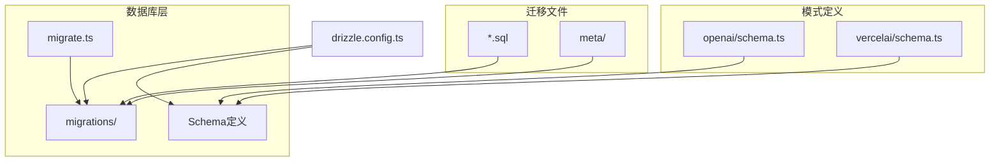
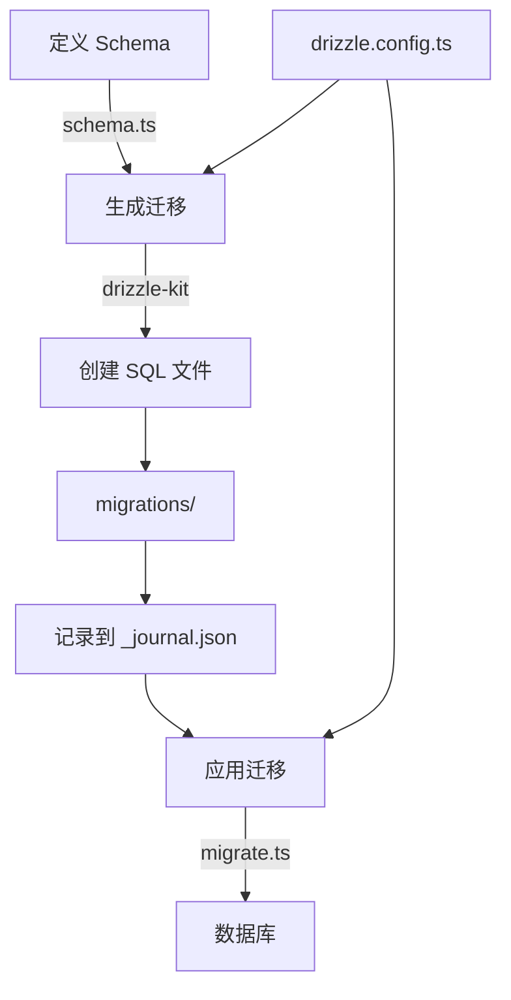
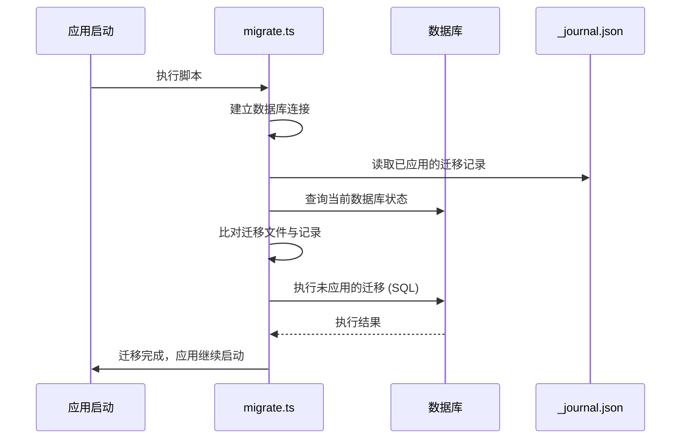
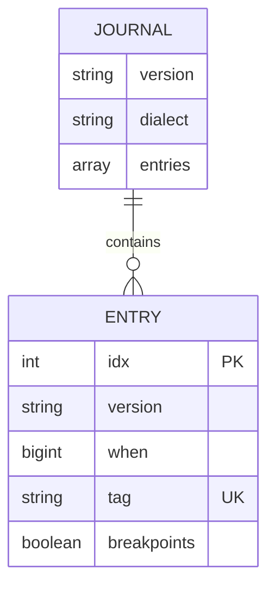
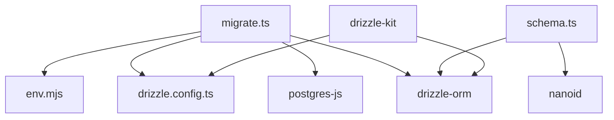

<cite>
**本文档中引用的文件**   
- [drizzle.config.ts](file://drizzle.config.ts)
- [migrate.ts](file://lib/db/migrate.ts)
- [_journal.json](file://lib/db/migrations/meta/_journal.json)
- [schema.ts](file://lib/db/openai/schema.ts)
- [schema.ts](file://lib/db/vercelai/schema.ts)
- [0000_slow_mastermind.sql](file://lib/db/migrations/0000_slow_mastermind.sql)
- [0001_cold_tyrannus.sql](file://lib/db/migrations/0001_cold_tyrannus.sql)
</cite>

## 目录
1. [引言](#引言)
2. [项目结构](#项目结构)
3. [核心组件](#核心组件)
4. [架构概述](#架构概述)
5. [详细组件分析](#详细组件分析)
6. [依赖分析](#依赖分析)
7. [性能考虑](#性能考虑)
8. [故障排除指南](#故障排除指南)
9. [结论](#结论)

## 引言

本文档旨在全面阐述基于Drizzle ORM的数据库迁移管理系统，重点说明其在保障数据库模式版本控制和团队协作方面的作用。系统通过自动化机制检测数据模式变化并生成SQL迁移脚本，确保在RAG（检索增强生成）系统中向量表结构变更时的数据兼容性和服务稳定性。文档详细描述了迁移流程、关键文件的作用以及相关操作命令。

## 项目结构

本项目的数据库迁移系统位于`lib/db/`目录下，其核心结构清晰，职责分明。迁移文件集中存放在`migrations/`目录中，包含实际的SQL脚本和元数据。`migrate.ts`作为迁移执行脚本，负责在应用启动时自动应用待处理的迁移。数据模式定义分散在`openai/`和`vercelai/`等子目录的`schema.ts`文件中。

**Diagram sources**
- [drizzle.config.ts](file://drizzle.config.ts#L1-L13)
- [lib/db/migrations](file://lib/db/migrations)

**Section sources**
- [drizzle.config.ts](file://drizzle.config.ts#L1-L13)
- [lib/db/migrations](file://lib/db/migrations)

## 核心组件

数据库迁移系统的核心由几个关键组件构成：`drizzle.config.ts`定义了迁移系统的全局配置，包括模式文件路径和输出目录；`migrate.ts`是迁移执行的入口点，负责连接数据库并应用迁移；`schema.ts`文件定义了应用程序的数据模型；`migrations/`目录下的SQL文件则记录了数据库模式的每一次变更。

**Section sources**
- [drizzle.config.ts](file://drizzle.config.ts#L1-L13)
- [lib/db/migrate.ts](file://lib/db/migrate.ts#L1-L34)
- [lib/db/openai/schema.ts](file://lib/db/openai/schema.ts#L1-L20)
- [lib/db/vercelai/schema.ts](file://lib/db/vercelai/schema.ts#L1-L20)

## 架构概述

该迁移系统采用声明式架构。开发者首先在`schema.ts`文件中声明期望的数据库模式。`drizzle-kit`工具通过读取`drizzle.config.ts`中的配置，扫描所有`schema.ts`文件，将其与当前数据库状态或上一次生成的快照进行比较，从而检测出模式差异。系统根据这些差异自动生成带有时间戳前缀的SQL迁移文件，并将其存入`migrations/`目录。`_journal.json`文件作为迁移历史的记录器，确保迁移的幂等性。最后，`migrate.ts`脚本在应用启动时运行，检查`_journal.json`并应用所有未执行的迁移。

**Diagram sources**
- [drizzle.config.ts](file://drizzle.config.ts#L1-L13)
- [lib/db/migrate.ts](file://lib/db/migrate.ts#L1-L34)
- [lib/db/migrations/meta/_journal.json](file://lib/db/migrations/meta/_journal.json#L1-L20)

## 详细组件分析

### 迁移配置分析

`drizzle.config.ts`是整个迁移系统的配置中心。它指定了模式文件的搜索路径（`./lib/db/**/*/schema.ts`），这意味着系统会自动发现并处理`lib/db/`目录下所有子目录中的`schema.ts`文件。迁移文件的输出目录被设置为`./lib/db/migrations`。该文件还配置了数据库凭证和连接信息，并通过`tablesFilter`选项排除了特定的表（如`langchain_embeddings`），以防止对这些表进行不必要的迁移操作。

**Section sources**
- [drizzle.config.ts](file://drizzle.config.ts#L1-L13)

### 迁移执行脚本分析

`migrate.ts`脚本是自动化迁移流程的关键。它在应用启动时被调用，首先建立到PostgreSQL数据库的连接，然后使用Drizzle ORM的`migrate`函数来执行迁移。该函数会读取`migrationsFolder`指定目录中的所有迁移文件，并与`_journal.json`中的记录进行比对，只应用那些尚未执行的迁移。此过程确保了每次部署时数据库模式都能自动更新到最新状态，极大地简化了部署流程并减少了人为错误。

**Diagram sources**
- [lib/db/migrate.ts](file://lib/db/migrate.ts#L1-L34)

**Section sources**
- [lib/db/migrate.ts](file://lib/db/migrate.ts#L1-L34)

### 模式定义与迁移生成

数据模式在`lib/db/openai/schema.ts`和`lib/db/vercelai/schema.ts`等文件中定义。这些文件使用Drizzle ORM的DSL（领域特定语言）来声明表结构，例如`openAiEmbeddings`和`vercelAiEmbeddings`表，它们都包含`id`、`content`和`embedding`（向量）字段。当模式发生变化时（例如添加新字段或修改索引），`drizzle-kit`会生成一个新的SQL迁移文件。文件名遵循`<序号>_<随机形容词>_<随机名词>.sql`的命名规则（如`0000_slow_mastermind.sql`），这种命名方式既保证了按字典序执行，又通过随机词增加了可读性。

**Section sources**
- [lib/db/openai/schema.ts](file://lib/db/openai/schema.ts#L1-L20)
- [lib/db/vercelai/schema.ts](file://lib/db/vercelai/schema.ts#L1-L20)
- [lib/db/migrations/0000_slow_mastermind.sql](file://lib/db/migrations/0000_slow_mastermind.sql)
- [lib/db/migrations/0001_cold_tyrannus.sql](file://lib/db/migrations/0001_cold_tyrannus.sql)

### 迁移历史记录

`_journal.json`文件是迁移系统实现幂等性的核心。它是一个JSON文件，记录了所有已成功应用到数据库的迁移。每条记录包含一个索引（`idx`）、版本号、应用时间戳（`when`）和迁移标签（`tag`，即SQL文件名去掉`.sql`后缀）。当`migrate.ts`脚本运行时，它会查询此文件，确定哪些迁移已经执行，从而避免重复应用，确保数据库状态的一致性。

**Diagram sources**
- [lib/db/migrations/meta/_journal.json](file://lib/db/migrations/meta/_journal.json#L1-L20)

**Section sources**
- [lib/db/migrations/meta/_journal.json](file://lib/db/migrations/meta/_journal.json#L1-L20)

## 依赖分析

该迁移系统依赖于多个外部库和内部模块。`drizzle-orm`和`postgres-js`是核心依赖，提供了ORM功能和数据库驱动。`drizzle-kit`是CLI工具，用于生成迁移。系统内部，`migrate.ts`依赖于`env.mjs`来获取数据库连接字符串，并依赖于`drizzle.config.ts`中的配置。`schema.ts`文件依赖于`drizzle-orm/pg-core`来定义表结构。

**Diagram sources**
- [lib/db/migrate.ts](file://lib/db/migrate.ts#L1-L34)
- [lib/db/openai/schema.ts](file://lib/db/openai/schema.ts#L1-L20)
- [drizzle.config.ts](file://drizzle.config.ts#L1-L13)

**Section sources**
- [package.json](file://package.json)

## 性能考虑

迁移操作通常在应用启动时执行，因此其性能直接影响服务的启动时间。将迁移操作设计为幂等且可自动执行，避免了手动干预，提高了部署效率。对于大型数据库，单个迁移文件中的复杂操作（如大规模数据重排）可能会导致长时间的锁表，影响服务可用性。建议将大型变更拆分为多个小的、增量的迁移。此外，`_journal.json`文件的读写是轻量级的，对性能影响极小。

## 故障排除指南

- **迁移失败**：检查`migrate.ts`脚本的输出日志，确认错误信息。最常见的原因是数据库连接问题（检查`DATABASE_URL`环境变量）或SQL语法错误。
- **迁移未执行**：确认`_journal.json`文件中的`tag`与`migrations/`目录下的SQL文件名完全匹配。如果文件名不匹配，迁移将不会被应用。
- **模式未更新**：确保`drizzle.config.ts`中的`schema`路径正确，并且`schema.ts`文件的更改已保存。重新运行`drizzle-kit`生成迁移命令。
- **回滚问题**：Drizzle ORM本身不直接提供回滚功能。如果需要回滚，必须手动创建一个反向操作的迁移文件（例如，删除一个之前添加的列）。

**Section sources**
- [lib/db/migrate.ts](file://lib/db/migrate.ts#L1-L34)
- [lib/db/migrations/meta/_journal.json](file://lib/db/migrations/meta/_journal.json#L1-L20)
- [drizzle.config.ts](file://drizzle.config.ts#L1-L13)

## 结论

基于Drizzle ORM的数据库迁移系统为项目提供了一套高效、可靠的数据库模式管理方案。通过自动化生成和应用迁移，它极大地简化了数据库变更流程，确保了团队协作中数据库状态的一致性。该系统在RAG应用中尤为重要，能够安全地管理向量存储表的结构变更，保障了数据兼容性和服务稳定性。遵循此文档中的实践，可以有效管理数据库的演进。