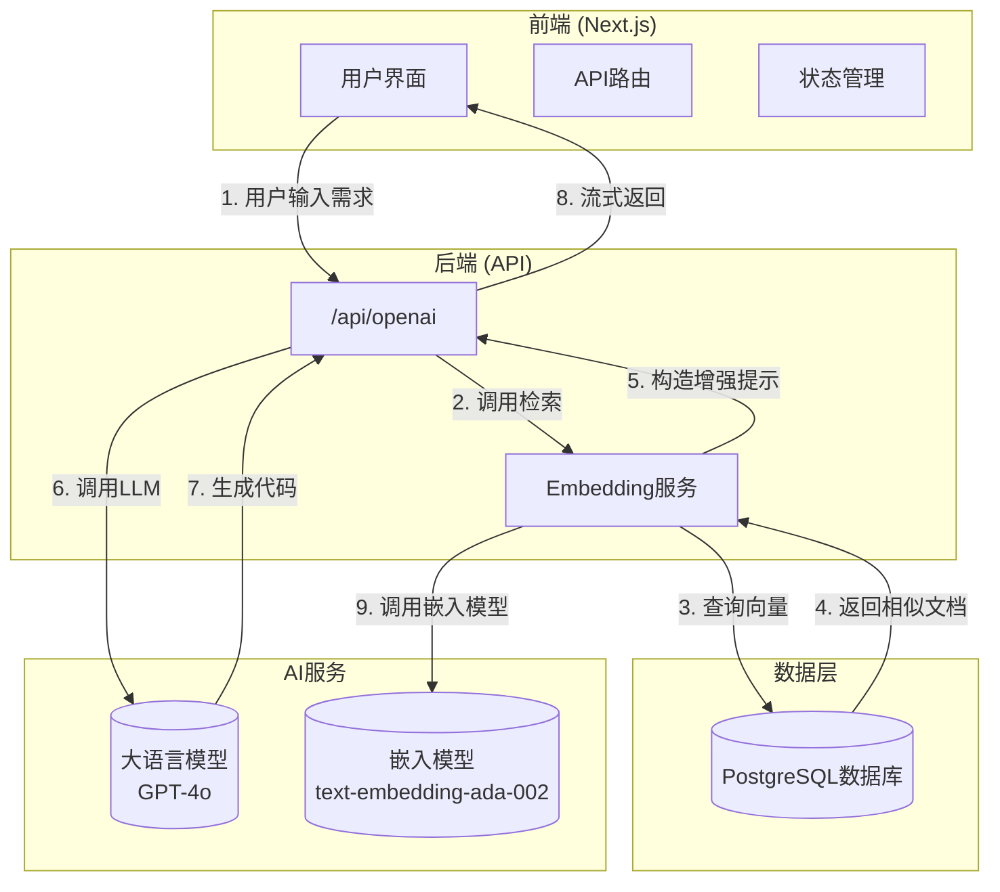

# 系统概述

<cite>
**Referenced Files in This Document**   
- [README.md](file://README.md)
- [INTEGRATION_SUMMARY.md](file://INTEGRATION_SUMMARY.md)
- [page.tsx](file://app/page.tsx)
- [prompt.ts](file://lib/prompt.ts)
- [route.ts](file://app/api/openai/route.ts)
- [embedding.ts](file://app/api/openai/embedding.ts)
- [openai-sdk/index.tsx](file://app/openai-sdk/index.tsx)
- [schema.ts](file://lib/db/openai/schema.ts)
- [selectors.ts](file://lib/db/openai/selectors.ts)
- [ChatMessages.tsx](file://app/components/ChatMessages/ChatMessages.tsx)
</cite>

## Table of Contents
1. [项目简介](#项目简介)
2. [核心架构与技术栈](#核心架构与技术栈)
3. [系统上下文与交互流程](#系统上下文与交互流程)
4. [RAG技术实现原理](#rag技术实现原理)
5. [多AI框架集成设计](#多ai框架集成设计)
6. [技术愿景与用户价值](#技术愿景与用户价值)

## 项目简介

`private-component-codegen` 是一个基于私有组件文档的AI代码生成应用，其核心目标是利用检索增强生成（RAG）技术，将开发者的自然语言需求智能地转化为可复用的前端业务组件代码。该项目旨在解决前端开发中重复性高、模式化强的组件开发问题，通过AI技术提升开发效率。

项目通过分析私有组件库（`@private-basic-components`）的文档，理解组件的使用场景（`<when-to-use>`）和API定义（`<API>`），并结合大语言模型（LLM）的强大生成能力，为开发者提供精准的代码生成服务。用户只需用自然语言描述需求，系统即可生成符合规范的完整组件代码，包括TSX文件、接口定义、Storybook文档和导出文件。

**Section sources**
- [README.md](file://README.md#L1-L10)
- [INTEGRATION_SUMMARY.md](file://INTEGRATION_SUMMARY.md#L1-L10)

## 核心架构与技术栈

本项目采用现代化的全栈技术栈，构建了一个高效、可扩展的AI应用。其核心架构分为前端、API路由、数据库和AI服务四个主要层次。

- **前端框架**：采用Next.js作为核心框架，利用其服务端渲染（SSR）和API路由功能，构建了响应式的用户界面。
- **UI组件库**：使用Ant Design和Tailwind CSS进行UI构建，确保界面美观且开发高效。
- **数据持久化**：使用Drizzle ORM操作PostgreSQL数据库，存储和管理组件文档的向量嵌入（Embeddings）。
- **AI服务**：集成了OpenAI SDK、LangChain、LlamaIndex和Vercel AI SDK四种主流AI框架，提供了灵活的AI能力接入方案。

这种架构设计使得系统既具备强大的AI处理能力，又拥有良好的用户体验和可维护性。

**Section sources**
- [README.md](file://README.md#L12-L25)
- [page.tsx](file://app/page.tsx#L1-L76)

## 系统上下文与交互流程

**Diagram sources**
- [route.ts](file://app/api/openai/route.ts#L1-L95)
- [embedding.ts](file://app/api/openai/embedding.ts#L1-L67)
- [openai-sdk/index.tsx](file://app/openai-sdk/index.tsx#L1-L268)

**Section sources**
- [route.ts](file://app/api/openai/route.ts#L1-L95)
- [openai-sdk/index.tsx](file://app/openai-sdk/index.tsx#L1-L268)

## RAG技术实现原理

RAG（检索增强生成）是本项目的核心技术，它通过将私有知识库（组件文档）与大语言模型相结合，解决了LLM“知识幻觉”和知识过时的问题。其工作原理分为三个关键阶段：

1.  **文档嵌入（Embedding）**：在系统初始化阶段，应用读取`ai-docs/basic-components.txt`文件，将其分割成多个文本片段，并使用`text-embedding-ada-002`模型为每个片段生成一个高维向量（即嵌入）。这些向量被批量存储到PostgreSQL数据库中，形成一个可搜索的知识库。
2.  **语义检索（Retrieval）**：当用户提交一个自然语言请求时，系统会使用相同的嵌入模型将用户输入转换为向量。然后，通过计算该向量与数据库中所有向量的余弦距离（Cosine Distance），找出最相似的前N个文档片段。这个过程由`searchSimilarEmbeddings`函数实现，它利用Drizzle ORM执行高效的向量相似度搜索。
3.  **增强生成（Generation）**：检索到的相关文档片段被动态地注入到发送给大语言模型的提示词（Prompt）中。`getSystemPrompt`函数负责构造这个增强的系统提示，它明确指示AI助手必须基于这些参考文档来生成代码。这确保了生成的代码严格遵循私有组件库的API规范。

**Section sources**
- [embedDocs.ts](file://app/api/openai/embedDocs.ts#L4-L14)
- [embedding.ts](file://app/api/openai/embedding.ts#L14-L45)
- [selectors.ts](file://lib/db/openai/selectors.ts#L1-L32)
- [prompt.ts](file://lib/prompt.ts#L1-L67)

## 多AI框架集成设计

项目的一个显著特点是支持多种AI框架，包括OpenAI SDK、LangChain、LlamaIndex和Vercel AI SDK。这种设计体现了高度的灵活性和前瞻性。

- **OpenAI SDK**：作为最直接的集成方式，它提供了对OpenAI API的底层访问，适用于需要精细控制流式响应和错误处理的场景。
- **LangChain & LlamaIndex**：这两个框架提供了更高层次的抽象，内置了RAG、链式调用（Chains）和代理（Agents）等复杂功能，适合构建更智能、更复杂的AI应用。
- **Vercel AI SDK**：专为Vercel平台优化，简化了流式响应的处理，特别适合部署在Vercel上的Next.js应用。

这种多框架并行的设计，不仅允许开发者根据项目需求选择最合适的工具，也为未来的技术演进和迁移提供了便利。所有框架共享相同的私有组件知识库和数据库，确保了功能的一致性。

**Section sources**
- [README.md](file://README.md#L2-L10)
- [INTEGRATION_SUMMARY.md](file://INTEGRATION_SUMMARY.md#L1-L10)

## 技术愿景与用户价值

`private-component-codegen` 的技术愿景是成为前端开发者的智能副驾驶。它不仅仅是一个代码生成工具，更是一个知识管理和开发效率的加速器。

**核心价值体现在**：
- **提升开发效率**：将编写重复性组件的时间从数小时缩短至数分钟。
- **保证代码质量**：生成的代码严格遵循团队的编码规范和组件库API，减少了人为错误。
- **降低学习成本**：新成员可以通过自然语言与系统交互，快速了解和使用私有组件库。
- **促进知识沉淀**：将分散的组件文档集中管理，并通过AI使其变得可操作。

对于初学者，它提供了一个直观的入口，通过对话式交互学习组件开发；对于资深开发者，它则是一个强大的生产力工具，可以专注于更高层次的架构设计。典型用户场景包括：根据“创建一个带搜索和分页的表格组件”这样的描述，自动生成完整的代码文件，极大地优化了开发者的工作流。