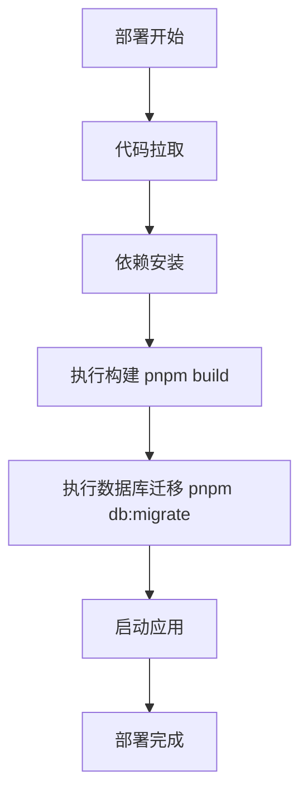

# 部署指南

<cite>
**Referenced Files in This Document**  
- [next.config.mjs](file://next.config.mjs)
- [env.mjs](file://lib/env.mjs)
- [migrate.ts](file://lib/db/migrate.ts)
- [package.json](file://package.json)
- [README.md](file://README.md)
- [INTEGRATION_SUMMARY.md](file://INTEGRATION_SUMMARY.md)
- [OPENAI_SETUP.md](file://OPENAI_SETUP.md)
</cite>

## 目录
1. [环境配置最佳实践](#环境配置最佳实践)
2. [生产级配置详解](#生产级配置详解)
3. [数据库部署方案](#数据库部署方案)
4. [主流平台部署步骤](#主流平台部署步骤)
5. [构建流程说明](#构建流程说明)
6. [数据库迁移自动化](#数据库迁移自动化)
7. [生产环境监控建议](#生产环境监控建议)

## 环境配置最佳实践

在生产环境中，安全地管理环境变量是确保应用安全性的关键环节。本项目通过 `@t3-oss/env-nextjs` 库实现类型安全的环境变量管理，确保开发和生产环境的一致性。

生产环境的环境变量应在部署平台的安全配置中设置，而不是在代码库中。根据项目文档，关键的生产环境变量包括：`DATABASE_URL`（数据库连接字符串）、`AI_KEY`（AI服务API密钥）、`AI_BASE_URL`（AI服务基础URL）、`MODEL`（使用的AI模型）和`EMBEDDING`（嵌入模型）。

**Section sources**
- [env.mjs](file://lib/env.mjs#L1-L27)
- [README.md](file://README.md#L45-L55)
- [OPENAI_SETUP.md](file://OPENAI_SETUP.md#L3-L20)

## 生产级配置详解

`next.config.mjs` 文件包含了Next.js应用的核心配置，这些配置在生产环境中直接影响应用的性能和行为。配置中启用了React严格模式，这有助于在开发阶段发现潜在问题，但在生产环境中不会影响性能。

配置中特别指定了 `serverComponentsExternalPackages` 选项，将 `llamaindex` 和 `onnxruntime-node` 标记为外部包，这优化了服务器组件的打包过程，避免了这些大型依赖的重复打包，提高了构建效率和运行时性能。

**Section sources**
- [next.config.mjs](file://next.config.mjs#L1-L11)

## 数据库部署方案

本项目使用Drizzle ORM进行数据库管理，支持PostgreSQL数据库。生产环境推荐使用托管数据库服务，如Supabase或AWS RDS，以确保高可用性、可扩展性和数据安全。

Supabase提供了一键式PostgreSQL托管服务，与Next.js应用集成简单，适合中小型应用。AWS RDS则提供了更高级的控制和企业级功能，适合大型、高流量的应用。无论选择哪种服务，都应配置SSL连接、定期备份和监控告警。

数据库模式通过Drizzle的迁移系统管理，确保数据库结构的版本控制和团队协作一致性。

**Section sources**
- [README.md](file://README.md#L45-L55)
- [drizzle.config.ts](file://drizzle.config.ts#L1-L11)
- [lib/db/index.ts](file://lib/db/index.ts#L1-L5)

## 主流平台部署步骤

### Vercel部署
1. 将代码推送到Git仓库（如GitHub）
2. 登录Vercel并导入项目
3. 在项目设置中配置生产环境变量
4. 设置构建命令为 `pnpm build`
5. 设置输出目录为 `.next`
6. 部署应用

### Netlify部署
1. 将代码推送到Git仓库
2. 登录Netlify并创建新站点
3. 连接Git仓库
4. 配置构建设置：构建命令 `pnpm build`，发布目录 `.next`
5. 在环境变量中设置生产配置
6. 部署站点

**Section sources**
- [README.md](file://README.md#L60-L75)
- [package.json](file://package.json#L5-L15)

## 构建流程说明

项目的构建流程由 `package.json` 中的脚本定义。生产构建通过 `pnpm build` 命令执行，该命令调用Next.js的内置构建系统。

构建过程包括：TypeScript编译、代码优化、资源压缩、静态生成（如果适用）和打包。构建输出位于 `.next` 目录中，包含优化后的生产代码。

构建过程中，Next.js会根据 `next.config.mjs` 中的配置进行优化，如代码分割、图像优化和服务器组件处理。

**Section sources**
- [package.json](file://package.json#L5-L15)

## 数据库迁移自动化

数据库迁移是确保生产环境数据库结构与代码同步的关键步骤。本项目使用Drizzle ORM的迁移系统，通过 `lib/db/migrate.ts` 脚本执行迁移。

在部署流程中，应在应用启动前自动执行数据库迁移。这可以通过在部署脚本中添加迁移命令来实现，例如在Vercel的构建后钩子中运行 `pnpm db:migrate`。

迁移脚本会检查 `lib/db/migrations` 目录中的迁移文件，并按顺序应用未执行的迁移，确保数据库结构的平滑演进。

**Diagram sources**
- [migrate.ts](file://lib/db/migrate.ts#L1-L33)
- [package.json](file://package.json#L15-L20)

**Section sources**
- [migrate.ts](file://lib/db/migrate.ts#L1-L33)
- [package.json](file://package.json#L15-L20)

## 生产环境监控建议

生产环境的稳定运行需要有效的监控和日志记录。建议实施以下监控策略：

1. **应用性能监控**：使用工具如Vercel Analytics或New Relic监控页面加载时间、API响应时间和错误率。
2. **日志记录**：确保关键操作（如数据库迁移、API调用）有详细的日志记录，便于问题排查。
3. **错误追踪**：集成Sentry或类似服务，实时捕获和分析运行时错误。
4. **数据库监控**：监控数据库连接数、查询性能和存储使用情况。
5. **AI服务监控**：监控AI API的调用次数、响应时间和费用，避免意外超支。

定期审查监控数据，及时发现和解决潜在问题，确保应用的高可用性和用户体验。

**Section sources**
- [INTEGRATION_SUMMARY.md](file://INTEGRATION_SUMMARY.md#L115-L125)
- [OPENAI_SETUP.md](file://OPENAI_SETUP.md#L60-L65)